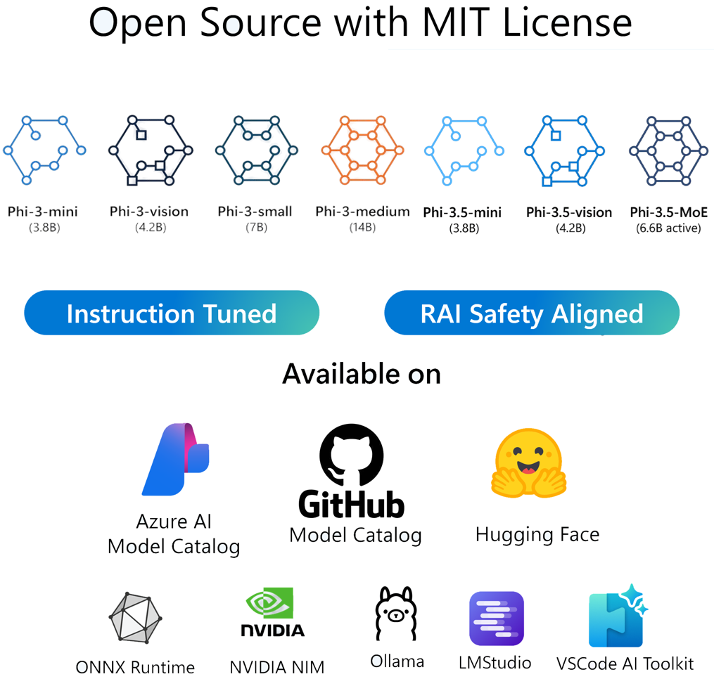

# Phi-3 Cookbook: Hands-On Examples with Microsoft's Phi-3 Models

Phi, is a family of open AI models developed by Microsoft. Phi models are the most capable and cost-effective small language models (SLMs) available, outperforming models of the same size and next size up across a variety of language, reasoning, coding, and math benchmarks. The Phi-3 Family includes mini, small, medium and vision versions, trained based on different parameter amounts to serve various application scenarios. For more detailed information about Microsoft's Phi family, please visit the [Welcome to the Phi Family](/md/01.Introduce/Phi3Family.md) page.

Follow these steps:
1. **Fork the Repository**: Click on the "Fork" button at the top-right corner of this page.
2. **Clone the Repository**:   `git clone https://github.com/microsoft/Phi-3CookBook.git`

## Table of Contents

- Introduction
  - [Setting up your environment](./md/01.Introduce/EnvironmentSetup.md)(✅)
  - [Welcome to the Phi Family](./md/01.Introduce/Phi3Family.md)(✅)
  - [Understanding Key Technologies](./md/01.Introduce/Understandingtech.md)(✅)
  - [AI Safety for Phi Models](./md/01.Introduce/AISafety.md)(✅)
  - [Phi-3 Hardware Support](./md/01.Introduce/Hardwaresupport.md)(✅)
  - [Phi-3 Models & Availability across platforms](./md/01.Introduce/Edgeandcloud.md)(✅)
  - [Using Guidance-ai and Phi](./md/01.Introduce/Guidance.md)(✅)
  - [GitHub Marketplace Models](https://github.com/marketplace/models)(✅)
  - [Azure AI Model Catalog](https://ai.azure.com)(✅)

- Quick Start
  - [Using Phi-3 in GitHub Model Catalog](./md/02.QuickStart/GitHubModel_QuickStart.md)(✅)
  - [Using Phi-3 in Hugging face](./md/02.QuickStart/Huggingface_QuickStart.md)(✅)
  - [Using Phi-3 with OpenAI SDK](./md/02.QuickStart/OpenAISDK_Quickstart.md)(✅)
  - [Using Phi-3 with Http Requests](./md/02.QuickStart/HttpAPI_QuickStart.md)(✅)
  - [Using Phi-3 in Azure AI Studio](./md/02.QuickStart/AzureAIStudio_QuickStart.md)(✅)
  - [Using Phi-3 Model Inference with Azure MaaS or MaaP](./md/02.QuickStart/AzureModel_Inference.md)(✅)
  - [Using Phi-3 with Azure Inference API with GitHub and Azure AI](./md/02.QuickStart/AzureInferenceAPI_QuickStart.md)
  - [Deploying Phi-3 models as serverless APIs in Azure AI Studio](./md/02.QuickStart/AzureAIStudio_MaaS.md)(✅)
  - [Using Phi-3 in Ollama](./md/02.QuickStart/Ollama_QuickStart.md)(✅)
  - [Using Phi-3 in LM Studio](./md/02.QuickStart/LMStudio_QuickStart.md)(✅)
  - [Using Phi-3 in AI Toolkit VSCode](./md/02.QuickStart/AITookit_QuickStart.md)(✅)
  - [Using Phi-3 and LiteLLM](./md/02.QuickStart/LiteLLM_QuickStart.md)(✅)
  

- [Inference Phi-3](./md/03.Inference/overview.md)  
  - [Inference Phi-3 in iOS](./md/03.Inference/iOS_Inference.md)(✅)
  - [Inference Phi-3.5 in Android](./md/08.Update/Phi35/050.UsingPhi35TFLiteCreateAndroidApp.md)(✅)
  - [Inference Phi-3 in Jetson](./md/03.Inference/Jetson_Inference.md)(✅)
  - [Inference Phi-3 in AI PC](./md/03.Inference/AIPC_Inference.md)(✅)
  - [Inference Phi-3 with Apple MLX Framework](./md/03.Inference/MLX_Inference.md)(✅)
  - [Inference Phi-3 in Local Server](./md/03.Inference/Local_Server_Inference.md)(✅)
  - [Inference Phi-3 in Remote Server using AI Toolkit](./md/03.Inference/Remote_Interence.md)(✅)
  - [Inference Phi-3 with Rust](./md/03.Inference/Rust_Inference.md)(✅)
  - [Inference Phi-3-Vision in Local](./md/03.Inference/Vision_Inference.md)(✅)
  - [Inference Phi-3 with Kaito AKS, Azure Containers(official support)](./md/03.Inference/Kaito_Inference.md)(✅)
  - [Inference Your Fine-tuning ONNX Runtime Model](./md/06.E2ESamples/E2E_Inference_ORT.md)(✅)

- Fine-tuning Phi-3
  - [Downloading & Creating Sample Data Set](./md/04.Fine-tuning/CreatingSampleData.md)(✅)
  - [Fine-tuning Scenarios](./md/04.Fine-tuning/FineTuning_Scenarios.md)(✅)
  - [Fine-tuning vs RAG](./md/04.Fine-tuning/FineTuning_vs_RAG.md)(✅)
  - [Fine-tuning Let Phi-3 become an industry expert](./md/04.Fine-tuning/LetPhi3gotoIndustriy.md)(✅)
  - [Fine-tuning Phi-3 with AI Toolkit for VS Code](./md/04.Fine-tuning/Finetuning_VSCodeaitoolkit.md)(✅)
  - [Fine-tuning Phi-3 with Azure Machine Learning Service](./md/04.Fine-tuning/Introduce_AzureML.md)(✅)
  - [Fine-tuning Phi-3 with Lora](./md/04.Fine-tuning/FineTuning_Lora.md)(✅)
  - [Fine-tuning Phi-3 with QLora](./md/04.Fine-tuning/FineTuning_Qlora.md)(✅)
  - [Fine-tuning Phi-3 with Azure AI Studio](./md/04.Fine-tuning/FineTuning_AIStudio.md)(✅)
  - [Fine-tuning Phi-3 with Azure ML CLI/SDK](./md/04.Fine-tuning/FineTuning_MLSDK.md)(✅)
  - [Fine-tuning with Microsoft Olive](./md/04.Fine-tuning/FineTuning_MicrosoftOlive.md)(✅)
  - [Fine-tuning with Microsoft Olive Hands-On Lab](./code/04.Finetuning/olive-lab/readme.md)(✅)
  - [Fine-tuning Phi-3-vision with Weights and Bias](./md/04.Fine-tuning/FineTuning_Phi-3-visionWandB.md)(✅)
  - [Fine-tuning Phi-3 with Apple MLX Framework](./md/04.Fine-tuning/FineTuning_MLX.md)(✅)
  - [Fine-tuning Phi-3-vision (official support)](./md/04.Fine-tuning/FineTuning_Vision.md)(✅)
  - [Fine-Tuning Phi-3 with Kaito AKS , Azure Containers(official Support)](./md/04.Fine-tuning/FineTuning_Kaito.md)(✅)
  - [Fine-Tuning Phi-3 and 3.5 Vision](https://github.com/2U1/Phi3-Vision-Finetune)(✅)

- Evaluation Phi-3
  - [Introduction to Responsible AI](./md/05.Evaluation/ResponsibleAI.md)(✅)
  - [Introduction to Promptflow](./md/05.Evaluation/Promptflow.md)(✅)
  - [Introduction to Azure AI Studio for evaluation](./md/05.Evaluation/AzureAIStudio.md)(✅)

- E2E Samples for Phi-3-mini
  - [Introduction to End to End Samples](./md/06.E2ESamples/E2E_Introduction.md)(✅)
  - [Prepare your industry data](./md/06.E2ESamples/E2E_Datasets.md)(✅)
  - [Use Microsoft Olive to architect your projects](./md/06.E2ESamples/E2E_LoRA&QLoRA_Config_With_Olive.md)(✅)
  - [Local Chatbot on Android with Phi-3, ONNXRuntime Mobile and ONNXRuntime Generate API](https://github.com/microsoft/onnxruntime-inference-examples/tree/main/mobile/examples/phi-3/android)(✅)
  - [Hugging Face Space WebGPU and Phi-3-mini Demo- Phi-3-mini provides the user with a private (and powerful) chatbot experience. You can try it out](https://huggingface.co/spaces/Xenova/experimental-phi3-webgpu)(✅)
  - [Local Chatbot in the browser using Phi3, ONNX Runtime Web and WebGPU](https://github.com/microsoft/onnxruntime-inference-examples/tree/main/js/chat)(✅)
  - [OpenVino Chat](/md/06.E2ESamples/E2E_OpenVino_Chat.md)(✅)
  - [Multi Model - Interactive Phi-3-mini and OpenAI Whisper](./md/06.E2ESamples/E2E_Phi-3-mini_with_whisper.md)(✅)
  - [MLFlow - Building a wrapper and using Phi-3 with MLFlow](./md/06.E2ESamples/E2E_Phi-3-MLflow.md)(✅)
  - [Model Optimization - How to optimize Phi-3-min model for ONNX Runtime Web with Olive](https://github.com/microsoft/Olive/tree/main/examples/phi3)(✅)
  - [WinUI3 App with Phi-3 mini-4k-instruct-onnx](https://github.com/microsoft/Phi3-Chat-WinUI3-Sample/)(✅)
  - [WinUI3 Multi Model AI Powered Notes App Sample](https://github.com/microsoft/ai-powered-notes-winui3-sample)(✅)
  - [Fine-tune and Integrate custom Phi-3 models with Prompt flow](./md/06.E2ESamples/E2E_Phi-3-FineTuning_PromptFlow_Integration.md)(✅)
  - [Fine-tune and Integrate custom Phi-3 models with Prompt flow in Azure AI Studio](./md/06.E2ESamples/E2E_Phi-3-FineTuning_PromptFlow_Integration_AIstudio.md)(✅)
  - [Evaluate the Fine-tuned Phi-3 / Phi-3.5 Model in Azure AI Studio Focusing on Microsoft's Responsible AI Principles](./md/06.E2ESamples/E2E_Phi-3-Evaluation_AIstudio.md)(✅)
  - [Phi-3.5-mini-instruct language prediction sample (Chinese/English)](./code/09.UpdateSamples/Aug/phi3-instruct-demo.ipynb)(✅)

- E2E Samples for Phi-3-vision
  - [Phi-3-vision-Image text to text](./code/06.E2E/E2E_Phi-3-vision-image-text-to-text-online-endpoint.ipynb)(✅)
  - [Phi-3-vision-ONNX](https://onnxruntime.ai/docs/genai/tutorials/phi3-v.html)(✅)
  - [Phi-3-vision CLIP Embedding](./md/06.E2ESamples/E2E_Phi-3-Embedding_Images_with_CLIPVision.md)(✅)
  - [DEMO: Phi-3 Recycling](https://github.com/jennifermarsman/PhiRecycling/)(✅)
  - [Phi-3-vision - Visual language assistant with Phi3-Vision and OpenVINO](https://docs.openvino.ai/nightly/notebooks/phi-3-vision-with-output.html)(✅)
  - [Phi-3 Vision Nvidia NIM](/md/06.E2ESamples/E2E_Nvidia_NIM_Vision.md)(✅)
  - [Phi-3 Vision OpenVino](/md/06.E2ESamples/E2E_OpenVino_Phi3Vision.md)(✅)
  - [Phi-3.5 Vision multi-frame or multi-image sample](./code/09.UpdateSamples/Aug/phi3-vision-demo.ipynb)(✅)

- E2E Samples for Phi-3.5-MoE
  - [Phi-3.5 Mixture of Experts Models (MoEs) Social Media Sample](./code/09.UpdateSamples/Aug/phi3_moe_demo.ipynb)(✅)
  - [Building a Retrieval-Augmented Generation (RAG) Pipeline with NVIDIA NIM Phi-3 MOE, Azure AI Search, and LlamaIndex](https://github.com/farzad528/azure-ai-search-python-playground/blob/main/azure-ai-search-nvidia-rag.ipynb)(✅)

- Labs and workshops samples Phi-3
  - [C# .NET Labs](./md/07.Labs/Csharp/csharplabs.md)(✅)
  - [Build your own Visual Studio Code GitHub Copilot Chat with Microsoft Phi-3 Family](./md/07.Labs/VSCode/README.md)(✅)
  - [Local WebGPU Phi-3 Mini RAG Chatbot Samples with Local RAG File](./code/08.RAG/rag_webgpu_chat/README.md)(✅)
  - [Phi-3 ONNX Tutorial](https://onnxruntime.ai/docs/genai/tutorials/phi3-python.html)(✅)
  - [Phi-3-vision ONNX Tutorial](https://onnxruntime.ai/docs/genai/tutorials/phi3-v.html)(✅)
  - [Run the Phi-3 models with the ONNX Runtime generate() API](https://github.com/microsoft/onnxruntime-genai/blob/main/examples/python/phi-3-tutorial.md)(✅)
  - [Phi-3 ONNX Multi Model LLM Chat UI, This is a chat demo](https://github.com/microsoft/onnxruntime-genai/tree/main/examples/chat_app)(✅)
  - [C# Hello Phi-3 ONNX example Phi-3](https://github.com/microsoft/onnxruntime-genai/tree/main/examples/csharp/HelloPhi)(✅)
  - [C# API Phi-3 ONNX example to support Phi3-Vision](https://github.com/microsoft/onnxruntime-genai/tree/main/examples/csharp/HelloPhi3V)(✅)
  - [Run C# Phi-3 samples in a CodeSpace](./md/07.Labs/CsharpOllamaCodeSpaces/CsharpOllamaCodeSpaces.md)(✅)
  - [Using Phi-3 with Promptflow and Azure AI Search](./code/07.Lab/RAG_with_PromptFlow_and_AISearch/README.md)(✅)
  - [Windows AI-PC APIs with Windows Copilot Library](https://developer.microsoft.com/windows/ai/?WT.mc_id=aiml-137032-kinfeylo)

- Learning Phi-3.5
  - [What's new Phi-3.5 Family](./md/08.Update/Phi35/010.WhatsNewInPhi35.md)(✅)
  - [Quantifying Phi-3.5 Family](./md/08.Update/Phi35/020.QuantifyingPhi35.md)(✅)
    - [Quantizing Phi-3.5 using llama.cpp](./md/08.Update/Phi35/021.UsingLlamacppQuantifyingPhi35.md)(✅)
    - [Quantizing Phi-3.5 using Generative AI extensions for onnxruntime](./md/08.Update/Phi35/022.UsingORTGenAIQuantifyingPhi35.md)(✅)
    - [Quantizing Phi-3.5 using Intel OpenVINO](./md/08.Update/Phi35/023.UsingIntelOpenVINOQuantifyingPhi35.md)(✅)
    - [Quantizing Phi-3.5 using Apple MLX Framework](./md/08.Update/Phi35/024.UsingAppleMLXQuantifyingPhi35.md)(✅)
  - Phi-3.5 Application Samples
    - [Phi-3.5-Instruct WebGPU RAG Chatbot](./md/08.Update/Phi35/031.WebGPUWithPhi35Readme.md)(✅)
    - [Create your own Visual Studio Code Chat Copilot Agent with Phi-3.5 by GitHub Models](./md/08.Update/Phi35/032.CreateVSCodeChatAgentWithGitHubModels.md)(✅)
    - [Using Windows GPU to create Prompt flow solution with Phi-3.5-Instruct ONNX ](./md/08.Update/Phi35/040.UsingPromptFlowWithONNX.md)(✅)
    - [Using Microsoft Phi-3.5 tflite to create Android app](./md/08.Update/Phi35/050.UsingPhi35TFLiteCreateAndroidApp.md)(✅)

## Using Phi-3 Models

### Phi-3 on Azure AI Studio

You can learn how to use Microsoft Phi-3 and how to build E2E solutions in your different hardware devices. To experience Phi-3 for yourself, start by playing with the model and customizing Phi-3 for your scenarios using the [Azure AI Foundry Azure AI Model Catalog](https://aka.ms/phi3-azure-ai) you can learn more at Getting Started with [Azure AI Studio](/md/02.QuickStart/AzureAIStudio_QuickStart.md)

**Playground**
Each model has a dedicated playground to test the model [Azure AI Playground](https://aka.ms/try-phi3).

### Phi-3 on GitHub Models

You can learn how to use Microsoft Phi-3 and how to build E2E solutions in your different hardware devices. To experience Phi-3 for yourself, start by playing with the model and customizing Phi-3 for your scenarios using the [GitHub Model Catalog](https://github.com/marketplace/models?WT.mc_id=aiml-137032-kinfeylo) you can learn more at Getting Started with [GitHub Model Catalog](/md/02.QuickStart/GitHubModel_QuickStart.md)

**Playground**
Each model has a dedicated [playground to test the model](/md/02.QuickStart/GitHubModel_QuickStart.md).

### Phi-3 on Hugging Face

You can also find the model on the [Hugging Face](https://huggingface.co/microsoft)

**Playground**
 [Hugging Chat playground](https://huggingface.co/chat/models/microsoft/Phi-3-mini-4k-instruct)

## 🌐 Multi-Language Support

> **Note:**
> These translations were automatically generated using the open-source [co-op-translator](https://github.com/Azure/co-op-translator) and may contain errors or inaccuracies. For critical information, it is recommended to refer to the original or consult a professional human translation. If you'd like to add or update a translation, please refer to the [co-op-translator](https://github.com/Azure/co-op-translator) repository, where you can easily contribute using simple commands.

| Language             | Code | Link to Translated README                               | Last Updated |
|----------------------|------|---------------------------------------------------------|--------------|
| Chinese (Simplified) | zh   | [Chinese Translation](./translations/zh/README.md)      | 2024-11-29   |
| Chinese (Traditional)| tw   | [Chinese Translation](./translations/tw/README.md)      | 2024-11-29   |
| French               | fr   | [French Translation](./translations/fr/README.md)       | 2024-11-29   |
| Japanese             | ja   | [Japanese Translation](./translations/ja/README.md)     | 2024-11-29   |
| Korean               | ko   | [Korean Translation](./translations/ko/README.md)       | 2024-11-29   |
| Spanish              | es   | [Spanish Translation](./translations/es/README.md)      | 2024-11-29   |

## Trademarks

This project may contain trademarks or logos for projects, products, or services. Authorized use of Microsoft trademarks or logos is subject to and must follow [Microsoft's Trademark & Brand Guidelines](https://www.microsoft.com/legal/intellectualproperty/trademarks/usage/general).
Use of Microsoft trademarks or logos in modified versions of this project must not cause confusion or imply Microsoft sponsorship. Any use of third-party trademarks or logos are subject to those third-party's policies.
