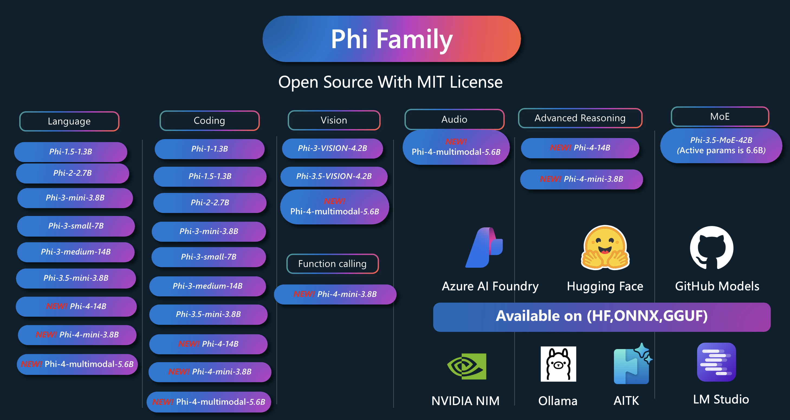

# Phi Cookbook: Hands-On Examples with Microsoft's Phi Models

Phi is a series of open source AI models developed by Microsoft. 

Phi is currently the most powerful and cost-effective small language model (SLM), with very good benchmarks in multi-language, reasoning, text/chat generation,coding, images, audio and other scenarios. 

You can deploy Phi to the cloud or to edge devices, and you can easily build generative AI applications with limited computing power.

Follow these steps to get started using these resource :
1. **Fork the Repository**: Click 
2. **Clone the Repository**:   `git clone https://github.com/microsoft/PhiCookBook.git`
3. [**Join The Microsoft AI Discord Community and meet experts and fellow developers**](https://discord.com/invite/ByRwuEEgH4?WT.mc_id=aiml-137032-kinfeylo)

## 🌐 Multi-Language Support

| Language Code | Language Name        | Link to Translated Readme         | Last Updated |
|---------------|----------------------|-----------------------------------|-------------|
| fr            | French               | [French Translation](./translations/fr/README.md)              | 2025-02-03  |
| es            | Spanish              | [Spanish Translation](./translations/es/README.md)             | 2025-02-03  |
| de            | German               | [German Translation](./translations/de/README.md)       | 2025-02-03  |
| ru            | Russian              |[Russian Translation](./translations/ru/README.md)            | 2025-02-03  |
| ar            | Arabic               |[Arabic Translation](./translations/ar/README.md)      | 2025-02-03  |
| fa            | Persian (Farsi)      | [Persian Translation](./translations/fa/README.md)       | 2025-02-03  |
| ur            | Urdu                 | [Urdu Translation](./translations/ur/README.md)    | 2025-02-03  |
| zh            | Chinese (Simplified) | [Chinese Translation](./translations/zh/README.md)        | 2025-02-03  |
| mo            | Chinese (Traditional, Macau) | [Chinese Translation](./translations/mo/README.md)         | 2025-02-03|
| hk            | Chinese (Traditional, Hong Kong) |[Chinese Translation](./translations/hk/README.md)        | 2025-02-03|
| tw            | Chinese (Traditional, Taiwan) | [Chinese Translation](./translations/tw/README.md)         |2025-02-03|
| ja            | Japanese             | [Japanese Translation](./translations/ja/README.md)            | 2025-02-03 |
| ko            | Korean               | [Korean Translation](./translations/ko/README.md)           | 2025-02-03 |
| hi            | Hindi                | [Hindi Translation](./translations/hi/README.md)   | 2025-02-03 |
| bn            | Bengali              | [Bengali Translation](./translations/bn/README.md)       | 2025-02-03 |
| mr            | Marathi              | [Marathi Translation](./translations/mr/README.md)  | 2025-02-03 |
| ne            | Nepali               | [Nepali Translation](./translations/ne/README.md)    | 2025-02-03  |
| pa            | Punjabi (Gurmukhi)   | [Punjabi Translation](./translations/pa/README.md)  | 2025-02-03  |
| pt            | Portuguese           | [Portuguese Translation](./translations/pt/README.md)             | 2025-02-03  |
| it            | Italian              | [Italian Translation](./translations/it/README.md)              | 2025-02-03  |
| pl            | Polish               | [Polish Translation](./translations/pl/README.md)              | 2025-02-03  |
| tr            | Turkish              | [Turkish Translation](./translations/tr/README.md)              | 2025-02-03 |
| el            | Greek                | [Greek Translation](./translations/el/README.md)               | 2025-02-03 |
| th            | Thai                 | [Thai Translation](./translations/th/README.md)          | 2025-02-03  |
| sv            | Swedish              | [Swedish Translation](./translations/sv/README.md)             |2025-02-03  |
| da            | Danish               | [Danish Translation](./translations/da/README.md)               |2025-02-03   |
| no            | Norwegian            | [Norwegian Translation](./translations/no/README.md)               |2025-02-03 |
| fi            | Finnish              | [Finnish Translation](./translations/fi/README.md)               |2025-02-03  |
| nl            | Dutch                | [Dutch Translation](./translations/nl/README.md)             | 2025-02-03  |
| he            | Hebrew               | [Hebrew Translation](./translations/he/README.md)         | 2025-02-03     |
| vi            | Vietnamese           | [Vietnamese Translation](./translations/vi/README.md)                |2025-02-03         |
| id            | Indonesian           | [Indonesian Translation](./translations/id/README.md)                | 2025-02-03     |
| ms            | Malay                |[Malay Translation](./translations/ms/README.md)            | 2025-02-03        |
| tl            | Tagalog (Filipino)   | [Tagalong Translation](./translations/tl/README.md)             | 2025-02-03       |
| sw            | Swahili              | [Swahili Translation](./translations/sw/README.md)              | 2025-02-03         |
| hu            | Hungarian            | [Hungarian Translation](./translations/hu/README.md)             | 2025-02-03       |
| cs            | Czech                | [Czech Translation](./translations/cs/README.md)               | 2025-02-03       |
| sk            | Slovak               | [Slovak Translation](./translations/sk/README.md)               | 2025-02-03      |
| ro            | Romanian             |[Romanian Translation](./translations/ro/README.md)         | 2025-02-03      |
| bg            | Bulgarian            | [Bulgarian Translation](./translations/bg/README.md)           | 2025-02-03     |
| sr            | Serbian (Cyrillic)   | [Serbian Translation](./translations/sr/README.md)         | 2025-02-03       |
| hr            | Croatian             | [Croatian Translation](./translations/hr/README.md)             | 2025-02-03     |
| sl            | Slovenian            | [Slovenian Translation](./translations/sl/README.md)         | 2025-02-03  |

## Table of Contents

- Introduction
  - [Welcome to the Phi Family](./md/01.Introduction/01/01.PhiFamily.md)
  - [Setting up your environment](./md/01.Introduction/01/01.EnvironmentSetup.md)
  - [Understanding Key Technologies](./md/01.Introduction/01/01.Understandingtech.md)
  - [AI Safety for Phi Models](./md/01.Introduction/01/01.AISafety.md)
  - [Phi Hardware Support](./md/01.Introduction/01/01.Hardwaresupport.md)
  - [Phi Models & Availability across platforms](./md/01.Introduction/01/01.Edgeandcloud.md)
  - [Using Guidance-ai and Phi](./md/01.Introduction/01/01.Guidance.md)
  - [GitHub Marketplace Models](https://github.com/marketplace/models)
  - [Azure AI Model Catalog](https://ai.azure.com)

- Inference Phi in different environment
    -  [Hugging face](./md/01.Introduction/02/01.HF.md)
    -  [GitHub Models](./md/01.Introduction/02/02.GitHubModel.md)
    -  [Azure AI Foundry Model Catalog](./md/01.Introduction/02/03.AzureAIFoundry.md)
    -  [Ollama](./md/01.Introduction/02/04.Ollama.md)
    -  [AI Toolkit VSCode (AITK)](./md/01.Introduction/02/05.AITK.md)
    -  [NVIDIA NIM](./md/01.Introduction/02/06.NVIDIA.md)

- Inference Phi Family
    - [Inference Phi in iOS](./md/01.Introduction/03/iOS_Inference.md)
    - [Inference Phi in Android](./md/01.Introduction/03/Android_Inference.md)
    - [Inference Phi in Jetson](./md/01.Introduction/03/Jetson_Inference.md)
    - [Inference Phi in AI PC](./md/01.Introduction/03/AIPC_Inference.md)
    - [Inference Phi with Apple MLX Framework](./md/01.Introduction/03/MLX_Inference.md)
    - [Inference Phi in Local Server](./md/01.Introduction/03/Local_Server_Inference.md)
    - [Inference Phi in Remote Server using AI Toolkit](./md/01.Introduction/03/Remote_Interence.md)
    - [Inference Phi with Rust](./md/01.Introduction/03/Rust_Inference.md)
    - [Inference Phi--Vision in Local](./md/01.Introduction/03/Vision_Inference.md)
    - [Inference Phi with Kaito AKS, Azure Containers(official support)](./md/01.Introduction/03/Kaito_Inference.md)
-  [Quantifying Phi Family](./md/01.Introduction/04/QuantifyingPhi.md)
    - [Quantizing Phi-3.5 / 4 using llama.cpp](./md/01.Introduction/04/UsingLlamacppQuantifyingPhi.md)
    - [Quantizing Phi-3.5 / 4 using Generative AI extensions for onnxruntime](./md/01.Introduction/04/UsingORTGenAIQuantifyingPhi.md)
    - [Quantizing Phi-3.5 / 4  using Intel OpenVINO](./md/01.Introduction/04/UsingIntelOpenVINOQuantifyingPhi.md)
    - [Quantizing Phi-3.5 / 4  using Apple MLX Framework](./md/01.Introduction/04/UsingAppleMLXQuantifyingPhi.md)

-  Evaluation Phi
    - [Response AI](./md/01.Introduction/05/ResponsibleAI.md)
    - [Azure AI Foundry for Evaluation](./md/01.Introduction/05/AIFoundry.md)
    - [Using Promptflow for Evaluation](./md/01.Introduction/05/Promptflow.md)
 
- RAG with Azure AI Search
    - [How to use Phi-4-mini and Phi-4-multimodal(RAG) with Azure AI Search](https://github.com/microsoft/PhiCookBook/blob/main/code/06.E2E/E2E_Phi-4-RAG-Azure-AI-Search.ipynb)

- Phi application development samples
  - Text & Chat Applications
    - Phi-4 Samples 🆕
      - [📓] [Chat With Phi-4-mini ONNX Model](./md/02.Application/01.TextAndChat/Phi4/ChatWithPhi4ONNX/README.md)
      - [Chat with Phi-4 local ONNX Model .NET](./md/04.HOL/dotnet/src/LabsPhi4-Chat-01OnnxRuntime/)
      - [Chat .NET Console App with Phi-4 ONNX using Sementic Kernel](./md/04.HOL/dotnet/src/LabsPhi4-Chat-02SK/)
    - Phi-3 / 3.5 Samples
      - [Local Chatbot in the browser using Phi3, ONNX Runtime Web and WebGPU](https://github.com/microsoft/onnxruntime-inference-examples/tree/main/js/chat)
      - [OpenVino Chat](./md/02.Application/01.TextAndChat/Phi3/E2E_OpenVino_Chat.md)
      - [Multi Model - Interactive Phi-3-mini and OpenAI Whisper](./md/02.Application/01.TextAndChat/Phi3/E2E_Phi-3-mini_with_whisper.md)
      - [MLFlow - Building a wrapper and using Phi-3 with MLFlow](./md//02.Application/01.TextAndChat/Phi3/E2E_Phi-3-MLflow.md)
      - [Model Optimization - How to optimize Phi-3-min model for ONNX Runtime Web with Olive](https://github.com/microsoft/Olive/tree/main/examples/phi3)
      - [WinUI3 App with Phi-3 mini-4k-instruct-onnx](https://github.com/microsoft/Phi3-Chat-WinUI3-Sample/)
      -[WinUI3 Multi Model AI Powered Notes App Sample](https://github.com/microsoft/ai-powered-notes-winui3-sample)
      - [Fine-tune and Integrate custom Phi-3 models with Prompt flow](./md/02.Application/01.TextAndChat/Phi3/E2E_Phi-3-FineTuning_PromptFlow_Integration.md)
      - [Fine-tune and Integrate custom Phi-3 models with Prompt flow in Azure AI Foundry](./md/02.Application/01.TextAndChat/Phi3/E2E_Phi-3-FineTuning_PromptFlow_Integration_AIFoundry.md)
      - [Evaluate the Fine-tuned Phi-3 / Phi-3.5 Model in Azure AI Foundry Focusing on Microsoft's Responsible AI Principles](./md/02.Application/01.TextAndChat/Phi3/E2E_Phi-3-Evaluation_AIFoundry.md)
      - [📓] [Phi-3.5-mini-instruct language prediction sample (Chinese/English)](./md/02.Application/01.TextAndChat/Phi3/phi3-instruct-demo.ipynb)
      - [Phi-3.5-Instruct WebGPU RAG Chatbot](./md/02.Application/01.TextAndChat/Phi3/WebGPUWithPhi35Readme.md)
      - [Using Windows GPU to create Prompt flow solution with Phi-3.5-Instruct ONNX](./md/02.Application/01.TextAndChat/Phi3/UsingPromptFlowWithONNX.md)
      - [Using Microsoft Phi-3.5 tflite to create Android app](./md/02.Application/01.TextAndChat/Phi3/UsingPhi35TFLiteCreateAndroidApp.md)
      - [Q&A .NET Example using local ONNX Phi-3 model using the Microsoft.ML.OnnxRuntime](./md/04.HOL/dotnet/src/LabsPhi301/)
      - [Console chat .NET app with Semantic Kernel and Phi-3](./md/04.HOL/dotnet/src/LabsPhi302/)

  - Azure AI Inference SDK Code Based Samples 
    - Phi-4 Samples 🆕
      - [📓] [Generate project code using Phi-4-multimodal](./md/02.Application/02.Code/Phi4/GenProjectCode/README.md)
    - Phi-3 / 3.5 Samples
      - [Build your own Visual Studio Code GitHub Copilot Chat with Microsoft Phi-3 Family](./md/02.Application/02.Code/Phi3/VSCodeExt/README.md)
      - [Create your own Visual Studio Code Chat Copilot Agent with Phi-3.5 by GitHub Models](/md/02.Application/02.Code/Phi3/CreateVSCodeChatAgentWithGitHubModels.md)

  - Advanced Reasoning Samples
    - Phi-4 Samples 🆕
      - [📓] [Phi-4-mini Reasoning Samples](./md/02.Application/03.AdvancedReasoning/Phi4/AdvancedResoningPhi4mini/README.md)
  
  - Demos
      - [Phi-4-mini demos hosted on Hugging Face Spaces](https://huggingface.co/spaces/microsoft/phi-4-mini?WT.mc_id=aiml-137032-kinfeylo)
      - [Phi-4-multimodal demos hosted on Hugginge Face Spaces](https://huggingface.co/spaces/microsoft/phi-4-multimodal?WT.mc_id=aiml-137032-kinfeylo)
  - Vision Samples
    - Phi-4 Samples 🆕
      - [📓] [Use Phi-4-multimodal to read images and generate code](./md/02.Application/04.Vision/Phi4/CreateFrontend/README.md) 
    - Phi-3 / 3.5 Samples
      -  [📓][Phi-3-vision-Image text to text](./md/02.Application/04.Vision/Phi3/E2E_Phi-3-vision-image-text-to-text-online-endpoint.ipynb)
      - [Phi-3-vision-ONNX](https://onnxruntime.ai/docs/genai/tutorials/phi3-v.html)
      - [📓][Phi-3-vision CLIP Embedding](./md/02.Application/04.Vision/Phi3/E2E_Phi-3-vision-image-text-to-text-online-endpoint.ipynb)
      - [DEMO: Phi-3 Recycling](https://github.com/jennifermarsman/PhiRecycling/)
      - [Phi-3-vision - Visual language assistant - with Phi3-Vision and OpenVINO](https://docs.openvino.ai/nightly/notebooks/phi-3-vision-with-output.html)
      - [Phi-3 Vision Nvidia NIM](./md/02.Application/04.Vision/Phi3/E2E_Nvidia_NIM_Vision.md)
      - [Phi-3 Vision OpenVino](./md/02.Application/04.Vision/Phi3/E2E_OpenVino_Phi3Vision.md)
      - [📓][Phi-3.5 Vision multi-frame or multi-image sample](./md/02.Application/04.Vision/Phi3/phi3-vision-demo.ipynb)
      - [Phi-3 Vision Local ONNX Model using the Microsoft.ML.OnnxRuntime .NET](./md/04.HOL/dotnet/src/LabsPhi303/)
      - [Menu based Phi-3 Vision Local ONNX Model using the Microsoft.ML.OnnxRuntime .NET](./md/04.HOL/dotnet/src/LabsPhi304/)

  - Audio Samples
    - Phi-4 Samples 🆕
      - [📓] [Extracting audio transcripts using Phi-4-multimodal](./md/02.Application/05.Audio/Phi4/Transciption/README.md)
      - [📓] [Phi-4-multimodal Audio Sample](./md/02.Application/05.Audio/Phi4/Siri/demo.ipynb)
      - [📓] [Phi-4-multimodal Speech Translation Sample](./md/02.Application/05.Audio/Phi4/Translate/demo.ipynb)
      - [.NET console application using Phi-4-multimodal Audio to analyze an audio file and generate transcript](./md/04.HOL/dotnet/src/LabsPhi4-MultiModal-02Audio/)

  - MOE Samples
    - Phi-3 / 3.5 Samples
      - [📓] [Phi-3.5 Mixture of Experts Models (MoEs) Social Media Sample](./md/02.Application/06.MoE/Phi3/phi3_moe_demo.ipynb)
      - [📓] [Building a Retrieval-Augmented Generation (RAG) Pipeline with NVIDIA NIM Phi-3 MOE, Azure AI Search, and LlamaIndex](./md/02.Application/06.MoE/Phi3/azure-ai-search-nvidia-rag.ipynb)
  - Function Calling Samples
    - Phi-4 Samples 🆕
      -  [📓] [Using Function Calling With Phi-4-mini](./md/02.Application/07.FunctionCalling/Phi4/FunctionCallingBasic/README.md)
      -  [📓] [Using Function Calling to create multi-agents With Phi-4-mini](./md/02.Application/07.FunctionCalling/Phi4/Multiagents/Phi_4_mini_multiagent.ipynb)
      -  [📓] [Using Function Calling with Ollama](./md/02.Application/07.FunctionCalling/Phi4/Ollama/ollama_functioncalling.ipynb)
  - Multimodal Mixing Samples
    - Phi-4 Samples 🆕
      -  [📓] [Using Phi-4-multimodal as a Technology journalist](./md/02.Application/08.Multimodel/Phi4/TechJournalist/phi_4_mm_audio_text_publish_news.ipynb)
      - [.NET console application using Phi-4-multimodal to analyze images](./md/04.HOL/dotnet/src/LabsPhi4-MultiModal-01Images/)

- Fine-tuning Phi Samples
  - [Fine-tuning Scenarios](./md/03.FineTuning/FineTuning_Scenarios.md)
  - [Fine-tuning vs RAG](./md/03.FineTuning/FineTuning_vs_RAG.md)
  - [Fine-tuning Let Phi-3 become an industry expert](./md/03.FineTuning/LetPhi3gotoIndustriy.md)
  - [Fine-tuning Phi-3 with AI Toolkit for VS Code](./md/03.FineTuning/Finetuning_VSCodeaitoolkit.md)
  - [Fine-tuning Phi-3 with Azure Machine Learning Service](./md/03.FineTuning/Introduce_AzureML.md)
  - [Fine-tuning Phi-3 with Lora](./md/03.FineTuning/FineTuning_Lora.md)
  - [Fine-tuning Phi-3 with QLora](./md/03.FineTuning/FineTuning_Qlora.md)
  - [Fine-tuning Phi-3 with Azure AI Foundry](./md/03.FineTuning/FineTuning_AIFoundry.md)
  - [Fine-tuning Phi-3 with Azure ML CLI/SDK](./md/03.FineTuning/FineTuning_MLSDK.md)
  - [Fine-tuning with Microsoft Olive](./md/03.FineTuning/FineTuning_MicrosoftOlive.md)
  - [Fine-tuning with Microsoft Olive Hands-On Lab](./md/03.FineTuning/olive-lab/readme.md)
  - [Fine-tuning Phi-3-vision with Weights and Bias](./md/03.FineTuning/FineTuning_Phi-3-visionWandB.md)
  - [Fine-tuning Phi-3 with Apple MLX Framework](./md/03.FineTuning/FineTuning_MLX.md)
  - [Fine-tuning Phi-3-vision (official support)](./md/03.FineTuning/FineTuning_Vision.md)
  - [Fine-Tuning Phi-3 with Kaito AKS , Azure Containers(official Support)](./md/03.FineTuning/FineTuning_Kaito.md)
  - [Fine-Tuning Phi-3 and 3.5 Vision](https://github.com/2U1/Phi3-Vision-Finetune)

- Hands on Lab
  - [Exploring cutting-edge models: LLMs, SLMs, local development and more](https://github.com/microsoft/aitour-exploring-cutting-edge-models)
  - [Unlocking NLP Potential: Fine-Tuning with Microsoft Olive](https://github.com/azure/Ignite_FineTuning_workshop)

- Academic Research Papers and Publications
  - [Textbooks Are All You Need II: phi-1.5 technical report](https://arxiv.org/abs/2309.05463)
  - [Phi-3 Technical Report: A Highly Capable Language Model Locally on Your Phone](https://arxiv.org/abs/2404.14219)
  - [Phi-4 Technical Report](https://arxiv.org/abs/2412.08905)
  - [Optimizing Small Language Models for In-Vehicle Function-Calling](https://arxiv.org/abs/2501.02342)
  - [(WhyPHI) Fine-Tuning PHI-3 for Multiple-Choice Question Answering: Methodology, Results, and Challenges](https://arxiv.org/abs/2501.01588)

## Using Phi Models

### Phi on Azure AI Foundry

You can learn how to use Microsoft Phi and how to build E2E solutions in your different hardware devices. To experience Phi for yourself, start by playing with the models and customizing Phi for your scenarios using the [Azure AI Foundry Azure AI Model Catalog](https://aka.ms/phi3-azure-ai) you can learn more at Getting Started with [Azure AI Foundry](/md/02.QuickStart/AzureAIFoundry_QuickStart.md)

**Playground**
Each model has a dedicated playground to test the model [Azure AI Playground](https://aka.ms/try-phi3).

### Phi on GitHub Models

You can learn how to use Microsoft Phi and how to build E2E solutions in your different hardware devices. To experience Phi for yourself, start by playing with the model and customizing Phi for your scenarios using the [GitHub Model Catalog](https://github.com/marketplace/models?WT.mc_id=aiml-137032-kinfeylo) you can learn more at Getting Started with [GitHub Model Catalog](/md/02.QuickStart/GitHubModel_QuickStart.md)

**Playground**
Each model has a dedicated [playground to test the model](/md/02.QuickStart/GitHubModel_QuickStart.md).

### Phi on Hugging Face

You can also find the model on the [Hugging Face](https://huggingface.co/microsoft)

**Playground**
 [Hugging Chat playground](https://huggingface.co/chat/models/microsoft/Phi-3-mini-4k-instruct)

## Responsible AI 

Microsoft is committed to helping our customers use our AI products responsibly, sharing our learnings, and building trust-based partnerships through tools like Transparency Notes and Impact Assessments. Many of these resources can be found at [https://aka.ms/RAI](https://aka.ms/RAI).
Microsoft’s approach to responsible AI is grounded in our AI principles of fairness, reliability and safety, privacy and security, inclusiveness, transparency, and accountability.

Large-scale natural language, image, and speech models - like the ones used in this sample - can potentially behave in ways that are unfair, unreliable, or offensive, in turn causing harms. Please consult the [Azure OpenAI service Transparency note](https://learn.microsoft.com/legal/cognitive-services/openai/transparency-note?tabs=text) to be informed about risks and limitations.

The recommended approach to mitigating these risks is to include a safety system in your architecture that can detect and prevent harmful behavior. [Azure AI Content Safety](https://learn.microsoft.com/azure/ai-services/content-safety/overview) provides an independent layer of protection, able to detect harmful user-generated and AI-generated content in applications and services. Azure AI Content Safety includes text and image APIs that allow you to detect material that is harmful. Within Azure AI Foundry, the Content Safety service allows you to view, explore and try out sample code for detecting harmful content across different modalities. The following [quickstart documentation](https://learn.microsoft.com/azure/ai-services/content-safety/quickstart-text?tabs=visual-studio%2Clinux&pivots=programming-language-rest) guides you through making requests to the service.

Another aspect to take into account is the overall application performance. With multi-modal and multi-models applications, we consider performance to mean that the system performs as you and your users expect, including not generating harmful outputs. It's important to assess the performance of your overall application using [Performance and Quality and Risk and Safety evaluators](https://learn.microsoft.com/azure/ai-studio/concepts/evaluation-metrics-built-in). You also have the ability to create and evaluate with [custom evaluators](https://learn.microsoft.com/azure/ai-studio/how-to/develop/evaluate-sdk#custom-evaluators).

You can evaluate your AI application in your development environment using the [Azure AI Evaluation SDK](https://microsoft.github.io/promptflow/index.html). Given either a test dataset or a target, your generative AI application generations are quantitatively measured with built-in evaluators or custom evaluators of your choice. To get started with the azure ai evaluation sdk to evaluate your system, you can follow the [quickstart guide](https://learn.microsoft.com/azure/ai-studio/how-to/develop/flow-evaluate-sdk). Once you execute an evaluation run, you can [visualize the results in Azure AI Foundry](https://learn.microsoft.com/azure/ai-studio/how-to/evaluate-flow-results). 

## Trademarks

This project may contain trademarks or logos for projects, products, or services. Authorized use of Microsoft trademarks or logos is subject to and must follow [Microsoft's Trademark & Brand Guidelines](https://www.microsoft.com/legal/intellectualproperty/trademarks/usage/general).
Use of Microsoft trademarks or logos in modified versions of this project must not cause confusion or imply Microsoft sponsorship. Any use of third-party trademarks or logos are subject to those third-party's policies.
