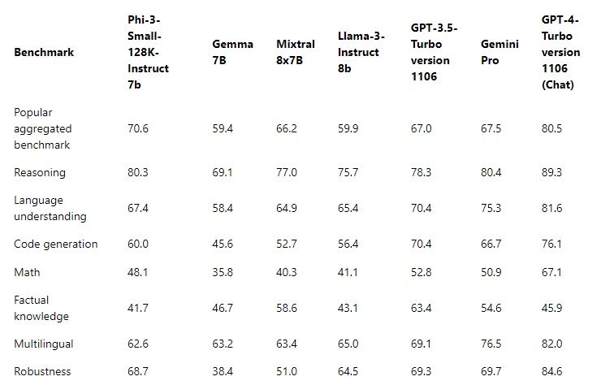

# Microsoft's Phi-3 family

The Phi-3 models are the most capable and cost-effective Small Language Models(SLMs) available, outperforming models of the same size and the next size up across a variety of language, reasoning, coding, and math benchmarks. This release expands the selection of high-quality models for customers, offering more practical choices for composing and building generative AI applications.

The Phi-3 Family includes mini, small, medium and vision versions, trained based on different parameter amounts to serve various application scenarios. Each model is instruction-tuned and developed in accordance with Microsoft's Responsible AI, safety and security standards to ensure it's ready to use off-the-shelf. Phi-3-mini outperforms models twice its size, and Phi-3-small and Phi-3-medium outperform much larger models, including GPT-3.5T.

## Example of Phi-3 Tasks
| | |
|-|-|
|Tasks|Phi-3|
|Language Tasks|Yes|
|Math & Reasoning|Yes|
|Coding|Yes|
|Function Calling|No|
|Self Orchestration (Assistant)|No|
|Dedicated Embedding Models|No|

## Phi-3-mini

Phi-3-mini, a 3.8B parameter language model, is available on [Microsoft Azure AI Studio](https://ai.azure.com/explore/models?selectedCollection=phi), [Hugging Face](https://huggingface.co/collections/microsoft/phi-3-6626e15e9585a200d2d761e3), and [Ollama](https://ollama.com/library/phi3). It offers two context lengths: [128K](https://ai.azure.com/explore/models/Phi-3-mini-128k-instruct/version/9/registry/azureml) and [4K](https://ai.azure.com/explore/models/Phi-3-mini-4k-instruct/version/9/registry/azureml).

Phi-3-mini is a Transformer-based language model with 3.8 billion parameters. It was trained using high-quality data containing educationally useful information, augmented with new data sources consisting of various NLP synthetic texts, and both internal and external chat datasets, which significantly improve chat capabilities. Additionally, Phi-3-mini has been chat fine-tuned after pre-training through supervised fine-tuning (SFT) and Direct Preference Optimization (DPO). Following this post-training, Phi-3-mini has demonstrated significant improvements in several capabilities, particularly in alignment, robustness, and safety. The model is part of the Phi-3 family and comes in the mini version with two variants, 4K and 128K, which represent the context length (in tokens) that it can support. 

## Phi-3-small

Phi-3-small, a 7B parameter language model, available in two context lengths [128K](https://ai.azure.com/explore/models/Phi-3-small-128k-instruct/version/2/registry/azureml) and [8K.](https://ai.azure.com/explore/models/Phi-3-small-8k-instruct/version/2/registry/azureml) outperforms GPT-3.5T across a variety of language, reasoning, coding, and math benchmarks.

Phi-3-small is a Transformer-based language model with 7 billion parameters. It was trained using high-quality data containing educationally useful information, augmented with new data sources that consist of various NLP synthetic texts, and both internal and external chat datasets, which significantly improve chat capabilities. In addition, Phi-3-small has been chat fine-tuned after pre-training via supervised fine-tuning (SFT) and Direct Preference Optimization (DPO). Following this post-training, Phi-3-small has shown significant improvements in several capabilities, particularly in alignment, robustness, and safety. Phi-3-small is also more intensively trained on multilingual datasets compared to Phi-3-Mini. The model family offers two variants, 8K and 128K, which represent the context length (in tokens) that it can support.

## Phi-3-medium

Phi-3-medium, a 14B parameter language model, available in two context lengths [128K](https://ai.azure.com/explore/models/Phi-3-medium-128k-instruct/version/2/registry/azureml) and [4K.](https://ai.azure.com/explore/models/Phi-3-medium-4k-instruct/version/2/registry/azureml), continues the trend by outperforming Gemini 1.0 Pro.

Phi-3-medium is a Transformer-based language model with 14 billion parameters. It was trained using high-quality data containing educationally useful information, augmented with new data sources that consist of various NLP synthetic texts, and both internal and external chat datasets, which significantly improve chat capabilities. Additionally, Phi-3-medium has been chat fine-tuned after pre-training through supervised fine-tuning (SFT) and Direct Preference Optimization (DPO). Following this post-training, Phi-3-medium has exhibited significant improvements in several capabilities, particularly in alignment, robustness, and safety. The model family offers two variants, 4K and 128K, which represent the context length (in tokens) that it can support.

## Phi-3-vision

The [Phi-3-vision](https://ai.azure.com/explore/models/Phi-3-vision-128k-instruct/version/2/registry/azureml), a 4.2B parameter multimodal model with language and vision capabilities, outperforms larger models like Claude-3 Haiku and Gemini 1.0 Pro V in general visual reasoning, OCR, and table and chart understanding tasks.

Phi-3-vision is the first multimodal model in the Phi-3 family, bringing together text and images. Phi-3-vision can be used to reason over real-world images and extract and reason over text from images. It has also been optimized for chart and diagram understanding and can be used to generate insights and answer questions. Phi-3-vision builds on the language capabilities of the Phi-3-mini, continuing to pack strong language and image reasoning quality in a small size.

> **Note**
>
> Phi-3 models do not perform as well on factual knowledge benchmarks (such as TriviaQA) as the smaller model size results in less capacity to retain facts.

## Phi silica

We are introducing Phi Silica which is built from the Phi series of models and is designed specifically for the NPUs in Copilot+ PCs. Windows is the first platform to have a state-of-the-art small language model (SLM) custom built for the NPU and shipping inbox. Phi Silica API along with OCR, Studio Effects, Live Captions, and Recall User Activity APIs will be available in Windows Copilot Library in June. More APIs like Vector Embedding, RAG API, and Text Summarization will be coming later.

## **Find all Phi-3 models** 

- [Azure AI](https://ai.azure.com/explore/models?selectedCollection=phi)
- [Hugging Face](https://huggingface.co/collections/microsoft/phi-3-6626e15e9585a200d2d761e3) 

## ONNX Models 

The primary difference between the two ONNX models, “cpu-int4-rtn-block-32” and “cpu-int4-rtn-block-32-acc-level-4”, is the accuracy level. The model with “acc-level-4” is designed to balance latency versus accuracy, with a minor trade-off in accuracy for better performance, which might be particularly suitable for mobile devices

## Example of Model Selection 

| | | | |
|-|-|-|-|
|Customer Need|Task|Start with|More Details|
|Need a model that simply summarizes a thread of messages|Conversation Summarization|Phi-3 text model|Deciding factor here is that the customer has a well defined and straight forward language task|
|A free math tutor app for kids|Math and Reasoning|Phi-3 text models|Because the app is free customers want a solution that does not cost them on a recurring basis |
|Self Patrol Car Camera|Vision analysis|Phi-Vision|Need a solution that can work on edge without internet|
|Wants to build an AI based travel booking agent|Needs complex planning, function calling and orchestration|GPT models|Need ability to plan, call APIs to gather information and execute |
|Wants to build a copilot for their employees|RAG, multiple domain, complex and open ended|GPT models|Open ended scenario, needs broader world knowledge, hence a larger model is more suited|

