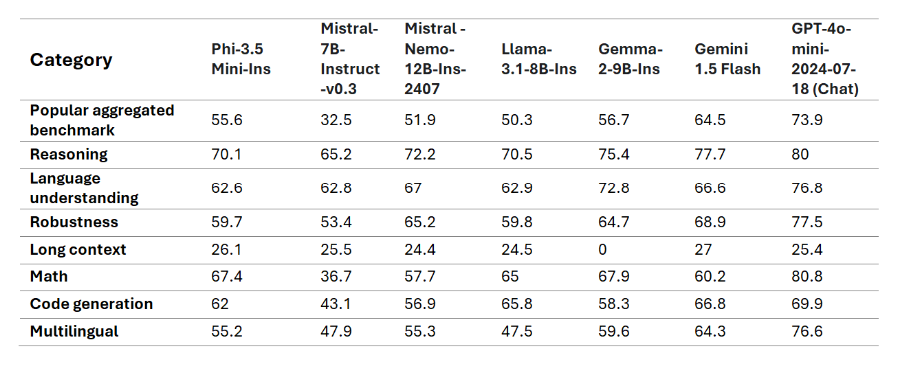

# MicrosoftのPhi-3ファミリー

Phi-3モデルは、最も強力でコスト効果の高い小型言語モデル（SLM）であり、さまざまな言語、推論、コーディング、および数学のベンチマークで同じサイズおよび次のサイズのモデルを上回ります。このリリースは、高品質なモデルの選択肢を拡大し、生成AIアプリケーションの作成と構築のためのより実用的な選択肢を提供します。

Phi-3ファミリーには、ミニ、小型、中型、およびビジョンバージョンが含まれており、さまざまなアプリケーションシナリオに対応するために異なるパラメータ量に基づいてトレーニングされています。各モデルは指示調整され、Microsoftの責任あるAI、安全性、およびセキュリティ基準に従って開発されており、すぐに使用できるようになっています。Phi-3-miniはそのサイズの2倍のモデルを上回り、Phi-3-smallおよびPhi-3-mediumは、GPT-3.5Tを含むはるかに大きなモデルを上回ります。

## Phi-3タスクの例

| | |
|-|-|
|タスク|Phi-3|
|言語タスク|はい|
|数学と推論|はい|
|コーディング|はい|
|関数呼び出し|いいえ|
|自己オーケストレーション（アシスタント）|いいえ|
|専用埋め込みモデル|いいえ|

## Phi-3-mini

Phi-3-miniは、3.8Bパラメータの言語モデルであり、[Microsoft Azure AI Studio](https://ai.azure.com/explore/models?selectedCollection=phi)、[Hugging Face](https://huggingface.co/collections/microsoft/phi-3-6626e15e9585a200d2d761e3)、および[Ollama](https://ollama.com/library/phi3)で利用できます。2つのコンテキスト長を提供します：[128K](https://ai.azure.com/explore/models/Phi-3-mini-128k-instruct/version/9/registry/azureml)および[4K](https://ai.azure.com/explore/models/Phi-3-mini-4k-instruct/version/9/registry/azureml)。

Phi-3-miniは、3.8BパラメータのTransformerベースの言語モデルです。教育的に有用な情報を含む高品質なデータを使用してトレーニングされ、さまざまなNLP合成テキスト、新しいデータソース、および内部および外部のチャットデータセットを使用してチャット機能が大幅に向上しました。さらに、Phi-3-miniは、監督付きファインチューニング（SFT）および直接好み最適化（DPO）を通じて、事前トレーニング後にチャットファインチューニングが行われました。この後のトレーニングにより、Phi-3-miniは、特に整合性、堅牢性、および安全性の面で、いくつかの能力で大幅な改善を示しました。このモデルはPhi-3ファミリーの一部であり、4Kおよび128Kの2つのバリアントがあり、サポートできるコンテキスト長（トークン単位）を表します。

## Phi-3.5-mini-instruct

[Phi-3.5 mini](https://ai.azure.com/explore/models/Phi-3.5-mini-instruct/version/1/registry/azureml)は、Phi-3で使用されたデータセット（合成データおよびフィルタリングされた公開Webサイト）に基づいて構築された軽量で最先端のオープンモデルであり、非常に高品質で推論が豊富なデータに焦点を当てています。このモデルはPhi-3モデルファミリーに属し、128Kトークンのコンテキスト長をサポートします。このモデルは、監督付きファインチューニング、近位ポリシー最適化、および直接好み最適化を組み込んだ厳格な強化プロセスを経て、正確な指示遵守と堅牢な安全対策を確保しています。

Phi-3.5 Miniは3.8Bパラメータを持ち、Phi-3 Miniと同じトークナイザーを使用する密なデコーダーオンリートランスフォーマーモデルです。

全体として、このモデルはわずか3.8Bパラメータでありながら、はるかに大きなモデルと同等の多言語理解および推論能力を持っています。ただし、特定のタスクに対してはサイズの制約があるため、依然として制限があります。このモデルは、あまりにも多くの事実知識を保持する能力がないため、事実の不正確さが発生する可能性があります。ただし、特にRAG設定でモデルを使用する場合、検索エンジンを使用してPhi-3.5を強化することで、この弱点を解決できると考えています。

### 言語サポート

以下の表は、Phi-3の多言語MMLU、MEGA、および多言語MMLU-proデータセットでの多言語能力を示しています。全体として、わずか3.8Bのアクティブパラメータであっても、モデルははるかに大きなアクティブパラメータを持つ他のモデルと比較して多言語タスクで非常に競争力があることがわかりました。

## Phi-3-small

Phi-3-smallは、7Bパラメータの言語モデルであり、2つのコンテキスト長[128K](https://ai.azure.com/explore/models/Phi-3-small-128k-instruct/version/2/registry/azureml)および[8K](https://ai.azure.com/explore/models/Phi-3-small-8k-instruct/version/2/registry/azureml)で利用できます。GPT-3.5Tを上回るパフォーマンスを発揮します。

Phi-3-smallは、7BパラメータのTransformerベースの言語モデルです。教育的に有用な情報を含む高品質なデータを使用してトレーニングされ、さまざまなNLP合成テキスト、新しいデータソース、および内部および外部のチャットデータセットを使用してチャット機能が大幅に向上しました。さらに、Phi-3-smallは、監督付きファインチューニング（SFT）および直接好み最適化（DPO）を通じて、事前トレーニング後にチャットファインチューニングが行われました。この後のトレーニングにより、Phi-3-smallは、特に整合性、堅牢性、および安全性の面で、いくつかの能力で大幅な改善を示しました。Phi-3-smallは、Phi-3-Miniと比較して多言語データセットでより集中的にトレーニングされています。このモデルファミリーは、8Kおよび128Kの2つのバリアントを提供しており、サポートできるコンテキスト長（トークン単位）を表します。

## Phi-3-medium

Phi-3-mediumは、14Bパラメータの言語モデルであり、2つのコンテキスト長[128K](https://ai.azure.com/explore/models/Phi-3-medium-128k-instruct/version/2/registry/azureml)および[4K](https://ai.azure.com/explore/models/Phi-3-medium-4k-instruct/version/2/registry/azureml)で利用できます。Gemini 1.0 Proを上回るパフォーマンスを発揮します。

Phi-3-mediumは、14BパラメータのTransformerベースの言語モデルです。教育的に有用な情報を含む高品質なデータを使用してトレーニングされ、さまざまなNLP合成テキスト、新しいデータソース、および内部および外部のチャットデータセットを使用してチャット機能が大幅に向上しました。さらに、Phi-3-mediumは、監督付きファインチューニング（SFT）および直接好み最適化（DPO）を通じて、事前トレーニング後にチャットファインチューニングが行われました。この後のトレーニングにより、Phi-3-mediumは、特に整合性、堅牢性、および安全性の面で、いくつかの能力で大幅な改善を示しました。このモデルファミリーは、4Kおよび128Kの2つのバリアントを提供しており、サポートできるコンテキスト長（トークン単位）を表します。

## Phi-3-vision

[Phi-3-vision](https://ai.azure.com/explore/models/Phi-3-vision-128k-instruct/version/2/registry/azureml)は、4.2Bパラメータのマルチモーダルモデルであり、言語およびビジョン機能を備えています。Claude-3 HaikuおよびGemini 1.0 Pro Vなどのより大きなモデルを上回ります。

Phi-3-visionは、Phi-3ファミリーの最初のマルチモーダルモデルであり、テキストと画像を組み合わせています。Phi-3-visionは、現実世界の画像を推論し、画像からテキストを抽出して推論するために使用できます。また、チャートおよび図の理解に最適化されており、洞察を生成し、質問に答えるために使用できます。Phi-3-visionは、Phi-3-miniの言語機能に基づいており、小さなサイズで強力な言語および画像推論品質を提供し続けています。

## Phi-3.5-vision

[Phi-3.5 Vision](https://ai.azure.com/explore/models/Phi-3.5-vision-instruct/version/1/registry/azureml)は、Phi-3で使用されたデータセット（合成データおよびフィルタリングされた公開Webサイト）に基づいて構築された軽量で最先端のオープンマルチモーダルモデルであり、非常に高品質で推論が豊富なデータに焦点を当てています。このモデルはPhi-3モデルファミリーに属し、128Kトークンのコンテキスト長をサポートします。このモデルは、監督付きファインチューニングおよび直接好み最適化を組み込んだ厳格な強化プロセスを経て、正確な指示遵守と堅牢な安全対策を確保しています。

Phi-3.5 Visionは4.2Bパラメータを持ち、画像エンコーダー、コネクタ、プロジェクター、およびPhi-3 Mini言語モデルを含んでいます。

このモデルは、英語での広範な商業および研究用途を目的としています。モデルは、メモリ/コンピュート制約のある環境、レイテンシー制約のあるシナリオ、一般的な画像理解、OCR、チャートおよび表の理解、複数の画像比較、複数の画像またはビデオクリップの要約などの用途に使用できます。

Phi-3.5-visionモデルは、効率的な言語およびマルチモーダルモデルの研究を加速し、生成AI機能の構築ブロックとして使用するために設計されています。

## Phi-3.5-MoE

[Phi-3.5 MoE](https://ai.azure.com/explore/models/Phi-3.5-MoE-instruct/version/1/registry/azureml)は、Phi-3で使用されたデータセット（合成データおよびフィルタリングされた公開ドキュメント）に基づいて構築された軽量で最先端のオープンモデルであり、非常に高品質で推論が豊富なデータに焦点を当てています。このモデルは多言語をサポートし、128Kトークンのコンテキスト長を持ちます。このモデルは、監督付きファインチューニング、近位ポリシー最適化、および直接好み最適化を組み込んだ厳格な強化プロセスを経て、正確な指示遵守と堅牢な安全対策を確保しています。

Phi-3 MoEは16x3.8Bパラメータを持ち、2つのエキスパートを使用する場合に6.6Bのアクティブパラメータを持つミクスチャーオブエキスパートデコーダーオンリートランスフォーマーモデルです。モデルは32,064の語彙サイズを持つトークナイザーを使用しています。

このモデルは、英語での広範な商業および研究用途を目的としています。モデルは、メモリ/コンピュート制約のある環境、レイテンシー制約のあるシナリオ、強力な推論（特に数学および論理）などの用途に使用できます。

MoEモデルは、言語およびマルチモーダルモデルの研究を加速し、生成AI機能の構築ブロックとして使用するために設計されています。

> [!NOTE]
>
> Phi-3モデルは、TriviaQAなどの事実知識ベンチマークでは、より小さなモデルサイズのため、事実を保持する能力が制限されるため、あまり優れていません。

## Phi Silica

Phiシリーズのモデルから構築されたPhi Silicaを紹介します。これは、Copilot+ PCのNPU用に特別に設計されています。Windowsは、NPU用にカスタム構築され、受信トレイに出荷される最先端の小型言語モデル（SLM）を備えた最初のプラットフォームです。Phi Silica APIおよびOCR、Studio Effects、Live Captions、Recall User Activity APIは、6月にWindows Copilotライブラリで提供されます。Vector Embedding、RAG API、およびText Summarizationなどの追加のAPIは、後日提供されます。

## **すべてのPhi-3モデルを見つける**

- [Azure AI](https://ai.azure.com/explore/models?selectedCollection=phi)
- [Hugging Face](https://huggingface.co/collections/microsoft/phi-3-6626e15e9585a200d2d761e3)

## ONNXモデル

2つのONNXモデル「cpu-int4-rtn-block-32」と「cpu-int4-rtn-block-32-acc-level-4」の主な違いは、精度レベルです。「acc-level-4」を持つモデルは、モバイルデバイスに特に適している場合に、わずかな精度のトレードオフでより良いパフォーマンスを提供するように設計されています。

## モデル選択の例

| | | | |
|-|-|-|-|
|顧客のニーズ|タスク|開始する|詳細|
|メッセージのスレッドを単純に要約するモデルが必要|会話の要約|Phi-3テキストモデル|決定要因は、顧客が明確に定義された簡単な言語タスクを持っていることです|
|子供向けの無料の数学チューターアプリ|数学と推論|Phi-3テキストモデル|アプリが無料であるため、顧客は定期的な費用がかからないソリューションを望んでいます|
|自動パトロールカメラ|ビジョン分析|Phi-Vision|インターネットなしでエッジで動作するソリューションが必要です|
|AIベースの旅行予約エージェントを構築したい|複雑な計画、関数呼び出し、およびオーケストレーションが必要|GPTモデル|計画、情報収集のためのAPI呼び出し、および実行の能力が必要です|
|従業員のためのコパイロットを構築したい|RAG、複数のドメイン、複雑でオープンエンド|GPTモデル|オープンエンドのシナリオであり、より広範な世界知識が必要であるため、より大きなモデルが適しています|
