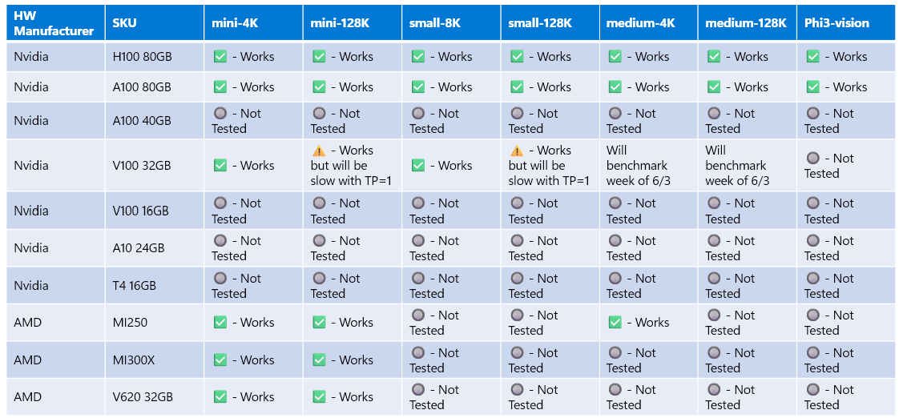

# Phi Hardware Support

Microsoft Phi has been optimized for ONNX Runtime and supports Windows DirectML. It works well across various hardware types, including GPUs, CPUs, and even mobile devices. 

## Device Hardware 
Specifically, the supported hardware includes:

- GPU SKU: RTX 4090 (DirectML)
- GPU SKU: 1 A100 80GB (CUDA)
- CPU SKU: Standard F64s v2 (64 vCPUs, 128 GiB memory)

## Mobile SKU

- Android - Samsung Galaxy S21
- Apple iPhone 14 or higher A16/A17 Processor

## Phi Hardware Specification

- Minimum Configuration Required.
- Windows: DirectX 12-capable GPU and a minimum of 4GB of combined RAM

CUDA: NVIDIA GPU with Compute Capability >= 7.02



## Running onnxruntime on multiple GPUs

Currently available Phi ONNX models are only for 1 GPU. It's possible to support multi-gpu for Phi model, but ORT with 2 gpu doesn't guarantee that it will give more throughput compared to 2 instance of ort. Please see [ONNX Runtime](https://onnxruntime.ai/) for the latest updates.

At [Build 2024 the GenAI ONNX Team](https://youtu.be/WLW4SE8M9i8?si=EtG04UwDvcjunyfC) announced that they had enabled multi-instance instead of multi-gpu for Phi models. 

At present this allows you to run one onnnxruntime or onnxruntime-genai instance with CUDA_VISIBLE_DEVICES environment variable like this.

```Python
CUDA_VISIBLE_DEVICES=0 python infer.py
CUDA_VISIBLE_DEVICES=1 python infer.py
```

Feel free to explore Phi further in [Azure AI Foundry](https://ai.azure.com)
