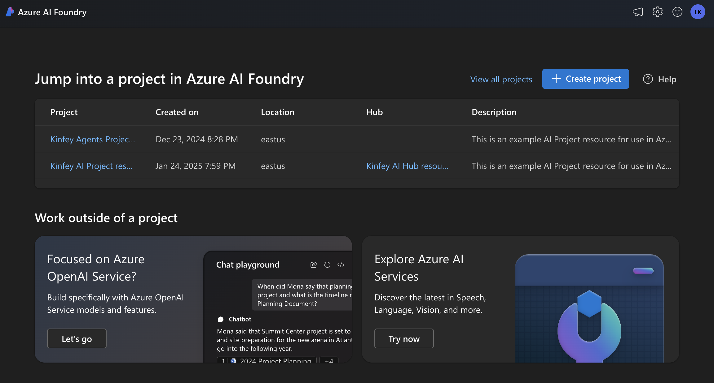
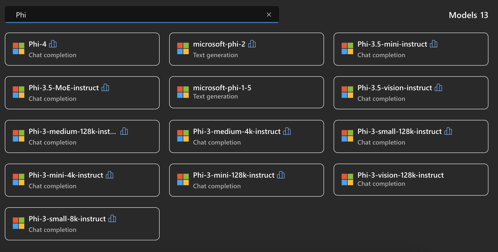
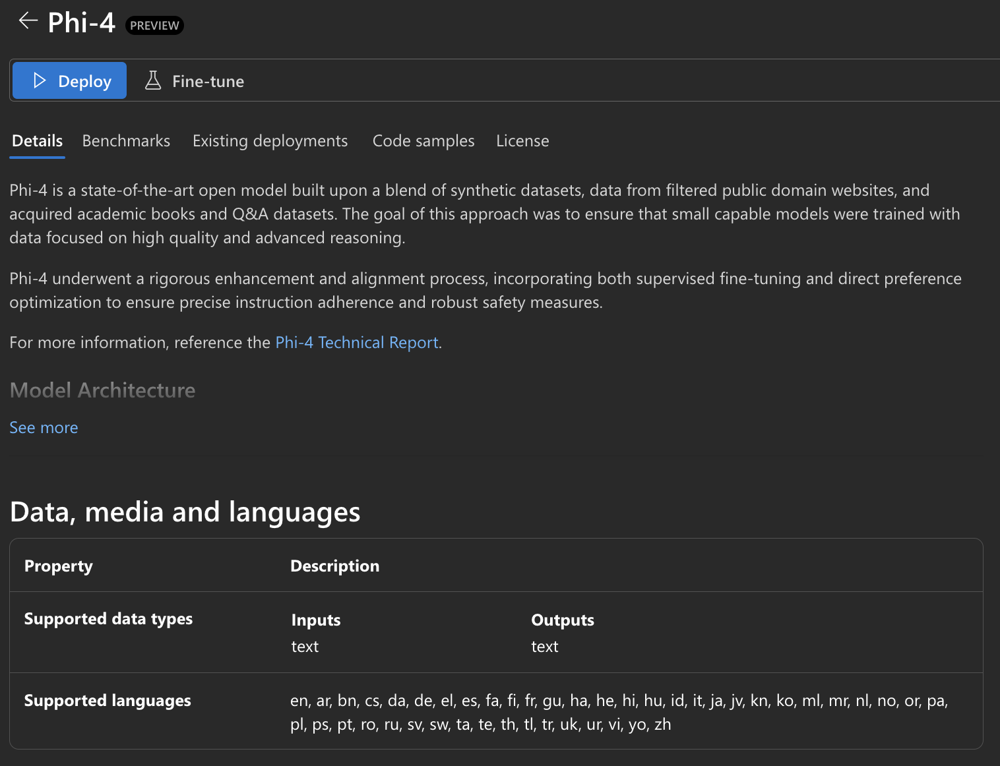
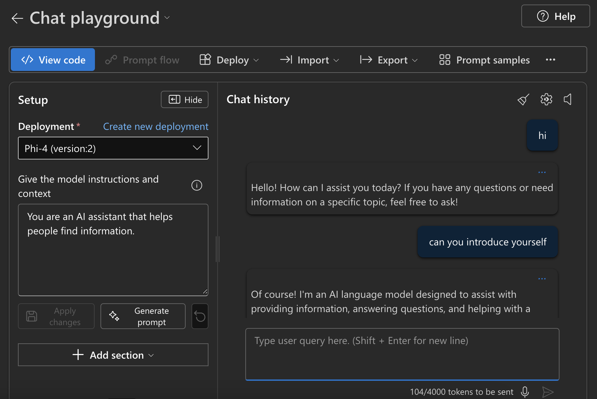

## Phi Family in Azure AI Foundry

[Azure AI Foundry](https://ai.azure.com) is a trusted platform that empowers developers to drive innovation and shape the future with AI in a safe, secure, and responsible way.


[Azure AI Foundry](https://ai.azure.com) is designed for developers to:

- Build generative AI applications on an enterprise-grade platform.
- Explore, build, test, and deploy using cutting-edge AI tools and ML models, grounded in responsible AI practices.
- Collaborate with a team for the full life-cycle of application development.

With Azure AI Foundry, you can explore a wide variety of models, services and capabilities, and get to building AI applications that best serve your goals. The Azure AI Foundry platform facilitates scalability for transforming proof of concepts into full-fledged production applications with ease. Continuous monitoring and refinement support long-term success.



In addition to using Azure AOAI Service in Azure AI Foundry, you can also use third-party models in the Azure AI Foundry Model Catalog. This is a good choice if you want to use Azure AI Foundry as your AI solution platform.

We can quickly deploy Phi Family Models through the Model Catalog in Azure AI Foundry



### **Deploy Phi-4 in Azure AI Foundry**




### **Test Phi-4 in Azure AI Foundry Playground**



### **Running Python Code to call Azure AI Foundry Phi-4**


```python

import os  
import base64
from openai import AzureOpenAI  
from azure.identity import DefaultAzureCredential, get_bearer_token_provider  
        
endpoint = os.getenv("ENDPOINT_URL", "Your Azure AOAI Service Endpoint")  
deployment = os.getenv("DEPLOYMENT_NAME", "Phi-4")  
      
token_provider = get_bearer_token_provider(  
    DefaultAzureCredential(),  
    "https://cognitiveservices.azure.com/.default"  
)  
  
client = AzureOpenAI(  
    azure_endpoint=endpoint,  
    azure_ad_token_provider=token_provider,  
    api_version="2024-05-01-preview",  
)  
  

chat_prompt = [
    {
        "role": "system",
        "content": "You are an AI assistant that helps people find information."
    },
    {
        "role": "user",
        "content": "can you introduce yourself"
    }
] 
    
# Include speech result if speech is enabled  
messages = chat_prompt 

completion = client.chat.completions.create(  
    model=deployment,  
    messages=messages,
    max_tokens=800,  
    temperature=0.7,  
    top_p=0.95,  
    frequency_penalty=0,  
    presence_penalty=0,
    stop=None,  
    stream=False  
)  
  
print(completion.to_json())  

```


