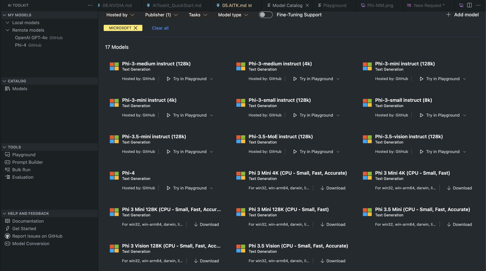
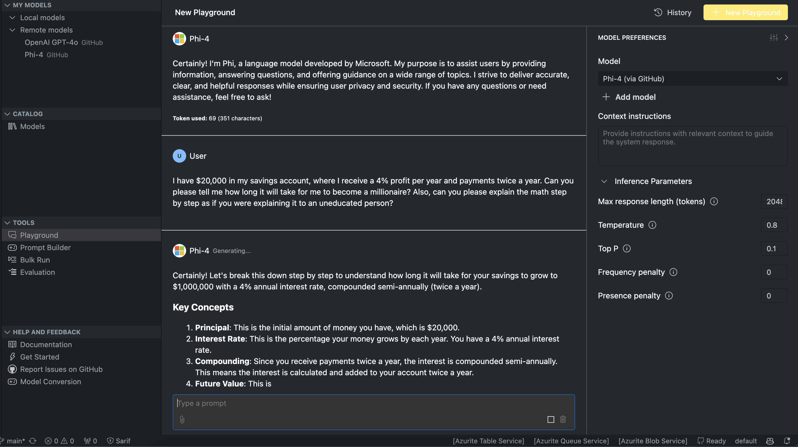

# Phi Family in AITK

[AI Toolkit for VS Code](https://marketplace.visualstudio.com/items?itemName=ms-windows-ai-studio.windows-ai-studio) simplifies generative AI app development by bringing together cutting-edge AI development tools and models from Azure AI Foundry Catalog and other catalogs like Hugging Face. You will be able browse the AI models catalog powered by GitHub Models and Azure AI Foundry Model Catalogs, download them locally or remote, fine-tune, test and use them in your application.

AI Toolkit Preview will run locally. Local inference or fine-tune, depends on the model you selected, you may need to have GPU such as NVIDIA CUDA GPU.You can run GitHub Models directly with AITK too.

## Getting Started

[Learn more how to install Windows subsystem for Linux](https://learn.microsoft.com/windows/wsl/install?WT.mc_id=aiml-137032-kinfeylo)

and [changing default distribution](https://learn.microsoft.com/windows/wsl/install#change-the-default-linux-distribution-installed).

[AI Tooklit GitHub Repo](https://github.com/microsoft/vscode-ai-toolkit/)

- Windows,Linux,macOS
  
- For finetuning on both Windows and Linux, you'll need an Nvidia GPU. In addition, **Windows** requires subsystem for Linux with Ubuntu distro 18.4 or greater. [Learn more how to install Windows subsystem for Linux](https://learn.microsoft.com/windows/wsl/install) and [changing default distribution](https://learn.microsoft.com/windows/wsl/install#change-the-default-linux-distribution-installed).

### Install AI Toolkit

AI Toolkit is shipped as a [Visual Studio Code Extension](https://code.visualstudio.com/docs/setup/additional-components#_vs-code-extensions), so you need to install [VS Code](https://code.visualstudio.com/docs/setup/windows?WT.mc_id=aiml-137032-kinfeylo) first, and download AI Toolkit from the [VS Marketplace](https://marketplace.visualstudio.com/items?itemName=ms-windows-ai-studio.windows-ai-studio).
The [AI Toolkit is available in the Visual Studio Marketplace](https://marketplace.visualstudio.com/items?itemName=ms-windows-ai-studio.windows-ai-studio) and can be installed like any other VS Code extension. 

If you're unfamiliar with installing VS Code extensions, follow these steps:

### Sign In

1. In the Activity Bar in VS Code select **Extensions**
1. In the Extensions Search bar type "AI Toolkit"
1. Select the "AI Toolkit for Visual Studio code"
1. Select **Install**

Now, you are ready to use the extension!

You will be prompted to sign in to GitHub, so please click "Allow" to continue. You will be redirected to GitHub signing page.

Please sign in and follow the process steps. After successful completion, you will be redirected to VS Code.

Once the extension has been installed you'll see the AI Toolkit icon appear in your Activity Bar.

Let's explore the available actions!

### Available Actions

The primary sidebar of the AI Toolkit is organized into  

- **Models**
- **Resources**
- **Playground**  
- **Fine-tuning**
- **Evaluation**

Are available in the Resources section. To get started select **Model Catalog**.

### Download a model from the catalog

Upon launching AI Toolkit from VS Code side bar, you can select from the following options:



- Find a supported model from **Model Catalog** and download locally
- Test model inference in the **Model Playground**
- Fine-tune model locally or remotely in **Model Fine-tuning**
- Deploy fine-tuned models to cloud via command palette for AI Toolkit
- Evaluation models

> [!NOTE]
>
> **GPU Vs CPU**
>
> You'll notice that the model cards show the model size, the platform and accelerator type (CPU, GPU). For optimized performance on **Windows devices that have at least one GPU**, select model versions that only target Windows.
>
> This ensures you have a model optimized for the DirectML accelerator.
>
> The model names are in the format of
>
> - `{model_name}-{accelerator}-{quantization}-{format}`.
>
>To check whether you have a GPU on your Windows device, open **Task Manager** and then select the **Performance** tab. If you have GPU(s), they will be listed under names like "GPU 0" or "GPU 1".

### Run the model in the playground

After all the parameters are set, click **Generate Project**.

Once your model has downloaded, select **Load in Playground** on the model card in the catalog:

- Initiate the model download
- Install all prerequisites and dependencies
- Create VS Code workspace



### Use the REST API in your application 

The AI Toolkit comes with a local REST API web server **on port 5272** that uses the [OpenAI chat completions format](https://platform.openai.com/docs/api-reference/chat/create). 

This enables you to test your application locally without having to rely on a cloud AI model service. For example, the following JSON file shows how to configure the body of the request:

```json
{
    "model": "Phi-4",
    "messages": [
        {
            "role": "user",
            "content": "what is the golden ratio?"
        }
    ],
    "temperature": 0.7,
    "top_p": 1,
    "top_k": 10,
    "max_tokens": 100,
    "stream": true
}
```

You can test the REST API using (say) [Postman](https://www.postman.com/) or the CURL (Client URL) utility:

```bash
curl -vX POST http://127.0.0.1:5272/v1/chat/completions -H 'Content-Type: application/json' -d @body.json
```

### Using the OpenAI client library for Python

```python
from openai import OpenAI

client = OpenAI(
    base_url="http://127.0.0.1:5272/v1/", 
    api_key="x" # required for the API but not used
)

chat_completion = client.chat.completions.create(
    messages=[
        {
            "role": "user",
            "content": "what is the golden ratio?",
        }
    ],
    model="Phi-4",
)

print(chat_completion.choices[0].message.content)
```

### Using Azure OpenAI client library for .NET

Add the [Azure OpenAI client library for .NET](https://www.nuget.org/packages/Azure.AI.OpenAI/) to your project using NuGet:

```bash
dotnet add {project_name} package Azure.AI.OpenAI --version 1.0.0-beta.17
```

Add a C# file called **OverridePolicy.cs** to your project and paste the following code:

```csharp
// OverridePolicy.cs
using Azure.Core.Pipeline;
using Azure.Core;

internal partial class OverrideRequestUriPolicy(Uri overrideUri)
    : HttpPipelineSynchronousPolicy
{
    private readonly Uri _overrideUri = overrideUri;

    public override void OnSendingRequest(HttpMessage message)
    {
        message.Request.Uri.Reset(_overrideUri);
    }
}
```

Next, paste the following code into your **Program.cs** file:

```csharp
// Program.cs
using Azure.AI.OpenAI;

Uri localhostUri = new("http://localhost:5272/v1/chat/completions");

OpenAIClientOptions clientOptions = new();
clientOptions.AddPolicy(
    new OverrideRequestUriPolicy(localhostUri),
    Azure.Core.HttpPipelinePosition.BeforeTransport);
OpenAIClient client = new(openAIApiKey: "unused", clientOptions);

ChatCompletionsOptions options = new()
{
    DeploymentName = "Phi-4",
    Messages =
    {
        new ChatRequestSystemMessage("You are a helpful assistant. Be brief and succinct."),
        new ChatRequestUserMessage("What is the golden ratio?"),
    }
};

StreamingResponse<StreamingChatCompletionsUpdate> streamingChatResponse
    = await client.GetChatCompletionsStreamingAsync(options);

await foreach (StreamingChatCompletionsUpdate chatChunk in streamingChatResponse)
{
    Console.Write(chatChunk.ContentUpdate);
}
```


## Fine Tuning with AI Toolkit

- Get started with model discovery and playground.
- Model fine-tuning and inference using local computing resources.
- Remote fine-tuning and inference using Azure resources

[Fine Tuning with AI Toolkit](../../03.FineTuning/Finetuning_VSCodeaitoolkit.md)

## AI Toolkit Q&A Resources

Please refer to our [Q&A page](https://github.com/microsoft/vscode-ai-toolkit/blob/main/archive/QA.md) for most common issues and resolutions
