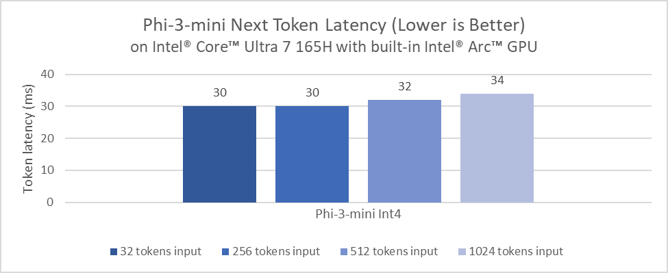
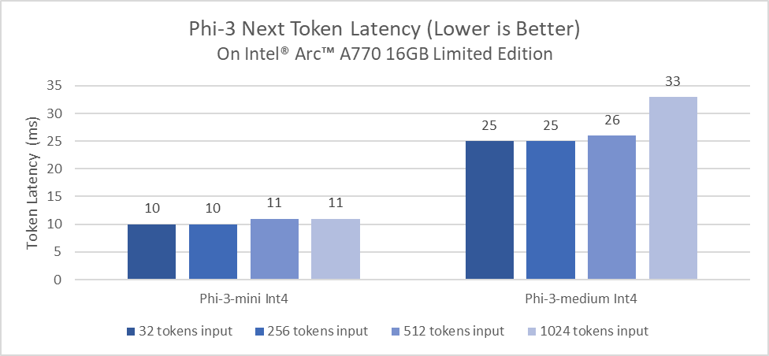
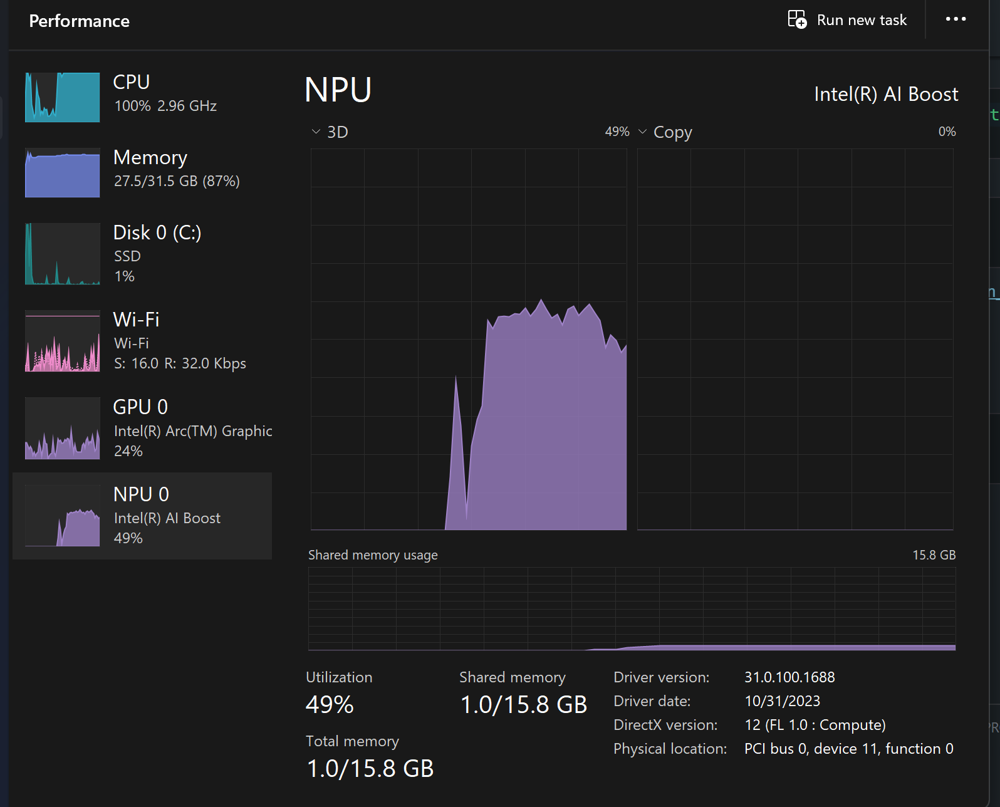
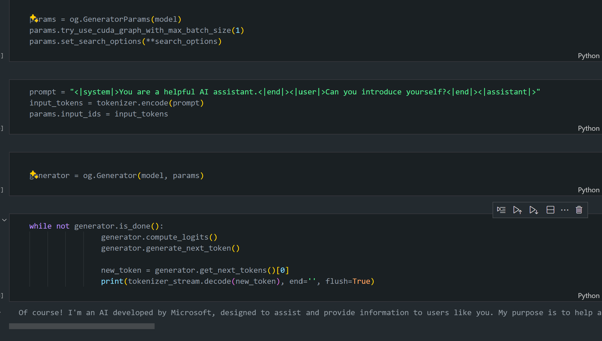

# **Inference Phi-3 in AI PC**

With the advancement of generative AI and the improvement in edge device hardware capabilities, an increasing number of generative AI models can now be integrated into users' Bring Your Own Device (BYOD) devices. AI PCs are among these models. Beginning in 2024, Intel, AMD, and Qualcomm have collaborated with PC manufacturers to introduce AI PCs that facilitate the deployment of localized generative AI models through hardware modifications. In this discussion, we will focus on Intel AI PCs and explore how to deploy Phi-3 on an Intel AI PC.

### What's NPU

An NPU (Neural Processing Unit) is a dedicated processor or processing unit on a larger SoC designed specifically for accelerating neural network operations and AI tasks. Unlike general-purpose CPUs and GPUs, NPUs are optimized for a data-driven parallel computing, making them highly efficient at processing massive multimedia data like videos and images and processing data for neural networks. They are particularly adept at handling AI-related tasks, such as speech recognition, background blurring in video calls, and photo or video editing processes like object detection.

## NPU vs GPU

While many AI and machine learning workloads run on GPUs, there's a crucial distinction between GPUs and NPUs.
GPUs are known for their parallel computing capabilities, but not all GPUs are equally efficient beyond processing graphics. NPUs, on the other hand, are purpose-built for complex computations involved in neural network operations, making them highly effective for AI tasks.

In summary, NPUs are the math whizzes that turbocharge AI computations, and they play a key role in the emerging era of AI PCs!

***This example is based on Intel's latest Intel Core Ultra Processor***

## **1. Use NPU to run Phi-3 model**

Intel® NPU device is an AI inference accelerator integrated with Intel client CPUs, starting from Intel® Core™ Ultra generation of CPUs (formerly known as Meteor Lake). It enables energy-efficient execution of artificial neural network tasks.





**Intel NPU Acceleration Library**

The Intel NPU Acceleration Library [https://github.com/intel/intel-npu-acceleration-library](https://github.com/intel/intel-npu-acceleration-library) is a Python library designed to boost the efficiency of your applications by leveraging the power of the Intel Neural Processing Unit (NPU) to perform high-speed computations on compatible hardware.

Example of Phi-3-mini on AI PC powered by Intel® Core™ Ultra processors.


Install the Python Library with pip

```bash

   pip install intel-npu-acceleration-library

```

***Note*** The project is still under development, but the reference model is already very complete.

### **Running Phi-3 with Intel NPU Acceleration Library**

Using Intel NPU acceleration, this library does not affect the traditional encoding process. You only need to use this library to quantize the original Phi-3 model, such as FP16，INT8，INT4，such as 

```python
from transformers import AutoTokenizer, pipeline,TextStreamer
from intel_npu_acceleration_library import NPUModelForCausalLM, int4
from intel_npu_acceleration_library.compiler import CompilerConfig
import warnings

model_id = "microsoft/Phi-3-mini-4k-instruct"

compiler_conf = CompilerConfig(dtype=int4)
model = NPUModelForCausalLM.from_pretrained(
    model_id, use_cache=True, config=compiler_conf, attn_implementation="sdpa"
).eval()

tokenizer = AutoTokenizer.from_pretrained(model_id)

text_streamer = TextStreamer(tokenizer, skip_prompt=True)
```

After the quantification is successful, continue execution to call the NPU to run the Phi-3 model.

```python
generation_args = {
   "max_new_tokens": 1024,
   "return_full_text": False,
   "temperature": 0.3,
   "do_sample": False,
   "streamer": text_streamer,
}

pipe = pipeline(
   "text-generation",
   model=model,
   tokenizer=tokenizer,
)

query = "<|system|>You are a helpful AI assistant.<|end|><|user|>Can you introduce yourself?<|end|><|assistant|>"

with warnings.catch_warnings():
    warnings.simplefilter("ignore")
    pipe(query, **generation_args)
```

When executing code, we can view the running status of the NPU through Task Manager



***Samples*** : [AIPC_NPU_DEMO.ipynb](../../../code/03.Inference/AIPC/AIPC_NPU_DEMO.ipynb)

## **2. Use DirectML + ONNX Runtime to run Phi-3 Model**

### **What is DirectML**

[DirectML](https://github.com/microsoft/DirectML) is a high-performance, hardware-accelerated DirectX 12 library for machine learning. DirectML provides GPU acceleration for common machine learning tasks across a broad range of supported hardware and drivers, including all DirectX 12-capable GPUs from vendors such as AMD, Intel, NVIDIA, and Qualcomm.

When used standalone, the DirectML API is a low-level DirectX 12 library and is suitable for high-performance, low-latency applications such as frameworks, games, and other real-time applications. The seamless interoperability of DirectML with Direct3D 12 as well as its low overhead and conformance across hardware makes DirectML ideal for accelerating machine learning when both high performance is desired, and the reliability and predictability of results across hardware is critical.

***Note*** : The latest DirectML already supports NPU(https://devblogs.microsoft.com/directx/introducing-neural-processor-unit-npu-support-in-directml-developer-preview/)

###  DirectML and CUDA in terms of their capabilities and performance:

**DirectML** is a machine learning library developed by Microsoft. It is designed to accelerate machine learning workloads on Windows devices, including desktops, laptops, and edge devices.
- DX12-Based: DirectML is built on top of DirectX 12 (DX12), which provides a wide range of hardware support across GPUs, including both NVIDIA and AMD.
- Wider Support: Since it leverages DX12, DirectML can work with any GPU that supports DX12, even integrated GPUs.
- Image Processing: DirectML processes images and other data using neural networks, making it suitable for tasks like image recognition, object detection, and more.
- Ease of Setup: Setting up DirectML is straightforward, and it doesn't require specific SDKs or libraries from GPU manufacturers.
- Performance: In some cases, DirectML performs well and can be faster than CUDA, especially for certain workloads.
- Limitations: However, there are instances where DirectML may be slower, particularly for float16 large batch sizes.

**CUDA** is NVIDIA's parallel computing platform and programming model. It allows developers to harness the power of NVIDIA GPUs for general-purpose computing, including machine learning and scientific simulations.
- NVIDIA-Specific: CUDA is tightly integrated with NVIDIA GPUs and is specifically designed for them.
- Highly Optimized: It provides excellent performance for GPU-accelerated tasks, especially when using NVIDIA GPUs.
- Widely Used: Many machine learning frameworks and libraries (such as TensorFlow and PyTorch) have CUDA support.
- Customization: Developers can fine-tune CUDA settings for specific tasks, which can lead to optimal performance.
- Limitations: However, CUDA's dependency on NVIDIA hardware can be limiting if you want broader compatibility across different GPUs.

### Choosing Between DirectML and CUDA

The choice between DirectML and CUDA depends on your specific use case, hardware availability, and preferences.
If you're looking for broader compatibility and ease of setup, DirectML might be a good choice. However, if you have NVIDIA GPUs and need highly optimized performance, CUDA remains a strong contender. In summary, both DirectML and CUDA have their strengths and weaknesses, so consider your requirements and available hardware when making a decision 

### **Generative AI with ONNX Runtime**

In the era of AI , the portability of AI models is very important. ONNX Runtime can easily deploy trained models to different devices. Developers do not need to pay attention to the inference framework and use a unified API to complete model inference. In the era of generative AI, ONNX Runtime has also performed code optimization (https: //onnxruntime.ai/docs/genai/). Through the optimized ONNX Runtime, the quantized generative AI model can be inferred on different terminals. In Generative AI with ONNX Runtime, you can inferene AI model API through Python, C#, C / C++. of course,Deployment on iPhone can take advantage of C++'s Generative AI with ONNX Runtime API.

[Sample Code](https://github.com/Azure-Samples/Phi-3MiniSamples/tree/main/onnx)

***compile generative AI with ONNX Runtime library***

```bash

winget install --id=Kitware.CMake  -e

git clone https://github.com/microsoft/onnxruntime.git

cd .\onnxruntime\

./build.bat --build_shared_lib --skip_tests --parallel --use_dml --config Release

cd ../

git clone https://github.com/microsoft/onnxruntime-genai.git

cd .\onnxruntime-genai\

mkdir ort

cd ort

mkdir include

mkdir lib

copy ..\onnxruntime\include\onnxruntime\core\providers\dml\dml_provider_factory.h ort\include

copy ..\onnxruntime\include\onnxruntime\core\session\onnxruntime_c_api.h ort\include

copy ..\onnxruntime\build\Windows\Release\Release\*.dll ort\lib

copy ..\onnxruntime\build\Windows\Release\Release\onnxruntime.lib ort\lib

python build.py --use_dml


```

**Install library**

```bash

pip install .\onnxruntime_genai_directml-0.3.0.dev0-cp310-cp310-win_amd64.whl

```

This is running result 



***Samples*** : [AIPC_DirectML_DEMO.ipynb](../../../code/03.Inference/AIPC/AIPC_DirectML_DEMO.ipynb)

## **3. Use Intel OpenVino to run Phi-3 Model**

### **What is OpenVINO**

[OpenVINO](https://github.com/openvinotoolkit/openvino) is an open-source toolkit for optimizing and deploying deep learning models. It provides boosted deep learning performance for vision, audio, and language models from popular frameworks like TensorFlow, PyTorch, and more. Get started with OpenVINO.OpenVINO can also be used in combination with CPU and GPU to run the Phi3 model.

***Note***: Currently, OpenVINO does not support NPU at this time.

### **Install OpenVINO Library**

```bash

 pip install git+https://github.com/huggingface/optimum-intel.git

 pip install git+https://github.com/openvinotoolkit/nncf.git

 pip install openvino-nightly

```

### **Running Phi-3 with OpenVINO**

Like NPU, OpenVINO completes the call of generative AI models by running quantitative models. We need to quantize the Phi-3 model first and complete the model quantization on the command line through optimum-cli

**INT4**

```bash

optimum-cli export openvino --model "microsoft/Phi-3-mini-4k-instruct" --task text-generation-with-past --weight-format int4 --group-size 128 --ratio 0.6  --sym  --trust-remote-code ./openvinomodel/phi3/int4

```

**FP16**

```bash

optimum-cli export openvino --model "microsoft/Phi-3-mini-4k-instruct" --task text-generation-with-past --weight-format fp16 --trust-remote-code ./openvinomodel/phi3/fp16

```

the converted format , like this


Load model paths(model_dir), related configurations(ov_config = {"PERFORMANCE_HINT": "LATENCY", "NUM_STREAMS": "1", "CACHE_DIR": ""}), and hardware-accelerated devices(GPU.0) through OVModelForCausalLM

```python

ov_model = OVModelForCausalLM.from_pretrained(
     model_dir,
     device='GPU.0',
     ov_config=ov_config,
     config=AutoConfig.from_pretrained(model_dir, trust_remote_code=True),
     trust_remote_code=True,
)

```

When executing code, we can view the running status of the GPU through Task Manager


***Samples*** : [AIPC_OpenVino_Demo.ipynb](../../../code/03.Inference/AIPC/AIPC_OpenVino_Demo.ipynb)

### ***Note*** : The above three methods each have their own advantages, but it is recommended to use NPU acceleration for AI PC inference.
