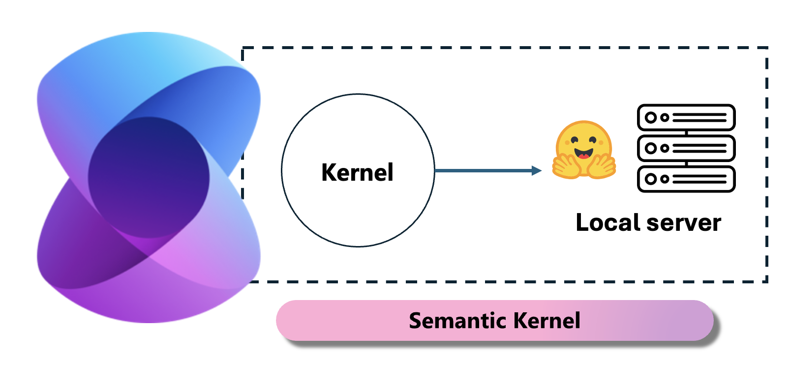
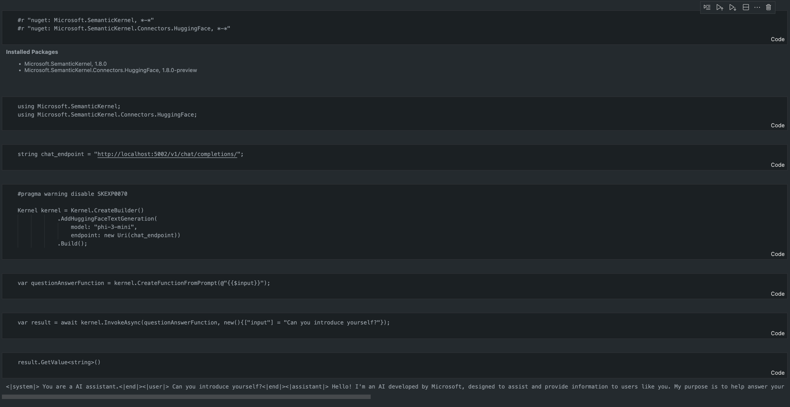

# **Inference Phi-3 in Local Server**

We can deploy Phi-3 on a local server. Users can choose [Ollama](https://ollama.com) or [LM Studio](https://llamaedge.com) solutions, or they can write their own code. You can connect Phi-3's local services through [Semantic Kernel](https://github.com/microsoft/semantic-kernel?WT.mc_id=aiml-138114-kinfeylo) or [Langchain](https://www.langchain.com/) to build Copilot applications

## **Use Semantic Kernel to access Phi-3-mini**

In the Copilot application, we create applications through Semantic Kernel / LangChain. This type of application framework is generally compatible with Azure OpenAI Service / OpenAI models, and can also support open source models on Hugging Face and local models. What should we do if we want to use Semantic Kernel to access Phi-3-mini? Using .NET as an example, we can combine it with the Hugging Face Connector in  Semantic Kernel. By default, it can correspond to the model id on Hugging Face (the first time you use it, the model will be downloaded from Hugging Face, which takes a long time). You can also connect to the built local service. Compared with the two, we recommend using the latter because it has a higher degree of autonomy, especially in enterprise applications.

From the figure accessing local services through Semantic Kernel can easily connect to the self-built Phi-3-mini model server. Here is the running result

***Sample Code*** https://github.com/kinfey/Phi3MiniSamples/tree/main/semantickernel

