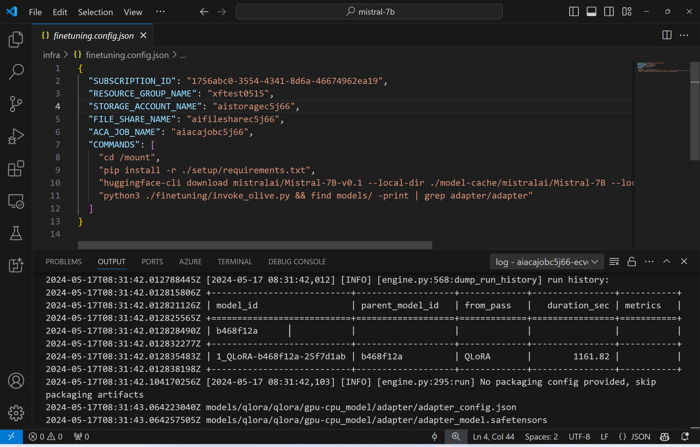
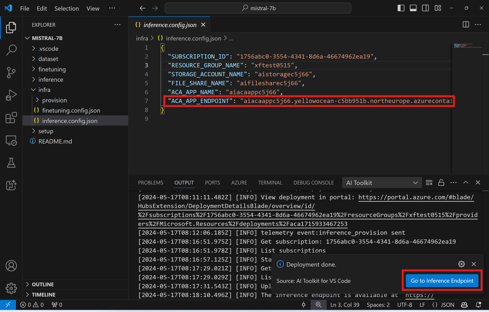

# Remote Inferencing with the fine-tuned model

After the adapters are trained in the remote environment, use a simple Gradio application to interact with the model.



### Provision Azure Resources
You need to set up the Azure Resources for remote inference by executing the `AI Toolkit: Provision Azure Container Apps for inference` from the command palette. During this setup, you will be asked to select your Azure Subscription and resource group.  

   
By default, the subscription and the resource group for inference should match those used for fine-tuning. The inference will use the same Azure Container App Environment and access the model and model adapter stored in Azure Files, which were generated during the fine-tuning step. 

## Using AI Toolkit 

### Deployment for Inference  
If you wish to revise the inference code or reload the inference model, please execute the `AI Toolkit: Deploy for inference` command. This will synchronize your latest code with ACA and restart the replica.  


After the successful completion of the deployment, the model is now ready for evaluation using this endpoint.

### Accessing the Inference API

You can access the inference API by clicking on the "*Go to Inference Endpoint*" button displayed in the VSCode notification. Alternatively, the web API endpoint can be found under `ACA_APP_ENDPOINT` in `./infra/inference.config.json` and in the output panel.



> **Note:** The inference endpoint may require a few minutes to become fully operational.

## Inference Components Included in the Template
 
| Folder | Contents |
| ------ |--------- |
| `infra` | Contains all necessary configurations for remote operations. |
| `infra/provision/inference.parameters.json` | Holds parameters for the bicep templates, used for provisioning Azure resources for inference. |
| `infra/provision/inference.bicep` | Contains templates for provisioning Azure resources for inference. |
| `infra/inference.config.json` |The configuration file, generated by the `AI Toolkit: Provision Azure Container Apps for inference` command. It is used as input for other remote command palettes. |

### Using AI Toolkit to configuring Azure Resource Provision
Configure the [AI Toolkit](https://marketplace.visualstudio.com/items?itemName=ms-windows-ai-studio.windows-ai-studio)

Provision Azure Container Apps for inference` command.

You can find configuration parameters in `./infra/provision/inference.parameters.json` file. Here are the details:
| Parameter | Description |
| --------- |------------ |
| `defaultCommands` | This is the commands to initiate a web API. |
| `maximumInstanceCount` | This parameter sets the maximum capacity of GPU instances. |
| `location` | This is the location where Azure resources are provisioned. The default value is the same as the chosen resource group's location. |
| `storageAccountName`, `fileShareName` `acaEnvironmentName`, `acaEnvironmentStorageName`, `acaAppName`,  `acaLogAnalyticsName` | These parameters are used to name the Azure resources for provision. By default, they will be same to the fine-tuning resource name. You can input a new, unused resource name to create your own custom-named resources, or you can input the name of an already existing Azure resource if you'd prefer to use that. For details, refer to the section [Using existing Azure Resources](#using-existing-azure-resources). |

### Using Existing Azure Resources

By default, the inference provision use the same Azure Container App Environment, Storage Account, Azure File Share, and Azure Log Analytics that were used for fine-tuning. A separate Azure Container App is created solely for the inference API. 

If you have customized the Azure resources during the fine-tuning step or want to use your own existing Azure resources for inference, specify their names in the `./infra/inference.parameters.json` file. Then, run the `AI Toolkit: Provision Azure Container Apps for inference` command from the command palette. This updates any specified resources and creates any that are missing.

For example, if you have an existing Azure container environment, your `./infra/finetuning.parameters.json` should look like this:

```json
{
    "$schema": "https://schema.management.azure.com/schemas/2019-04-01/deploymentParameters.json#",
    "contentVersion": "1.0.0.0",
    "parameters": {
      ...
      "acaEnvironmentName": {
        "value": "<your-aca-env-name>"
      },
      "acaEnvironmentStorageName": {
        "value": null
      },
      ...
    }
  }
```

### Manual Provision  
If you prefer to manually configure the Azure resources, you can use the provided bicep files in the `./infra/provision` folders. If you have already set up and configured all the Azure resources without using the AI Toolkit command palette, you can simply enter the resource names in the `inference.config.json` file.

For example:

```json
{
  "SUBSCRIPTION_ID": "<your-subscription-id>",
  "RESOURCE_GROUP_NAME": "<your-resource-group-name>",
  "STORAGE_ACCOUNT_NAME": "<your-storage-account-name>",
  "FILE_SHARE_NAME": "<your-file-share-name>",
  "ACA_APP_NAME": "<your-aca-name>",
  "ACA_APP_ENDPOINT": "<your-aca-endpoint>"
}
```
