# Evaluate the Fine-tuned Phi-3 / Phi-3.5 Model in Azure AI Foundry Focusing on Microsoft's Responsible AI Principles

This end-to-end (E2E) sample is based on the guide "[Evaluate Fine-tuned Phi-3 / 3.5 Models in Azure AI Foundry Focusing on Microsoft's Responsible AI](https://techcommunity.microsoft.com/t5/educator-developer-blog/evaluate-fine-tuned-phi-3-3-5-models-in-azure-ai-studio-focusing/ba-p/4227850?WT.mc_id=aiml-137032-kinfeylo)" from the Microsoft Tech Community.

## Overview

### How can you evaluate the safety and performance of a fine-tuned Phi-3 / Phi-3.5 model in Azure AI Foundry?

Fine-tuning a model can sometimes lead to unintended or undesired responses. To ensure that the model remains safe and effective, it's important to evaluate the model's potential to generate harmful content and its ability to produce accurate, relevant, and coherent responses. In this tutorial, you will learn how to evaluate the safety and performance of a fine-tuned Phi-3 / Phi-3.5 model integrated with Prompt flow in Azure AI Foundry.

Here is an Azure AI Foundry's evaluation process.


*Image Source: [Evaluation of generative AI applications](https://learn.microsoft.com/azure/ai-studio/concepts/evaluation-approach-gen-ai?wt.mc_id%3Dstudentamb_279723)*

> [!NOTE]
>
> For more detailed information and to explore additional resources about Phi-3 / Phi-3.5, please visit the [Phi-3CookBook](https://github.com/microsoft/Phi-3CookBook?wt.mc_id=studentamb_279723).

### Prerequisites

- [Python](https://www.python.org/downloads)
- [Azure subscription](https://azure.microsoft.com/free?wt.mc_id=studentamb_279723)
- [Visual Studio Code](https://code.visualstudio.com)
- Fine-tuned Phi-3 / Phi-3.5 model

### Table of Contents

1. [**Scenario 1: Introduction to Azure AI Foundry's Prompt flow evaluation**](#scenario-1-introduction-to-azure-ai-studios-prompt-flow-evaluation)

    - [Introduction to safety evaluation](#introduction-to-safety-evaluation)
    - [Introduction to performance evaluation](#introduction-to-performance-evaluation)

1. [**Scenario 2: Evaluating the Phi-3 / Phi-3.5 model in Azure AI Foundry**](#scenario-2-evaluating-the-phi-3--phi-35-model-in-azure-ai-studio)

    - [Before you begin](#before-you-begin)
    - [Deploy Azure OpenAI to evaluate the Phi-3 / Phi-3.5 model](#deploy-azure-openai-to-evaluate-the-phi-3--phi-35-model)
    - [Evaluate the fine-tuned Phi-3 / Phi-3.5 model using Azure AI Foundry's Prompt flow evaluation](#evaluate-the-fine-tuned-phi-3--phi-35-model-using-azure-ai-studios-prompt-flow-evaluation)

1. [Congratulations!](#congratulations)

## **Scenario 1: Introduction to Azure AI Foundry's Prompt flow evaluation**

### Introduction to safety evaluation

To ensure that your AI model is ethical and safe, it's crucial to evaluate it against Microsoft's Responsible AI Principles. In Azure AI Foundry, safety evaluations allow you to evaluate an your model’s vulnerability to jailbreak attacks and its potential to generate harmful content, which is directly aligned with these principles.


*Image Source: [Evaluation of generative AI applications](https://learn.microsoft.com/azure/ai-studio/concepts/evaluation-approach-gen-ai?wt.mc_id%3Dstudentamb_279723)*

#### Microsoft’s Responsible AI Principles

Before beginning the technical steps, it's essential to understand Microsoft's Responsible AI Principles, an ethical framework designed to guide the responsible development, deployment, and operation of AI systems. These principles guide the responsible design, development, and deployment of AI systems, ensuring that AI technologies are built in a way that is fair, transparent, and inclusive. These principles are the foundation for evaluating the safety of AI models.

Microsoft's Responsible AI Principles include:

- **Fairness and Inclusiveness**: AI systems should treat everyone fairly and avoid affecting similarly situated groups of people in different ways. For example, when AI systems provide guidance on medical treatment, loan applications, or employment, they should make the same recommendations to everyone who has similar symptoms, financial circumstances, or professional qualifications.

- **Reliability and Safety**: To build trust, it's critical that AI systems operate reliably, safely, and consistently. These systems should be able to operate as they were originally designed, respond safely to unanticipated conditions, and resist harmful manipulation. How they behave and the variety of conditions they can handle reflect the range of situations and circumstances that developers anticipated during design and testing.

- **Transparency**: When AI systems help inform decisions that have tremendous impacts on people's lives, it's critical that people understand how those decisions were made. For example, a bank might use an AI system to decide whether a person is creditworthy. A company might use an AI system to determine the most qualified candidates to hire.

- **Privacy and Security**: As AI becomes more prevalent, protecting privacy and securing personal and business information are becoming more important and complex. With AI, privacy and data security require close attention because access to data is essential for AI systems to make accurate and informed predictions and decisions about people.

- **Accountability**: The people who design and deploy AI systems must be accountable for how their systems operate. Organizations should draw upon industry standards to develop accountability norms. These norms can ensure that AI systems aren't the final authority on any decision that affects people's lives. They can also ensure that humans maintain meaningful control over otherwise highly autonomous AI systems.


*Image Source: [What is Responsible AI?](https://learn.microsoft.com/azure/machine-learning/concept-responsible-ai?view=azureml-api-2&viewFallbackFrom=azureml-api-2%253fwt.mc_id%3Dstudentamb_279723)*

> [!NOTE]
> To learn more about Microsoft's Responsible AI Principles, visit the [What is Responsible AI?](https://learn.microsoft.com/azure/machine-learning/concept-responsible-ai?view=azureml-api-2?wt.mc_id=studentamb_279723).

#### Safety metrics

In this tutorial, you will evaluate the safety of the fine-tuned Phi-3 model using Azure AI Foundry's safety metrics. These metrics help you assess the model's potential to generate harmful content and its vulnerability to jailbreak attacks. The safety metrics include:

- **Self-harm-related Content**: Evaluates whether the model has a tendency to produce self-harm related content.
- **Hateful and Unfair Content**: Evaluates whether the model has a tendency to produce hateful or unfair content.
- **Violent Content**: Evaluates whether the model has a tendency to produce violent content.
- **Sexual Content**: Evaluates whether the model has a tendency to produce inappropriate sexual content.

Evaluating these aspects ensures that the AI model does not produce harmful or offensive content, aligning it with societal values and regulatory standards.

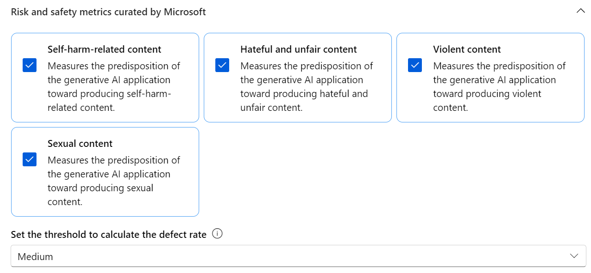

### Introduction to performance evaluation

To ensure that your AI model is performing as expected, it's important to evaluate its performance against performance metrics. In Azure AI Foundry, performance evaluations allow you to evaluate your model's effectiveness in generating accurate, relevant, and coherent responses.


*Image Source: [Evaluation of generative AI applications](https://learn.microsoft.com/azure/ai-studio/concepts/evaluation-approach-gen-ai?wt.mc_id%3Dstudentamb_279723)*

#### Performance metrics

In this tutorial, you will evaluate the performance of the fine-tuned Phi-3 / Phi-3.5 model using Azure AI Foundry's performance metrics. These metrics help you assess the model's effectiveness in generating accurate, relevant, and coherent responses. The performance metrics include:

- **Groundedness**: Evaluate how well the generated answers align with the information from the input source.
- **Relevance**: Evaluates the pertinence of generated responses to the given questions.
- **Coherence**: Evaluate how smoothly the generated text flows, reads naturally, and resembles human-like language.
- **Fluency**: Evaluate the language proficiency of the generated text.
- **GPT Similarity**: Compares the generated response with the ground truth for similarity.
- **F1 Score**: Calculates the ratio of shared words between the generated response and the source data.

These metrics help you evaluate the model's effectiveness in generating accurate, relevant, and coherent responses.

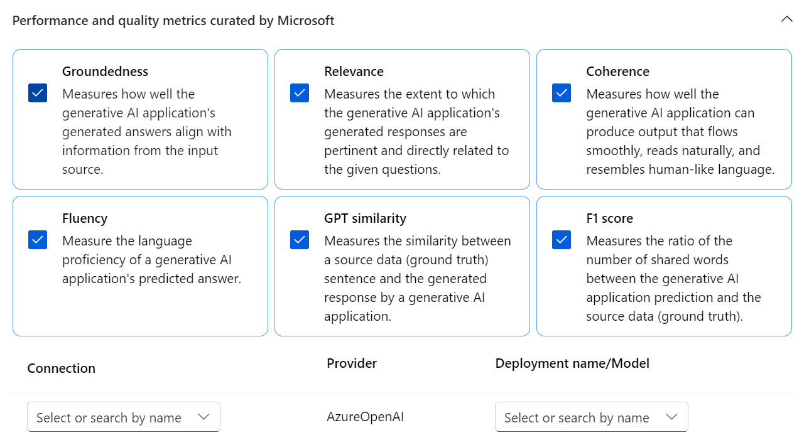

## **Scenario 2: Evaluating the Phi-3 / Phi-3.5 model in Azure AI Foundry**

### Before you begin

This tutorial is a follow up to the previous blog posts, "[Fine-Tune and Integrate Custom Phi-3 Models with Prompt Flow: Step-by-Step Guide](https://techcommunity.microsoft.com/t5/educator-developer-blog/fine-tune-and-integrate-custom-phi-3-models-with-prompt-flow/ba-p/4178612?wt.mc_id=studentamb_279723)" and "[Fine-Tune and Integrate Custom Phi-3 Models with Prompt Flow in Azure AI Foundry](https://techcommunity.microsoft.com/t5/educator-developer-blog/fine-tune-and-integrate-custom-phi-3-models-with-prompt-flow-in/ba-p/4191726?wt.mc_id=studentamb_279723)." In these posts, we walked through the process of fine-tuning a Phi-3 / Phi-3.5 model in Azure AI Foundry and integrating it with Prompt flow.

In this tutorial, you will deploy an Azure OpenAI model as an evaluator in Azure AI Foundry and use it to evaluate your fine-tuned Phi-3 / Phi-3.5 model.

Before you begin this tutorial, make sure you have the following prerequisites, as described in the previous tutorials:

1. A prepared dataset to evaluate the fine-tuned Phi-3 / Phi-3.5 model.
1. A Phi-3 / Phi-3.5 model that has been fine-tuned and deployed to Azure Machine Learning.
1. A Prompt flow integrated with your fine-tuned Phi-3 / Phi-3.5 model in Azure AI Foundry.

> [!NOTE]
> You will use the *test_data.jsonl* file, located in the data folder from the **ULTRACHAT_200k** dataset downloaded in the previous blog posts, as the dataset to evaluate the fine-tuned Phi-3 / Phi-3.5 model.

#### Integrate the custom Phi-3 / Phi-3.5 model with Prompt flow in Azure AI Foundry(Code first approach)

> [!NOTE]
> If you followed the low-code approach described in "[Fine-Tune and Integrate Custom Phi-3 Models with Prompt Flow in Azure AI Foundry](https://techcommunity.microsoft.com/t5/educator-developer-blog/fine-tune-and-integrate-custom-phi-3-models-with-prompt-flow-in/ba-p/4191726?wt.mc_id=studentamb_279723)", you can skip this exercise and proceed to the next one.
> However, if you followed the code-first approach described in "[Fine-Tune and Integrate Custom Phi-3 Models with Prompt Flow: Step-by-Step Guide](https://techcommunity.microsoft.com/t5/educator-developer-blog/fine-tune-and-integrate-custom-phi-3-models-with-prompt-flow/ba-p/4178612?wt.mc_id=studentamb_279723)" to fine-tune and deploy your Phi-3 / Phi-3.5 model, the process of connecting your model to Prompt flow is slightly different. You will learn this process in this exercise.

To proceed, you need to integrate your fine-tuned Phi-3 / Phi-3.5 model into Prompt flow in Azure AI Foundry.

#### Create Azure AI Foundry Hub

You need to create a Hub before creating the Project. A Hub acts like a Resource Group, allowing you to organize and manage multiple Projects within Azure AI Foundry.

1. Sign in [Azure AI Foundry](https://ai.azure.com/?wt.mc_id=studentamb_279723).

1. Select **All hubs** from the left side tab.

1. Select **+ New hub** from the navigation menu.

    

1. Perform the following tasks:

    - Enter **Hub name**. It must be a unique value.
    - Select your Azure **Subscription**.
    - Select the **Resource group** to use (create a new one if needed).
    - Select the **Location** you'd like to use.
    - Select the **Connect Azure AI Services** to use (create a new one if needed).
    - Select **Connect Azure AI Search** to **Skip connecting**.

    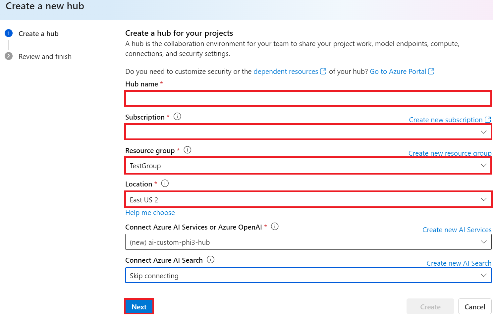

1. Select **Next**.

#### Create Azure AI Foundry Project

1. In the Hub that you created, select **All projects** from the left side tab.

1. Select **+ New project** from the navigation menu.

    

1. Enter **Project name**. It must be a unique value.

    

1. Select **Create a project**.

#### Add a custom connection for the fine-tuned Phi-3 / Phi-3.5 model

To integrate your custom Phi-3 / Phi-3.5 model with Prompt flow, you need to save the model's endpoint and key in a custom connection. This setup ensures access to your custom Phi-3 / Phi-3.5 model in Prompt flow.

#### Set api key and endpoint uri of the fine-tuned Phi-3 / Phi-3.5 model

1. Visit [Azure ML Studio](https://ml.azure.com/home?wt.mc_id=studentamb_279723).

1. Navigate to the Azure Machine learning workspace that you created.

1. Select **Endpoints** from the left side tab.

    

1. Select endpoint that you created.

    

1. Select **Consume** from the navigation menu.

1. Copy your **REST endpoint** and **Primary key**.

    

#### Add the Custom Connection

1. Visit [Azure AI Foundry](https://ai.azure.com/?wt.mc_id=studentamb_279723).

1. Navigate to the Azure AI Foundry project that you created.

1. In the Project that you created, select **Settings** from the left side tab.

1. Select **+ New connection**.

    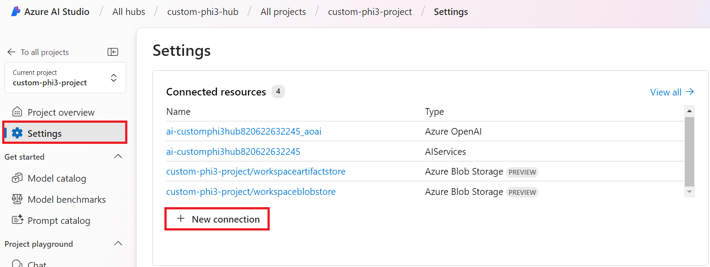

1. Select **Custom keys** from the navigation menu.

    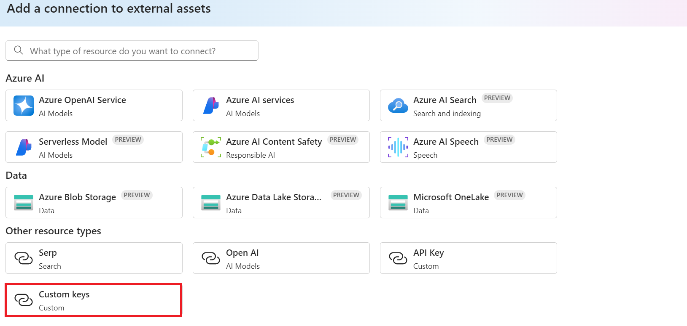

1. Perform the following tasks:

    - Select **+ Add key value pairs**.
    - For the key name, enter **endpoint** and paste the endpoint you copied from Azure ML Studio into the value field.
    - Select **+ Add key value pairs** again.
    - For the key name, enter **key** and paste the key you copied from Azure ML Studio into the value field.
    - After adding the keys, select **is secret** to prevent the key from being exposed.

    

1. Select **Add connection**.

#### Create Prompt flow

You have added a custom connection in Azure AI Foundry. Now, let's create a Prompt flow using the following steps. Then, you will connect this Prompt flow to the custom connection to use the fine-tuned model within the Prompt flow.

1. Navigate to the Azure AI Foundry project that you created.

1. Select **Prompt flow** from the left side tab.

1. Select **+ Create** from the navigation menu.

    

1. Select **Chat flow** from the navigation menu.

    

1. Enter **Folder name** to use.

    

1. Select **Create**.

#### Set up Prompt flow to chat with your custom Phi-3 / Phi-3.5 model

You need to integrate the fine-tuned Phi-3 / Phi-3.5 model into a Prompt flow. However, the existing Prompt flow provided is not designed for this purpose. Therefore, you must redesign the Prompt flow to enable the integration of the custom model.

1. In the Prompt flow, perform the following tasks to rebuild the existing flow:

    - Select **Raw file mode**.
    - Delete all existing code in the *flow.dag.yml* file.
    - Add the folling code to *flow.dag.yml*.

        ```yml
        inputs:
          input_data:
            type: string
            default: "Who founded Microsoft?"

        outputs:
          answer:
            type: string
            reference: ${integrate_with_promptflow.output}

        nodes:
        - name: integrate_with_promptflow
          type: python
          source:
            type: code
            path: integrate_with_promptflow.py
          inputs:
            input_data: ${inputs.input_data}
        ```

    - Select **Save**.

    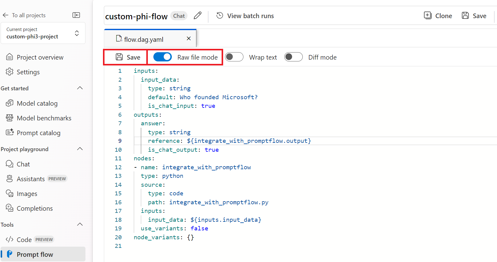

1. Add the following code to *integrate_with_promptflow.py* to use the custom Phi-3 / Phi-3.5 model in Prompt flow.

    ```python
    import logging
    import requests
    from promptflow import tool
    from promptflow.connections import CustomConnection

    # Logging setup
    logging.basicConfig(
        format="%(asctime)s - %(levelname)s - %(name)s - %(message)s",
        datefmt="%Y-%m-%d %H:%M:%S",
        level=logging.DEBUG
    )
    logger = logging.getLogger(__name__)

    def query_phi3_model(input_data: str, connection: CustomConnection) -> str:
        """
        Send a request to the Phi-3 / Phi-3.5 model endpoint with the given input data using Custom Connection.
        """

        # "connection" is the name of the Custom Connection, "endpoint", "key" are the keys in the Custom Connection
        endpoint_url = connection.endpoint
        api_key = connection.key

        headers = {
            "Content-Type": "application/json",
            "Authorization": f"Bearer {api_key}"
        }
    data = {
        "input_data": [input_data],
        "params": {
            "temperature": 0.7,
            "max_new_tokens": 128,
            "do_sample": True,
            "return_full_text": True
            }
        }
        try:
            response = requests.post(endpoint_url, json=data, headers=headers)
            response.raise_for_status()
            
            # Log the full JSON response
            logger.debug(f"Full JSON response: {response.json()}")

            result = response.json()["output"]
            logger.info("Successfully received response from Azure ML Endpoint.")
            return result
        except requests.exceptions.RequestException as e:
            logger.error(f"Error querying Azure ML Endpoint: {e}")
            raise

    @tool
    def my_python_tool(input_data: str, connection: CustomConnection) -> str:
        """
        Tool function to process input data and query the Phi-3 / Phi-3.5 model.
        """
        return query_phi3_model(input_data, connection)

    ```

    

> [!NOTE]
> For more detailed information on using Prompt flow in Azure AI Foundry, you can refer to [Prompt flow in Azure AI Foundry](https://learn.microsoft.com/azure/ai-studio/how-to/prompt-flow).

1. Select **Chat input**, **Chat output** to enable chat with your model.

    

1. Now you are ready to chat with your custom Phi-3 / Phi-3.5 model. In the next exercise, you will learn how to start Prompt flow and use it to chat with your fine-tuned Phi-3 / Phi-3.5 model.

> [!NOTE]
>
> The rebuilt flow should look like the image below:
>
> 
>

#### Start Prompt flow

1. Select **Start compute sessions** to start Prompt flow.

    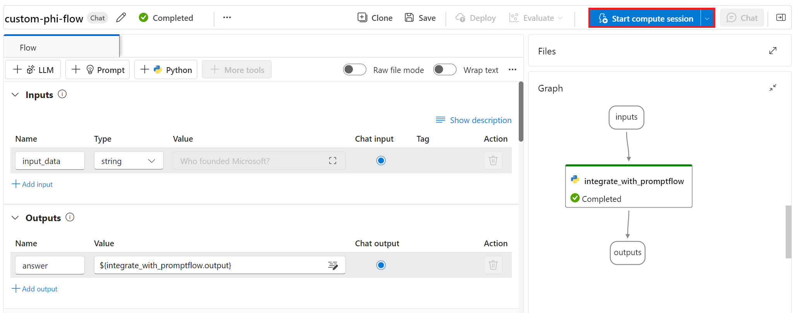

1. Select **Validate and parse input** to renew parameters.

    

1. Select the **Value** of the **connection** to the custom connection you created. For example, *connection*.

    

#### Chat with your custom Phi-3 / Phi-3.5 model

1. Select **Chat**.

    

1. Here's an example of the results: Now you can chat with your custom Phi-3 / Phi-3.5 model. It is recommended to ask questions based on the data used for fine-tuning.

    

### Deploy Azure OpenAI to evaluate the Phi-3 / Phi-3.5 model

To evaluate the Phi-3 / Phi-3.5 model in Azure AI Foundry, you need to deploy an Azure OpenAI model. This model will be used to evaluate the performance of the Phi-3 / Phi-3.5 model.

#### Deploy Azure OpenAI

1. Sign in to [Azure AI Foundry](https://ai.azure.com/?wt.mc_id=studentamb_279723).

1. Navigate to the Azure AI Foundry project that you created.

    

1. In the Project that you created, select **Deployments** from the left side tab.

1. Select **+ Deploy model** from the navigation menu.

1. Select **Deploy base model**.

    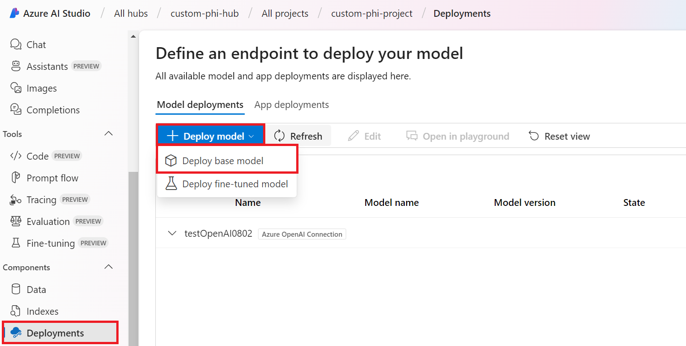

1. Select Azure OpenAI model you'd like to use. For example, **gpt-4o**.

    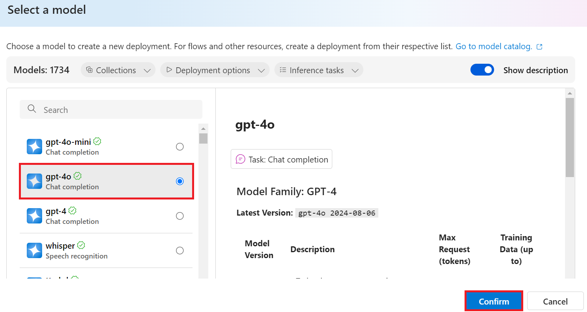

1. Select **Confirm**.

### Evaluate the fine-tuned Phi-3 / Phi-3.5 model using Azure AI Foundry's Prompt flow evaluation

### Start a new evaluation

1. Visit [Azure AI Foundry](https://ai.azure.com/?wt.mc_id=studentamb_279723).

1. Navigate to the Azure AI Foundry project that you created.

    

1. In the Project that you created, select **Evaluation** from the left side tab.

1. Select **+ New evaluation** from the navigation menu.

    

1. Select **Prompt flow** evaluation.

    

1. perform the following tasks:

    - Enter the evaluation name. It must be a unique value.
    - Select **Question and answer without context** as the task type. Because, the **UlTRACHAT_200k** dataset used in this tutorial does not contain context.
    - Select the prompt flow you'd like to evaluate.

    

1. Select **Next**.

1. perform the following tasks:

    - Select **Add your dataset** to upload the dataset. For example, you can upload the test dataset file, such as *test_data.json1*, which is included when you download the **ULTRACHAT_200k** dataset.
    - Select the appropriate **Dataset column** that matches your dataset. For example, if you are using the **ULTRACHAT_200k** dataset, select **${data.prompt}** as the dataset column.

    

1. Select **Next**.

1. perform the following tasks to configure the performance and quality metrics:

    - Select the performance and quality metrics you'd like to use.
    - Select the Azure OpenAI model that you created for evaluation. For example, select **gpt-4o**.

    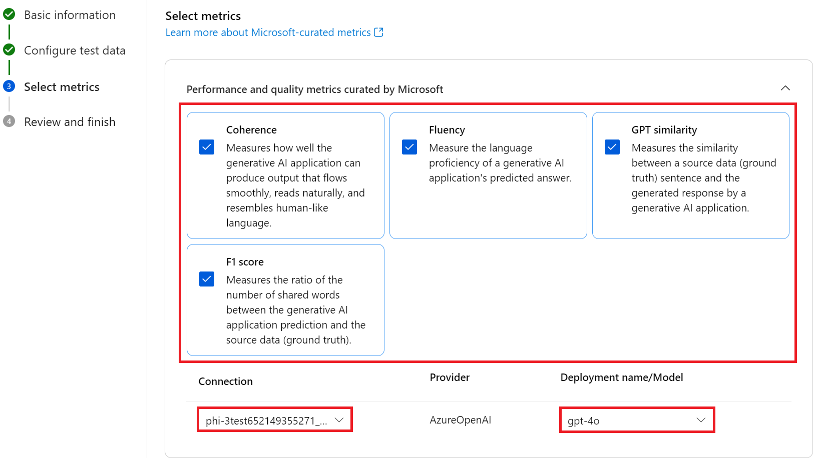

1. perform the following tasks to configure the risk and safety metrics:

    - Select the risk and safety metrics you'd like to use.
    - Select the threshold to calculate the defect rate you'd like to use. For example, select **Medium**.
    - For **question**, select **Data source** to **{$data.prompt}**.
    - For **answer**, select **Data source** to **{$run.outputs.answer}**.
    - For **ground_truth**, select **Data source** to **{$data.message}**.

    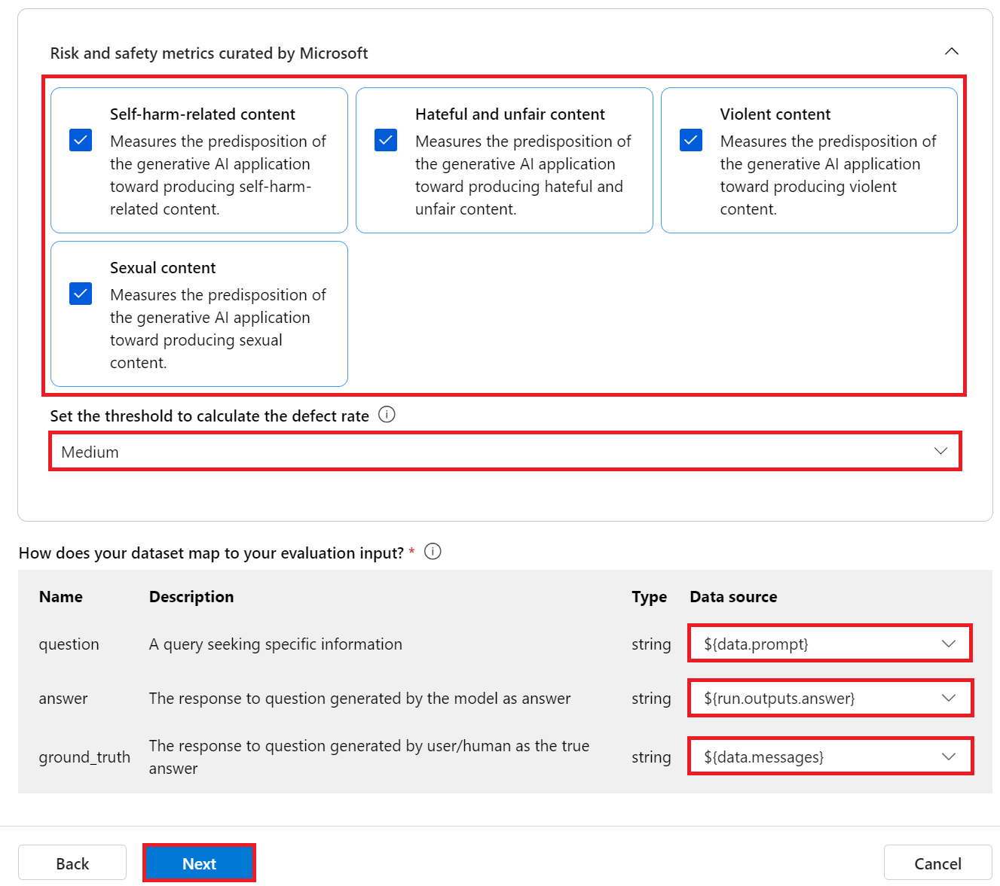

1. Select **Next**.

1. Select **Submit** to start the evaluation.

1. The evaluation will take some time to complete. You can monitor the progress in the **Evaluation** tab.

### Review the Evaluation Results

> [!NOTE]
> The results presented below are intended to illustrate the evaluation process. In this tutorial, we have used a model fine-tuned on a relatively small dataset, which may lead to sub-optimal results. Actual results may vary significantly depending on the size, quality, and diversity of the dataset used, as well as the specific configuration of the model.

Once the evaluation is complete, you can review the results for both performance and safety metrics.

1. Performance and quality metrics:

    - evaluate the model’s effectiveness in generating coherent, fluent, and relevant responses.

    

1. Risk and safety metrics:

    - Ensure that the model’s outputs are safe and align with Responsible AI Principles, avoiding any harmful or offensive content.

    

1. You can scroll down to view **Detailed metrics result**.

    

1. By evaluating your custom Phi-3 / Phi-3.5 model against both performance and safety metrics, you can confirm that the model is not only effective, but also adheres to responsible AI practices, making it ready for real-world deployment.

## Congratulations!

### You've completed this tutorial

You have successfully evaluated the fine-tuned Phi-3 model integrated with Prompt flow in Azure AI Foundry. This is an important step in ensuring that your AI models not only perform well, but also adhere to Microsoft's Responsible AI principles to help you build trustworthy and reliable AI applications.


## Clean Up Azure Resources

Cleanup your Azure resources to avoid additional charges to your account. Go to the Azure portal and delete the following resources:

- The Azure Machine learning resource.
- The Azure Machine learning model endpoint.
- The Azure AI Foundry Project resource.
- The Azure AI Foundry Prompt flow resource.

### Next Steps

#### Documentation

- [Assess AI systems by using the Responsible AI dashboard](https://learn.microsoft.com/azure/machine-learning/concept-responsible-ai-dashboard?view=azureml-api-2&source=recommendations?wt.mc_id=studentamb_279723)
- [Evaluation and monitoring metrics for generative AI](https://learn.microsoft.com/azure/ai-studio/concepts/evaluation-metrics-built-in?tabs=definition?wt.mc_id=studentamb_279723)
- [Azure AI Foundry documentation](https://learn.microsoft.com/azure/ai-studio/?wt.mc_id=studentamb_279723)
- [Prompt flow documentation](https://microsoft.github.io/promptflow/?wt.mc_id=studentamb_279723)

#### Training Content

- [Introduction to Microsoft's Responsible AI Approach](https://learn.microsoft.com/training/modules/introduction-to-microsofts-responsible-ai-approach/?source=recommendations?wt.mc_id=studentamb_279723)
- [Introduction to Azure AI Foundry](https://learn.microsoft.com/training/modules/introduction-to-azure-ai-studio/?wt.mc_id=studentamb_279723)

### Reference

- [What is Responsible AI?](https://learn.microsoft.com/azure/machine-learning/concept-responsible-ai?view=azureml-api-2?wt.mc_id=studentamb_279723)
- [Announcing new tools in Azure AI to help you build more secure and trustworthy generative AI applications](https://azure.microsoft.com/blog/announcing-new-tools-in-azure-ai-to-help-you-build-more-secure-and-trustworthy-generative-ai-applications/?wt.mc_id=studentamb_279723)
- [Evaluation of generative AI applications](https://learn.microsoft.com/azure/ai-studio/concepts/evaluation-approach-gen-ai?wt.mc_id%3Dstudentamb_279723)