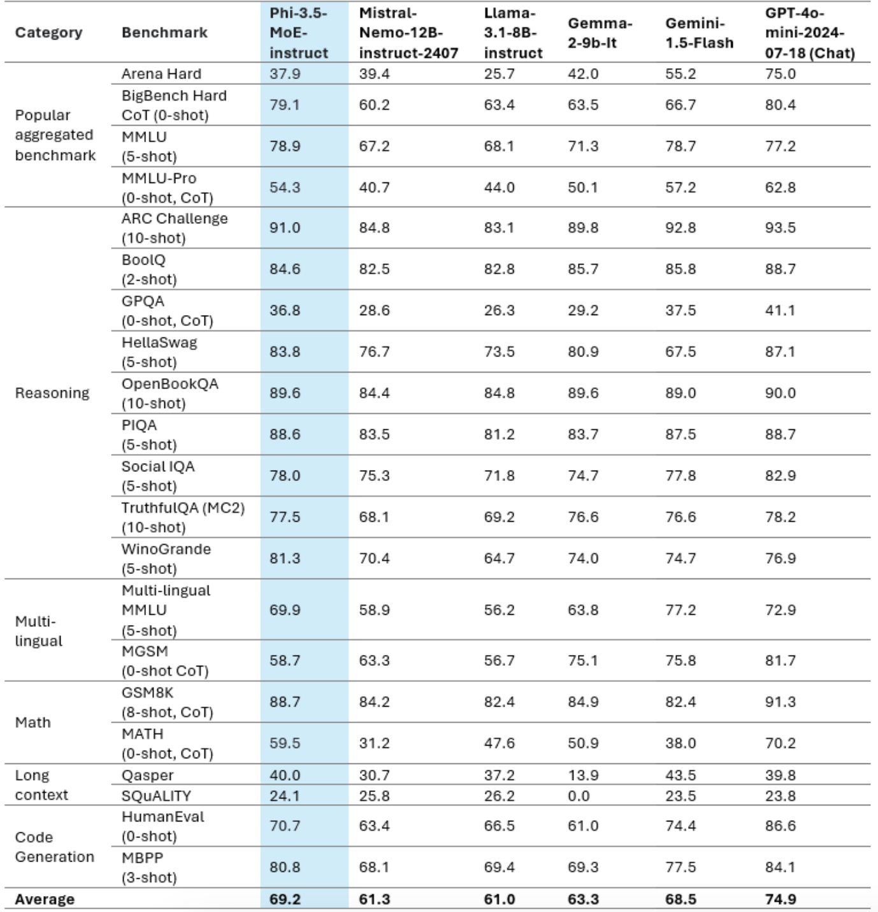
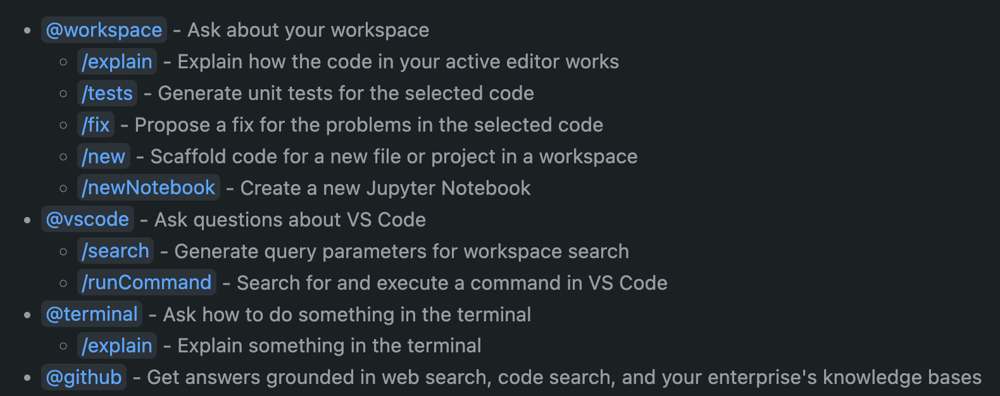
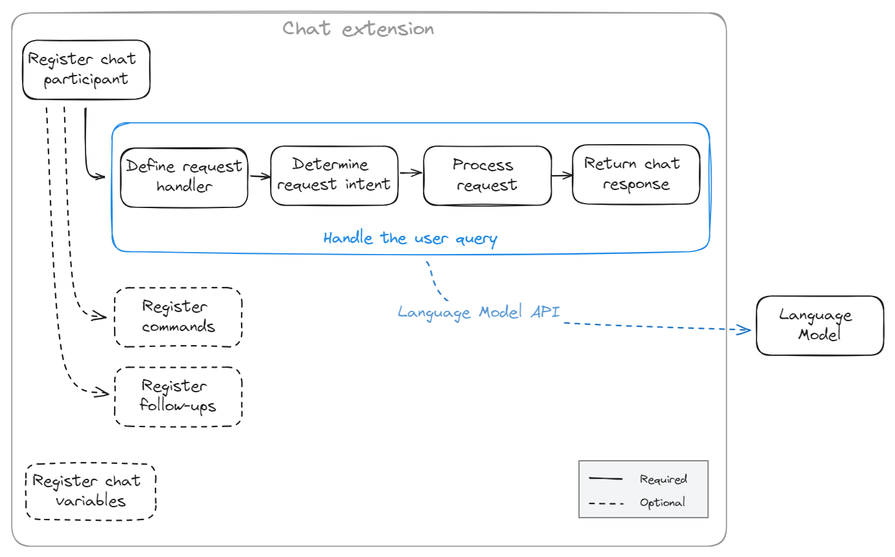
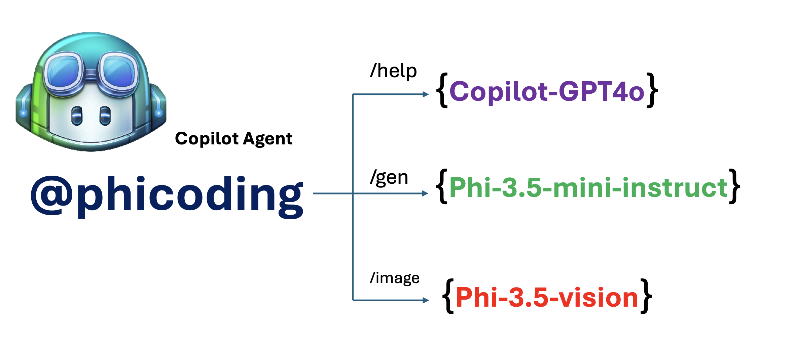
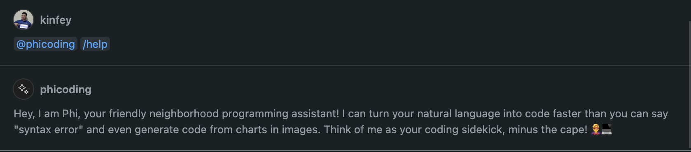
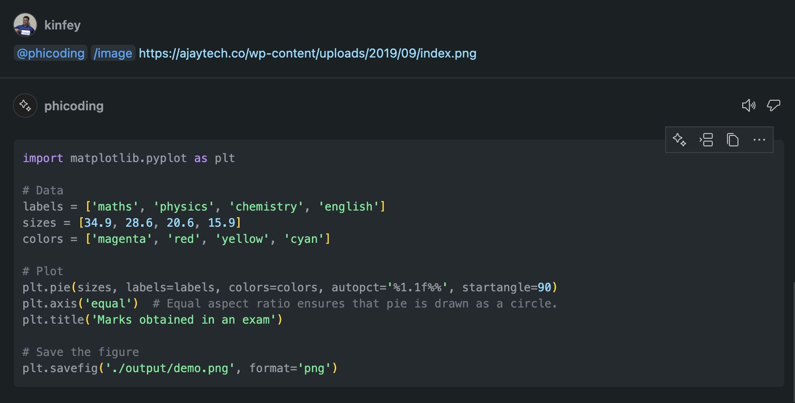

# **Create your own Visual Studio Code Chat Copilot Agent with Phi-3.5 by GitHub Models**

Are you using Visual Studio Code Copilot? Especially in Chat, you can use different agents to improve the ability to create, write, and maintain projects in Visual Studio Code. Visual Studio Code provides an API that allows companies and individuals to create different agents based on their business to expand their capabilities in different proprietary fields. In this article, we will focus on **Phi-3.5-mini-instruct (128k)** and **Phi-3.5-vision-instruct (128k)** of GitHub Models to create your own Visual Studio Code Agent.

## **About Phi-3.5 on GitHub Models**

We know that Phi-3/3.5-mini-instruct in the Phi-3/3.5 Family has strong code understanding and generation capabilities, and has advantages over Gemma-2-9b and Mistral-Nemo-12B-instruct-2407.



The latest GitHub Models already provide access to the Phi-3.5-mini-instruct (128k) and Phi-3.5-vision-instruct (128k) models. Developers can access them through the OpenAI SDK, Azure AI Inference SDK, and REST API.


***Note: *** It is recommended to use Azure AI Inference SDK here, because it can better switch with the Azure Model Catalog in the production environment

The following are the results of **Phi-3.5-mini-instruct (128k)** and **Phi-3.5-vision-instruct (128k)** in the code generation scenario after docking with GitHub Models, and also prepare for the following examples

**Demo: GitHub Models Phi-3.5-mini-instruct (128k) generate code from Prompt** ([click this link](../../../../code/09.UpdateSamples/Aug/ghmodel_phi35_instruct_demo.ipynb))

**Demo: GitHub Models Phi-3.5-vision-instruct (128k) generate code from Image** ([click this link](../../../../code/09.UpdateSamples/Aug/ghmodel_phi35_vision_demo.ipynb))


## **About GitHub Copilot Chat Agent**

GitHub Copilot Chat Agent can complete different tasks in different project scenarios based on the code. The system has four agents: workspace, github, terminal, vscode



By adding the name of the agent with ‘@’, you can quickly complete the corresponding work. For enterprises, if you add your own business-related content such as requirements, coding, test specifications, and release, you can have more powerful enterprise private functions based on GitHub Copilot.

Visua Studio Code Chat Agent has now officially released its API, allowing enterprises or enterprise developers to develop agents based on different software business ecosystems. Based on the development method of Visual Studio Code Extension Development, you can easily access the interface of the Visua Studio Code Chat Agent API. We can develop based on this process



The development scenario can support access to third-party model APIs (such as GitHub Models, Azure Model Catalog, and self-built services based on open source models) and can also use the gpt-35-turbo, gpt-4, and gpt-4o models provided by GitHub Copilot.

## **Add an Agent @phicoding based on Phi-3.5**

We try to integrate the programming capabilities of Phi-3.5 to complete code writing, image generation code and other tasks. Complete an Agent built around Phi-3.5 - @PHI, the following are some functions

1. Generate a self-introduction based on GPT-4o provided by GitHub Copilot through the **@phicoding /help** command

2. Generate code for different programming languages ​​based on **Phi-3.5-mini-instruct (128k)** through the **@phicoding /gen** command

3. Generate code based on **Phi-3.5-vision-instruct (128k)** and image completion through the **@phicoding /image** command



## **Related steps**

1. Install Visual Studio Code Extension development support using npm

```bash

npm install --global yo generator-code 

```
2. Create a Visual Studio Code Extension plugin (using Typescript development mode, named phiext)


```bash

yo code 

```

3. Open the created project and modify package.json. Here are the related instructions and configurations, as well as the configuration of GitHub Models. Note that you need to add your GitHub Models token here.


```json

{
  "name": "phiext",
  "displayName": "phiext",
  "description": "",
  "version": "0.0.1",
  "engines": {
    "vscode": "^1.93.0"
  },
  "categories": [
    "AI",
    "Chat"
  ],
  "activationEvents": [],
  "enabledApiProposals": [
      "chatVariableResolver"
  ],
  "main": "./dist/extension.js",
  "contributes": {
    "chatParticipants": [
        {
            "id": "chat.phicoding",
            "name": "phicoding",
            "description": "Hey! I am Microsoft Phi-3.5, She can help me with coding problems, such as generation code with your natural language, or even generation code about chart from images. Just ask me anything!",
            "isSticky": true,
            "commands": [
                {
                    "name": "help",
                    "description": "Introduce myself to you"
                },
                {
                    "name": "gen",
                    "description": "Generate code for you with Microsoft Phi-3.5-mini-instruct"
                },
                {
                    "name": "image",
                    "description": "Generate code for chart from image(png or jpg) with Microsoft Phi-3.5-vision-instruct, please add image url like this : https://ajaytech.co/wp-content/uploads/2019/09/index.png"
                }
            ]
        }
    ],
    "commands": [
        {
            "command": "phicoding.namesInEditor",
            "title": "Use Microsoft Phi 3.5 in Editor"
        }
    ],
    "configuration": {
      "type": "object",
      "title": "githubmodels",
      "properties": {
        "githubmodels.endpoint": {
          "type": "string",
          "default": "https://models.inference.ai.azure.com",
          "description": "Your GitHub Models Endpoint",
          "order": 0
        },
        "githubmodels.api_key": {
          "type": "string",
          "default": "Your GitHub Models Token",
          "description": "Your GitHub Models Token",
          "order": 1
        },
        "githubmodels.phi35instruct": {
          "type": "string",
          "default": "Phi-3.5-mini-instruct",
          "description": "Your Phi-35-Instruct Model",
          "order": 2
        },
        "githubmodels.phi35vision": {
          "type": "string",
          "default": "Phi-3.5-vision-instruct",
          "description": "Your Phi-35-Vision Model",
          "order": 3
        }
      }
    }
  },
  "scripts": {
    "vscode:prepublish": "npm run package",
    "compile": "webpack",
    "watch": "webpack --watch",
    "package": "webpack --mode production --devtool hidden-source-map",
    "compile-tests": "tsc -p . --outDir out",
    "watch-tests": "tsc -p . -w --outDir out",
    "pretest": "npm run compile-tests && npm run compile && npm run lint",
    "lint": "eslint src",
    "test": "vscode-test"
  },
  "devDependencies": {
    "@types/vscode": "^1.93.0",
    "@types/mocha": "^10.0.7",
    "@types/node": "20.x",
    "@typescript-eslint/eslint-plugin": "^8.3.0",
    "@typescript-eslint/parser": "^8.3.0",
    "eslint": "^9.9.1",
    "typescript": "^5.5.4",
    "ts-loader": "^9.5.1",
    "webpack": "^5.94.0",
    "webpack-cli": "^5.1.4",
    "@vscode/test-cli": "^0.0.10",
    "@vscode/test-electron": "^2.4.1"
  },
  "dependencies": {
    "@types/node-fetch": "^2.6.11",
    "node-fetch": "^3.3.2",
    "@azure-rest/ai-inference": "latest",
    "@azure/core-auth": "latest",
    "@azure/core-sse": "latest"
  }
}


```

4. Modify src/extension.ts


```typescript

// The module 'vscode' contains the VS Code extensibility API
// Import the module and reference it with the alias vscode in your code below
import * as vscode from 'vscode';
import ModelClient from "@azure-rest/ai-inference";
import { AzureKeyCredential } from "@azure/core-auth";


interface IPhiChatResult extends vscode.ChatResult {
    metadata: {
        command: string;
    };
}


const MODEL_SELECTOR: vscode.LanguageModelChatSelector = { vendor: 'copilot', family: 'gpt-4o' };

function isValidImageUrl(url: string): boolean {
    const regex = /^(https?:\/\/.*\.(?:png|jpg))$/i;
    return regex.test(url);
}
  

// This method is called when your extension is activated
// Your extension is activated the very first time the command is executed
export function activate(context: vscode.ExtensionContext) {

    const codinghandler: vscode.ChatRequestHandler = async (request: vscode.ChatRequest, context: vscode.ChatContext, stream: vscode.ChatResponseStream, token: vscode.CancellationToken): Promise<IPhiChatResult> => {


        const config : any = vscode.workspace.getConfiguration('githubmodels');
        const endPoint: string = config.get('endpoint');
        const apiKey: string = config.get('api_key');
        const phi35instruct: string = config.get('phi35instruct');
        const phi35vision: string = config.get('phi35vision');
        
        if (request.command === 'help') {

            const content = "Welcome to Coding assistant with Microsoft Phi-3.5"; 
            stream.progress(content);


            try {
                const [model] = await vscode.lm.selectChatModels(MODEL_SELECTOR);
                if (model) {
                    const messages = [
                        vscode.LanguageModelChatMessage.User("Please help me express this content in a humorous way: I am a programming assistant who can help you convert natural language into code and generate code based on the charts in the images. output format like this : Hey I am Phi ......")
                    ];
                    const chatResponse = await model.sendRequest(messages, {}, token);
                    for await (const fragment of chatResponse.text) {
                        stream.markdown(fragment);
                    }
                }
            } catch(err) {
                console.log(err);
            }


            return { metadata: { command: 'help' } };

        }

        
        if (request.command === 'gen') {

            const content = "Welcome to use phi-3.5 to generate code";

            stream.progress(content);

            const client = new ModelClient(endPoint, new AzureKeyCredential(apiKey));

            const response = await client.path("/chat/completions").post({
              body: {
                messages: [
                  { role:"system", content: "You are a coding assistant.Help answer all code generation questions." },
                  { role:"user", content: request.prompt }
                ],
                model: phi35instruct,
                temperature: 0.4,
                max_tokens: 1000,
                top_p: 1.
              }
            });

            stream.markdown(response.body.choices[0].message.content);

            return { metadata: { command: 'gen' } };

        }


        
        if (request.command === 'image') {


            const content = "Welcome to use phi-3.5 to generate code from image(png or jpg),image url like this:https://ajaytech.co/wp-content/uploads/2019/09/index.png";

            stream.progress(content);

            if (!isValidImageUrl(request.prompt)) {
                stream.markdown('Please provide a valid image URL');
                return { metadata: { command: 'image' } };
            }
            else
            {

                const client = new ModelClient(endPoint, new AzureKeyCredential(apiKey));
    
                const response = await client.path("/chat/completions").post({
                    body: {
                      messages: [
                        { role: "system", content: "You are a helpful assistant that describes images in details." },
                        { role: "user", content: [
                            { type: "text", text: "Please generate code according to the chart in the picture according to the following requirements\n1. Keep all information in the chart, including data and text\n2. Do not generate additional information that is not included in the chart\n3. Please extract data from the picture, do not generate it from csv\n4. Please save the regenerated chart as a chart and save it to ./output/demo.png"},
                            { type: "image_url", image_url: {url: request.prompt}
                            }
                          ]
                        }
                      ],
                      model: phi35vision,
                      temperature: 0.4,
                      max_tokens: 2048,
                      top_p: 1.
                    }
                  });
    
                
                stream.markdown(response.body.choices[0].message.content);
    
                return { metadata: { command: 'image' } };
            }


        }


        return { metadata: { command: '' } };
    };


    const phi_ext = vscode.chat.createChatParticipant("chat.phicoding", codinghandler);

    phi_ext.iconPath = new vscode.ThemeIcon('sparkle');


    phi_ext.followupProvider = {
        provideFollowups(result: IPhiChatResult, context: vscode.ChatContext, token: vscode.CancellationToken) {
            return [{
                prompt: 'Let us coding with Phi-3.5 😋😋😋😋',
                label: vscode.l10n.t('Enjoy coding with Phi-3.5'),
                command: 'help'
            } satisfies vscode.ChatFollowup];
        }
    };

    context.subscriptions.push(phi_ext);
}

// This method is called when your extension is deactivated
export function deactivate() {}


```

6. Running

***/help***


***@phicoding /help***



***@phicoding /gen***


***@phicoding /image***




You can download sample code :[click](../../../../code/09.UpdateSamples/Aug/vscode/)

## **Resources**

1. Sign up GitHub Models [https://gh.io/models](https://gh.io/models)

2. Learn Visual Studio Code Extension Development [https://code.visualstudio.com/api/get-started/your-first-extension](https://code.visualstudio.com/api/get-started/your-first-extension)

3. Learn about Visual Studio Code Coilot Chat API [https://code.visualstudio.com/api/extension-guides/chat](https://code.visualstudio.com/api/extension-guides/chat)


