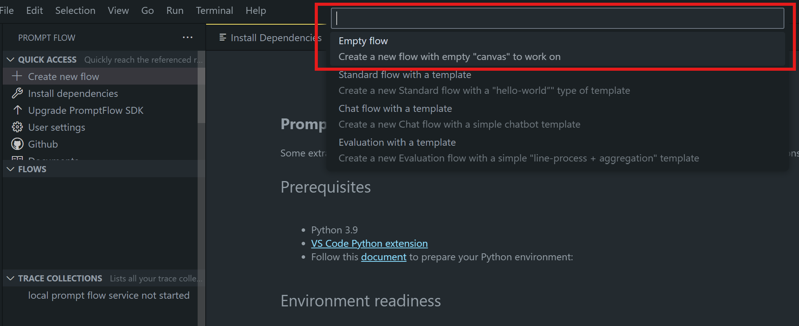
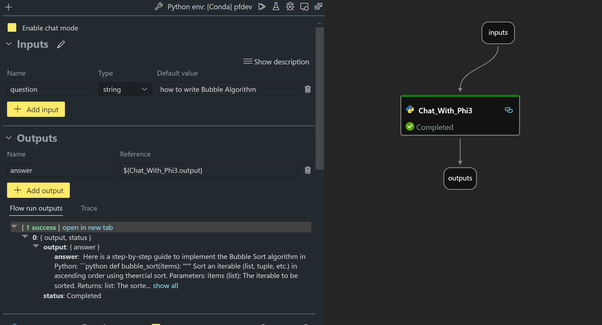
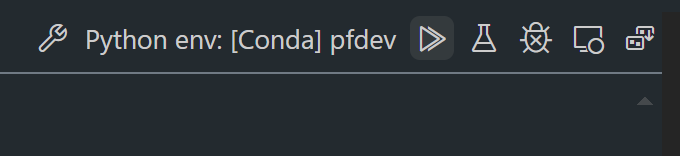

# **Lab 2 -  Run Prompt flow with Phi-3-mini in AIPC**

## **What's Prompt flow**

Prompt flow is a suite of development tools designed to streamline the end-to-end development cycle of LLM-based AI applications, from ideation, prototyping, testing, evaluation to production deployment and monitoring. It makes prompt engineering much easier and enables you to build LLM apps with production quality.

With prompt flow, you will be able to:

- Create flows that link LLMs, prompts, Python code and other tools together in a executable workflow.

- Debug and iterate your flows, especially the interaction with LLMs with ease.

- Evaluate your flows, calculate quality and performance metrics with larger datasets.

- Integrate the testing and evaluation into your CI/CD system to ensure quality of your flow.

- Deploy your flows to the serving platform you choose or integrate into your app’s code base easily.

- (Optional but highly recommended) Collaborate with your team by leveraging the cloud version of Prompt flow in Azure AI.

## **What's AIPC**

An AI PC has a CPU, a GPU and an NPU, each with specific AI acceleration capabilities. An NPU, or neural processing unit, is a specialized accelerator that handles artificial intelligence (AI) and machine learning (ML) tasks right on your PC instead of sending data to be processed in the cloud. The GPU and CPU can also process these workloads, but the NPU is especially good at low-power AI calculations. The AI PC represents a fundamental shift in how our computers operate. It is not a solution for a problem that didn’t exist before. Instead, it promises to be a huge improvement for everyday PC usages.

So how does it work? Compared to generative AI and the massive large language models (LLMs) trained on tons of public data, the AI that will happen on your PC is more accessible on pretty much every level. The concept is easier to digest, and because it’s trained on your data, without needing to access the cloud, the benefits are more immediately appealing to a broader population.

In the near-term, the AI PC world involves personal assistants and smaller AI models running directly on your PC, using your data to offer personal, private, more secure AI enhancements for things you already do every day – taking meeting minutes, organizing a fantasy football league, automating enhancements for photo and video editing, or laying out the perfect itinerary for a family reunion based on everyone’s arrival and departure times.


## **Building generation code flows on AIPC**

***Note*** ：If you have not completed the environment installation , please visit [Lab 0 -Installations](./01.Installations.md)

1. Open the Prompt flow Extension in Visual Studio Code and create a empty flow project



2. Add Inputs and Outputs parameters and Add Python Code as new flow




You can refer to this structure (flow.dag.yaml) to construct your flow

```yaml

inputs:
  question:
    type: string
    default: how to write Bubble Algorithm
outputs:
  answer:
    type: string
    reference: ${Chat_With_Phi3.output}
nodes:
- name: Chat_With_Phi3
  type: python
  source:
    type: code
    path: Chat_With_Phi3.py
  inputs:
    question: ${inputs.question}


```

3. Add Code in ***Chat_With_Phi3.py***


```python


from promptflow.core import tool

# import torch
from transformers import AutoTokenizer, pipeline,TextStreamer
import intel_npu_acceleration_library as npu_lib

import warnings

import asyncio
import platform

class Phi3CodeAgent:
    
    model = None
    tokenizer = None
    text_streamer = None
    
    model_id = "microsoft/Phi-3-mini-4k-instruct"

    @staticmethod
    def init_phi3():
        
        if Phi3CodeAgent.model is None or Phi3CodeAgent.tokenizer is None or Phi3CodeAgent.text_streamer is None:
            Phi3CodeAgent.model = npu_lib.NPUModelForCausalLM.from_pretrained(
                                    Phi3CodeAgent.model_id,
                                    torch_dtype="auto",
                                    dtype=npu_lib.int4,
                                    trust_remote_code=True
                                )
            Phi3CodeAgent.tokenizer = AutoTokenizer.from_pretrained(Phi3CodeAgent.model_id)
            Phi3CodeAgent.text_streamer = TextStreamer(Phi3CodeAgent.tokenizer, skip_prompt=True)

    

    @staticmethod
    def chat_with_phi3(prompt):
        
        Phi3CodeAgent.init_phi3()

        messages = "<|system|>You are a AI Python coding assistant. Please help me to generate code in Python.The answer only genertated Python code, but any comments and instructions do not need to be generated<|end|><|user|>" + prompt +"<|end|><|assistant|>"


        generation_args = {
            "max_new_tokens": 1024,
            "return_full_text": False,
            "temperature": 0.3,
            "do_sample": False,
            "streamer": Phi3CodeAgent.text_streamer,
        }

        pipe = pipeline(
            "text-generation",
            model=Phi3CodeAgent.model,
            tokenizer=Phi3CodeAgent.tokenizer,
            # **generation_args
        )

        result = ''

        with warnings.catch_warnings():
            warnings.simplefilter("ignore")
            response = pipe(messages, **generation_args)
            result =response[0]['generated_text']
            return result


@tool
def my_python_tool(question: str) -> str:
    if platform.system() == 'Windows':
        asyncio.set_event_loop_policy(asyncio.WindowsSelectorEventLoopPolicy())
    return Phi3CodeAgent.chat_with_phi3(question)


```

4. You can test the flow from Debug or Run to check generation code okay or not 



5. Run flow as development API in terminal

```

pf flow serve --source ./ --port 8080 --host localhost   

```

You can test it in Postman / Thunder Client


### **Note**

1. The first run takes a long time. It is recommended to download the phi-3 model from Hugging face CLI.

2. Considering the limited computing power of Intel NPU, it is recommended to use Phi-3-mini-4k-instruct

3. We use Intel NPU Acceleration to quantize INT4 conversion, but if you re-run the service, you need to delete the cache and nc_workshop folders.


## **Resources**

1. Learn Promptflow [https://microsoft.github.io/promptflow/](https://microsoft.github.io/promptflow/)

2. Learn Intel NPU Acceleration [https://github.com/intel/intel-npu-acceleration-library](https://github.com/intel/intel-npu-acceleration-library)

3. Sample Code, download [Local NPU Agent Sample Code](../../../../../../../code/07.Lab/01/AIPC/)


