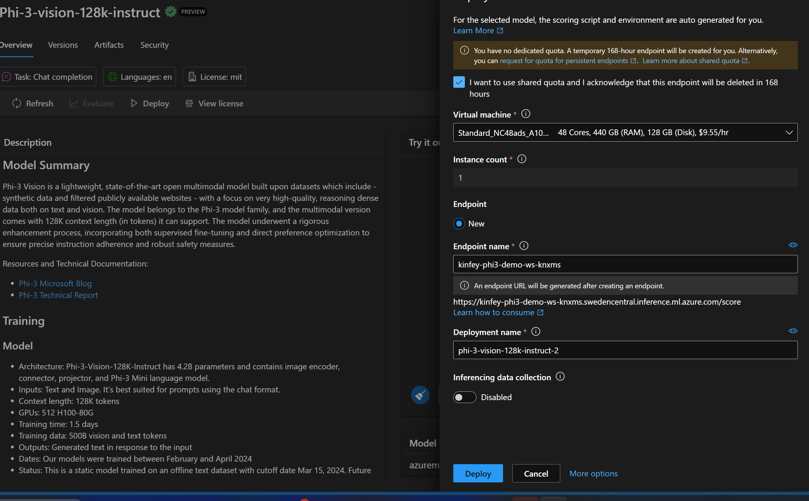
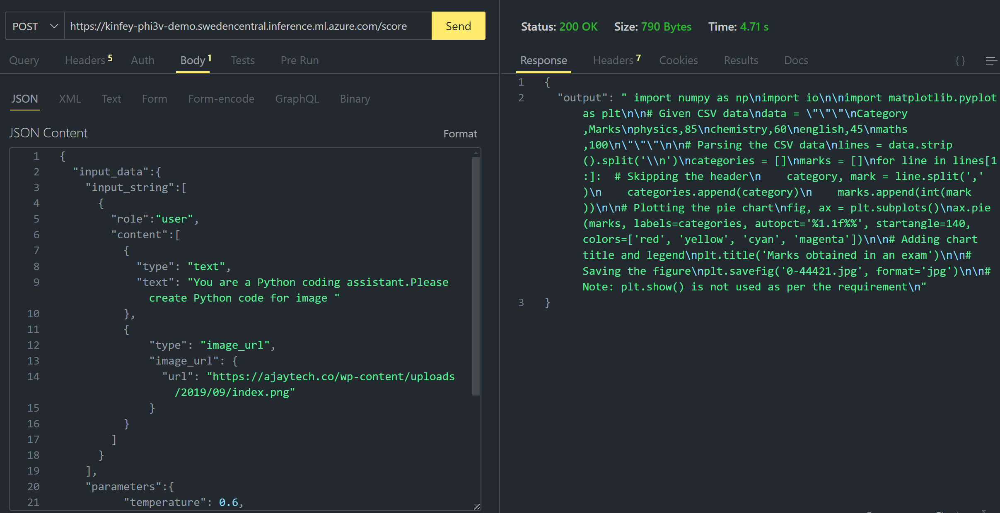

# **Lab 3 - Deploy Phi-3-vision on Azure Machine Learning Service**

We use NPU to complete the production deployment of local code, and then we want to introduce the ability to introduce PHI-3-VISION through it to achieve pictures to generate code.

In this introduction, we can quickly build a Model As Service Phi-3 Vision service in Azure Machine Learning Service.

***Note***： Phi-3 Vision requires computing power to generate content at a faster speed. We need cloud computing power to help us achieve this.


### **1. Create Azure Machine Learning Service**

We need to create an Azure Machine Learning Service in the Azure Portal. If you want to learn how, please visit this link [https://learn.microsoft.com/azure/machine-learning/quickstart-create-resources?view=azureml-api-2](https://learn.microsoft.com/azure/machine-learning/quickstart-create-resources?view=azureml-api-2)


### **2. Choose Phi-3 Vision in Azure Machine Learning Service**


### **3. Deploy Phi-3-Vision in Azure**





### **4. Test Endpoint in Postman**





***Note***

1. The parameters to be transmitted must include Authorization, azureml-model-deployment, and Content-Type. You need to check the deployment information to obtain it.

2. To transmit parameters, Phi-3-Vision needs to transmit an image link. Please refer to the GPT-4-Vision method to transmit parameters, such as

```json

{
  "input_data":{
    "input_string":[
      {
        "role":"user",
        "content":[ 
          {
            "type": "text",
            "text": "You are a Python coding assistant.Please create Python code for image "
          },
          {
              "type": "image_url",
              "image_url": {
                "url": "https://ajaytech.co/wp-content/uploads/2019/09/index.png"
              }
          }
        ]
      }
    ],
    "parameters":{
          "temperature": 0.6,
          "top_p": 0.9,
          "do_sample": false,
          "max_new_tokens": 2048
    }
  }
}

```

3. Call **/score** using the Post method

**Congratulations** ！You have completed the fast PHI-3-VISION deployment and tried how to use pictures to generate code. Next, we can build applications in combination with NPUs and clouds


