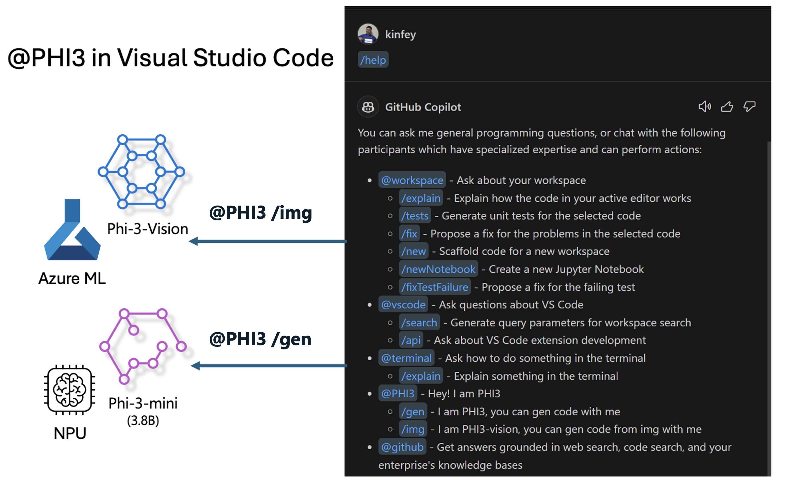

# **Build your own Visual Studio Code GitHub Copilot Chat with Microsoft Phi-3 Family**

Have you used the workspace agent in GitHub Copilot Chat? Do you want to build your own team's code agent? This hands-on lab hopes to combine the open source model to build an enterprise-level code business agent.

## **Foundation**

### **Why choose Microsoft Phi-3**

Phi-3 is a family series, including phi-3-mini, phi-3-small, and phi-3-medium based on different training parameters for text generation, dialogue completion, and code generation. There is also phi-3-vision based on Vision. It is suitable for enterprises or different teams to create offline generative AI solutions.

Recommended to read this link [https://github.com/microsoft/Phi-3CookBook/blob/main/md/01.Introduce/Phi3Family.md](https://github.com/microsoft/Phi-3CookBook/blob/main/md/01.Introduce/Phi3Family.md)

### **Microsoft GitHub Copilot Chat**

The GitHub Copilot Chat extension gives you a chat interface that lets you interact with GitHub Copilot and receive answers to coding-related questions directly within VS Code, without requiring you to navigate documentation or search online forums.

Copilot Chat might use syntax highlighting, indentation, and other formatting features to add clarity to the generated response. Depending upon the type of question from the user, the result can contain links to context that Copilot used for generating a response, such as source code files or documentation, or buttons for accessing VS Code functionality.

- Copilot Chat integrates in your developer flow and gives you assistance where you need it:

- Start an inline chat conversation directly from the editor or the terminal for help while you're coding

- Use the Chat view to have an AI assistant on the side to help you at any time

- Launch Quick Chat to ask a quick question and get back into what you're doing

You can use GitHub Copilot Chat in various scenarios, such as:

- Answering coding questions on how to best solve a problem

- Explaining someone else's code and suggest improvements

- Proposing code fixes

- Generating unit test cases

- Generating code documentation

Recommended to read this link [https://code.visualstudio.com/docs/copilot/copilot-chat](https://code.visualstudio.com/docs/copilot/copilot-chat?WT.mc_id=aiml-137032-kinfeylo)

###  **Microsoft GitHub Copilot Chat @workspace**

Referencing **@workspace** in Copilot Chat lets you ask questions about your entire codebase. Based on the question, Copilot intelligently retrieves relevant files and symbols, which it then references in its answer as links and code examples. 

To answer your question, **@workspace** searches through the same sources a developer would use when navigating a codebase in VS Code:

- All files in the workspace, except for files that are ignored by a .gitignore file

- Directory structure with nested folder and file names

- GitHub's code search index, if the workspace is a GitHub repository and indexed by code search

- Symbols and definitions in the workspace

- Currently selected text or visible text in the active editor

Note: .gitignore is bypassed if you have a file open or have text selected within an ignored file.

Recommended to read this link [[https://code.visualstudio.com/docs/copilot/copilot-chat](https://code.visualstudio.com/docs/copilot/workspace-context?WT.mc_id=aiml-137032-kinfeylo)]

## **Know more about this Lab**

GitHub Copilot has greatly improved the programming efficiency of enterprises, and every enterprise hopes to customize the relevant functions of GitHub Copilot. Many enterprises have customized Extensions similar to GitHub Copilot based on their own business scenarios and open source models. For enterprises, customized Extensions are easier to control, but this also affects the user experience. After all, GitHub Copilot has stronger functions in dealing with general scenarios and professionalism. If the experience can be kept consistent, it would be better to customize the enterprise's own Extension. GitHub Copilot Chat provides relevant APIs for enterprises to expand in the Chat experience. Maintaining a consistent experience and having customized functions is a better user experience.

This lab mainly uses the Phi-3 model combined with the local NPU and Azure hybrid to build a custom Agent in GitHub Copilot Chat ***@PHI3*** to assist enterprise developers in completing code generation***(@PHI3 /gen)*** and generating code based on images ***(@PHI3 /img)***.

### ***Note:*** 

This lab is currently implemented in the AIPC of Intel CPU and Apple Silicon. We will continue to update the Qualcomm version of NPU.

## **Lab**

| Name | Description | AIPC | Apple |
| ------------ | ----------- | -------- |-------- |
| Lab0 - Installations(✅) | Configure and install related environments and installation tools | [Go](./HOL/AIPC/01.Installations.md) |[Go](./HOL/Apple/01.Installations.md) |
| Lab1 - Run Prompt flow with Phi-3-mini (✅) | Combined with AIPC / Apple Silicon, using local NPU to create code generation through Phi-3-mini | [Go](./HOL/AIPC/02.PromptflowWithNPU.md) |  [Go](./HOL/Apple/02.PromptflowWithMLX.md) |
| Lab2 - Deploy Phi-3-vision on Azure Machine Learning Service(✅) | Generate code by deploying Azure Machine Learning Service's Model Catalog - Phi-3-vision image | [Go](./HOL/AIPC/03.DeployPhi3VisionOnAzure.md) |[Go](./HOL/Apple/03.DeployPhi3VisionOnAzure.md) |
| Lab3 - Create a @phi-3 agent in GitHub Copilot Chat(✅)  | Create a custom Phi-3 agent in GitHub Copilot Chat to complete code generation, graph generation code, RAG, etc. | [Go](./HOL/AIPC/04.CreatePhi3AgentInVSCode.md) | [Go](./HOL/Apple/04.CreatePhi3AgentInVSCode.md) |
| Sample Code (✅)  | Download sample code | [Go](../../../../../code/07.Lab/01/AIPC/) | [Go](../../../../../code/07.Lab/01/Apple/) |

## **Resources**

1. Phi-3 Cookbook [https://github.com/microsoft/Phi-3CookBook](https://github.com/microsoft/Phi-3CookBook)

2. Learn more about GitHub Copilot [https://learn.microsoft.com/training/paths/copilot/](https://learn.microsoft.com/training/paths/copilot/?WT.mc_id=aiml-137032-kinfeylo)

3. Learn more about GitHub Copilot Chat [https://learn.microsoft.com/training/paths/accelerate-app-development-using-github-copilot/](https://learn.microsoft.com/training/paths/accelerate-app-development-using-github-copilot/?WT.mc_id=aiml-137032-kinfeylo)

4. Learn more about GitHub Copilot Chat API [https://code.visualstudio.com/api/extension-guides/chat](https://code.visualstudio.com/api/extension-guides/chat?WT.mc_id=aiml-137032-kinfeylo)

5. Learn more about Azure AI Foundry [https://learn.microsoft.com/training/paths/create-custom-copilots-ai-studio/](https://learn.microsoft.com/training/paths/create-custom-copilots-ai-studio/?WT.mc_id=aiml-137032-kinfeylo)

6. Learn more about Azure AI Foundry's Model Catalog [https://learn.microsoft.com/azure/ai-studio/how-to/model-catalog-overview](https://learn.microsoft.com/azure/ai-studio/how-to/model-catalog-overview)
