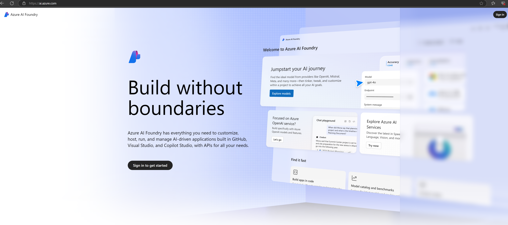

# **Using Phi-3 in Azure AI Foundry**

With the development of Generative AI, we hope to use a unified platform to manage different LLM and SLM, enterprise data integration, fine-tuning/RAG operations, and the evaluation of different enterprise businesses after integrating LLM and SLM, etc., so that generative AI can Smart applications are better implemented. [Azure AI Foundry](https://ai.azure.com) is an enterprise-level generative AI application platform.

With Azure AI Foundry, you can evaluate large language model (LLM) responses and orchestrate prompt application components with prompt flow for better performance. The platform facilitates scalability for transforming proof of concepts into full-fledged production with ease. Continuous monitoring and refinement support long-term success.

We can quickly deploy the Phi-3 model on Azure AI Foundry through simple steps, and then use Azure AI Foundry to complete Phi-3 related Playground/Chat, Fine-tuning, evaluation and other related work.

## **1. Preparation**

If you already have the [Azure Developer CLI](https://learn.microsoft.com/azure/developer/azure-developer-cli/overview?WT.mc_id=aiml-138114-kinfeylo) installed on your machine, using this template is as simple as running this command in a new directory.

## Manual Creation

Creating a Microsoft Azure AI Foundry project and hub is a great way to organize and manage your AI work. Here's a step-by-step guide to get you started:

### Creating a Project in Azure AI Foundry

1. **Go to Azure AI Foundry**: Sign in to the Azure AI Foundry portal.
2. **Create a Project**:
   - If you're in a project, select "Azure AI Foundry" at the top left of the page to go to the Home page.
   - Select "+ Create project".
   - Enter a name for the project.
   - If you have a hub, it will be selected by default. If you have access to more than one hub, you can select a different one from the dropdown. If you want to create a new hub, select "Create new hub" and supply a name.
   - Select "Create".

### Creating a Hub in Azure AI Foundry

1. **Go to Azure AI Foundry**: Sign in with your Azure account.
2. **Create a Hub**:
   - Select the Management center from the left menu.
   - Select "All resources", then the down arrow next to "+ New project" and select "+ New hub".
   - In the "Create a new hub" dialog, enter a name for your hub (e.g., contoso-hub) and modify the other fields as desired.
   - Select "Next", review the information, and then select "Create".

For more detailed instructions, you can refer to the official [Microsoft documentation](https://learn.microsoft.com/azure/ai-studio/how-to/create-projects).

After successful creation, you can access the studio you created through [ai.azure.com](https://ai.azure.com/)

There can be multiple projects on one AI Foundry. Create a project in AI Foundry to prepare.

Create Azure AI Foundry [QuickStarts](https://learn.microsoft.com/azure/ai-studio/quickstarts/get-started-code)

## **2. Deploy a Phi model in Azure AI Foundry**

Click the Explore option of the project to enter the Model Catalog and select Phi-3

Select Phi-3-mini-4k-instruct

Click 'Deploy' to deploy the Phi-3-mini-4k-instruct model

> [!NOTE]
>
> You can select computing power when deploying

## **3. Playground Chat Phi in Azure AI Foundry**

Go to the deployment page, select Playground, and chat with Phi-3 of Azure AI Foundry

## **4. Deploying the Model from Azure AI Foundry**

To deploy a model from the Azure Model Catalog, you can follow these steps:

- Sign in to Azure AI Foundry.
- Choose the model you want to deploy from the Azure AI Foundry model catalog.
- On the model's Details page, select Deploy and then select Serverless API with Azure AI Content Safety.
- Select the project in which you want to deploy your models. To use the Serverless API offering, your workspace must belong to the East US 2 or Sweden Central region. You can customize the Deployment name.
- On the deployment wizard, select the Pricing and terms to learn about the pricing and terms of use.
- Select Deploy. Wait until the deployment is ready and you're redirected to the Deployments page.
- Select Open in playground to start interacting with the model.
- You can return to the Deployments page, select the deployment, and note the endpoint's Target URL and the Secret Key, which you can use to call the deployment and generate completions.
- You can always find the endpoint's details, URL, and access keys by navigating to the Build tab and selecting Deployments from the Components section.

> [!NOTE]
> Please note that your account must have the Azure AI Developer role permissions on the Resource Group to perform these steps.

## **5. Using Phi API in Azure AI Foundry**

You can access https://{Your project name}.region.inference.ml.azure.com/swagger.json through Postman GET and combine it with Key to learn about the provided interfaces

You can get the request parameters very conveniently, as well as the response parameters.

