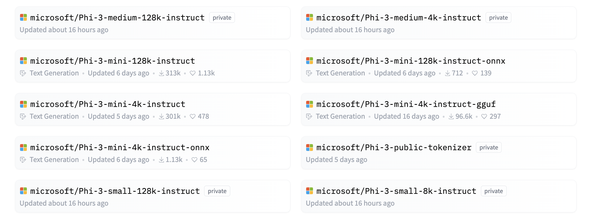

# **Using Phi-3 in Hugging Face**

[Hugging Face](https://huggingface.co/) is a very popular AI community with rich data and open source model resources. Different manufacturers will release open source LLM and SLM through Hugging Face, such as Microsoft, Meta, Mistral, Apple, Google, etc.



Microsoft Phi-3 has been released on Hugging Face. Developers can download the corresponding Phi-3 model based on scenarios and businesses。In addition to deploying Phi-3 Pytorch models on Hugging Face, we also released quantized models, using GGUF and ONNX formats to give end users a choice.


## **1. Download Phi-3 from Hugging Face**

```bash

git lfs install 

git clone https://huggingface.co/microsoft/Phi-3-mini-4k-instruct

```

## **2. Learn about Phi-3 Prompt Template**

There is a specific data template when training Phi-3, so when using Phi-3, sending Prompt needs to be set through the Template. During fine-tuning, the data also needs to be expanded according to the template.

The template has three roles, including system, user, and assistant.

```txt

<|system|>
Your Role<|end|>
<|user|>
Your Question?<|end|>
<|assistant|>

```

such as

```txt

<|system|>
Your are a python developer.<|end|>
<|user|>
Help me generate a bubble algorithm<|end|>
<|assistant|>

```

## **3. Inferences Phi-3 with Python**

Inferences with Phi-3 refer to the process of using the Phi-3 models to generate predictions or outputs based on input data. The Phi-3 models are a family of small language models (SLMs) that include variants like Phi-3-Mini, Phi-3-Small, and Phi-3-Medium, each designed for different application scenarios and with varying parameter sizes. These models have been trained on high-quality data and are fine-tuned for chat capabilities, alignment, robustness, and safety. They can be deployed on both edge and cloud platforms using ONNX and TensorFlow Lite, and are developed in accordance with Microsoft's Responsible AI principles.

For example, the Phi-3-Mini is a lightweight, state-of-the-art open model with 3.8 billion parameters, suitable for prompts using chat format and supporting a context length of up to 128K tokens. It's the first model in its weight class to support such a long context.

The Phi-3 models are available on platforms like Azure AI MaaS, HuggingFace, NVIDIA, Ollama, ONNX, and can be used for a variety of applications, including real-time interactions, autonomous systems, and apps requiring low latency.

There are many ways to reference Phi-3. You can use different programming languages to reference the model.

Here is an example in Python.

```python

import torch
from transformers import AutoModelForCausalLM, AutoTokenizer, pipeline

torch.random.manual_seed(0)

model = AutoModelForCausalLM.from_pretrained(
    "microsoft/Phi-3-mini-4k-instruct", 
    device_map="cuda", 
    torch_dtype="auto", 
    trust_remote_code=True, 
)
tokenizer = AutoTokenizer.from_pretrained("microsoft/Phi-3-mini-4k-instruct")

messages = [
    {"role": "system", "content": "Your are a python developer."},
    {"role": "user", "content": "Help me generate a bubble algorithm"},
]

pipe = pipeline(
    "text-generation",
    model=model,
    tokenizer=tokenizer,
)

generation_args = {
    "max_new_tokens": 600,
    "return_full_text": False,
    "temperature": 0.3,
    "do_sample": False,
}

output = pipe(messages, **generation_args)
print(output[0]['generated_text'])


```

> [!NOTE]
> You can see if this result is consistent with the result in your mind

## **4. Inferences Phi-3 with C#**

Here is an example in a .NET Console application.

The C# project must add the following packages:

```bash
dotnet add package Microsoft.ML.OnnxRuntime --version 1.18.0
dotnet add package Microsoft.ML.OnnxRuntimeGenAI --version 0.3.0-rc2
dotnet add package Microsoft.ML.OnnxRuntimeGenAI.Cuda --version 0.3.0-rc2
```

Here is the C# code.

```csharp
using System;
using Microsoft.ML.OnnxRuntimeGenAI;


// folder location of the ONNX model file
var modelPath = @"..\models\Phi-3-mini-4k-instruct-onnx";
var model = new Model(modelPath);
var tokenizer = new Tokenizer(model);

var systemPrompt = "You are an AI assistant that helps people find information. Answer questions using a direct style. Do not share more information that the requested by the users.";

// chat start
Console.WriteLine(@"Ask your question. Type an empty string to Exit.");


// chat loop
while (true)
{
    // Get user question
    Console.WriteLine();
    Console.Write(@"Q: ");
    var userQ = Console.ReadLine();    
    if (string.IsNullOrEmpty(userQ))
    {
        break;
    }

    // show phi3 response
    Console.Write("Phi3: ");
    var fullPrompt = $"<|system|>{systemPrompt}<|end|><|user|>{userQ}<|end|><|assistant|>";
    var tokens = tokenizer.Encode(fullPrompt);

    var generatorParams = new GeneratorParams(model);
    generatorParams.SetSearchOption("max_length", 2048);
    generatorParams.SetSearchOption("past_present_share_buffer", false);
    generatorParams.SetInputSequences(tokens);

    var generator = new Generator(model, generatorParams);
    while (!generator.IsDone())
    {
        generator.ComputeLogits();
        generator.GenerateNextToken();
        var outputTokens = generator.GetSequence(0);
        var newToken = outputTokens.Slice(outputTokens.Length - 1, 1);
        var output = tokenizer.Decode(newToken);
        Console.Write(output);
    }
    Console.WriteLine();
}
```

The running demo is similar to this one:


***Note:** there is a typo in the 1st question, Phi-3 is cool enough to share the correct answer!*

## **5. Using Phi-3 in Hugging Face Chat**

Hugging Face chat provides related experience. Enter [here to try Phi-3 chat](https://huggingface.co/chat/models/microsoft/Phi-3-mini-4k-instruct) in your browser to experience it.


