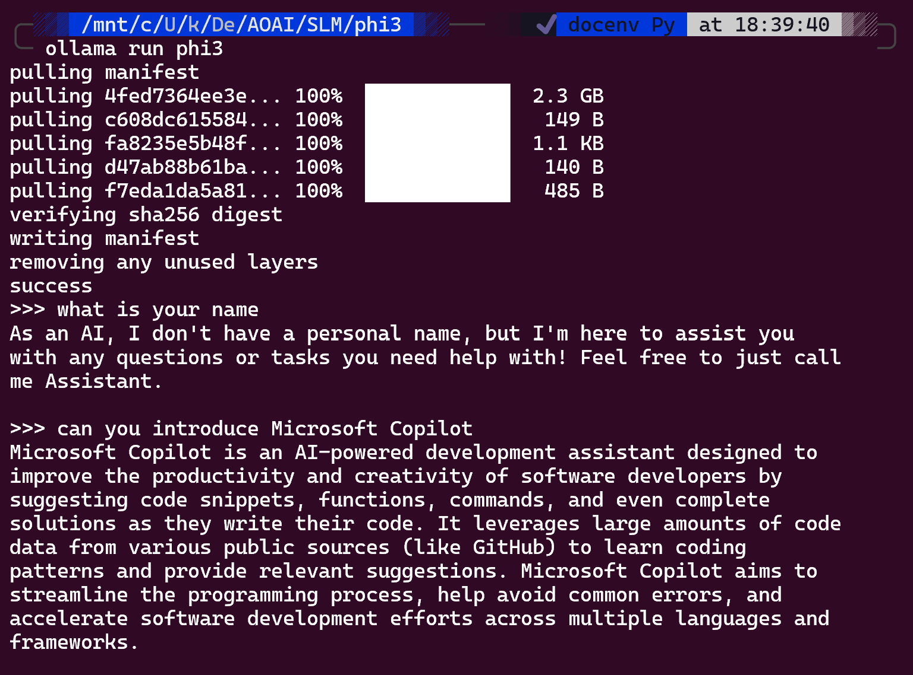
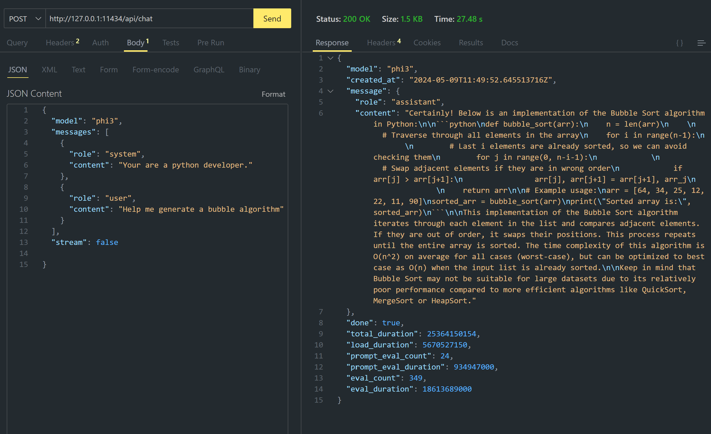
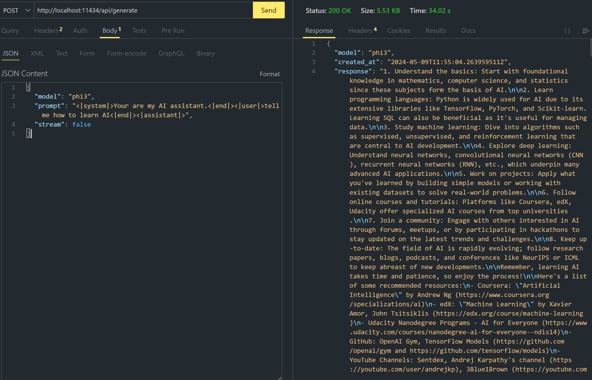

# **Using Phi-3 in Ollama**

[Ollama](https://ollama.com) allows more people to directly deploy open source LLM or SLM through simple scripts, and can also build APIs to help local Copilot application scenarios.

## **1. Installation**

Ollama supports running on Windows, macOS, and Linux. You can install Ollama through this link ([https://ollama.com/download](https://ollama.com/download)). After successful installation, you can directly use Ollama script to call Phi-3 through a terminal window. You can see all the [available libaries in Ollama](https://ollama.com/library). If you open this repository in a Codespace, it will already have Ollama installed.

```bash

ollama run phi3

```

> [!NOTE]
> The model will be downloaded first when you run it for the first time. Of course, you can also directly specify the downloaded Phi-3 model. We take WSL as an example to run the command. After the model is successfully downloaded, you can interact directly on the terminal.



## **2. Call the phi-3 API from Ollama**

If you want to call the Phi-3 API generated by ollama, you can use this command in the terminal to start the Ollama server.

```bash

ollama serve

```

> [!NOTE]
> If running MacOS or Linux, please note that you may encounter the following error **"Error: listen tcp 127.0.0.1:11434: bind: address already in use"** You may get this error when calling running the command. You can either ignore that error, since it typically indicates the server is already running, or you can stop the and restart Ollama:

**macOS**

```bash

brew services restart ollama

```

**Linux**

```bash

sudo systemctl stop ollama

```

Ollama supports two API: generate and chat. You can call the model API provided by Ollama according to your needs, by sending requests to the local service running on port 11434.

**Chat**

```bash

curl http://127.0.0.1:11434/api/chat -d '{
  "model": "phi3",
  "messages": [
    {
      "role": "system",
      "content": "Your are a python developer."
    },
    {
      "role": "user",
      "content": "Help me generate a bubble algorithm"
    }
  ],
  "stream": false
  
}'


```

This is the result in Postman



```bash

curl http://127.0.0.1:11434/api/generate -d '{
  "model": "phi3",
  "prompt": "<|system|>Your are my AI assistant.<|end|><|user|>tell me how to learn AI<|end|><|assistant|>",
  "stream": false
}'


```

This is the result in Postman



## Additional Resources

Check the list of available models in Ollama in [their library](https://ollama.com/library).

Pull your model from the Ollama server using this command

```bash
ollama pull phi3
```

Run the model using this command

```bash
ollama run phi3
```

***Note:*** Visit this link [https://github.com/ollama/ollama/blob/main/docs/api.md](https://github.com/ollama/ollama/blob/main/docs/api.md) to learn more

## Calling Ollama from Python

You can use `requests` or `urllib3` to make requests to the local server endpoints used above. However, a popular way to use Ollama in Python is via the [openai](https://pypi.org/project/openai/) SDK, since Ollama provides OpenAI-compatible server endpoints as well.

Here is an example for phi3-mini:

```python
import openai

client = openai.OpenAI(
    base_url="http://localhost:11434/v1",
    api_key="nokeyneeded",
)

response = client.chat.completions.create(
    model="phi3",
    temperature=0.7,
    n=1,
    messages=[
        {"role": "system", "content": "You are a helpful assistant."},
        {"role": "user", "content": "Write a haiku about a hungry cat"},
    ],
)

print("Response:")
print(response.choices[0].message.content)
```

## Calling Ollama from JavaScript 

```javascript
// Example of Summarize a file with Phi-3
script({
    model: "ollama:phi3",
    title: "Summarize with Phi-3",
    system: ["system"],
})

// Example of summarize
const file = def("FILE", env.files)
$`Summarize ${file} in a single paragraph.`
```

## Calling Ollama from C#

Create a new C# Console application and add the following NuGet package:

```bash
dotnet add package Microsoft.SemanticKernel --version 1.13.0
```

Then replace this code in the `Program.cs` file

```csharp
using Microsoft.SemanticKernel;
using Microsoft.SemanticKernel.ChatCompletion;

// add chat completion service using the local ollama server endpoint
#pragma warning disable SKEXP0001, SKEXP0003, SKEXP0010, SKEXP0011, SKEXP0050, SKEXP0052
builder.AddOpenAIChatCompletion(
    modelId: "phi3.5",
    endpoint: new Uri("http://localhost:11434/"),
    apiKey: "non required");

// invoke a simple prompt to the chat service
string prompt = "Write a joke about kittens";
var response = await kernel.InvokePromptAsync(prompt);
Console.WriteLine(response.GetValue<string>());
```

Run the app with the command:

```bash
dotnet run
```
