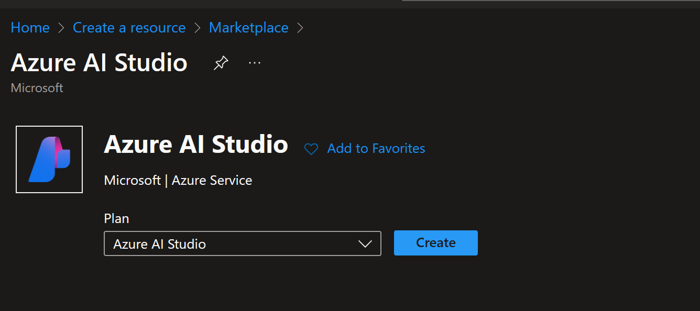
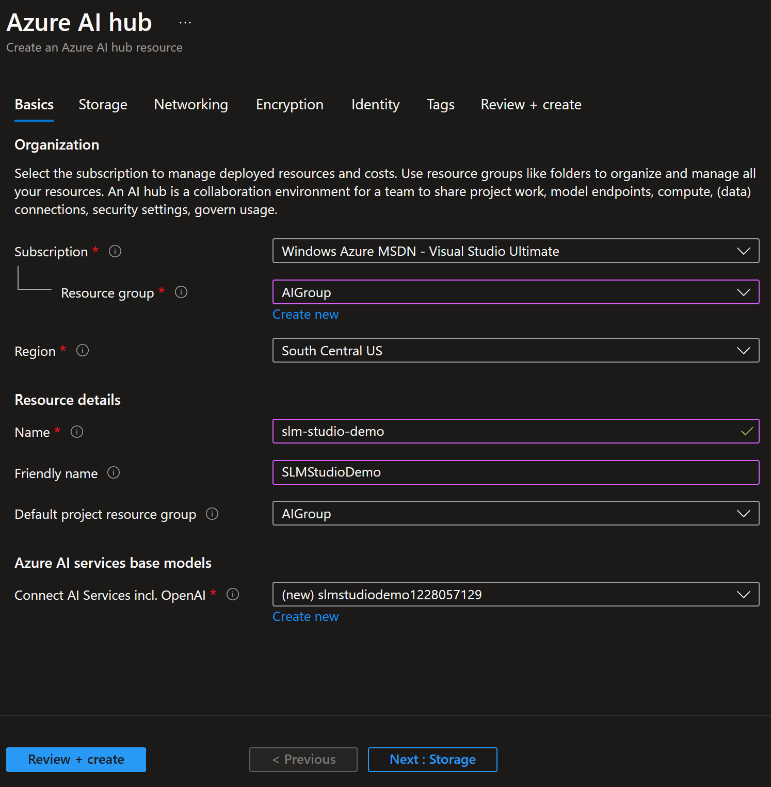
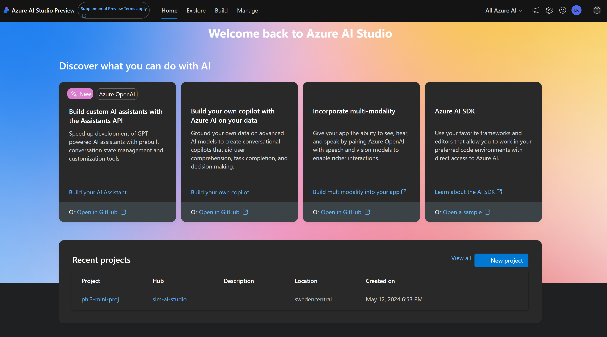
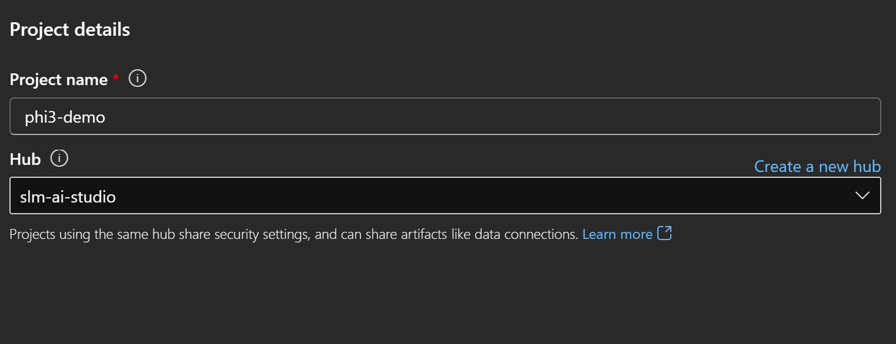
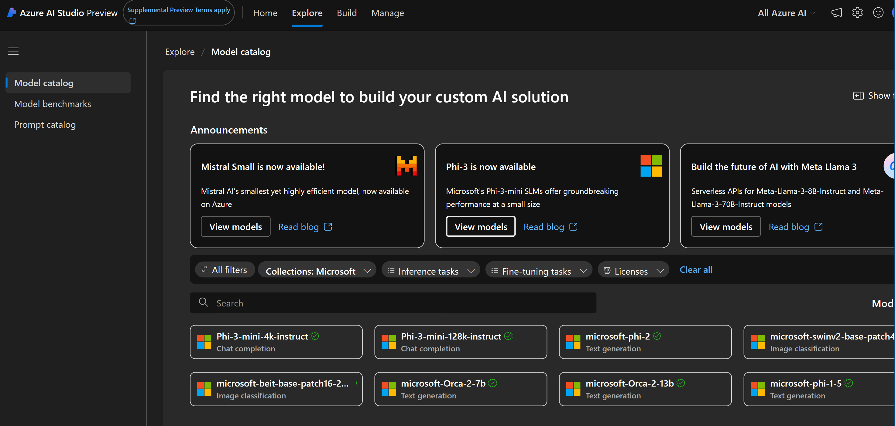
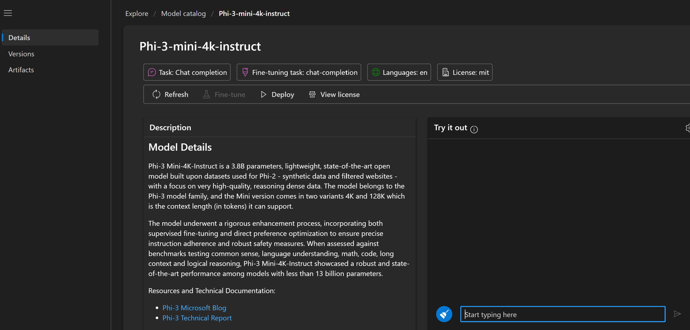
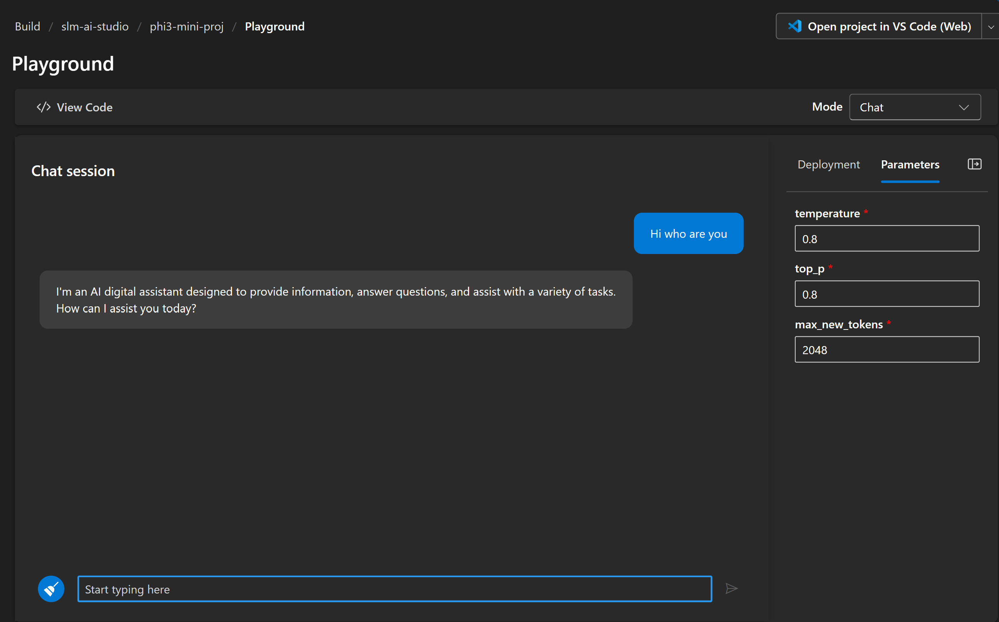
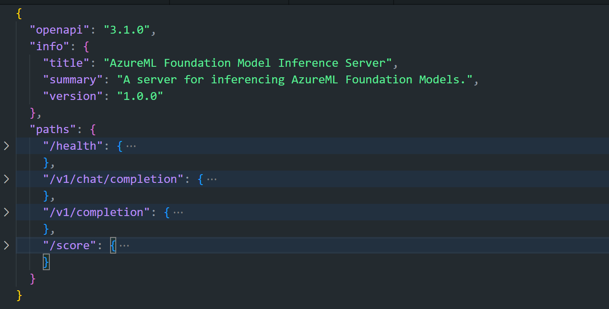
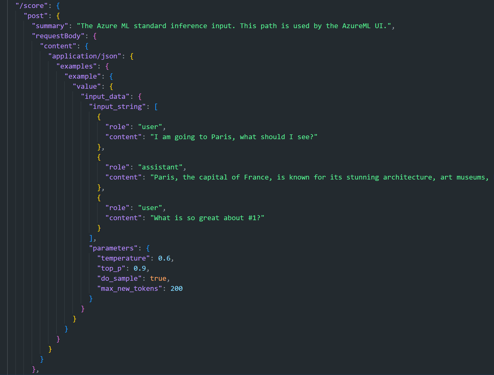

# **Azure AI StudioでPhi-3を使用する**

生成AIの発展に伴い、異なるLLMやSLMの管理、企業データの統合、微調整/RAG操作、LLMやSLMを統合した後の企業ビジネスの評価などを統一プラットフォームで行いたいと考えています。これにより、生成AIのスマートアプリケーションがより良く実現されます。[Azure AI Studio](https://ai.azure.com)は、企業向けの生成AIアプリケーションプラットフォームです。


Azure AI Studioを使用すると、大規模言語モデル（LLM）の応答を評価し、プロンプトフローを使用してプロンプトアプリケーションコンポーネントを調整し、より良いパフォーマンスを実現できます。このプラットフォームは、概念実証を完全な生産に容易に変換するためのスケーラビリティを提供します。継続的な監視と改善が長期的な成功をサポートします。

簡単な手順でPhi-3モデルをAzure AI Studioに迅速にデプロイし、その後、Azure AI Studioを使用してPhi-3に関連するPlayground/Chat、微調整、評価などの作業を完了できます。

## **1. 準備**

## [AZD AI Studio Starter Template](https://azure.github.io/awesome-azd/?name=AI+Studio)

### Azure AI Studio Starter

これは、Azure AI Studioを開始するために必要なすべてをデプロイするBicepテンプレートです。AI Hubと依存リソース、AIプロジェクト、AIサービス、およびオンラインエンドポイントが含まれます。

### クイックスタート

すでに[Azure Developer CLI](https://learn.microsoft.com/azure/developer/azure-developer-cli/overview?WT.mc_id=aiml-138114-kinfeylo)がマシンにインストールされている場合、このテンプレートを使用するのは、新しいディレクトリでこのコマンドを実行するだけで簡単です。

### ターミナルコマンド

```bash
azd init -t azd-aistudio-starter
```

または
azd VS Code拡張機能を使用している場合は、このURLをVS Codeコマンドターミナルに貼り付けることができます。

### ターミナルURL

```bash
azd-aistudio-starter
```

## 手動作成

[Azure Portal](https://portal.azure.com?WT.mc_id=aiml-138114-kinfeylo)でAzure AI Studioを作成します。



スタジオの命名とリージョンの設定を完了したら、作成できます。



作成が成功すると、[ai.azure.com](https://ai.azure.com/)を通じて作成したスタジオにアクセスできます。



1つのAI Studioには複数のプロジェクトが存在できます。AI Studioでプロジェクトを作成して準備します。



## **2. Azure AI StudioにPhi-3モデルをデプロイする**

プロジェクトのExploreオプションをクリックしてモデルカタログに入り、Phi-3を選択します。



Phi-3-mini-4k-instructを選択します。



「デプロイ」をクリックしてPhi-3-mini-4k-instructモデルをデプロイします。

> [!NOTE]
> デプロイ時にコンピューティングパワーを選択できます。

## **3. Azure AI StudioでPlayground Chat Phi-3を使用する**

デプロイメントページに移動し、Playgroundを選択して、Azure AI StudioのPhi-3とチャットします。



## **4. Azure AI Studioからモデルをデプロイする**

Azure Model Catalogからモデルをデプロイするには、次の手順に従います：

- Azure AI Studioにサインインします。
- Azure AI Studioモデルカタログからデプロイするモデルを選択します。
- モデルの詳細ページで、デプロイを選択し、Azure AI Content Safetyを使用したServerless APIを選択します。
- モデルをデプロイするプロジェクトを選択します。Serverless APIオファリングを使用するには、ワークスペースがEast US 2またはSweden Centralリージョンに属している必要があります。デプロイメント名をカスタマイズできます。
- デプロイメントウィザードで、Pricing and termsを選択して、選択したモデルの価格と利用規約について学びます。
- デプロイを選択します。デプロイメントが準備完了になるまで待ち、デプロイメントページにリダイレクトされます。
- Playgroundで開くを選択して、モデルと対話を開始します。
- デプロイメントページに戻り、デプロイメントを選択し、エンドポイントのターゲットURLとシークレットキーを確認して、デプロイメントを呼び出して完了を生成します。
- Buildタブに移動し、ComponentsセクションからDeploymentsを選択して、エンドポイントの詳細、URL、およびアクセスキーをいつでも確認できます。

> [!NOTE]
> これらの手順を実行するには、リソースグループにAzure AI Developerロールの権限が必要です。

## **5. Azure AI StudioでPhi-3 APIを使用する**

Postman GETを使用してhttps://{Your project name}.region.inference.ml.azure.com/swagger.jsonにアクセスし、キーと組み合わせて提供されるインターフェースについて学びます。



たとえば、スコアAPIにアクセスします。



リクエストパラメータとレスポンスパラメータを非常に簡単に取得できます。これはPostmanの結果です。


