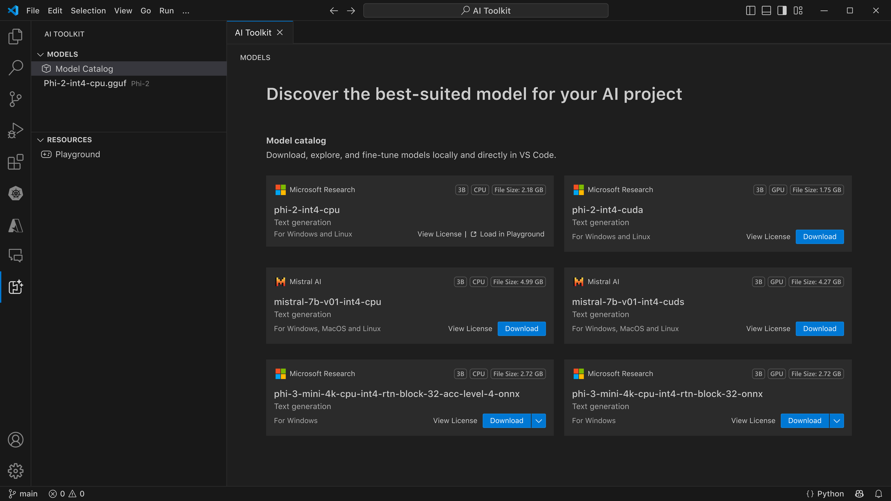
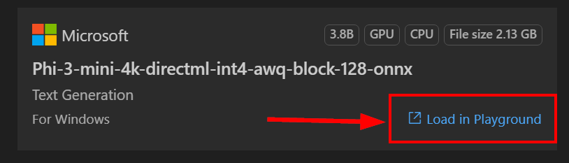

# AI Toolkit for VScode (Windows)

[AI Toolkit for VS Code](https://marketplace.visualstudio.com/items?itemName=ms-windows-ai-studio.windows-ai-studio) 简化了生成式 AI 应用程序开发，将 Azure AI Studio Catalog和 Hugging Face 等平台的最新 AI 开发工具和模型汇集在一起。您将能够浏览由 Azure ML 和 Hugging Face 提供支持的 AI 模型目录，将它们下载到本地，进行微调、测试并在您的应用程序中使用它们。

AI Toolkit Preview可以在本地运行。根据您选择的模型，某些任务可能仅支持 Windows 和 Linux。

本地推理或微调，根据您选择的模型，您可能需要GPU，如 NVIDIA CUDA GPU。

如果您在云端远程运行，云资源需要具有 GPU，请确保检查您的环境。对于在 Windows + WSL的本地运行环境，应在使用 AI Toolkit 之前安装 WSL Ubuntu 发行版 18.04 或更高版本，并将其设置为默认。

## 开始使用
[了解更多如何为 Windows 安装 Linux 子系统](https://learn.microsoft.com/windows/wsl/install) 

和 [更改默认的发行版本](https://learn.microsoft.com/windows/wsl/install#change-the-default-linux-distribution-installed).

[AI Tooklit GitHub 代码仓库](https://github.com/microsoft/vscode-ai-toolkit/)

- Windows 或 Linux. 
- **对MacOS的支持即将到来**
- •	对于在 Windows 和 Linux 上进行微调，您需要一个 Nvidia GPU。此外，Windows 需要具有 Ubuntu 发行版 18.04 或更高版本的 Linux 子系统。 [了解更多如何为 Windows 安装 Linux 子系统](https://learn.microsoft.com/windows/wsl/install) and [更改默认的发行版本](https://learn.microsoft.com/windows/wsl/install#change-the-default-linux-distribution-installed).

### 安装 AI Toolkit 

AI Toolkit 作为 [Visual Studio Code 扩展](https://code.visualstudio.com/docs/setup/additional-components#_vs-code-extensions) 进行分发, 因此您需要首先安装 [VS Code](https://code.visualstudio.com/docs/setup/windows) , 然后从 [VS Marketplace](https://marketplace.visualstudio.com/items?itemName=ms-windows-ai-studio.windows-ai-studio) 下载 AI Toolkit。
AI Toolkit 可在 Visual Studio Marketplace 中找到，并可像安装其他 VS Code 扩展一样进行安装[AI Toolkit is available in the Visual Studio Marketplace](https://marketplace.visualstudio.com/items?itemName=ms-windows-ai-studio.windows-ai-studio) 。

如果您不熟悉如何安装 VS Code 扩展，请按照以下步骤操作:

### 登录
1. 在 VS Code 的 Activity 栏中选择 **Extensions**
1. 在扩展搜索栏中输入 "AI Toolkit"
1. 选择 "AI Toolkit for Visual Studio code"
1. 点击 **Install**

现在，您已经准备好使用这个扩展了!

系统会提示您登录 GitHub，请点击“允许”以继续。接着您将被重定向到 GitHub 登录页面。

请登录并按照流程操作。完成后，您将被重定向回 VS Code。

一旦安装扩展后，您会在活动栏上看到 AI Toolkit 图标。

现在让我们探索一下可用的功能吧!
### 从目录中下载一个模型

### 可用的操作
AI Toolkit 的主要侧边栏分为以下几部分 

- **Models** 
- **Resources**
- **Playground**  
- **Fine-tuning** 

要开始使用，请选择 

**Model Catalog**:

从 VS Code 侧边栏启动 AI Toolkit 后，您可以从以下选项中进行选择:



- 从 **Model Catalog** 中找到支持的模型并下载到本地
- 在 **Model Playground** 中测试模型推理
- 在 **Model Fine-tuning** 中本地或远程微调模型
- 通过 AI Toolkit 命令面板将微调后的模型部署到云端

 **GPU Vs CPU**

您会注意到，模型卡片显示了模型大小、平台和加速器类型（CPU、GPU）。为了 **在至少拥有一个 GPU 的 Windows 设备上优化性能**, 请选择仅针对 Windows 的模型版本。 

这可以确保您拥有一个为 DirectML 加速器优化的模型。

模型名称的格式为
-  `{model_name}-{accelerator}-{quantization}-{format}`.

>要检查您的 Windows 设备上是否有 GPU，请打开 **Task Manager**，然后选择**Performance** 选项卡。 如果您有 GPU，它们将以“GPU 0”或“GPU 1”等名称列出。

### 在 playground 中运行模型

在设置好所有参数后，点击 **Generate Project**。

模型下载完成后，在目录中的模型卡片上选择 **Load in Playground**:

- 启动模型下载
- 安装所有先决条件和依赖项
- 创建 VS Code 工作区



当模型下载完成后，您可以从 AI Toolkit 启动项目。

> ***注意*** 如果您想尝试预览功能以远程进行推理或微调，请按照以下指南操作： [this guide](https://aka.ms/previewFinetune)


### 为 Windows 优化的模型
您应该看到模型响应返回给您：

AI Toolkit 提供了为 Windows 优化的公开可用的 AI 模型集合。这些模型存储在不同位置，包括 Hugging Face、GitHub 等，但您可以浏览模型并在一个地方找到所有可供下载并用于您的 Windows 应用程序的模型。


### 模型选择
> 如果您的 Windows 设备上没有可用的 GPU，但您选择了Phi-3-mini-4k-directml-int4-awq-block-128-onnx model模型，那么模型响应将会非常缓慢。

因此，您应该下载针对 CPU 优化的模型版本：Phi-3-mini-4k-cpu-int4-rtn-block-32-acc-level-4-onnx。

您还可以对以下参数进行配置:

**上下文说明:** 您可以帮助 AI 模型更好地理解您请求的整体背景。这可以是背景信息、您想要的示例/演示或解释任务的目的。

**推理参数:**
  - *最大响应长度*: 模型返回的最大令牌数。
  - *温度*: 模型温度是控制语言模型输出随机性的参数。较高的温度使模型承担更多风险，给您提供更丰富多样的词汇组合。反之，较低的温度使模型更加保守，坚持更集中和可预测的回答。
  - *Top P*: 也称为核采样，是控制语言模型在预测下一个词时考虑的可能单词或短语数量的设置。
  - *频率惩罚*: 此参数影响模型在输出中重复单词或短语的频率。较高的值（接近 1.0）鼓励模型避免重复单词或短语。
  - *存在惩罚*: 此参数用于生成式 AI 模型，以鼓励生成文本中的多样性和具体性。较高的值（接近 1.0）鼓励模型包含更多新颖和多样的令牌。较低的值使模型更可能生成常见或通用的短语。

### 在你的应用程序中使用 REST API 

AI Toolkit 提供了一个运行在 **5272** 端口的本地 REST API Web 服务器，该服务器使用 OpenAI 聊天补全格式 [OpenAI chat completions format](https://platform.openai.com/docs/api-reference/chat/create)。

这使您可以在本地测试应用程序，而无需依赖云端 AI 模型服务。以下是一个 JSON 文件示例，展示了如何配置请求体:

```json
{
    "model": "Phi-3-mini-4k-directml-int4-awq-block-128-onnx",
    "messages": [
        {
            "role": "user",
            "content": "what is the golden ratio?"
        }
    ],
    "temperature": 0.7,
    "top_p": 1,
    "top_k": 10,
    "max_tokens": 100,
    "stream": true
}
```

您可以使用 [Postman](https://www.postman.com/)  或 CURL（客户端 URL）工具测试 REST API:

```bash
curl -vX POST http://127.0.0.1:5272/v1/chat/completions -H 'Content-Type: application/json' -d @body.json
```

### 使用 OpenAI client library for Python 库

```python
from openai import OpenAI

client = OpenAI(
    base_url="http://127.0.0.1:5272/v1/", 
    api_key="x" # required for the API but not used
)

chat_completion = client.chat.completions.create(
    messages=[
        {
            "role": "user",
            "content": "what is the golden ratio?",
        }
    ],
    model="Phi-3-mini-4k-cuda-int4-onnx",
)

print(chat_completion.choices[0].message.content)
```

### 使用 Azure OpenAI client library for .NET 库

通过 NuGet 将 [Azure OpenAI client library for .NET](https://www.nuget.org/packages/Azure.AI.OpenAI/) 添加到您的 .NET 项目中:

```bash
dotnet add {project_name} package Azure.AI.OpenAI --version 1.0.0-beta.17
```

将名为 **OverridePolicy.cs** 的 C# 文件添加到您的项目中，并粘贴以下代码:

```csharp
// OverridePolicy.cs
using Azure.Core.Pipeline;
using Azure.Core;

internal partial class OverrideRequestUriPolicy(Uri overrideUri)
    : HttpPipelineSynchronousPolicy
{
    private readonly Uri _overrideUri = overrideUri;

    public override void OnSendingRequest(HttpMessage message)
    {
        message.Request.Uri.Reset(_overrideUri);
    }
}
```

接下来，将以下代码粘贴到 **Program.cs** 文件中:

```csharp
// Program.cs
using Azure.AI.OpenAI;

Uri localhostUri = new("http://localhost:5272/v1/chat/completions");

OpenAIClientOptions clientOptions = new();
clientOptions.AddPolicy(
    new OverrideRequestUriPolicy(localhostUri),
    Azure.Core.HttpPipelinePosition.BeforeTransport);
OpenAIClient client = new(openAIApiKey: "unused", clientOptions);

ChatCompletionsOptions options = new()
{
    DeploymentName = "Phi-3-mini-4k-directml-int4-awq-block-128-onnx",
    Messages =
    {
        new ChatRequestSystemMessage("You are a helpful assistant. Be brief and succinct."),
        new ChatRequestUserMessage("What is the golden ratio?"),
    }
};

StreamingResponse<StreamingChatCompletionsUpdate> streamingChatResponse
    = await client.GetChatCompletionsStreamingAsync(options);

await foreach (StreamingChatCompletionsUpdate chatChunk in streamingChatResponse)
{
    Console.Write(chatChunk.ContentUpdate);
}
```
## 用 AI Toolkit 进行微调

- 从模型发现和playground开始。
- 使用本地计算资源进行模型微调和推理。
- 使用Azure资源进行远程微调和推理。

[使用AI Toolkit 进行微调](../04.Fine-tuning/Finetuning_VSCodeaitoolkit.md)

## AI Toolkit Q&A 资源

如果您想了解最常见的问题和解决方案，请参阅我们的问答页面： [Q&A page](https://github.com/microsoft/vscode-ai-toolkit/blob/main/QA.md)。