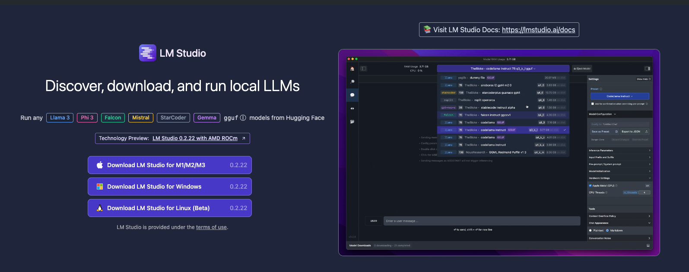
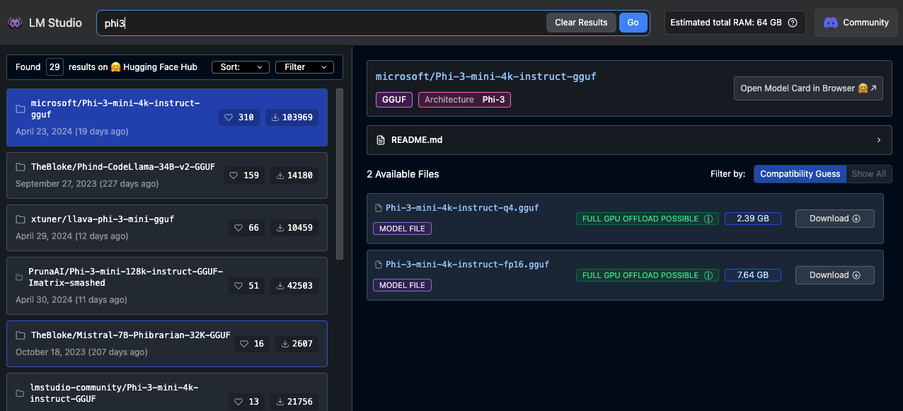
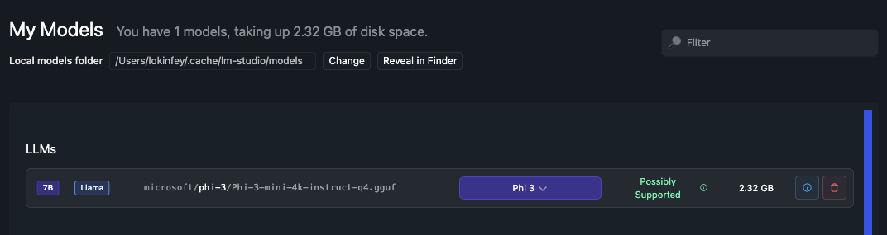
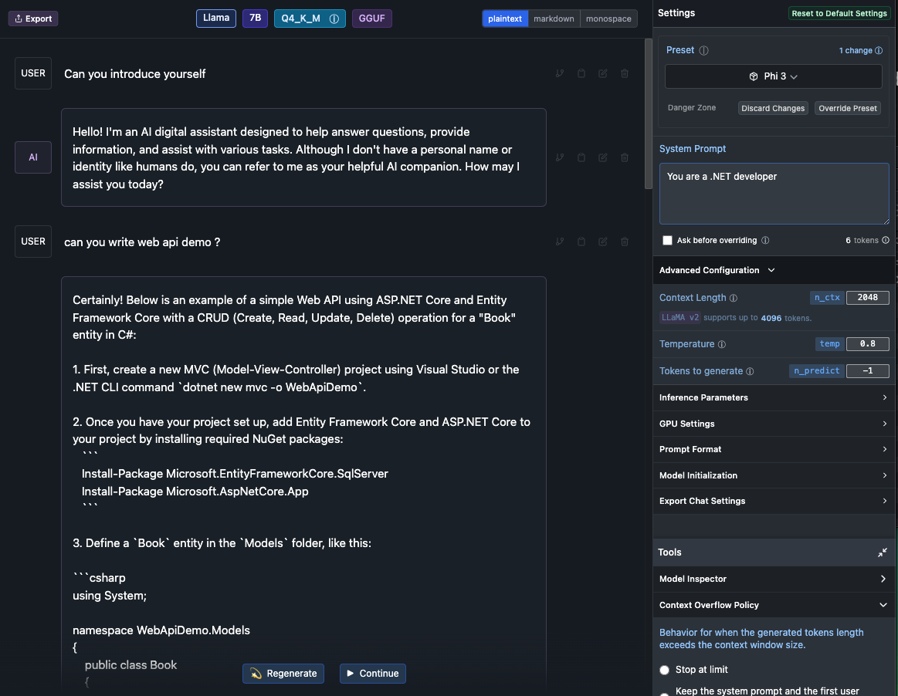
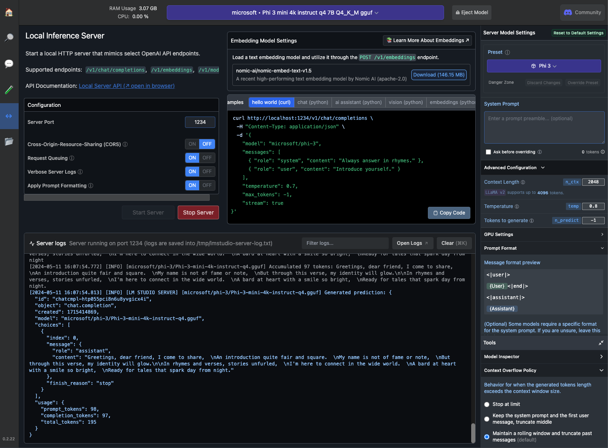
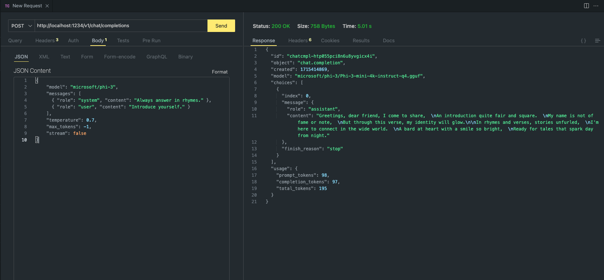

# **在 LM Studio 中使用 Phi-3**

[LM Studio](https://lmstudio.ai) 是一个用于在本地桌面应用程序中调用SLM和LLM的应用程序。它允许用户轻松使用不同的模型，并支持使用NVIDIA/AMD GPU/Apple Silicon进行加速计算。通过LM Studio，用户可以在本地下载、安装并运行基于Hugging Face的各种开源LLM和SLM，以测试模型性能，无需编写代码。

## **1. 安装**

您可以在LM Studio的官网 [https://lmstudio.ai/] (https://lmstudio.ai/)来选择安装在Windows、Linux或者MacOS等不同平台的程序。 

## **2.在 LM Studio 中下载 Phi-3**

LM Studio调用量化gguf格式的开源模型。您可以直接从LM Studio Search 界面提供的平台下载，或者自行下载并指定在相关目录中调用。

***我们在LM Studio Search中搜索Phi3，并下载Phi-3 gguf模型。***

***通过LM Studio来管理下载的模型***

## **3.在 LM Studio 中与 Phi-3 模型聊天**

我们在LM Studio Chat中选择Phi-3，并设置聊天模板（Preset - Phi3），以开始与Phi-3的本地聊天。

***注意***:

a. 您可以通过LM Studio控制面板中的高级配置设置参数。

b. 由于Phi-3有特定的聊天模板要求，必须在预设中选择Phi-3。

c. 您还可以设置不同的参数，例如GPU使用等。

## **4.在 LM Studio 中调用 Phi-3 API**

LM Studio支持本地服务的快速部署，您可以在无需编码的情况下构建模型服务。

以下是Postman中的结果：

