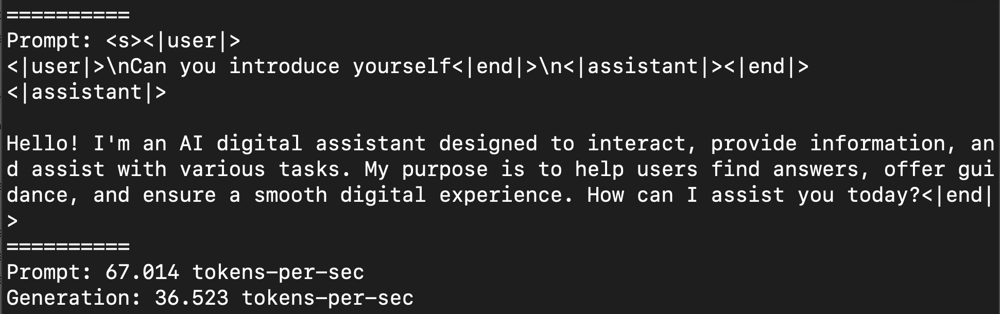
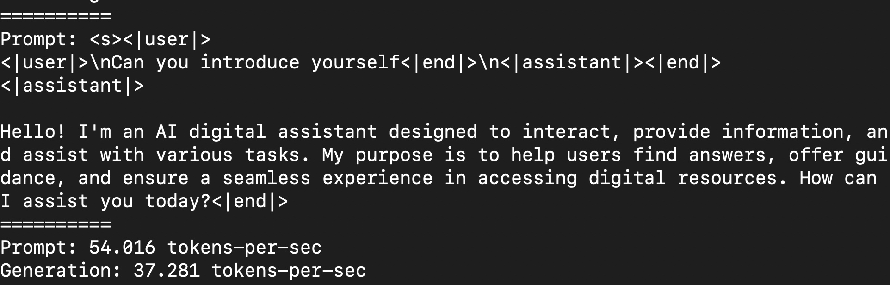

# **Inference Phi-3 with Apple MLX Framework**

## **What is MLX Framework**

MLX is an array framework for machine learning research on Apple silicon, brought to you by Apple machine learning research.

MLX is designed by machine learning researchers for machine learning researchers. The framework is intended to be user-friendly, but still efficient to train and deploy models. The design of the framework itself is also conceptually simple. We intend to make it easy for researchers to extend and improve MLX with the goal of quickly exploring new ideas.

LLMs can be accelerated in Apple Silicon devices through MLX, and models can be run locally very conveniently.

## **Using MLX to inference Phi-3-mini**

### **1. Set up you MLX env**

1. Python 3.11.x
2. Install MLX Library


```bash

pip install mlx-lm

```

### **2. Running Phi-3-mini in Terminal with MLX**


```bash

python -m mlx_lm.generate --model microsoft/Phi-3-mini-4k-instruct --max-token 2048 --prompt  "<|user|>\nCan you introduce yourself<|end|>\n<|assistant|>"

```

The result (my env is Apple M1 Max,64GB) is



### **3. Quantizing Phi-3-mini with MLX in Terminal**


```bash

python -m mlx_lm.convert --hf-path microsoft/Phi-3-mini-4k-instruct

```

***Note：*** The model can be quantized through mlx_lm.convert, and the default quantization is INT4. This example quantizes Phi-3-mini to INT4

The model can be quantized through mlx_lm.convert, and the default quantization is INT4. This example is to quantize Phi-3-mini into INT4. After quantization, it will be stored in the default directory ./mlx_model

We can test the model quantized with MLX from terminal


```bash

python -m mlx_lm.generate --model ./mlx_model/ --max-token 2048 --prompt  "<|user|>\nCan you introduce yourself<|end|>\n<|assistant|>"

```

The result is




### **4. Running Phi-3-mini with MLX in Jupyter Notebook**


***Note:*** Please read this sample [click this link](../../../code/03.Inference/MLX/MLX_DEMO.ipynb)


## **Resources**

1. Learn about Apple MLX Framework [https://ml-explore.github.io](https://ml-explore.github.io/mlx/build/html/index.html)

2. Apple MLX GitHub Repo [https://github.com/ml-explore](https://github.com/ml-explore)


