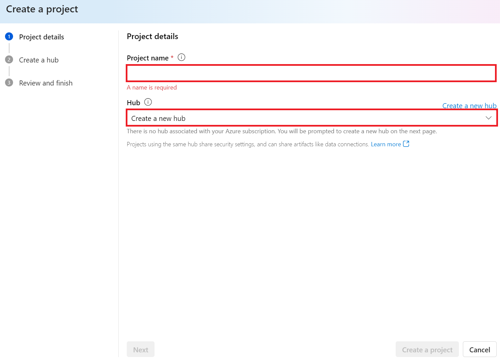
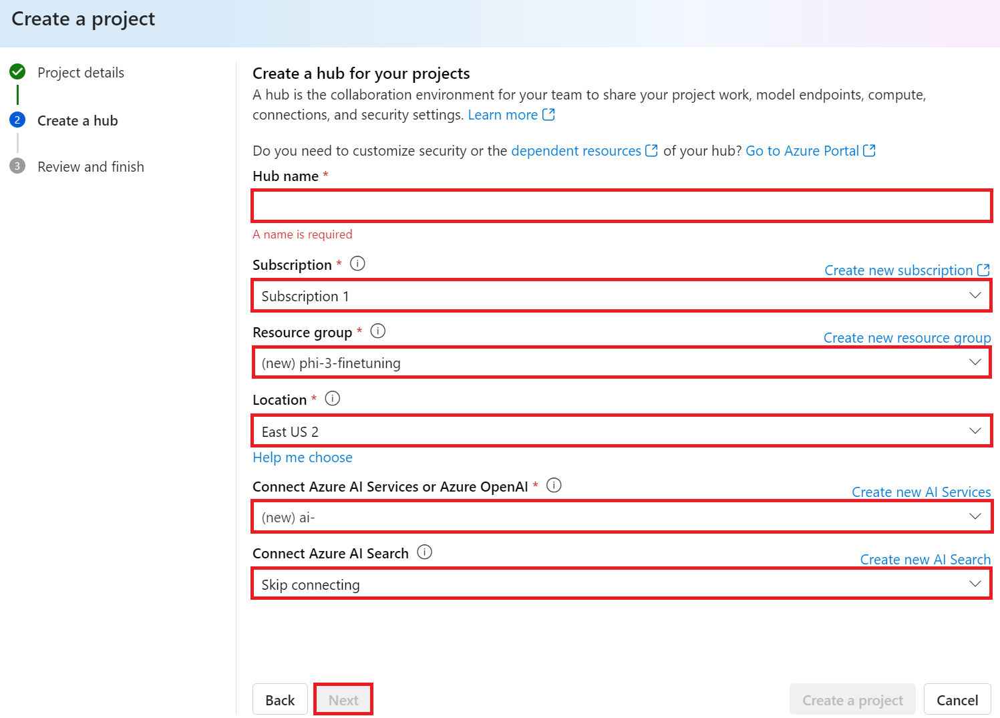
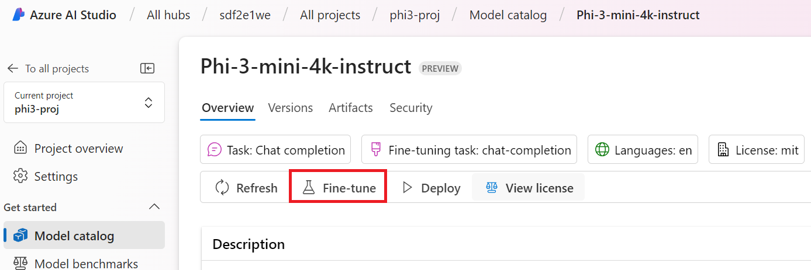
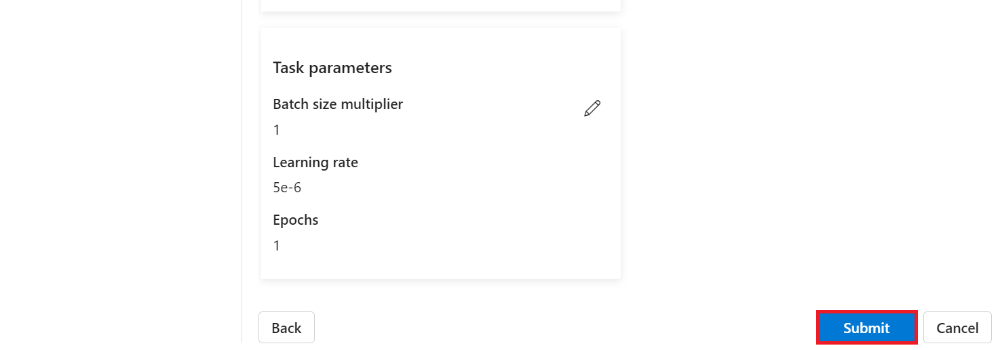

# Fine-tuning Phi-3 with Azure AI Foundry

 Let’s explore how to fine-tune Microsoft’s Phi-3 Mini language model using Azure AI Foundry. Fine-tuning allows you to adapt Phi-3 Mini to specific tasks, making it even more powerful and context-aware.

## Considerations

- **Capabilities:** Which models are fine tunable? What can the base model be fine tuned to do?
- **Cost:** What’s the pricing model for fine tuning
**Customizability:** How much can I modify the base model – and in what ways?
- **Convenience:** How does fine tuning actually happen – do I need to write custom code? Do I need to bring my own compute?
- **Safety:** Fine tuned models are known to have safety risks – are there any guardrails in place to protect against unintended harm?


## Preparation for fine-tuning

### Prerequisites

> [!NOTE]
> For Phi-3 family models, the pay-as-you-go model fine-tune offering is only available with hubs created in **East US 2** regions.

- An Azure subscription. If you don't have an Azure subscription, create a [paid Azure account](https://azure.microsoft.com/pricing/purchase-options/pay-as-you-go) to begin.

- An [AI Foundry project](https://ai.azure.com?WT.mc_id=aiml-138114-kinfeylo).
- Azure role-based access controls (Azure RBAC) are used to grant access to operations in Azure AI Foundry. To perform the steps in this article, your user account must be assigned the __Azure AI Developer role__ on the resource group.

### Subscription provider registration

Verify the subscription is registered to the `Microsoft.Network` resource provider.

1. Sign in to the [Azure portal](https://portal.azure.com).
1. Select **Subscriptions** from the left menu.
1. Select the subscription you want to use.
1. Select **AI project settings** > **Resource providers** from the left menu.
1. Confirm that **Microsoft.Network** is in the list of resource providers. Otherwise add it.

### Data preparation

Prepare your training and validation data to finetune your model. Your training data and validation data sets consist of input and output examples for how you would like the model to perform.

Make sure all your training examples follow the expected format for inference. To finetune models effectively, ensure a balanced and diverse dataset.

This involves maintaining data balance, including various scenarios, and periodically refining training data to align with real-world expectations, ultimately leading to more accurate and balanced model responses.

Different model types require a different format of training data.

### Chat Completion

The training and validation data you use **must** be formatted as a JSON Lines (JSONL) document. For `Phi-3-mini-128k-instruct` the fine-tuning dataset must be formatted in the conversational format that is used by the Chat completions API.

### Example file format

```json
    {"messages": [{"role": "system", "content": "You are an Xbox customer support agent whose primary goal is to help users with issues they are experiencing with their Xbox devices. You are friendly and concise. You only provide factual answers to queries, and do not provide answers that are not related to Xbox."}, {"role": "user", "content": "Is Xbox better than PlayStation?"}, {"role": "assistant", "content": "I apologize, but I cannot provide personal opinions. My primary job is to assist you with any issues related to your Xbox device. Do you have any Xbox-related issues that need addressing?"}]}
    {"messages": [{"role": "system", "content": "You are an Xbox customer support agent whose primary goal is to help users with issues they are experiencing with their Xbox devices. You are friendly and concise. You only provide factual answers to queries, and do not provide answers that are not related to Xbox."}, {"role": "user", "content": "Can I play PC games on my Xbox?"}, {"role": "assistant", "content": "While Xbox consoles don't natively support PC games, they can play an array of Xbox games, many of which are also available on PC. Can I assist you with finding games compatible with your Xbox device?"}]}
    {"messages": [{"role": "system", "content": "You are an Xbox customer support agent whose primary goal is to help users with issues they are experiencing with their Xbox devices. You are friendly and concise. You only provide factual answers to queries, and do not provide answers that are not related to Xbox."}, {"role": "user", "content": "I'm having trouble connecting my Xbox to the Wi-Fi."}, {"role": "assistant", "content": "No worries, let's go through the network settings on your Xbox. Can you please tell me what happens when you try to connect it to the Wi-Fi?"}]}
```

The supported file type is JSON Lines. Files are uploaded to the default datastore and made available in your project.

## Fine-Tuning Phi-3 with Azure AI Foundry

Azure AI Foundry lets you tailor large language models to your personal datasets by using a process known as fine-tuning. Fine-tuning provides significant value by enabling customization and optimization for specific tasks and applications. It leads to improved performance, cost efficiency, reduced latency, and tailored outputs.


### Create a New Project

1. Sign in to [Azure AI Foundry](https://ai.azure.com).

1. Select **+New project** to create new project in Azure AI Foundry.

    

1. Perform the following tasks:

    - Project **Hub name**. It must be a unique value.
    - Select the **Hub** to use (create a new one if needed).

    

1. Perform the following tasks to create a new hub:

    - Enter **Hub name**. It must be a unique value.
    - Select your Azure **Subscription**.
    - Select the **Resource group** to use (create a new one if needed).
    - Select the **Location** you'd like to use.
    - Select the **Connect Azure AI Services** to use (create a new one if needed).
    - Select **Connect Azure AI Search** to **Skip connecting**.

    

1. Select **Next**.
1. Select **Create a project**.

### Data Preparation

Before fine-tuning, gather or create a dataset relevant to your task, such as chat instructions, question-answer pairs, or any other pertinent text data. Clean and preprocess this data by removing noise, handling missing values, and tokenizing the text.

### Fine-tune Phi-3 models in Azure AI Foundry

> [!NOTE]
> Fine-tuning of Phi-3 models is currently supported in projects located in East US 2.

1. Select **Model catalog** from the left side tab.

1. Type *phi-3* in the **search bar** and select the phi-3 model you'd like to use.

    

1. Select **Fine-tune**.

    

1. Enter the **Fine-tuned model name**.

    

1. Select **Next**.

1. Perform the following tasks:

    - Select **task type** to **Chat completion**.
    - Select the **Training data** you'd like to use. You can upload it through Azure AI Foundry's data or from your local environment.

    

1. Select **Next**.

1. Upload the **Validation data** you'd like to use. or you can select **Automatic split of training data**.

    

1. Select **Next**.

1. Perform the following tasks:

    - Select the **Batch size multiplier** you'd like to use.
    - Select the **Learning rate** you'd like to use.
    - Select the **Epochs** you'd like to use.

    

1. Select **Submit** to start the fine-tuning process.

    


1. Once your model is fine-tuned, the status will be displayed as **Completed**, as shown in the image below. Now you can deploy the model and can use it in your own application, in the playground, or in prompt flow. For more information, see [How to deploy Phi-3 family of small language models with Azure AI Foundry](https://learn.microsoft.com/azure/ai-studio/how-to/deploy-models-phi-3?tabs=phi-3-5&pivots=programming-language-python).

    

> [!NOTE]
> For more detailed information on fine-tuning Phi-3, please visit [Fine-tune Phi-3 models in Azure AI Foundry](https://learn.microsoft.com/azure/ai-studio/how-to/fine-tune-phi-3?tabs=phi-3-mini).

## Cleaning up your fine-tuned models

You can delete a fine-tuned model from the fine-tuning model list in [Azure AI Foundry](https://ai.azure.com) or from the model details page. Select the fine-tuned model to delete from the Fine-tuning page, and then select the Delete button to delete the fine-tuned model.

> [!NOTE]
> You can't delete a custom model if it has an existing deployment. You must first delete your model deployment before you can delete your custom model.

## Cost and quotas

### Cost and quota considerations for Phi-3 models fine-tuned as a service

Phi models fine-tuned as a service are offered by Microsoft and integrated with Azure AI Foundry for use. You can find the pricing when [deploying](https://learn.microsoft.com/azure/ai-studio/how-to/deploy-models-phi-3?tabs=phi-3-5&pivots=programming-language-python) or fine-tuning the models under the Pricing and terms tab on deployment wizard.

## Content filtering

Models deployed as a service with pay-as-you-go are protected by Azure AI Content Safety. When deployed to real-time endpoints, you can opt out of this capability. With Azure AI content safety enabled, both the prompt and completion pass through an ensemble of classification models aimed at detecting and preventing the output of harmful content. The content filtering system detects and takes action on specific categories of potentially harmful content in both input prompts and output completions. Learn more about [Azure AI Content Safety](https://learn.microsoft.com/azure/ai-studio/concepts/content-filtering).

**Fine-Tuning Configuration**

Hyperparameters: Define hyperparameters such as learning rate, batch size, and number of training epochs.

**Loss Function**

Choose an appropriate loss function for your task (e.g., cross-entropy).

**Optimizer**

Select an optimizer (e.g., Adam) for gradient updates during training.

**Fine-Tuning Process**

- Load Pre-Trained Model: Load the Phi-3 Mini checkpoint.
- Add Custom Layers: Add task-specific layers (e.g., classification head for chat instructions).

**Train the Model**
Fine-tune the model using your prepared dataset. Monitor training progress and adjust hyperparameters as needed.

**Evaluation and Validation**

Validation Set: Split your data into training and validation sets.

**Evaluate Performance**

Use metrics like accuracy, F1-score, or perplexity to assess model performance.

## Save Fine-Tuned Model

**Checkpoint**
Save the fine-tuned model checkpoint for future use.

## Deployment

- Deploy as a Web Service: Deploy your fine-tuned model as a web service in Azure AI Foundry.
- Test the Endpoint: Send test queries to the deployed endpoint to verify its functionality.

## Iterate and Improve

Iterate: If the performance isn't satisfactory, iterate by adjusting hyperparameters, adding more data, or fine-tuning for additional epochs.

## Monitor and Refine

Continuously monitor the model's behavior and refine as needed.

## Customize and Extend

Custom Tasks: Phi-3 Mini can be fine-tuned for various tasks beyond chat instructions. Explore other use cases!
Experiment: Try different architectures, layer combinations, and techniques to enhance performance.

> [!NOTE]
> Fine-tuning is an iterative process. Experiment, learn, and adapt your model to achieve the best results for your specific task!
