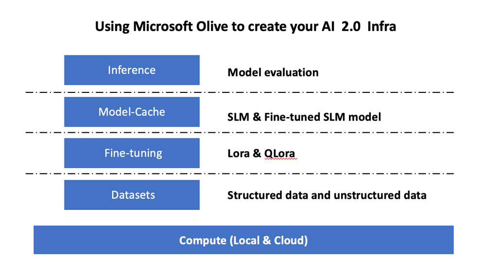

# **Fine-tuning Phi-3 with Microsoft Olive**

[Olive](https://github.com/microsoft/OLive?WT.mc_id=aiml-138114-kinfeylo) is an easy-to-use hardware-aware model optimization tool that brings together industry-leading techniques across model compression, optimization, and compilation.

It's designed to streamline the process of optimizing machine learning models, ensuring they make the most efficient use of specific hardware architectures.

Whether you're working on cloud-based applications or edge devices, Olive enables you to optimize your models effortlessly and effectively.

## Key Features:
- Olive aggregates and automates optimization techniques for desired hardware targets.
- No single optimization technique fits all scenarios, so Olive allows extensibility by enabling industry experts to plug in their optimization innovations.

## Reduce Engineering Effort:
- Developers often need to learn and utilize multiple hardware vendor-specific toolchains to prepare and optimize trained models for deployment.
- Olive simplifies this experience by automating optimization techniques for the desired hardware.

## Ready-to-Use E2E Optimization Solution:

By composing and tuning integrated techniques, Olive offers a unified solution for end-to-end optimization.
It takes constraints like accuracy and latency into account while optimizing models.

## Using Microsoft Olive to fine-tuning

Microsoft Olive is a very easy-to-use open source model optimization tool that can cover both fine-tuning and reference in the field of generative artificial intelligence. It only requires simple configuration, combined with the use of open source small language models and related runtime environments (AzureML / local GPU, CPU, DirectML), you can complete the fine-tuning or reference of the model through automatic optimization, and find the best model to deploy to the cloud Or on edge devices. Allow enterprises to build their own industry vertical models on-premises and in the cloud.



## Phi-3 Fine Tuning with Microsoft Olive 


## Phi-3 Olive Sample Code and Example
In this example you'll use Olive to:

- Fine-tune a LoRA adapter to classify phrases into Sad, Joy, Fear, Surprise.
- Merge the adapter weights into the base model.
- Optimize and Quantize the model into int4.

[Sample Code](../../code/03.Finetuning/olive-ort-example/README.md)

### Setup Microsoft Olive

Microsoft Olive installation is very simple, and can also be installed for CPU, GPU ,DirectML, and Azure ML

```bash
pip install olive-ai
```

If you wish to run an ONNX model with a CPU, you can use

```bash
pip install olive-ai[cpu]
```

If you want to run an ONNX model with a GPU, you can use

```python
pip install olive-ai[gpu]
```

If you want to use Azure ML, use

```python
pip install git+https://github.com/microsoft/Olive#egg=olive-ai[azureml]
```

**Notice**
OS requirement : Ubuntu 20.04 / 22.04 

### **Microsoft Olive's Config.json**

After installation, you can configure different model-specific settings through the Config file, including data, computing, training, deployment, and model generation.

**1. Data**

On Microsoft Olive, training on local data and cloud data can be supported, and can be configured in the settings.

*Local data settings*

You can simply set up the data set that needs to be trained for fine-tuning, usually in json format, and adapt it with the data template. This needs to be adjusted based on the requirements of the model (for example, adapt it to the format required by Microsoft Phi-3-mini. If you have other models, please Refer to the required fine-tuning formats of other models for processing)

```json

    "data_configs": [
        {
            "name": "dataset_default_train",
            "type": "HuggingfaceContainer",
            "load_dataset_config": {
                "params": {
                    "data_name": "json", 
                    "data_files":"dataset/dataset-classification.json",
                    "split": "train"
                }
            },
            "pre_process_data_config": {
                "params": {
                    "dataset_type": "corpus",
                    "text_cols": [
                            "phrase",
                            "tone"
                    ],
                    "text_template": "### Text: {phrase}\n### The tone is:\n{tone}",
                    "corpus_strategy": "join",
                    "source_max_len": 2048,
                    "pad_to_max_len": false,
                    "use_attention_mask": false
                }
            }
        }
    ],
```

**Cloud data source settings**

By linking the datastore of Azure AI Studio/Azure Machine Learning Service to link the data in the cloud, you can choose to introduce different data sources to Azure AI Studio/Azure Machine Learning Service through Microsoft Fabric and Azure Data as a support for fine-tuning the data.

```json

    "data_configs": [
        {
            "name": "dataset_default_train",
            "type": "HuggingfaceContainer",
            "load_dataset_config": {
                "params": {
                    "data_name": "json", 
                    "data_files": {
                        "type": "azureml_datastore",
                        "config": {
                            "azureml_client": {
                                "subscription_id": "Your Azure Subscrition ID",
                                "resource_group": "Your Azure Resource Group",
                                "workspace_name": "Your Azure ML Workspaces name"
                            },
                            "datastore_name": "workspaceblobstore",
                            "relative_path": "Your train_data.json Azure ML Location"
                        }
                    },
                    "split": "train"
                }
            },
            "pre_process_data_config": {
                "params": {
                    "dataset_type": "corpus",
                    "text_cols": [
                            "Question",
                            "Best Answer"
                    ],
                    "text_template": "<|user|>\n{Question}<|end|>\n<|assistant|>\n{Best Answer}\n<|end|>",
                    "corpus_strategy": "join",
                    "source_max_len": 2048,
                    "pad_to_max_len": false,
                    "use_attention_mask": false
                }
            }
        }
    ],
    
```

**2. Computing configuration**

If you need to be local, you can directly use local data resources. You need to use the resources of Azure AI Studio / Azure Machine Learning Service. You need to configure the relevant Azure parameters, computing power name, etc.

```json

    "systems": {
        "aml": {
            "type": "AzureML",
            "config": {
                "accelerators": ["gpu"],
                "hf_token": true,
                "aml_compute": "Your Azure AI Studio / Azure Machine Learning Service Compute Name",
                "aml_docker_config": {
                    "base_image": "Your Azure AI Studio / Azure Machine Learning Service docker",
                    "conda_file_path": "conda.yaml"
                }
            }
        },
        "azure_arc": {
            "type": "AzureML",
            "config": {
                "accelerators": ["gpu"],
                "aml_compute": "Your Azure AI Studio / Azure Machine Learning Service Compute Name",
                "aml_docker_config": {
                    "base_image": "Your Azure AI Studio / Azure Machine Learning Service docker",
                    "conda_file_path": "conda.yaml"
                }
            }
        }
    },
```

***Notice***

Because it is run through a container on Azure AI Studio/Azure Machine Learning Service, the required environment needs to be configured. This is configured in the conda.yaml environment.


```yaml

name: project_environment
channels:
  - defaults
dependencies:
  - python=3.8.13
  - pip=22.3.1
  - pip:
      - einops
      - accelerate
      - azure-keyvault-secrets
      - azure-identity
      - bitsandbytes
      - datasets
      - huggingface_hub
      - peft
      - scipy
      - sentencepiece
      - torch>=2.2.0
      - transformers
      - git+https://github.com/microsoft/Olive@jiapli/mlflow_loading_fix#egg=olive-ai[gpu]
      - --extra-index-url https://aiinfra.pkgs.visualstudio.com/PublicPackages/_packaging/ORT-Nightly/pypi/simple/ 
      - ort-nightly-gpu==1.18.0.dev20240307004
      - --extra-index-url https://aiinfra.pkgs.visualstudio.com/PublicPackages/_packaging/onnxruntime-genai/pypi/simple/
      - onnxruntime-genai-cuda

    

```

**3. Choose your SLM**

You can use the model directly from Hugging face, or you can directly combine it with the Model Catalog of Azure AI Studio / Azure Machine Learning to select the model to use. In the code example below we will use Microsoft Phi-3-mini as an example.

If you have the model locally, you can use this method

```json

    "input_model":{
        "type": "PyTorchModel",
        "config": {
            "hf_config": {
                "model_name": "model-cache/microsoft/phi-3-mini",
                "task": "text-generation",
                "model_loading_args": {
                    "trust_remote_code": true
                }
            }
        }
    },
```

If you want to use a model from Azure AI Studio / Azure Machine Learning Service, you can use this method


```json

    "input_model":{
        "type": "PyTorchModel",
        "config": {
            "model_path": {
                "type": "azureml_registry_model",
                "config": {
                    "name": "microsoft/Phi-3-mini-4k-instruct",
                    "registry_name": "azureml-msr",
                    "version": "11"
                }
            },
             "model_file_format": "PyTorch.MLflow",
             "hf_config": {
                "model_name": "microsoft/Phi-3-mini-4k-instruct",
                "task": "text-generation",
                "from_pretrained_args": {
                    "trust_remote_code": true
                }
            }
        }
    },
```

**Notice:**
We need to integrate with Azure AI Studio / Azure Machine Learning Service, so when setting up the model, please refer to the version number and related naming.

All models on Azure need to be set to PyTorch.MLflow

You need to have a Hugging face account and bind the key to the Key value of Azure AI Studio / Azure Machine Learning

**4. Algorithm**

Microsoft Olive encapsulates Lora and QLora fine-tuning algorithms very well. All you need to configure are some relevant parameters. Here I take QLora as an example.

```json
        "lora": {
            "type": "LoRA",
            "config": {
                "target_modules": [
                    "o_proj",
                    "qkv_proj"
                ],
                "double_quant": true,
                "lora_r": 64,
                "lora_alpha": 64,
                "lora_dropout": 0.1,
                "train_data_config": "dataset_default_train",
                "eval_dataset_size": 0.3,
                "training_args": {
                    "seed": 0,
                    "data_seed": 42,
                    "per_device_train_batch_size": 1,
                    "per_device_eval_batch_size": 1,
                    "gradient_accumulation_steps": 4,
                    "gradient_checkpointing": false,
                    "learning_rate": 0.0001,
                    "num_train_epochs": 3,
                    "max_steps": 10,
                    "logging_steps": 10,
                    "evaluation_strategy": "steps",
                    "eval_steps": 187,
                    "group_by_length": true,
                    "adam_beta2": 0.999,
                    "max_grad_norm": 0.3
                }
            }
        },
```

If you want quantization conversion, Microsoft Olive main branch already supports the onnxruntime-genai method. You can set it according to your needs：

1. merge adapter weights into base model
2. Convert the model to onnx model with required precision by ModelBuilder

such as converting to quantized INT4


```json

        "merge_adapter_weights": {
            "type": "MergeAdapterWeights"
        },
        "builder": {
            "type": "ModelBuilder",
            "config": {
                "precision": "int4"
            }
        }
```

**Notice** 
- If you use QLoRA, the quantization conversion of ONNXRuntime-genai is not supported for the time being.

- It should be pointed out here that you can set the above steps according to your own needs. It is not necessary to completely configure the above these steps. Depending on your needs, you can directly use the steps of the algorithm without fine-tuning. Finally you need to configure the relevant engines

```json

    "engine": {
        "log_severity_level": 0,
        "host": "aml",
        "target": "aml",
        "search_strategy": false,
        "execution_providers": ["CUDAExecutionProvider"],
        "cache_dir": "../model-cache/models/phi3-finetuned/cache",
        "output_dir" : "../model-cache/models/phi3-finetuned"
    }
```

**5. Finished fine-tuning**

On the command line, execute in the directory of olive-config.json

```bash
olive run --config olive-config.json  
```
