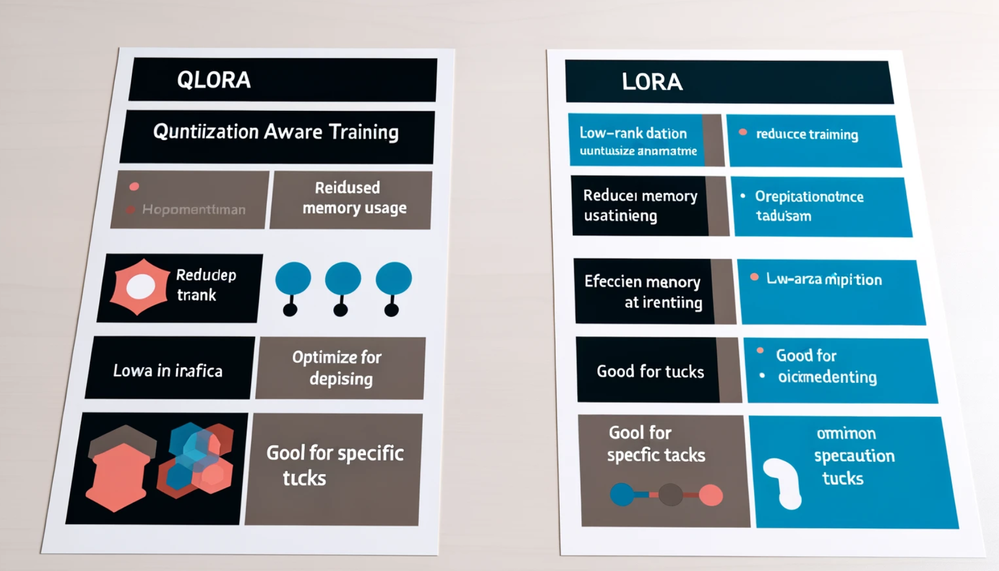

# **Let Phi-3 become an industry expert**

To put the Phi-3 model into an industry, you need to add industry business data to the Phi-3 model. We have two different options, the first is RAG (Retrieval Augmented Generation) and the second is Fine Tuning.

## **RAG vs Fine-Tuning**

### **Retrieval Augmented Generation**

RAG is data retrieval + text generation. The structured data and unstructured data of the enterprise are stored in the vector database. When searching for relevant content, the relevant summary and content are found to form a context, and the text completion capability of LLM/SLM is combined to generate content.

### **Fine-tuning**

Fine-tuning is based on improvement of a certain model. It does not need to start with the model algorithm, but data needs to be continuously accumulated. If you want more precise terminology and language expression in industry applications, fine-tuning is your better choice. But if your data changes frequently, fine-tuning can become complicated.

### **How to choose**

1. If our answer requires the introduction of external data, RAG is the best choice

2. If you need to output stable and precise industry knowledge, fine-tuning will be a good choice. RAG prioritizes pulling relevant content but might not always nail the specialized nuances.

3. Fine-tuning requires a high-quality data set, and if it is just a small range of data, it will not make much difference. RAG is more flexible

4. Fine-tuning is a black box, a metaphysics, and it is difficult to understand the internal mechanism. But RAG can make it easier to find the source of the data, thereby effectively adjusting hallucinations or content errors and providing better transparency.

### **Scenarios**

1. Vertical industries require specific professional vocabulary and expressions, ***Fine-tuning*** will be the best choice

2. QA system, involving the synthesis of different knowledge points, ***RAG*** will be the best choice

3. The combination of automated business flow ***RAG + Fine-tuning*** is the best choice

## **How to use RAG**

A vector database is a collection of data stored in mathematical form. Vector databases make it easier for machine learning models to remember previous inputs, enabling machine learning to be used to support use cases such as search, recommendations, and text generation. Data can be identified based on similarity metrics rather than exact matches, allowing computer models to understand the context of the data.

Vector database is the key to realizing RAG. We can convert data into vector storage through vector models such as text-embedding-3, jina-ai-embedding, etc.

Learn more about create RAG application [https://github.com/microsoft/Phi-3CookBook](https://github.com/microsoft/Phi-3CookBook?WT.mc_id=aiml-138114-kinfeylo) 

## **How to use Fine-tuning**

The commonly used algorithms in Fine-tuning are Lora and QLora. How to choose?
- [Learn More with this sample notebook](../../code/04.Finetuning/Phi_3_Inference_Finetuning.ipynb)
- [Example of Python FineTuning Sample](../../code/04.Finetuning/FineTrainingScript.py)

### **Lora and QLora**

LoRA (Low-Rank Adaptation) and QLoRA (Quantized Low-Rank Adaptation) are both techniques used to fine-tune large language models (LLMs) using Parameter Efficient Fine Tuning (PEFT). PEFT techniques are designed to train models more efficiently than traditional methods. 
LoRA is a standalone finetuning technique that reduces memory footprint by applying a low-rank approximation to the weight update matrix. It offers fast training times and maintains performance close to traditional fine-tuning methods. 

QLoRA is an extended version of LoRA that incorporates quantization techniques to further reduce memory usage. QLoRA quantizes the precision of the weight parameters in the pre-trained LLM to 4-bit precision, which is more memory efficient than LoRA. However, QLoRA training is about 30% slower than LoRA training due to the additional quantization and dequantization steps. 

QLoRA uses LoRA as an accessory to fix the errors introduced during quantization errors. QLoRA enables the fine-tuning of massive models with billions of parameters on relatively small, highly available GPUs. For example, QLoRA can fine-tune a 70B parameter model that requires 36 GPUs with only 2

