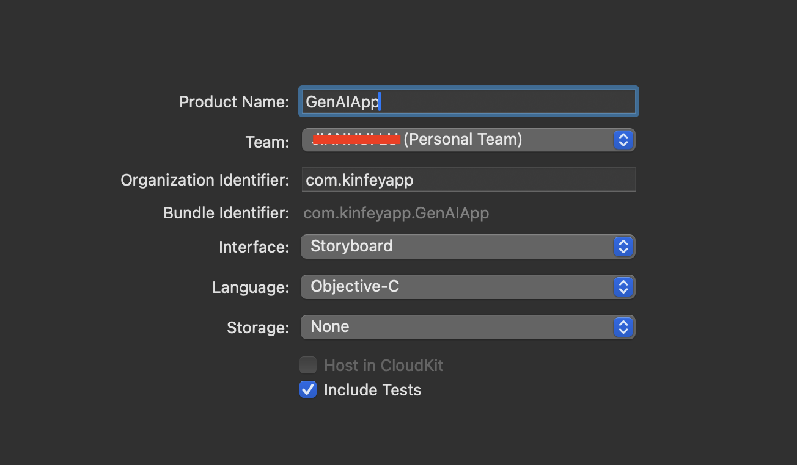
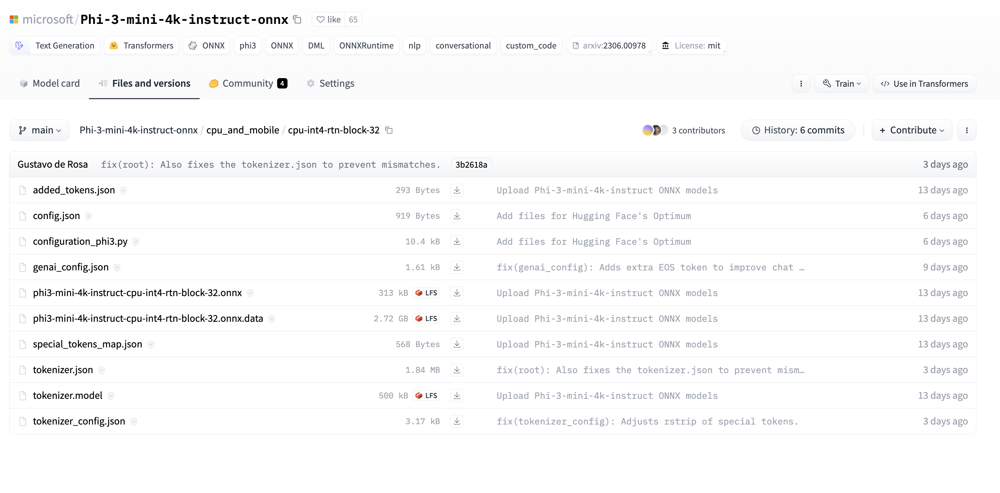

# **Inference Phi-3 in iOS**

Phi-3-mini is a new series of models from Microsoft that enables deployment of Large Language Models (LLMs) on edge devices and IoT devices. Phi-3-mini is available in iOS, Android, and Edge Device deployments, allowing generative AI to be deployed in BYOD. The following example deploys Phi-3-mini based on iOS

## **1. Preparation**


a. macOS 14+

b. Xcode 15+
   
c. iOS SDK 17.x (iPhone 14 A16 or greater)
   
d. Install Python 3.10+ (Conda is recommended)
   
e. Install the Python library - python-flatbuffers

f. Install CMake

### Semantic Kernel and Inference:
Semantic Kernel is an application framework that allows you to create applications compatible with Azure OpenAI Service, OpenAI models, and even local models. Accessing local services through Semantic Kernel allows you to easily connect to your self-built Phi-3-mini model server.

### Calling Quantized Models with Ollama or LlamaEdge:
Many users prefer using quantized models to run models locally. [Ollama](https://ollama.com) and [LlamaEdge](https://llamaedge.com) allow individual users to call different quantized models:

**Ollama**
You can directly run ollama run phi3 or configure it offline. Create a Modelfile with the path to your gguf file. Sample code for running Phi-3-mini quantization model:

```

FROM {Add your gguf file path}
TEMPLATE \"\"\"<|user|> {{.Prompt}}<|end|> <|assistant|>\"\"\"
PARAMETER stop <|end|>
PARAMETER num_ctx 4096

```
**LlamaEdge**
If you want to use gguf in the cloud and edge devices simultaneously, LlamaEdge can be your choice.


## **2. Compiling ONNX Runtime for iOS**

```bash

git clone https://github.com/microsoft/onnxruntime.git

cd onnxruntime

./build.sh --build_shared_lib --ios --skip_tests --parallel --build_dir ./build_ios --ios --apple_sysroot iphoneos --osx_arch arm64 --apple_deploy_target 17.5 --cmake_generator Xcode --config Release

cd ../

```
 
***Notice*** 

  a. Before compiling, you must ensure that Xcode is configured correctly and set it on the terminal


```bash

sudo xcode-select -switch /Applications/Xcode.app/Contents/Developer 

```
 
  b. ONNX Runtime needs to be compiled based on different platforms. For iOS, you can compile based on arm64 / x86_64
   
  c. It is recommended to directly use the latest iOS SDK for compilation. Of course, you can also lower the version to be compatible with past SDKs.


## **3. Compiling Generative AI with ONNX Runtime for iOS**


 ***Note:*** Because Generative AI with ONNX Runtime is in preview, please note the changes.


```bash

git clone https://github.com/microsoft/onnxruntime-genai
 
cd onnxruntime-genai
 
mkdir ort
 
cd ort
 
mkdir include
 
mkdir lib
 
cd ../
 
cp ../onnxruntime/include/onnxruntime/core/session/onnxruntime_c_api.h ort/include
 
cp ../onnxruntime/build_ios/Release/Release-iphoneos/libonnxruntime*.dylib* ort/lib
 
export OPENCV_SKIP_XCODEBUILD_FORCE_TRYCOMPILE_DEBUG=1
 
python3 build.py --parallel --build_dir ./build_ios --ios --ios_sysroot iphoneos --ios_arch arm64 --ios_deployment_target 17.5 --cmake_generator Xcode --cmake_extra_defines CMAKE_XCODE_ATTRIBUTE_CODE_SIGNING_ALLOWED=NO

```


## **4. Create an App application in Xcode**

I chose Objective-C as the App development method , because using Generative AI with ONNX Runtime C++ API, Objective-C is better compatible. Of course, you can also complete related calls through Swift bridging.





## **5. Copy the ONNX quantized INT4 model to the App application project**

We need to import the INT4 quantization model in ONNX format, which needs to be downloaded first



After downloading, you need to add it to the Resources directory of the project in Xcode.


 ## **6. Add the C++ API in ViewControllers**
 
***Notice***:

  a. Add the corresponding C++ header file to the project


  

  b. add onnxruntime-gen ai dylib in Xcode

  
  
 
  c. Directly use the code on C Samples for testing in this samples. You can also directly add moreto run(such as ChatUI）

  d. Because you need to call C++, please change ViewController.m to ViewController.mm

```objc

    NSString *llmPath = [[NSBundle mainBundle] resourcePath];
    char const *modelPath = llmPath.cString;

    auto model =  OgaModel::Create(modelPath);

    auto tokenizer = OgaTokenizer::Create(*model);

    const char* prompt = "<|system|>You are a helpful AI assistant.<|end|><|user|>Can you introduce yourself?<|end|><|assistant|>";

    auto sequences = OgaSequences::Create();
    tokenizer->Encode(prompt, *sequences);

    auto params = OgaGeneratorParams::Create(*model);
    params->SetSearchOption("max_length", 100);
    params->SetInputSequences(*sequences);

    auto output_sequences = model->Generate(*params);
    const auto output_sequence_length = output_sequences->SequenceCount(0);
    const auto* output_sequence_data = output_sequences->SequenceData(0);
    auto out_string = tokenizer->Decode(output_sequence_data, output_sequence_length);
    
    auto tmp = out_string;

```


## **7. The running results**


***Sample Codes：*** https://github.com/Azure-Samples/Phi-3MiniSamples/tree/main/ios