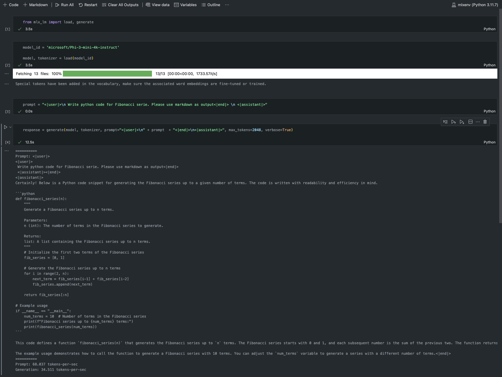

# **使用 Apple MLX 框架进行 Phi-3 推理**

## **什么是 MLX 框架**

MLX 是一个面向苹果硅芯片的机器学习研究阵列框架，由苹果机器学习研究团队带来。

MLX 是由机器学习研究人员为机器学习研究人员设计的。该框架旨在用户友好，同时在训练和部署模型方面仍具有高效性。框架本身的设计在概念上也很简单。我们希望使研究人员能够轻松地扩展和改进 MLX，以便快速探索新想法。

通过 MLX，LLMs 可以在苹果硅芯片设备上加速，模型可以非常方便地在本地运行。

## **使用 MLX 框架进行 Phi-3-mini 推理**

### **1. 设置您的 MLX 环境**

1. Python 3.11.x
2. 安装 MLX 库


```bash

pip install mlx-lm

```

### **2. 在终端中使用 MLX 运行 Phi-3-mini**


```bash

python -m mlx_lm.generate --model microsoft/Phi-3-mini-4k-instruct --max-token 2048 --prompt  "<|user|>\nCan you introduce yourself<|end|>\n<|assistant|>"

```

运行结果如下（以我的Apple M1 Max 64GB设备为例）


### **3. 在终端中使用 MLX 量化 Phi-3-mini**


```bash

python -m mlx_lm.convert --hf-path microsoft/Phi-3-mini-4k-instruct

```

***注意：*** 通过 mlx_lm.convert 可以对模型进行量化，默认的量化方式为 INT4。

本示例将 Phi-3-mini 量化为 INT4。量化完成以后，它会自动存储在默认的./mlx_model路径中。

我们可以在终端中使用 MLX 测试量化的模型。


```bash

python -m mlx_lm.convert --hf-path microsoft/Phi-3-mini-4k-instruct

```

结果如下图所示。


### **4. 在 Jupyter Notebook 中使用 MLX 运行 Phi-3-mini**




***注意:*** 请参考这个例子 [参考示例](../../../../code/03.Inference/MLX/MLX_DEMO.ipynb)


## **资源**

1. 学习Apple 的MLX 框架 [https://ml-explore.github.io](https://ml-explore.github.io/mlx/build/html/index.html)

2. Apple MLX的Github代码仓库 [https://github.com/ml-explore](https://github.com/ml-explore)


