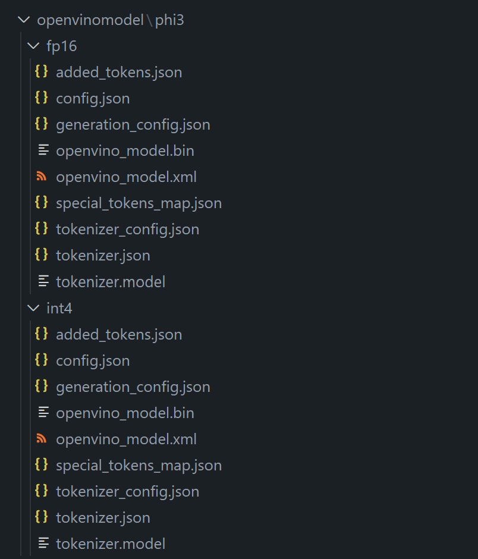
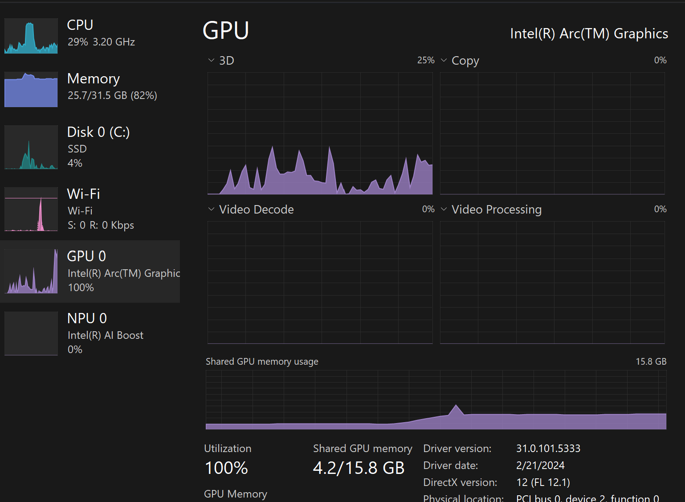

# **在 AI PC 中推論 Phi-3**

隨著生成式 AI 的進步和邊緣設備硬體能力的提升，越來越多的生成式 AI 模型現在可以整合到用戶的自帶設備（BYOD）中。AI PC 就是這些模型之一。從 2024 年開始，Intel、AMD 和 Qualcomm 與 PC 製造商合作，推出 AI PC，通過硬體修改促進本地生成式 AI 模型的部署。在這次討論中，我們將重點關注 Intel AI PC，並探討如何在 Intel AI PC 上部署 Phi-3。

### **什麼是 NPU**

NPU (Neural Processing Unit) 是一種專用處理器或處理單元，位於較大的 SoC 上，專為加速神經網絡操作和 AI 任務而設計。與通用 CPU 和 GPU 不同，NPU 針對數據驅動的平行計算進行了優化，使其在處理大量多媒體數據（如影片和圖像）以及處理神經網絡數據方面非常高效。它們特別擅長處理 AI 相關任務，例如語音識別、影片通話中的背景模糊，以及物件檢測等照片或影片編輯過程。

## **NPU vs GPU**

雖然許多 AI 和機器學習工作負載在 GPU 上執行，但 GPU 和 NPU 之間有一個關鍵的區別。
GPU 以其平行計算能力聞名，但並非所有 GPU 在處理圖形之外都同樣高效。另一方面，NPU 是專門為涉及神經網路操作的複雜計算而設計的，使其在 AI 任務中非常有效。

總結來說，NPU 是加速 AI 計算的數學天才，它們在新興的 AI PC 時代中扮演著關鍵角色！

***此範例是基於 Intel 最新的 Intel Core Ultra Processor***

## **1. 使用 NPU 執行 Phi-3 模型**

Intel® NPU 裝置是一種 AI 推論加速器，整合於 Intel 用戶端 CPU 中，從 Intel® Core™ Ultra 世代的 CPU（前稱為 Meteor Lake）開始。它能夠高效能地執行人工神經網路任務。


**Intel NPU 加速函式庫**

Intel NPU 加速函式庫 [https://github.com/intel/intel-npu-acceleration-library](https://github.com/intel/intel-npu-acceleration-library) 是一個 Python 函式庫，旨在利用 Intel 神經處理單元 (NPU) 的強大功能，在相容硬體上執行高速計算，以提升應用程式的效率。

Phi-3-mini 在由 Intel® Core™ Ultra 處理器驅動的 AI PC 上的範例。


使用 pip 安裝 Python 函式庫

```bash

   pip install intel-npu-acceleration-library

```

***注意*** 專案仍在開發中，但參考模型已經非常完整。

### **執行 Phi-3 搭配 Intel NPU 加速函式庫**

使用 Intel NPU 加速，這個函式庫不會影響傳統的編碼過程。你只需要使用這個函式庫來量化原始的 Phi-3 模型，例如 FP16，INT8，INT4，例如

```python

from transformers import AutoTokenizer, pipeline, TextStreamer
import intel_npu_acceleration_library as npu_lib
import warnings

model_id = "microsoft/Phi-3-mini-4k-instruct"

model = npu_lib.NPUModelForCausalLM.from_pretrained(
                                    model_id,
                                    torch_dtype="auto",
                                    dtype=npu_lib.int4,
                                    trust_remote_code=True
                                )

tokenizer = AutoTokenizer.from_pretrained(model_id)

text_streamer = TextStreamer(tokenizer, skip_prompt=True)

```

量化成功後，繼續執行以呼叫 NPU 執行 Phi-3 模型。

```python

generation_args = {
            "max_new_tokens": 1024,
            "return_full_text": False,
            "temperature": 0.3,
            "do_sample": False,
            "streamer": text_streamer,
        }

pipe = pipeline(
            "text-generation",
            model=model,
            tokenizer=tokenizer,
)

query = "<|system|>You are a helpful AI assistant.<|end|><|user|>Can you introduce yourself?<|end|><|assistant|>"

with warnings.catch_warnings():
    warnings.simplefilter("ignore")
    pipe(query, **generation_args)


```

執行程式碼時，我們可以通過 Task Manager 查看 NPU 的執行狀態


***範例*** : [AIPC_NPU_DEMO.ipynb](../../code/03.Inference/AIPC/AIPC_NPU_DEMO.ipynb)

## **2. 使用 DirectML + ONNX Runtime 執行 Phi-3 模型**

### **什麼是 DirectML**

[DirectML](https://github.com/microsoft/DirectML) 是一個高效能、硬體加速的 DirectX 12 函式庫，用於機器學習。DirectML 為各種支援的硬體和驅動程式提供常見機器學習任務的 GPU 加速，包括來自 AMD、Intel、NVIDIA 和 Qualcomm 等廠商的所有支援 DirectX 12 的 GPU。

當單獨使用時，DirectML API 是一個低階的 DirectX 12 函式庫，適用於高效能、低延遲的應用程式，如框架、遊戲和其他即時應用程式。DirectML 與 Direct3D 12 的無縫互通性，以及其低開銷和跨硬體的一致性，使得 DirectML 成為在需要高效能和跨硬體結果的可靠性和可預測性時，加速機器學習的理想選擇。

***注意*** : 最新的 DirectML 已經支援 NPU (https://devblogs.microsoft.com/directx/introducing-neural-processor-unit-npu-support-in-directml-developer-preview/)

### DirectML 和 CUDA 在其功能和性能方面:

**DirectML** 是由 Microsoft 開發的機器學習函式庫。它旨在加速 Windows 設備上的機器學習工作負載，包括桌面電腦、筆記型電腦和邊緣設備。

- DX12-Based: DirectML 建立在 DirectX 12 (DX12) 之上，提供廣泛的 GPU 硬體支援，包括 NVIDIA 和 AMD。
- Wider Support: 由於它利用了 DX12，DirectML 可以與任何支援 DX12 的 GPU 一起工作，甚至是整合型 GPU。
- Image Processing: DirectML 使用神經網絡處理圖像和其他資料，使其適合圖像識別、物件檢測等任務。
- Ease of Setup: 設定 DirectML 很簡單，不需要 GPU 製造商的特定 SDK 或函式庫。
- Performance: 在某些情況下，DirectML 表現良好，甚至可能比 CUDA 更快，特別是對於某些工作負載。
- Limitations: 然而，在某些情況下，DirectML 可能會較慢，特別是對於 float16 大批量大小。

**CUDA** 是 NVIDIA 的平行處理平台和程式設計模型。它允許開發人員利用 NVIDIA GPU 的強大功能進行通用計算，包括機器學習和科學模擬。

- NVIDIA-Specific: CUDA 與 NVIDIA GPU 緊密集成，專為其設計。
- Highly Optimized: 它為 GPU 加速任務提供了卓越的性能，特別是在使用 NVIDIA GPU 時。
- Widely Used: 許多機器學習框架和函式庫（如 TensorFlow 和 PyTorch）都支持 CUDA。
- Customization: 開發者可以針對特定任務微調 CUDA 設定，從而達到最佳性能。
- Limitations: 然而，CUDA 對 NVIDIA 硬體的依賴可能會限制你在不同 GPU 間獲得更廣泛相容性的能力。

### 選擇 DirectML 和 CUDA:

在 DirectML 和 CUDA 之間的選擇取決於您的具體使用案例、硬體可用性和偏好。如果您尋求更廣泛的相容性和簡易的設定，DirectML 可能是一個不錯的選擇。然而，如果您擁有 NVIDIA GPUs 並需要高度優化的效能，CUDA 仍然是一個強有力的競爭者。總之，DirectML 和 CUDA 都有其優勢和劣勢，因此在做出決定時請考慮您的需求和可用的硬體。

### **生成式 AI 與 ONNX Runtime**

在 AI 時代，AI 模型的可移植性非常重要。ONNX Runtime 可以輕鬆地將訓練好的模型部署到不同的設備上。開發者不需要關注推論框架，使用統一的 API 即可完成模型推論。在生成式 AI 時代，ONNX Runtime 也進行了程式碼優化 (https://onnxruntime.ai/docs/genai/)。通過優化的 ONNX Runtime，量化的生成式 AI 模型可以在不同終端上進行推論。在使用 ONNX Runtime 的生成式 AI 中，你可以通過 Python、C#、C / C++ 來推論 AI 模型 API。當然，在 iPhone 上部署可以利用 C++ 的生成式 AI 與 ONNX Runtime API。

[範例程式碼](https://github.com/Azure-Samples/Phi-3MiniSamples/tree/main/onnx)

***編譯生成式 AI 與 ONNX Runtime 函式庫***

```bash

winget install --id=Kitware.CMake  -e

git clone https://github.com/microsoft/onnxruntime.git

cd .\onnxruntime\

./build.bat --build_shared_lib --skip_tests --parallel --use_dml --config Release

cd ../

git clone https://github.com/microsoft/onnxruntime-genai.git

cd .\onnxruntime-genai\

mkdir ort

cd ort

mkdir include

mkdir lib

copy ..\onnxruntime\include\onnxruntime\core\providers\dml\dml_provider_factory.h ort\include

copy ..\onnxruntime\include\onnxruntime\core\session\onnxruntime_c_api.h ort\include

copy ..\onnxruntime\build\Windows\Release\Release\*.dll ort\lib

copy ..\onnxruntime\build\Windows\Release\Release\onnxruntime.lib ort\lib

python build.py --use_dml

```

**安裝函式庫**

```bash

pip install .\onnxruntime_genai_directml-0.3.0.dev0-cp310-cp310-win_amd64.whl

```

這是執行結果


***範例*** : [AIPC_DirectML_DEMO.ipynb](../../code/03.Inference/AIPC/AIPC_DirectML_DEMO.ipynb)

## **3. 使用 Intel OpenVino 執行 Phi-3 模型**

### **什麼是 OpenVINO**

[OpenVINO](https://github.com/openvinotoolkit/openvino) 是一個用於優化和部署深度學習模型的開源工具包。它為來自流行框架（如 TensorFlow、PyTorch 等）的視覺、音頻和語言模型提供了增強的深度學習性能。開始使用 OpenVINO。OpenVINO 也可以與 CPU 和 GPU 結合使用來執行 Phi-3 模型。

***注意***: 目前，OpenVINO 暫不支援 NPU。

### **安裝 OpenVINO 函式庫**

```bash

 pip install git+https://github.com/huggingface/optimum-intel.git

 pip install git+https://github.com/openvinotoolkit/nncf.git

 pip install openvino-nightly

```

### **執行 Phi-3 with OpenVINO**

像 NPU 一樣，OpenVINO 通過執行定量模型來完成生成式 AI 模型的呼叫。我們需要先對 Phi-3 模型進行量化，並通過 optimum-cli 在命令列上完成模型量化。

**INT4**

```bash

optimum-cli export openvino --model "microsoft/Phi-3-mini-4k-instruct" --task text-generation-with-past --weight-format int4 --group-size 128 --ratio 0.6  --sym  --trust-remote-code ./openvinomodel/phi3/int4

```

**FP16**

```bash

optimum-cli export openvino --model "microsoft/Phi-3-mini-4k-instruct" --task text-generation-with-past --weight-format fp16 --trust-remote-code ./openvinomodel/phi3/fp16

```

轉換後的格式，如下所示



載入模型路徑(model_dir)、相關配置(ov_config = {"PERFORMANCE_HINT": "LATENCY", "NUM_STREAMS": "1", "CACHE_DIR": ""})和硬體加速設備(GPU.0)通過 OVModelForCausalLM

```python

ov_model = OVModelForCausalLM.from_pretrained(
     model_dir,
     device='GPU.0',
     ov_config=ov_config,
     config=AutoConfig.from_pretrained(model_dir, trust_remote_code=True),
     trust_remote_code=True,
)

```

執行程式碼時，我們可以通過任務管理器查看 GPU 的執行狀態



***範例*** : [AIPC_OpenVino_Demo.ipynb](../../code/03.Inference/AIPC/AIPC_OpenVino_Demo.ipynb)

### ***注意*** : 上述三種方法各有優勢，但建議使用 NPU 加速進行 AI PC 推論。


