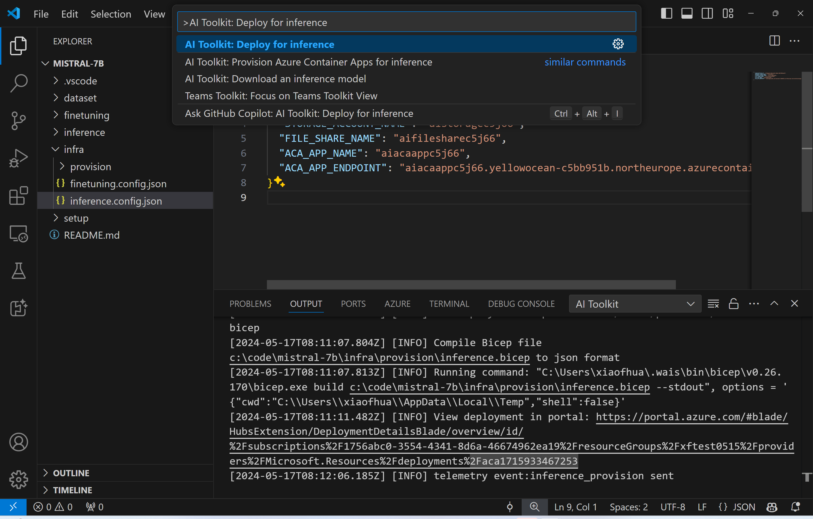

# 遠端推論與微調模型

在遠端環境中訓練適配器後，使用一個簡單的 Gradio 應用來與模型互動。


### 提供 Azure 資源

你需要透過從命令面板執行 `AI Toolkit: Provision Azure Container Apps for inference` 來設定 Azure 資源以進行遠端推論。在此設定過程中，系統會要求你選擇你的 Azure 訂閱和資源群組。


預設情況下，用於推論的訂閱和資源群組應與用於微調的訂閱和資源群組相匹配。推論將使用相同的 Azure Container App Environment 並訪問存儲在 Azure Files 中的模型和模型適配器，這些都是在微調步驟中生成的。

## 使用 AI 工具包

### 部署以進行推論

如果你希望修改推論程式碼或重新載入推論模型，請執行 `AI Toolkit: Deploy for inference` 指令。這將同步你最新的程式碼與 ACA 並重新啟動副本。



在成功完成部署後，該模型現在可以使用此端點進行評估。

### 存取推論 API

您可以通過點擊 VSCode 通知中顯示的 "*Go to Inference Endpoint*" 按鈕來訪問推論 API。或者，可以在 `./infra/inference.config.json` 中的 `ACA_APP_ENDPOINT` 和輸出面板中找到 Web API 端點。


> **注意:** 推論端點可能需要幾分鐘才能完全運行。

## 推論元件包含在模板中

 Folder | Contents |
| ------ |--------- |
| `infra` | 包含所有遠端操作所需的配置。 |
| `infra/provision/inference.parameters.json` | 包含 bicep 模板的參數，用於建構 Azure 資源以進行推論。 |
| `infra/provision/inference.bicep` | 包含用於建構 Azure 資源以進行推論的模板。 |
| `infra/inference.config.json` | 由 `AI Toolkit: Provision Azure Container Apps for inference` 指令生成的配置檔案。它被用作其他遠端指令面板的輸入。

### 使用 AI Toolkit 配置 Azure 資源提供

設定 [AI Toolkit](https://marketplace.visualstudio.com/items?itemName=ms-windows-ai-studio.windows-ai-studio)

配置 Azure Container Apps 以進行推論`命令。

您可以在 `./infra/provision/inference.parameters.json` 文件中找到配置參數。以下是詳細資訊：

| Parameter | Description |
| --------- |------------ |
| `defaultCommands` | 這是用於啟動 web API 的命令。 |
| `maximumInstanceCount` | 此參數設置 GPU 實例的最大容量。 |
| `location` | 這是 Azure 資源被配置的位置。預設值與所選資源組的位置相同。 |
| `storageAccountName`, `fileShareName` `acaEnvironmentName`, `acaEnvironmentStorageName`, `acaAppName`,  `acaLogAnalyticsName` | 這些參數用於命名 Azure 資源以進行配置。預設情況下，它們將與微調資源名稱相同。您可以輸入一個新的、未使用的資源名稱來建立您自定義命名的資源，或者如果您更喜歡使用已存在的 Azure 資源，則可以輸入已存在的資源名稱。詳情請參閱章節 [Using existing Azure Resources](#using-existing-azure-resources)。 |

### 使用現有的 Azure 資源

預設情況下，推論配置使用與微調相同的 Azure Container App Environment、Storage Account、Azure File Share 和 Azure Log Analytics。將單獨建立一個 Azure Container App 專門用於推論 API。

如果您在微調步驟中自訂了 Azure 資源或想使用您現有的 Azure 資源進行推論，請在 `./infra/inference.parameters.json` 檔案中指定它們的名稱。然後，從命令面板執行 `AI Toolkit: Provision Azure Container Apps for inference` 命令。這將更新任何指定的資源並建立任何缺失的資源。

例如，如果你有一個現有的 Azure 容器環境，你的 `./infra/finetuning.parameters.json` 應該看起來像這樣:

```json
{
    "$schema": "https://schema.management.azure.com/schemas/2019-04-01/deploymentParameters.json#",
    "contentVersion": "1.0.0.0",
    "parameters": {
      ...
      "acaEnvironmentName": {
        "value": "<your-aca-env-name>"
      },
      "acaEnvironmentStorageName": {
        "value": null
      },
      ...
    }
  }
```

### 手動供應

如果你偏好手動配置 Azure 資源，你可以使用 `./infra/provision` 資料夾中提供的 bicep 檔案。如果你已經設定並配置了所有 Azure 資源而未使用 AI Toolkit 命令面板，你只需在 `inference.config.json` 檔案中輸入資源名稱。

例如:

```json
{
  "SUBSCRIPTION_ID": "<your-subscription-id>",
  "RESOURCE_GROUP_NAME": "<your-resource-group-name>",
  "STORAGE_ACCOUNT_NAME": "<your-storage-account-name>",
  "FILE_SHARE_NAME": "<your-file-share-name>",
  "ACA_APP_NAME": "<your-aca-name>",
  "ACA_APP_ENDPOINT": "<your-aca-endpoint>"
}
```

