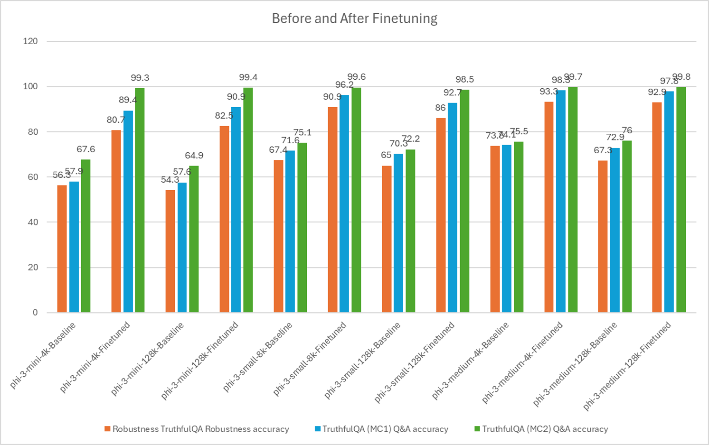

## Fine Tuning Scenarios

| | | | | | | |
|-|-|-|-|-|-|-|
|Scenario|LoRA|QLoRA|PEFT|DeepSpeed|ZeRO|DORA|
|Adapting pre-trained LLMs to specific tasks or domains|Yes|Yes|Yes|Yes|Yes|Yes|
|Fine-tuning for NLP tasks such as text classification, named entity recognition, and machine translation|Yes|Yes|Yes|Yes|Yes|Yes|
|Fine-tuning for QA tasks|Yes|Yes|Yes|Yes|Yes|Yes|
|Fine-tuning for generating human-like responses in chatbots|Yes|Yes|Yes|Yes|Yes|Yes|
|Fine-tuning for generating music, art, or other forms of creativity|Yes|Yes|Yes|Yes|Yes|Yes|
|Reducing computational and financial costs|Yes|Yes|No|Yes|Yes|No|
|Reducing memory usage|No|Yes|No|Yes|Yes|Yes|
|Using fewer parameters for efficient finetuning|No|Yes|Yes|No|No|Yes|
|Memory-efficient form of data parallelism that gives access to the aggregate GPU memory of all the GPU devices available|No|No|No|Yes|Yes|Yes|

## Fine Tuning Performance Examples

