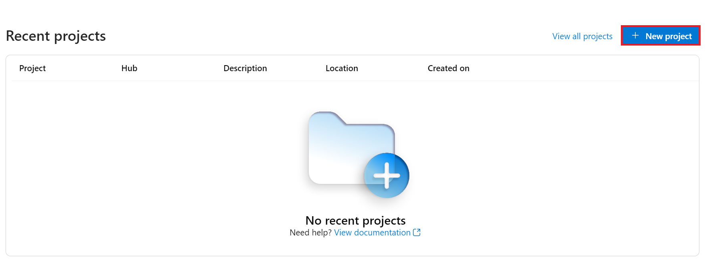
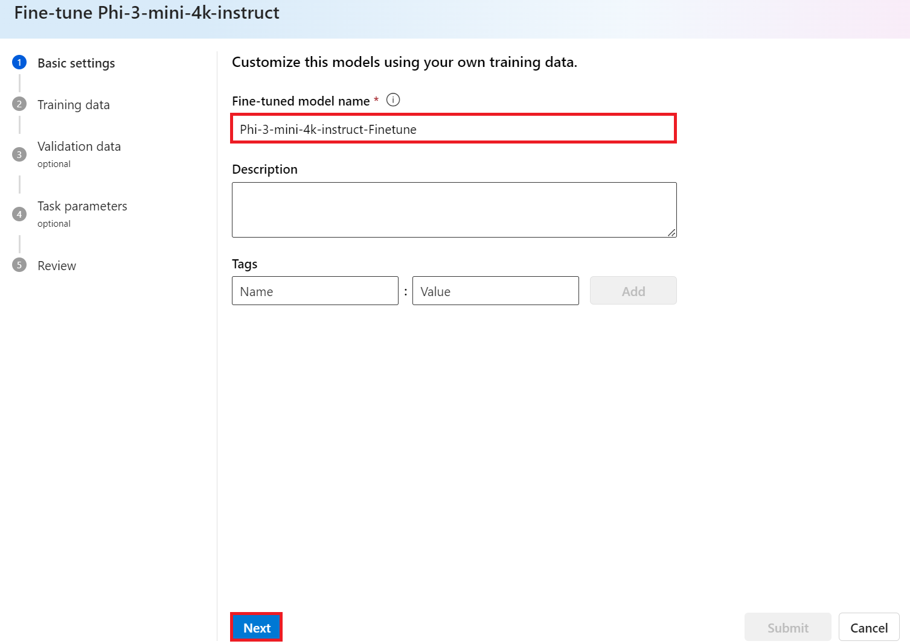

# Phi-3をAzure AI Studioで微調整する

MicrosoftのPhi-3 Mini言語モデルをAzure AI Studioを使用して微調整する方法を探ってみましょう。微調整により、Phi-3 Miniを特定のタスクに適応させ、さらに強力でコンテキストに敏感なものにすることができます。

## 考慮事項

- **機能:** どのモデルが微調整可能か？ベースモデルは何ができるようになるのか？
- **コスト:** 微調整の価格モデルはどうなっているのか？
- **カスタマイズ性:** ベースモデルをどの程度変更できるのか？どのように変更できるのか？
- **利便性:** 微調整は実際にどのように行われるのか？カスタムコードを書く必要があるのか？自分で計算リソースを用意する必要があるのか？
- **安全性:** 微調整されたモデルには安全性のリスクがあることが知られているが、意図しない害を防ぐためのガードレールはあるのか？


## 微調整の準備

### 前提条件

> [!NOTE]
> Phi-3ファミリーモデルの場合、従量課金制の微調整オファリングは**East US 2**リージョンで作成されたハブでのみ利用可能です。

- Azureサブスクリプション。Azureサブスクリプションをお持ちでない場合は、[有料Azureアカウント](https://azure.microsoft.com/pricing/purchase-options/pay-as-you-go)を作成して開始してください。

- [AI Studioプロジェクト](https://ai.azure.com?WT.mc_id=aiml-138114-kinfeylo)。
- Azureロールベースのアクセス制御（Azure RBAC）は、Azure AI Studioでの操作へのアクセスを付与するために使用されます。この記事の手順を実行するには、ユーザーアカウントにリソースグループの__Azure AI Developerロール__が割り当てられている必要があります。

### サブスクリプションプロバイダーの登録

サブスクリプションが`Microsoft.Network`リソースプロバイダーに登録されていることを確認します。

1. [Azureポータル](https://portal.azure.com)にサインインします。
1. 左側のメニューから**サブスクリプション**を選択します。
1. 使用するサブスクリプションを選択します。
1. 左側のメニューから**AIプロジェクト設定** > **リソースプロバイダー**を選択します。
1. **Microsoft.Network**がリソースプロバイダーのリストにあることを確認します。ない場合は追加します。

### データ準備

モデルを微調整するためのトレーニングデータと検証データを準備します。トレーニングデータと検証データセットには、モデルがどのように動作するかの入力と出力の例が含まれます。

すべてのトレーニング例が推論のための期待される形式に従っていることを確認してください。モデルを効果的に微調整するためには、バランスの取れた多様なデータセットを確保することが重要です。

これには、データのバランスを保ち、さまざまなシナリオを含め、トレーニングデータを定期的に精緻化して現実世界の期待に合わせることが含まれます。最終的には、より正確でバランスの取れたモデル応答が得られます。

異なるモデルタイプには、異なる形式のトレーニングデータが必要です。

### チャット補完

使用するトレーニングデータと検証データは、JSON Lines（JSONL）ドキュメントとしてフォーマットされている必要があります。`Phi-3-mini-128k-instruct`の微調整データセットは、チャット補完APIで使用される会話形式でフォーマットされている必要があります。

### ファイル形式の例

```json
    {"messages": [{"role": "system", "content": "あなたはXboxカスタマーサポートエージェントであり、主な目標はユーザーがXboxデバイスで直面している問題を解決することです。あなたは親切で簡潔です。あなたはクエリに対して事実に基づいた回答のみを提供し、Xboxに関連しない回答は提供しません。"}, {"role": "user", "content": "XboxはPlayStationよりも優れていますか？"}, {"role": "assistant", "content": "申し訳ありませんが、個人的な意見を提供することはできません。私の主な仕事は、Xboxデバイスに関連する問題を解決することです。Xboxに関連する問題がありますか？"}]}
    {"messages": [{"role": "system", "content": "あなたはXboxカスタマーサポートエージェントであり、主な目標はユーザーがXboxデバイスで直面している問題を解決することです。あなたは親切で簡潔です。あなたはクエリに対して事実に基づいた回答のみを提供し、Xboxに関連しない回答は提供しません。"}, {"role": "user", "content": "PCゲームをXboxでプレイできますか？"}, {"role": "assistant", "content": "XboxコンソールはPCゲームをネイティブにサポートしていませんが、多くのXboxゲームをプレイできます。その多くはPCでも利用可能です。Xboxデバイスに対応するゲームを見つけるお手伝いをしましょうか？"}]}
    {"messages": [{"role": "system", "content": "あなたはXboxカスタマーサポートエージェントであり、主な目標はユーザーがXboxデバイスで直面している問題を解決することです。あなたは親切で簡潔です。あなたはクエリに対して事実に基づいた回答のみを提供し、Xboxに関連しない回答は提供しません。"}, {"role": "user", "content": "XboxをWi-Fiに接続するのに問題があります。"}, {"role": "assistant", "content": "心配しないでください。Xboxのネットワーク設定を確認しましょう。Wi-Fiに接続しようとすると何が起こるか教えてください。"}]}
```

サポートされているファイルタイプはJSON Linesです。ファイルはデフォルトのデータストアにアップロードされ、プロジェクトで利用可能になります。

## Azure AI StudioでPhi-3を微調整する

Azure AI Studioを使用すると、微調整と呼ばれるプロセスを使用して、大規模な言語モデルを個人のデータセットに合わせて調整できます。微調整は、特定のタスクやアプリケーションに対してカスタマイズと最適化を行うことで、パフォーマンスの向上、コスト効率、遅延の削減、出力のカスタマイズを実現します。


### 新しいプロジェクトを作成する

1. [Azure AI Studio](https://ai.azure.com)にサインインします。

1. **+New project**を選択して、Azure AI Studioで新しいプロジェクトを作成します。

    

1. 次のタスクを実行します：

    - プロジェクト**ハブ名**。一意の値である必要があります。
    - 使用する**ハブ**を選択します（必要に応じて新しいものを作成します）。

    

1. 新しいハブを作成するために次のタスクを実行します：

    - **ハブ名**を入力します。一意の値である必要があります。
    - Azure**サブスクリプション**を選択します。
    - 使用する**リソースグループ**を選択します（必要に応じて新しいものを作成します）。
    - 使用したい**場所**を選択します。
    - 使用する**Azure AIサービスを接続**を選択します（必要に応じて新しいものを作成します）。
    - **Azure AI検索を接続**を選択して**接続をスキップ**します。

    

1. **次へ**を選択します。
1. **プロジェクトを作成**を選択します。

### データ準備

微調整の前に、チャット指示、質問回答ペア、その他関連するテキストデータなど、タスクに関連するデータセットを収集または作成します。このデータをノイズを除去し、欠損値を処理し、テキストをトークン化することでクリーンアップおよび前処理します。

### Azure AI StudioでPhi-3モデルを微調整する

> [!NOTE]
> Phi-3モデルの微調整は現在、East US 2にあるプロジェクトでサポートされています。

1. 左側のタブから**モデルカタログ**を選択します。

1. **検索バー**に*phi-3*と入力し、使用したいphi-3モデルを選択します。

    

1. **微調整**を選択します。

    

1. **微調整されたモデル名**を入力します。

    

1. **次へ**を選択します。

1. 次のタスクを実行します：

    - **タスクタイプ**を**チャット補完**に選択します。
    - 使用したい**トレーニングデータ**を選択します。Azure AI Studioのデータまたはローカル環境からアップロードできます。

    

1. **次へ**を選択します。

1. 使用したい**検証データ**をアップロードします。または**トレーニングデータの自動分割**を選択できます。

    

1. **次へ**を選択します。

1. 次のタスクを実行します：

    - 使用したい**バッチサイズ乗数**を選択します。
    - 使用したい**学習率**を選択します。
    - 使用したい**エポック数**を選択します。

    

1. **送信**を選択して微調整プロセスを開始します。

    

1. モデルが微調整されると、ステータスが**完了**として表示されます。これで、モデルをデプロイし、独自のアプリケーション、プレイグラウンド、またはプロンプトフローで使用できます。詳細については、[Azure AI StudioでPhi-3ファミリーの小型言語モデルをデプロイする方法](https://github.com/MicrosoftDocs/azure-docs/blob/main/articles/ai-studio/how-to/deploy-models-phi-3.md)を参照してください。

    

> [!NOTE]
> Phi-3の微調整に関する詳細情報については、[Azure AI StudioでPhi-3モデルを微調整する](https://learn.microsoft.com/azure/ai-studio/how-to/fine-tune-phi-3?tabs=phi-3-mini)を参照してください。

## 微調整されたモデルのクリーンアップ

微調整モデルリストの[Azure AI Studio](https://ai.azure.com)またはモデル詳細ページから微調整されたモデルを削除できます。微調整ページから削除する微調整モデルを選択し、削除ボタンを選択して微調整モデルを削除します。

> [!NOTE]
> 既存のデプロイメントがある場合、カスタムモデルを削除することはできません。カスタムモデルを削除する前に、モデルデプロイメントを削除する必要があります。

## コストとクォータ

### サービスとして微調整されたPhi-3モデルのコストとクォータの考慮事項

サービスとして提供されるPhiモデルは、Microsoftによって提供され、Azure AI Studioと統合されています。モデルの[デプロイ](https://github.com/MicrosoftDocs/azure-docs/blob/main/articles/ai-studio/how-to/deploy-models-phi-3.md)または微調整時に、デプロイメントウィザードの価格と条件タブで価格を確認できます。

## コンテンツフィルタリング

従量課金制でサービスとしてデプロイされたモデルは、Azure AIコンテンツセーフティによって保護されています。リアルタイムエンドポイントにデプロイされると、この機能をオプトアウトすることができます。Azure AIコンテンツセーフティが有効になっている場合、プロンプトと補完の両方が有害なコンテンツの出力を検出および防止することを目的とした分類モデルのアンサンブルを通過します。コンテンツフィルタリングシステムは、入力プロンプトと出力補完の両方で特定のカテゴリの潜在的に有害なコンテンツを検出し、対策を講じます。詳細については、[Azure AIコンテンツセーフティ](https://github.com/MicrosoftDocs/azure-docs/blob/main/articles/ai-studio/concepts/content-filtering.md)を参照してください。

**微調整設定**

ハイパーパラメータ: 学習率、バッチサイズ、トレーニングエポック数などのハイパーパラメータを定義します。

**損失関数**

タスクに適した損失関数を選択します（例: クロスエントロピー）。

**オプティマイザ**

トレーニング中の勾配更新のためにオプティマイザ（例: Adam）を選択します。

**微調整プロセス**

- 事前トレーニング済みモデルの読み込み: Phi-3 Miniチェックポイントを読み込みます。
- カスタムレイヤーの追加: タスク固有のレイヤーを追加します（例: チャット指示の分類ヘッド）。

**モデルのトレーニング**
準備したデータセットを使用してモデルを微調整します。トレーニングの進行状況を監視し、必要に応じてハイパーパラメータを調整します。

**評価と検証**

検証セット: データをトレーニングセットと検証セットに分割します。

**パフォーマンスの評価**

精度、F1スコア、パープレキシティなどの指標を使用してモデルのパフォーマンスを評価します。

## 微調整されたモデルの保存

**チェックポイント**
将来の使用のために微調整されたモデルのチェックポイントを保存します。

## デプロイメント

- Webサービスとしてデプロイ: 微調整されたモデルをAzure AI StudioでWebサービスとしてデプロイします。
- エンドポイントのテスト: デプロイされたエンドポイントにテストクエリを送信して、その機能を確認します。

## 繰り返しと改善

繰り返し: パフォーマンスが満足できない場合は、ハイパーパラメータの調整、データの追加、または追加のエポックの微調整を行って繰り返し改善します。

## 監視と改善

モデルの動作を継続的に監視し、必要に応じて改善します。

## カスタマイズと拡張

カスタムタスク: Phi-3 Miniはチャット指示以外のさまざまなタスクに微調整できます。他のユースケースを探求してください！
実験: パフォーマンスを向上させるために、さまざまなアーキテクチャ、レイヤーの組み合わせ、技術を試してみてください。

> [!NOTE]
> 微調整は反復的なプロセスです。実験し、学び、モデルを適応させて、特定のタスクに最適な結果を達成してください！
