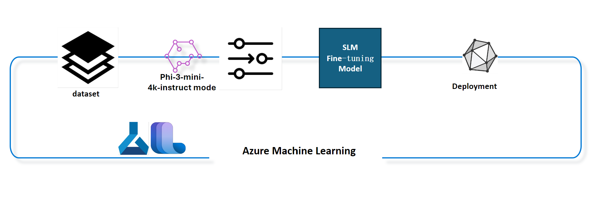

## Azure ML システムレジストリのチャット補完コンポーネントを使用してモデルをファインチューニングする方法

この例では、ultrachat_200k データセットを使用して Phi-3-mini-4k-instruct モデルをファインチューニングし、2人の間の会話を完了します。



この例では、Azure ML SDK と Python を使用してファインチューニングを行い、その後、ファインチューニングされたモデルをオンラインエンドポイントにデプロイしてリアルタイム推論を行う方法を示します。

### トレーニングデータ
ultrachat_200k データセットを使用します。これは UltraChat データセットの厳密にフィルタリングされたバージョンで、最先端の7bチャットモデルである Zephyr-7B-β をトレーニングするために使用されました。

### モデル
Phi-3-mini-4k-instruct モデルを使用して、ユーザーがチャット補完タスクのためにモデルをファインチューニングする方法を示します。このノートブックを特定のモデルカードから開いた場合は、特定のモデル名に置き換えてください。

### タスク
- ファインチューニングするモデルを選択します。
- トレーニングデータを選択して探索します。
- ファインチューニングジョブを構成します。
- ファインチューニングジョブを実行します。
- トレーニングと評価の指標を確認します。
- ファインチューニングされたモデルを登録します。
- ファインチューニングされたモデルをリアルタイム推論のためにデプロイします。
- リソースをクリーンアップします。

## 1. 前提条件の設定
- 依存関係をインストールします。
- AzureML ワークスペースに接続します。SDK認証の設定について詳しく学びます。以下の <WORKSPACE_NAME>、<RESOURCE_GROUP>、<SUBSCRIPTION_ID> を置き換えます。
- azureml システムレジストリに接続します。
- オプションの実験名を設定します。
- コンピューティングを確認または作成します。

単一のGPUノードには複数のGPUカードが含まれる場合があります。たとえば、Standard_NC24rs_v3の1つのノードには4つのNVIDIA V100 GPUが含まれ、Standard_NC12s_v3には2つのNVIDIA V100 GPUが含まれます。この情報についてはドキュメントを参照してください。各ノードのGPUカードの数は、以下のgpus_per_nodeパラメータに設定されています。この値を正しく設定することで、ノード内のすべてのGPUの利用率が確保されます。推奨されるGPUコンピューティングSKUは、ここおよびここで見つけることができます。

### Python ライブラリ

以下のセルを実行して依存関係をインストールします。新しい環境で実行する場合、この手順は省略できません。

```
pip install azure-ai-ml
pip install azure-identity
pip install datasets==2.9.0
pip install mlflow
pip install azureml-mlflow
```
### Azure MLとの対話

このPythonスクリプトは、Azure Machine Learning（Azure ML）サービスと対話するためのものです。以下はその機能の概要です：

azure.ai.ml、azure.identity、およびazure.ai.ml.entitiesパッケージから必要なモジュールをインポートします。また、timeモジュールもインポートします。

DefaultAzureCredential()を使用して認証を試みます。これにより、Azureクラウドで実行されるアプリケーションの開発を迅速に開始するための簡素化された認証エクスペリエンスが提供されます。これが失敗した場合、InteractiveBrowserCredential()にフォールバックします。これにより、インタラクティブなログインプロンプトが提供されます。

次に、from_configメソッドを使用してMLClientインスタンスを作成しようとします。このメソッドは、デフォルトの構成ファイル（config.json）から構成を読み取ります。これが失敗した場合、subscription_id、resource_group_name、およびworkspace_nameを手動で提供してMLClientインスタンスを作成します。

次に、Azure MLレジストリ「azureml」のためのMLClientインスタンスを作成します。このレジストリは、モデル、ファインチューニングパイプライン、および環境が保存される場所です。

experiment_nameを「chat_completion_Phi-3-mini-4k-instruct」に設定します。

現在の時間（エポック以降の秒数、浮動小数点数として）を整数に変換し、次に文字列に変換することで一意のタイムスタンプを生成します。このタイムスタンプは、一意の名前とバージョンを作成するために使用できます。

```
# Import necessary modules from Azure ML and Azure Identity
from azure.ai.ml import MLClient
from azure.identity import (
    DefaultAzureCredential,
    InteractiveBrowserCredential,
)
from azure.ai.ml.entities import AmlCompute
import time  # Import time module

# Try to authenticate using DefaultAzureCredential
try:
    credential = DefaultAzureCredential()
    credential.get_token("https://management.azure.com/.default")
except Exception as ex:  # If DefaultAzureCredential fails, use InteractiveBrowserCredential
    credential = InteractiveBrowserCredential()

# Try to create an MLClient instance using the default config file
try:
    workspace_ml_client = MLClient.from_config(credential=credential)
except:  # If that fails, create an MLClient instance by manually providing the details
    workspace_ml_client = MLClient(
        credential,
        subscription_id="<SUBSCRIPTION_ID>",
        resource_group_name="<RESOURCE_GROUP>",
        workspace_name="<WORKSPACE_NAME>",
    )

# Create another MLClient instance for the Azure ML registry named "azureml"
# This registry is where models, fine-tuning pipelines, and environments are stored
registry_ml_client = MLClient(credential, registry_name="azureml")

# Set the experiment name
experiment_name = "chat_completion_Phi-3-mini-4k-instruct"

# Generate a unique timestamp that can be used for names and versions that need to be unique
timestamp = str(int(time.time()))
```
## 2. ファインチューニングする基礎モデルを選択する
Phi-3-mini-4k-instructは、Phi-2で使用されたデータセットを基に構築された38億パラメータの軽量で最先端のオープンモデルです。このモデルはPhi-3モデルファミリーに属し、Miniバージョンには4Kと128Kの2つのバリアントがあり、これはサポートできるコンテキストの長さ（トークン数）です。使用するためには、特定の目的のためにモデルをファインチューニングする必要があります。これらのモデルは、AzureML Studioのモデルカタログで閲覧でき、チャット補完タスクでフィルタリングできます。この例では、Phi-3-mini-4k-instructモデルを使用します。このノートブックを他のモデルのために開いた場合は、モデル名とバージョンを適宜置き換えてください。

モデルのmodel idプロパティに注意してください。これはファインチューニングジョブの入力として渡されます。これは、AzureML Studioモデルカタログのモデル詳細ページのAsset IDフィールドとしても利用できます。

このPythonスクリプトは、Azure Machine Learning（Azure ML）サービスと対話しています。以下はその機能の概要です：

model_nameを「Phi-3-mini-4k-instruct」に設定します。

registry_ml_clientオブジェクトのmodelsプロパティのgetメソッドを使用して、Azure MLレジストリから指定された名前の最新バージョンのモデルを取得します。getメソッドは、モデルの名前と最新バージョンを取得するためのラベルの2つの引数を使用して呼び出されます。

ファインチューニングに使用するモデルの名前、バージョン、およびIDを示すメッセージをコンソールに出力します。文字列のformatメソッドを使用して、モデルの名前、バージョン、およびIDをメッセージに挿入します。モデルの名前、バージョン、およびIDは、foundation_modelオブジェクトのプロパティとしてアクセスされます。

```
# Set the model name
model_name = "Phi-3-mini-4k-instruct"

# Get the latest version of the model from the Azure ML registry
foundation_model = registry_ml_client.models.get(model_name, label="latest")

# Print the model name, version, and id
# This information is useful for tracking and debugging
print(
    "\n\nUsing model name: {0}, version: {1}, id: {2} for fine tuning".format(
        foundation_model.name, foundation_model.version, foundation_model.id
    )
)
```
## 3. ジョブで使用するコンピューティングを作成する
ファインチューニングジョブはGPUコンピューティングでのみ動作します。コンピューティングのサイズはモデルの大きさによって異なり、ほとんどの場合、ジョブに適したコンピューティングを特定するのは難しいです。このセルでは、ジョブに適したコンピューティングを選択する方法を説明します。

**注意1** 以下にリストされているコンピューティングは、最適化された構成で動作します。構成を変更すると、Cudaメモリ不足エラーが発生する可能性があります。その場合は、コンピューティングをより大きなサイズにアップグレードしてみてください。

**注意2** 以下のcompute_cluster_sizeを選択する際には、コンピューティングがリソースグループ内で利用可能であることを確認してください。特定のコンピューティングが利用できない場合は、コンピューティングリソースへのアクセスをリクエストすることができます。

### ファインチューニングサポートのためのモデルの確認
このPythonスクリプトは、Azure Machine Learning（Azure ML）モデルと対話しています。以下はその機能の概要です：

astモジュールをインポートします。このモジュールは、Pythonの抽象構文木を処理する関数を提供します。

foundation_modelオブジェクト（Azure MLのモデルを表す）にfinetune_compute_allow_listというタグがあるかどうかを確認します。Azure MLのタグは、モデルをフィルタリングおよびソートするために作成および使用できるキーと値のペアです。

finetune_compute_allow_listタグが存在する場合、ast.literal_eval関数を使用してタグの値（文字列）を安全に解析し、Pythonリストに変換します。このリストはcomputes_allow_list変数に割り当てられます。次に、リストからコンピューティングを作成するように指示するメッセージを出力します。

finetune_compute_allow_listタグが存在しない場合、computes_allow_listをNoneに設定し、finetune_compute_allow_listタグがモデルのタグの一部ではないことを示すメッセージを出力します。

要約すると、このスクリプトはモデルのメタデータに特定のタグがあるかどうかを確認し、存在する場合はタグの値をリストに変換し、ユーザーにフィードバックを提供します。

```
# Import the ast module, which provides functions to process trees of the Python abstract syntax grammar
import ast

# Check if the 'finetune_compute_allow_list' tag is present in the model's tags
if "finetune_compute_allow_list" in foundation_model.tags:
    # If the tag is present, use ast.literal_eval to safely parse the tag's value (a string) into a Python list
    computes_allow_list = ast.literal_eval(
        foundation_model.tags["finetune_compute_allow_list"]
    )  # convert string to python list
    # Print a message indicating that a compute should be created from the list
    print(f"Please create a compute from the above list - {computes_allow_list}")
else:
    # If the tag is not present, set computes_allow_list to None
    computes_allow_list = None
    # Print a message indicating that the 'finetune_compute_allow_list' tag is not part of the model's tags
    print("`finetune_compute_allow_list` is not part of model tags")
```
### コンピューティングインスタンスの確認

このPythonスクリプトは、Azure Machine Learning（Azure ML）サービスと対話し、コンピューティングインスタンスに対していくつかのチェックを実行します。以下はその機能の概要です：

compute_clusterに格納されている名前のコンピューティングインスタンスをAzure MLワークスペースから取得しようとします。コンピューティングインスタンスのプロビジョニング状態が「失敗」となっている場合、ValueErrorを発生させます。

computes_allow_listがNoneでないかどうかを確認します。そうでない場合、リスト内のすべてのコンピューティングサイズを小文字に変換し、現在のコンピューティングインスタンスのサイズがリストに含まれているかどうかを確認します。含まれていない場合、ValueErrorを発生させます。

computes_allow_listがNoneの場合、コンピューティングインスタンスのサイズがサポートされていないGPU VMサイズのリストに含まれているかどうかを確認します。含まれている場合、ValueErrorを発生させます。

ワークスペース内のすべての利用可能なコンピューティングサイズのリストを取得します。次に、このリストを反復処理し、各コンピューティングサイズの名前が現在のコンピューティングインスタンスのサイズと一致するかどうかを確認します。一致する場合、そのコンピューティングサイズのGPU数を取得し、gpu_count_foundをTrueに設定します。

gpu_count_foundがTrueの場合、コンピューティングインスタンス内のGPU数を出力します。gpu_count_foundがFalseの場合、ValueErrorを発生させます。

要約すると、このスクリプトはAzure MLワークスペース内のコンピューティングインスタンスに対していくつかのチェックを実行し、そのプロビジョニング状態、許可リストまたは拒否リストに対するサイズ、および持っているGPUの数を確認します。

```
# Print the exception message
print(e)
# Raise a ValueError if the compute size is not available in the workspace
raise ValueError(
    f"WARNING! Compute size {compute_cluster_size} not available in workspace"
)

# Retrieve the compute instance from the Azure ML workspace
compute = workspace_ml_client.compute.get(compute_cluster)
# Check if the provisioning state of the compute instance is "failed"
if compute.provisioning_state.lower() == "failed":
    # Raise a ValueError if the provisioning state is "failed"
    raise ValueError(
        f"Provisioning failed, Compute '{compute_cluster}' is in failed state. "
        f"please try creating a different compute"
    )

# Check if computes_allow_list is not None
if computes_allow_list is not None:
    # Convert all compute sizes in computes_allow_list to lowercase
    computes_allow_list_lower_case = [x.lower() for x in computes_allow_list]
    # Check if the size of the compute instance is in computes_allow_list_lower_case
    if compute.size.lower() not in computes_allow_list_lower_case:
        # Raise a ValueError if the size of the compute instance is not in computes_allow_list_lower_case
        raise ValueError(
            f"VM size {compute.size} is not in the allow-listed computes for finetuning"
        )
else:
    # Define a list of unsupported GPU VM sizes
    unsupported_gpu_vm_list = [
        "standard_nc6",
        "standard_nc12",
        "standard_nc24",
        "standard_nc24r",
    ]
    # Check if the size of the compute instance is in unsupported_gpu_vm_list
    if compute.size.lower() in unsupported_gpu_vm_list:
        # Raise a ValueError if the size of the compute instance is in unsupported_gpu_vm_list
        raise ValueError(
            f"VM size {compute.size} is currently not supported for finetuning"
        )

# Initialize a flag to check if the number of GPUs in the compute instance has been found
gpu_count_found = False
# Retrieve a list of all available compute sizes in the workspace
workspace_compute_sku_list = workspace_ml_client.compute.list_sizes()
available_sku_sizes = []
# Iterate over the list of available compute sizes
for compute_sku in workspace_compute_sku_list:
    available_sku_sizes.append(compute_sku.name)
    # Check if the name of the compute size matches the size of the compute instance
    if compute_sku.name.lower() == compute.size.lower():
        # If it does, retrieve the number of GPUs for that compute size and set gpu_count_found to True
        gpus_per_node = compute_sku.gpus
        gpu_count_found = True
# If gpu_count_found is True, print the number of GPUs in the compute instance
if gpu_count_found:
    print(f"Number of GPU's in compute {compute.size}: {gpus_per_node}")
else:
    # If gpu_count_found is False, raise a ValueError
    raise ValueError(
        f"Number of GPU's in compute {compute.size} not found. Available skus are: {available_sku_sizes}."
        f"This should not happen. Please check the selected compute cluster: {compute_cluster} and try again."
    )
```

## 4. モデルをファインチューニングするためのデータセットを選択する

ultrachat_200kデータセットを使用します。このデータセットには、以下のように適した4つの分割があります：

監督ファインチューニング（sft）。
生成ランキング（gen）。各分割の例の数は次のとおりです：
train_sft	test_sft	train_gen	test_gen
207865	23110	256032	28304
次のいくつかのセルは、ファインチューニングのための基本的なデータ準備を示しています：

いくつかのデータ行を視覚化します
このサンプルを迅速に実行するために、すでにトリミングされた行の5％を含むtrain_sft、test_sftファイルを保存します。これにより、ファインチューニングされたモデルの精度が低くなるため、実際の使用には適していません。
download-dataset.pyは、ultrachat_200kデータセットをダウンロードし、データセットをファインチューニングパイプラインコンポーネントで使用できる形式に変換します。また、データセットが大きいため、ここでは一部のデータのみを使用します。

以下のスクリプトを実行すると、データの5％のみがダウンロードされます。dataset_split_pcパラメータを変更して、必要な割合に増やすことができます。

**注意:** 一部の言語モデルには異なる言語コードがあり、データセット内の列名もそれに応じて変更する必要があります。

データがどのように表示されるかの例を以下に示します
チャット補完データセットは、次のスキーマを使用して各エントリをJSON Lines形式で保存します：

これはJSON（JavaScript Object Notation）ドキュメントであり、一般的なデータ交換形式です。これは実行可能なコードではなく、データを保存および転送する方法です。以下はその構造の概要です：

"prompt": このキーには、AIアシスタントに提示されたタスクや質問を表す文字列値が含まれます。

"messages": このキーにはオブジェクトの配列が含まれます。各オブジェクトは、ユーザーとAIアシスタントの間の会話のメッセージを表します。各メッセージオブジェクトには2つのキーがあります：

"content": このキーには、メッセージの内容を表す文字列値が含まれます。
"role": このキーには、メッセージを送信したエンティティの役割を表す文字列値が含まれます。これは"user"または"assistant"のいずれかです。
"prompt_id": このキーには、プロンプトの一意の識別子を表す文字列値が含まれます。

この特定のJSONドキュメントでは、ユーザーがAIアシスタントに反ユートピアの物語の主人公を作成するように依頼する会話が表されています。アシスタントが応答し、ユーザーがさらに詳細を求めます。アシスタントが詳細を提供することに同意します。全体の会話は特定のプロンプトIDに関連付けられています。

```
{
    // The task or question posed to an AI assistant
    "prompt": "Create a fully-developed protagonist who is challenged to survive within a dystopian society under the rule of a tyrant. ...",

    // An array of objects, each representing a message in a conversation between a user and an AI assistant
    "messages":[
        {
            // The content of the user's message
            "content": "Create a fully-developed protagonist who is challenged to survive within a dystopian society under the rule of a tyrant. ...",
            // The role of the entity that sent the message
            "role": "user"
        },
        {
            // The content of the assistant's message
            "content": "Name: Ava\n\n Ava was just 16 years old when the world as she knew it came crashing down. The government had collapsed, leaving behind a chaotic and lawless society. ...",
            // The role of the entity that sent the message
            "role": "assistant"
        },
        {
            // The content of the user's message
            "content": "Wow, Ava's story is so intense and inspiring! Can you provide me with more details.  ...",
            // The role of the entity that sent the message
            "role": "user"
        },
        {
            // The content of the assistant's message
            "content": "Certainly! ....",
            // The role of the entity that sent the message
            "role": "assistant"
        }
    ],

    // A unique identifier for the prompt
    "prompt_id": "d938b65dfe31f05f80eb8572964c6673eddbd68eff3db6bd234d7f1e3b86c2af"
}
```
### データのダウンロード
このPythonスクリプトは、download-dataset.pyというヘルパースクリプトを使用してデータセットをダウンロードします。以下はその機能の概要です：

osモジュールをインポートします。このモジュールは、オペレーティングシステム依存の機能を使用するためのポータブルな方法を提供します。

os.system関数を使用して、特定のコマンドライン引数を使用してdownload-dataset.pyスクリプトをシェルで実行します。引数は、ダウンロードするデータセット（HuggingFaceH4/ultrachat_200k）、ダウンロード先のディレクトリ（ultrachat_200k_dataset）、およびデータセットを分割する割合（5）を指定します。os.system関数は、実行したコマンドの終了ステータスを返します。このステータスはexit_status変数に格納されます。

exit_statusが0でないかどうかを確認します。Unix系オペレーティングシステムでは、終了ステータスが0の場合、通常はコマンドが成功したことを示し、他の数字はエラーを示します。exit_statusが0でない場合、データセットのダウンロード中にエラーが発生したことを示すメッセージを含む例外を発生させます。

要約すると、このスクリプトはヘルパースクリプトを使用してデータセットをダウンロードするコマンドを実行し、コマンドが失敗した場合に例外を発生させます。

```
# Import the os module, which provides a way of using operating system dependent functionality
import os

# Use the os.system function to run the download-dataset.py script in the shell with specific command-line arguments
# The arguments specify the dataset to download (HuggingFaceH4/ultrachat_200k), the directory to download it to (ultrachat_200k_dataset), and the percentage of the dataset to split (5)
# The os.system function returns the exit status of the command it executed; this status is stored in the exit_status variable
exit_status = os.system(
    "python ./download-dataset.py --dataset HuggingFaceH4/ultrachat_200k --download_dir ultrachat_200k_dataset --dataset_split_pc 5"
)

# Check if exit_status is not 0
# In Unix-like operating systems, an exit status of 0 usually indicates that a command has succeeded, while any other number indicates an error
# If exit_status is not 0, raise an Exception with a message indicating that there was an error downloading the dataset
if exit_status != 0:
    raise Exception("Error downloading dataset")
```
### データをDataFrameに読み込む
このPythonスクリプトは、JSON Linesファイルをpandas DataFrameに読み込み、最初の5行を表示します。以下はその機能の概要です：

pandasライブラリをインポートします。これは強力なデータ操作および分析ライブラリです。

pandasの表示オプションの最大列幅を0に設定します。これにより、DataFrameを表示する際に各列の完全なテキストが切り捨てられずに表示されます。

pd.read_json関数を使用して、ultrachat_200k_datasetディレクトリからtrain_sft.jsonlファイルをDataFrameに読み込みます。lines=True引数は、ファイルがJSON Lines形式であり、各行が個別のJSONオブジェクトであることを示します。

headメソッドを使用してDataFrameの最初の5行を表示します。DataFrameが5行未満の場合、すべての行を表示します。

要約すると、このスクリプトはJSON LinesファイルをDataFrameに読み込み、最初の5行を完全な列テキストで表示します。

```
# Import the pandas library, which is a powerful data manipulation and analysis library
import pandas as pd

# Set the maximum column width for pandas' display options to 0
# This means that the full text of each column will be displayed without truncation when the DataFrame is printed
pd.set_option("display.max_colwidth", 0)

# Use the pd.read_json function to load the train_sft.jsonl file from the ultrachat_200k_dataset directory into a DataFrame
# The lines=True argument indicates that the file is in JSON Lines format, where each line is a separate JSON object
df = pd.read_json("./ultrachat_200k_dataset/train_sft.jsonl", lines=True)

# Use the head method to display the first 5 rows of the DataFrame
# If the DataFrame has less than 5 rows, it will display all of them
df.head()
```
## 5. モデルとデータを入力としてファインチューニングジョブを送信する
チャット補完パイプラインコンポーネントを使用するジョブを作成します。ファインチューニングをサポートするすべてのパラメータについて詳しく学びます。

### ファインチューニングパラメータの定義

ファインチューニングパラメータは、トレーニングパラメータと最適化パラメータの2つのカテゴリに分けることができます。

トレーニングパラメータは、トレーニングの側面を定義します。例えば：

- 使用するオプティマイザ、スケジューラ
- ファインチューニングを最適化するための指標
- トレーニングステップ数とバッチサイズなど
- 最適化パラメータは、GPUメモリを最適化し、計算リソースを効果的に使用するのに役立ちます。

以下はこのカテゴリに属するいくつかのパラメータです。最適化パラメータは各モデルごとに異なり、これらのバリエーションを処理するためにモデルと一緒にパッケージ化されています。

- DeepSpeedとLoRAを有効にする
- 混合精度トレーニングを有効にする
- マルチノードトレーニングを有効にする

**注意:** 監督ファインチューニングは、アライメントの喪失や破滅的な忘却を引き起こす可能性があります。この問題を確認し、ファインチューニング後にアライメントステージを実行することをお勧めします。

### ファインチューニングパラメータ

このPythonスクリプトは、機械学習モデルのファインチューニングパラメータを設定しています。以下はその機能の概要です：

トレーニングエポック数、トレーニングおよび評価のバッチサイズ、学習率、学習率スケジューラタイプなどのデフォルトのトレーニングパラメータを設定します。

LoRAおよびDeepSpeedの適用、DeepSpeedステージなどのデフォルトの最適化パラメータを設定します。

トレーニングおよび最適化パラメータを1つの辞書であるfinetune_parametersに結合します。

foundation_modelにモデル固有のデフォルトパラメータがあるかどうかを確認します。ある場合、警告メッセージを出力し、これらのモデル固有のデフォルト値でfinetune_parameters辞書を更新します。ast.literal_eval関数を使用して、モデル固有のデフォルト値を文字列からPython辞書に変換します。

実行に使用されるファインチューニングパラメータの最終セットを出力します。

要約すると、このスクリプトは機械学習モデルのファインチューニングパラメータを設定および表示し、モデル固有のパラメータでデフォルトパラメータを上書きすることができます。

```
# Set up default training parameters such as the number of training epochs, batch sizes for training and evaluation, learning rate, and learning rate scheduler type
training_parameters = dict(
    num_train_epochs=3,
    per_device_train_batch_size=1,
    per_device_eval_batch_size=1,
    learning_rate=5e-6,
    lr_scheduler_type="cosine",
)

# Set up default optimization parameters such as whether to apply Layer-wise Relevance Propagation (LoRa) and DeepSpeed, and the DeepSpeed stage
optimization_parameters = dict(
    apply_lora="true",
    apply_deepspeed="true",
    deepspeed_stage=2,
)

# Combine the training and optimization parameters into a single dictionary called finetune_parameters
finetune_parameters = {**training_parameters, **optimization_parameters}

# Check if the foundation_model has any model-specific default parameters
# If it does, print a warning message and update the finetune_parameters dictionary with these model-specific defaults
# The ast.literal_eval function is used to convert the model-specific defaults from a string to a Python dictionary
if "model_specific_defaults" in foundation_model.tags:
    print("Warning! Model specific defaults exist. The defaults could be overridden.")
    finetune_parameters.update(
        ast.literal_eval(  # convert string to python dict
            foundation_model.tags["model_specific_defaults"]
        )
    )

# Print the final set of fine-tuning parameters that will be used for the run
print(
    f"The following finetune parameters are going to be set for the run: {finetune_parameters}"
)
```

### トレーニングパイプライン
このPythonスクリプトは、機械学習トレーニングパイプラインの表示名を生成する関数を定義し、その後、この関数を呼び出して表示名を生成および出力します。以下はその機能の概要です：

get_pipeline_display_name関数が定義されています。この関数は、トレーニングパイプラインに関連するさまざまなパラメータに基づいて表示名を生成します。

関数内で、デバイスごとのバッチサイズ、勾配累積ステップ数、ノードごとのGPU数、およびファインチューニングに使用されるノード数を掛け合わせて、合計バッチサイズを計算します。

学習率スケジューラタイプ、DeepSpeedの適用有無、DeepSpeedステージ、LoRAの適用有無、保持するモデルチェックポイントの制限、および最大シーケンス長などのさまざまな他のパラメータを取得します。

これらのすべてのパラメータを含む文字列を構築し、ハイフンで区切ります。DeepSpeedまたはLoRAが適用されている場合、文字列にはそれぞれ「ds」およびDeepSpeedステージ、または「lora」が含まれます。適用されていない場合、それぞれ「nods」または「nolora」が含まれます。

関数はこの文字列を返し、これがトレーニングパイプラインの表示名となります。

関数が定義された後、表示名を生成するために呼び出され、次に表示名が出力されます。

要約すると、このスクリプトはさまざまなパラメータに基づいて機械学習トレーニングパイプラインの表示名を生成し、その表示名を出力します。

```
# Define a function to generate a display name for the training pipeline
def get_pipeline_display_name():
    # Calculate the total batch size by multiplying the per-device batch size, the number of gradient accumulation steps, the number of GPUs per node, and the number of nodes used for fine-tuning
    batch_size = (
        int(finetune_parameters.get("per_device_train_batch_size", 1))
        * int(finetune_parameters.get("gradient_accumulation_steps", 1))
        * int(gpus_per_node)
        * int(finetune_parameters.get("num_nodes_finetune", 1))
    )
    # Retrieve the learning rate scheduler type
    scheduler = finetune_parameters.get("lr_scheduler_type", "linear")
    # Retrieve whether DeepSpeed is applied
    deepspeed = finetune_parameters.get("apply_deepspeed", "false")
    # Retrieve the DeepSpeed stage
    ds_stage = finetune_parameters.get("deepspeed_stage", "2")
    # If DeepSpeed is applied, include "ds" followed by the DeepSpeed stage in the display name; if not, include "nods"
    if deepspeed == "true":
        ds_string = f"ds{ds_stage}"
    else:
        ds_string = "nods"
    # Retrieve whether Layer-wise Relevance Propagation (LoRa) is applied
    lora = finetune_parameters.get("apply_lora", "false")
    # If LoRa is applied, include "lora" in the display name; if not, include "nolora"
    if lora == "true":
        lora_string = "lora"
    else:
        lora_string = "nolora"
    # Retrieve the limit on the number of model checkpoints to keep
    save_limit = finetune_parameters.get("save_total_limit", -1)
    # Retrieve the maximum sequence length
    seq_len = finetune_parameters.get("max_seq_length", -1)
    # Construct the display name by concatenating all these parameters, separated by hyphens
    return (
        model_name
        + "-"
        + "ultrachat"
        + "-"
        + f"bs{batch_size}"
        + "-"
        + f"{scheduler}"
        + "-"
        + ds_string
        + "-"
        + lora_string
        + f"-save_limit{save_limit}"
        + f"-seqlen{seq_len}"
    )

# Call the function to generate the display name
pipeline_display_name = get_pipeline_display_name()
# Print the display name
print(f"Display name used for the run: {pipeline_display_name}")
```
### パイプラインの構成

このPythonスクリプトは、Azure Machine Learning SDKを使用して機械学習パイプラインを定義および構成しています。以下はその機能の概要です：

1. Azure AI ML SDKから必要なモジュールをインポートします。

2. レジストリから「chat_completion_pipeline」という名前のパイプラインコンポーネントを取得します。

3. `@pipeline`デコレータと`create_pipeline`関数を使用してパイプラインジョブを定義します。パイプラインの名前は`pipeline_display_name`に設定されます。

4. `create_pipeline`関数内で、さまざまなパラメータを使用して取得したパイプラインコンポーネントを初期化します。これには、モデルパス、異なるステージのコンピューティングクラスター、トレーニングおよびテストのデータセット分割、ファインチューニングに使用するGPUの数、およびその他のファインチューニングパラメータが含まれます。

5. ファインチューニングジョブの出力をパイプラインジョブの出力にマッピングします。これにより、ファインチューニングされたモデルを簡単に登録できるようになります。モデルの登録は、モデルをオンラインまたはバッチエンドポイントにデプロイするために必要です。

6. `create_pipeline`関数を呼び出してパイプラインのインスタンスを作成します。

7. パイプラインの`force_rerun`設定を`True`に設定します。これにより、以前のジョブのキャッシュ結果が使用されません。

8. パイプラインの`continue_on_step_failure`設定を`False`に設定します。これにより、ステップが失敗した場合にパイプラインが停止します。

要約すると、このスクリプトはAzure Machine Learning SDKを使用してチャット補完タスクのための機械学習パイプラインを定義および構成しています。

```
# Import necessary modules from the Azure AI ML SDK
from azure.ai.ml.dsl import pipeline
from azure.ai.ml import Input

# Fetch the pipeline component named "chat_completion_pipeline" from the registry
pipeline_component_func = registry_ml_client.components.get(
    name="chat_completion_pipeline", label="latest"
)

# Define the pipeline job using the @pipeline decorator and the function create_pipeline
# The name of the pipeline is set to pipeline_display_name
@pipeline(name=pipeline_display_name)
def create_pipeline():
    # Initialize the fetched pipeline component with various parameters
    # These include the model path, compute clusters for different stages, dataset splits for training and testing, the number of GPUs to use for fine-tuning, and other fine-tuning parameters
    chat_completion_pipeline = pipeline_component_func(
        mlflow_model_path=foundation_model.id,
        compute_model_import=compute_cluster,
        compute_preprocess=compute_cluster,
        compute_finetune=compute_cluster,
        compute_model_evaluation=compute_cluster,
        # Map the dataset splits to parameters
        train_file_path=Input(
            type="uri_file", path="./ultrachat_200k_dataset/train_sft.jsonl"
        ),
        test_file_path=Input(
            type="uri_file", path="./ultrachat_200k_dataset/test_sft.jsonl"
        ),
        # Training settings
        number_of_gpu_to_use_finetuning=gpus_per_node,  # Set to the number of GPUs available in the compute
        **finetune_parameters
    )
    return {
        # Map the output of the fine tuning job to the output of pipeline job
        # This is done so that we can easily register the fine tuned model
        # Registering the model is required to deploy the model to an online or batch endpoint
        "trained_model": chat_completion_pipeline.outputs.mlflow_model_folder
    }

# Create an instance of the pipeline by calling the create_pipeline function
pipeline_object = create_pipeline()

# Don't use cached results from previous jobs
pipeline_object.settings.force_rerun = True

# Set continue on step failure to False
# This means that the pipeline will stop if any step fails
pipeline_object.settings.continue_on_step_failure = False
```
### ジョブの送信

このPythonスクリプトは、機械学習パイプラインのジョブをAzure Machine Learningワークスペースにサブミットし、ジョブが完了するのを待っている。このスクリプトが行うことの内訳は次のとおりです:

workspace_ml_clientのjobsオブジェクトのcreate_or_updateメソッドを呼び出し、パイプラインジョブを投入します。実行するパイプラインはpipeline_objectで指定し、ジョブを実行する実験はexperiment_nameで指定します。

その後、workspace_ml_clientのjobsオブジェクトのstreamメソッドを呼び出し、パイプラインジョブの完了を待ちます。待機するジョブは、pipeline_job オブジェクトの name 属性で指定します。

要約すると、このスクリプトは、機械学習パイプラインジョブを Azure Machine Learning ワークスペースにサブミットし、ジョブの完了を待ちます。

```
# Submit the pipeline job to the Azure Machine Learning workspace
# The pipeline to be run is specified by pipeline_object
# The experiment under which the job is run is specified by experiment_name
pipeline_job = workspace_ml_client.jobs.create_or_update(
    pipeline_object, experiment_name=experiment_name
)

# Wait for the pipeline job to complete
# The job to wait for is specified by the name attribute of the pipeline_job object
workspace_ml_client.jobs.stream(pipeline_job.name)
```

## 6. ファインチューニングしたモデルをワークスペースに登録する
ファインチューニングジョブの出力からモデルを登録します。これにより、ファインチューニングモデルとファインチューニングジョブ間の系譜が追跡されます。ファインチューニングジョブはさらに、基礎モデル、データ、トレーニングコードへの系譜を追跡します。

### MLモデルの登録
この Python スクリプトは、Azure Machine Learning パイプラインで学習した機械学習モデルを登録しています。このスクリプトが行うことの内訳は次のとおりです:

Azure AI ML SDKから必要なモジュールをインポートします。

workspace_ml_clientのjobsオブジェクトのgetメソッドを呼び出し、outputs属性にアクセスすることで、パイプラインジョブからtrained_model出力が利用可能かどうかをチェックします。

パイプラインジョブの名前と出力の名前（「trained_model」）を文字列でフォーマットすることで、学習済みモデルへのパスを構築します。

元のモデル名に "-ultrachat-200k" を追加し、スラッシュをハイフンに置き換えることで、ファインチューニングされたモデルの名前を定義します。

モデルへのパス、モデルのタイプ（MLflowモデル）、モデルの名前とバージョン、モデルの説明を含む様々なパラメータを持つModelオブジェクトを作成することで、モデルを登録する準備をします。

ワークスペース_ml_clientのmodelsオブジェクトのcreate_or_updateメソッドをModelオブジェクトを引数として呼び出すことでモデルを登録します。

登録されたモデルを表示します。

要約すると、このスクリプトは、Azure Machine Learning パイプラインでトレーニングされた機械学習モデルを登録しています。

```
# Import necessary modules from the Azure AI ML SDK
from azure.ai.ml.entities import Model
from azure.ai.ml.constants import AssetTypes

# Check if the `trained_model` output is available from the pipeline job
print("pipeline job outputs: ", workspace_ml_client.jobs.get(pipeline_job.name).outputs)

# Construct a path to the trained model by formatting a string with the name of the pipeline job and the name of the output ("trained_model")
model_path_from_job = "azureml://jobs/{0}/outputs/{1}".format(
    pipeline_job.name, "trained_model"
)

# Define a name for the fine-tuned model by appending "-ultrachat-200k" to the original model name and replacing any slashes with hyphens
finetuned_model_name = model_name + "-ultrachat-200k"
finetuned_model_name = finetuned_model_name.replace("/", "-")

print("path to register model: ", model_path_from_job)

# Prepare to register the model by creating a Model object with various parameters
# These include the path to the model, the type of the model (MLflow model), the name and version of the model, and a description of the model
prepare_to_register_model = Model(
    path=model_path_from_job,
    type=AssetTypes.MLFLOW_MODEL,
    name=finetuned_model_name,
    version=timestamp,  # Use timestamp as version to avoid version conflict
    description=model_name + " fine tuned model for ultrachat 200k chat-completion",
)

print("prepare to register model: \n", prepare_to_register_model)

# Register the model by calling the create_or_update method of the models object in the workspace_ml_client with the Model object as the argument
registered_model = workspace_ml_client.models.create_or_update(
    prepare_to_register_model
)

# Print the registered model
print("registered model: \n", registered_model)
```
## 7. ファインチューニングしたモデルをオンラインエンドポイントにデプロイする
オンラインエンドポイントは、モデルを利用する必要のあるアプリケーションと統合するために利用できる耐久性のあるREST APIを提供します。

### エンドポイントの管理
この Python スクリプトは、Azure Machine Learning に登録されたモデル用のマネージドオンラインエンドポイントを作成します。このスクリプトが行うことの内訳は次のとおりです:

Azure AI ML SDKから必要なモジュールをインポートする。

ultrachat-completion-" という文字列にタイムスタンプを付加して、オンラインエンドポイントの一意な名前を定義します。

エンドポイントの名前、エンドポイントの説明、認証モード（"key"）など、さまざまなパラメータを持つ ManagedOnlineEndpoint オブジェクトを作成して、オンラインエンドポイントを作成する準備をします。

ManagedOnlineEndpoint オブジェクトを引数として workspace_ml_client の begin_create_or_update メソッドを呼び出し、オンラインエンドポイントを作成します。その後、wait メソッドを呼び出すことで、作成操作が完了するのを待ちます。

要約すると、このスクリプトは、Azure Machine Learning で、登録されたモデルのマネージドオンラインエンドポイントを作成している。

```
# Import necessary modules from the Azure AI ML SDK
from azure.ai.ml.entities import (
    ManagedOnlineEndpoint,
    ManagedOnlineDeployment,
    ProbeSettings,
    OnlineRequestSettings,
)

# Define a unique name for the online endpoint by appending a timestamp to the string "ultrachat-completion-"
online_endpoint_name = "ultrachat-completion-" + timestamp

# Prepare to create the online endpoint by creating a ManagedOnlineEndpoint object with various parameters
# These include the name of the endpoint, a description of the endpoint, and the authentication mode ("key")
endpoint = ManagedOnlineEndpoint(
    name=online_endpoint_name,
    description="Online endpoint for "
    + registered_model.name
    + ", fine tuned model for ultrachat-200k-chat-completion",
    auth_mode="key",
)

# Create the online endpoint by calling the begin_create_or_update method of the workspace_ml_client with the ManagedOnlineEndpoint object as the argument
# Then wait for the creation operation to complete by calling the wait method
workspace_ml_client.begin_create_or_update(endpoint).wait()
```
デプロイのためにサポートされているSKUのリストはこちらをご覧ください - [マネージドオンラインエンドポイント SKUリスト](https://learn.microsoft.com/azure/machine-learning/reference-managed-online-endpoints-vm-sku-list)

### ML モデルのデプロイ

この Python スクリプトは、Azure Machine Learning のマネージドオンラインエンドポイントに、登録済みの機械学習モデルをデプロイしています。このスクリプトが行うことの内訳は次のとおりです:

Python抽象構文文法のツリーを処理する関数を提供するastモジュールをインポートします。

デプロイのインスタンスタイプを "Standard_NC6s_v3" に設定します。

inference_compute_allow_listタグが基礎モデルに存在するかチェックします。存在する場合、タグの値を文字列からPythonのリストに変換し、inference_computes_allow_listに割り当てます。存在しない場合、inference_computes_allow_listをNoneに設定します。

指定されたインスタンスタイプが許可リストにあるかどうかをチェックします。指定されたインスタンスタイプが許可リストにない場合、ユーザに許可 リストからインスタンスタイプを選択するよう求めるメッセージが表示されます。

デプロイメントの名前、エンドポイントの名前、モデルの ID、インスタンス タイプとカウント、有効性プローブの設定、リクエスト設定など、さまざまなパラメータを持つ ManagedOnlineDeployment オブジェクトを作成して、デプロイメントを作成する準備をします。

ManagedOnlineDeployment オブジェクトを引数として workspace_ml_client の begin_create_or_update メソッドを呼び出して配置を作成します。その後、wait メソッドを呼び出して作成が完了するのを待ちます。

エンドポイントのトラフィックを設定し、トラフィックの 100% を「demo」配置に誘導します。

エンドポイントオブジェクトを引数として workspace_ml_client の begin_create_or_update メソッドを呼び出すことで、エンドポイントを更新します。その後、result メソッドを呼び出して更新が完了するのを待ちます。

要約すると、このスクリプトは、Azure Machine Learning のマネージドオンラインエンドポイントに、登録済みの機械学習モデルをデプロイしている。

```
# Import the ast module, which provides functions to process trees of the Python abstract syntax grammar
import ast

# Set the instance type for the deployment
instance_type = "Standard_NC6s_v3"

# Check if the `inference_compute_allow_list` tag is present in the foundation model
if "inference_compute_allow_list" in foundation_model.tags:
    # If it is, convert the tag value from a string to a Python list and assign it to `inference_computes_allow_list`
    inference_computes_allow_list = ast.literal_eval(
        foundation_model.tags["inference_compute_allow_list"]
    )
    print(f"Please create a compute from the above list - {computes_allow_list}")
else:
    # If it's not, set `inference_computes_allow_list` to `None`
    inference_computes_allow_list = None
    print("`inference_compute_allow_list` is not part of model tags")

# Check if the specified instance type is in the allow list
if (
    inference_computes_allow_list is not None
    and instance_type not in inference_computes_allow_list
):
    print(
        f"`instance_type` is not in the allow listed compute. Please select a value from {inference_computes_allow_list}"
    )

# Prepare to create the deployment by creating a `ManagedOnlineDeployment` object with various parameters
demo_deployment = ManagedOnlineDeployment(
    name="demo",
    endpoint_name=online_endpoint_name,
    model=registered_model.id,
    instance_type=instance_type,
    instance_count=1,
    liveness_probe=ProbeSettings(initial_delay=600),
    request_settings=OnlineRequestSettings(request_timeout_ms=90000),
)

# Create the deployment by calling the `begin_create_or_update` method of the `workspace_ml_client` with the `ManagedOnlineDeployment` object as the argument
# Then wait for the creation operation to complete by calling the `wait` method
workspace_ml_client.online_deployments.begin_create_or_update(demo_deployment).wait()

# Set the traffic of the endpoint to direct 100% of the traffic to the "demo" deployment
endpoint.traffic = {"demo": 100}

# Update the endpoint by calling the `begin_create_or_update` method of the `workspace_ml_client` with the `endpoint` object as the argument
# Then wait for the update operation to complete by calling the `result` method
workspace_ml_client.begin_create_or_update(endpoint).result()
```
## 8. サンプルデータでエンドポイントをテストする
テストデータセットからいくつかのサンプル・データを取得し、推論のためにオンラインエンドポイントに送信します。次に、採点されたラベルと真実のラベルを並べて表示します

### 結果の読み込み
この Python スクリプトは、JSON Lines ファイルを pandas DataFrame に読み込み、ランダムなサンプルを取り、インデックスをリセットしています。このスクリプトが行うことの内訳は以下の通りです:

./ultrachat_200k_dataset/test_gen.jsonl ファイルを pandas DataFrame に読み込みます。ファイルが JSON Lines フォーマットであり、各行が個別の JSON オブジェクトであるため、read_json 関数は lines=True 引数と共に使用されます。

この関数は、DataFrame からランダムに1行のサンプルを取得します。sample 関数は、n=1 引数とともに使用され、選択するランダムな行数を指定します。

DataFrame のインデックスをリセットします。reset_index 関数は、drop=True 引数とともに使用され、元のインデックスを削除し、デフォルトの整数値からなる新しいインデックスに置き換えます。

head 関数の引数に2を指定して、DataFrame の最初の2行を表示します。しかし、サンプリング後の DataFrame には1行しか含まれていないため、このスクリプトではその1行しか表示されません。

要約すると、このスクリプトは、JSON Lines ファイルを pandas DataFrame に読み込み、1行のランダムサンプルを取り、インデックスをリセットし、最初の行を表示しています。

```
# Import pandas library
import pandas as pd

# Read the JSON Lines file './ultrachat_200k_dataset/test_gen.jsonl' into a pandas DataFrame
# The 'lines=True' argument indicates that the file is in JSON Lines format, where each line is a separate JSON object
test_df = pd.read_json("./ultrachat_200k_dataset/test_gen.jsonl", lines=True)

# Take a random sample of 1 row from the DataFrame
# The 'n=1' argument specifies the number of random rows to select
test_df = test_df.sample(n=1)

# Reset the index of the DataFrame
# The 'drop=True' argument indicates that the original index should be dropped and replaced with a new index of default integer values
# The 'inplace=True' argument indicates that the DataFrame should be modified in place (without creating a new object)
test_df.reset_index(drop=True, inplace=True)

# Display the first 2 rows of the DataFrame
# However, since the DataFrame only contains one row after the sampling, this will only display that one row
test_df.head(2)
```
### JSON オブジェクトの作成

この Python スクリプトは、特定のパラメータで JSON オブジェクトを作成し、ファイルに保存します。このスクリプトが行うことの内訳は以下の通りです:

これは、JSON データを扱う関数を提供する json モジュールをインポートします。

機械学習モデルのパラメータを表すキーと値を持つ辞書パラメータを作成する。キーは "temperature"、"top_p"、"do_sample"、"max_new_tokens" で、対応する値はそれぞれ 0.6、0.9、True、200 である。

2つのキーを持つ別の辞書 test_json が作成される: "input_data" と "params"。"input_data" の値は、キー "input_string" と "parameters" を持つ別の辞書です。"input_string" の値は、test_df データフレームからの最初のメッセージを含むリストです。"parameters" の値は先ほど作成したパラメータ辞書です。params" の値は空の辞書です。

sample_score.json という名前のファイルが開かれます

```
# Import the json module, which provides functions to work with JSON data
import json

# Create a dictionary `parameters` with keys and values that represent parameters for a machine learning model
# The keys are "temperature", "top_p", "do_sample", and "max_new_tokens", and their corresponding values are 0.6, 0.9, True, and 200 respectively
parameters = {
    "temperature": 0.6,
    "top_p": 0.9,
    "do_sample": True,
    "max_new_tokens": 200,
}

# Create another dictionary `test_json` with two keys: "input_data" and "params"
# The value of "input_data" is another dictionary with keys "input_string" and "parameters"
# The value of "input_string" is a list containing the first message from the `test_df` DataFrame
# The value of "parameters" is the `parameters` dictionary created earlier
# The value of "params" is an empty dictionary
test_json = {
    "input_data": {
        "input_string": [test_df["messages"][0]],
        "parameters": parameters,
    },
    "params": {},
}

# Open a file named `sample_score.json` in the `./ultrachat_200k_dataset` directory in write mode
with open("./ultrachat_200k_dataset/sample_score.json", "w") as f:
    # Write the `test_json` dictionary to the file in JSON format using the `json.dump` function
    json.dump(test_json, f)
```
### エンドポイントの呼び出し

このPythonスクリプトは、Azure Machine Learning のオンラインエンドポイントを呼び出して、JSON ファイルをスコアリングしています。このスクリプトが行うことの内訳は次のとおりです:

workspace_ml_client オブジェクトの online_endpoints プロパティの invoke メソッドを呼び出します。このメソッドは、オンラインエンドポイントにリクエストを送信し、応答を取得するために使用されます。

エンドポイント名と配置名を endpoint_name と deployment_name 引数で指定します。この場合、エンドポイント名は online_endpoint_name 変数に格納され、デプロイメント名は "demo" です。

request_file引数で、スコアリングするJSONファイルへのパスを指定します。この場合、ファイルは ./ultrachat_200k_dataset/sample_score.json です。

エンドポイントからの応答を response 変数に格納します。

生のレスポンスを出力します。

要約すると、このスクリプトは、Azure Machine Learning のオンライン エンドポイントを呼び出して、JSON ファイルをスコアリングし、レスポンスを表示しています。

```
# Invoke the online endpoint in Azure Machine Learning to score the `sample_score.json` file
# The `invoke` method of the `online_endpoints` property of the `workspace_ml_client` object is used to send a request to an online endpoint and get a response
# The `endpoint_name` argument specifies the name of the endpoint, which is stored in the `online_endpoint_name` variable
# The `deployment_name` argument specifies the name of the deployment, which is "demo"
# The `request_file` argument specifies the path to the JSON file to be scored, which is `./ultrachat_200k_dataset/sample_score.json`
response = workspace_ml_client.online_endpoints.invoke(
    endpoint_name=online_endpoint_name,
    deployment_name="demo",
    request_file="./ultrachat_200k_dataset/sample_score.json",
)

# Print the raw response from the endpoint
print("raw response: \n", response, "\n")
```
## 9. オンラインエンドポイントの削除
オンラインエンドポイントを削除しないと、エンドポイントによって使用されたコンピュートに対して課金メーターが実行されたままになります。この Python コードの行は、Azure Machine Learning のオンラインエンドポイントを削除しています。以下は、このコードが行うことの内訳です:

workspace_ml_client オブジェクトの online_endpoints プロパティの begin_delete メソッドを呼び出します。このメソッドはオンラインエンドポイントの削除を開始するために使用します。

name 引数で削除するエンドポイント名を指定します。この場合、エンドポイント名は online_endpoint_name 変数に格納されます。

wait メソッドを呼び出し、削除操作が完了するのを待ちます。これはブロッキング操作で、削除が完了するまでスクリプトが続行できなくなることを意味します。

要約すると、このコードの行は、Azure Machine Learning のオンライン エンドポイントの削除を開始し、操作が完了するのを待っています。

```
# Delete the online endpoint in Azure Machine Learning
# The `begin_delete` method of the `online_endpoints` property of the `workspace_ml_client` object is used to start the deletion of an online endpoint
# The `name` argument specifies the name of the endpoint to be deleted, which is stored in the `online_endpoint_name` variable
# The `wait` method is called to wait for the deletion operation to complete. This is a blocking operation, meaning that it will prevent the script from continuing until the deletion is finished
workspace_ml_client.online_endpoints.begin_delete(name=online_endpoint_name).wait()
```
