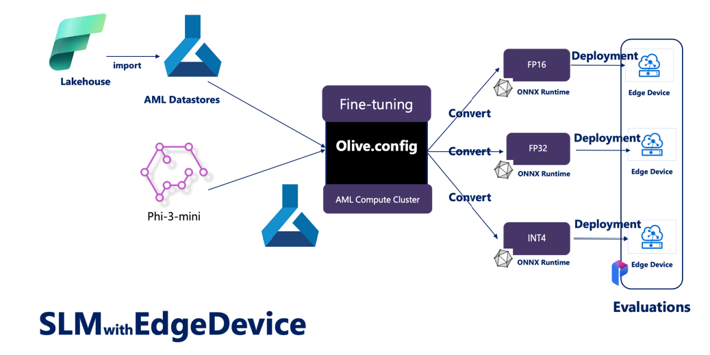

# **Microsoft Oliveを使用してPhi-3を微調整する**

[Olive](https://github.com/microsoft/OLive?WT.mc_id=aiml-138114-kinfeylo)は、モデル圧縮、最適化、およびコンパイルにおいて業界をリードする技術を統合した、使いやすいハードウェア対応のモデル最適化ツールです。

これは、機械学習モデルの最適化プロセスを簡素化し、特定のハードウェアアーキテクチャを最大限に活用できるように設計されています。

クラウドベースのアプリケーションやエッジデバイスで作業しているかどうかにかかわらず、Oliveを使用すると、モデルを簡単かつ効果的に最適化できます。

## 主な機能:
- Oliveは、必要なハードウェアターゲットに対する最適化技術を集約し、自動化します。
- 単一の最適化技術がすべてのシナリオに適合するわけではないため、Oliveは業界の専門家が最適化の革新をプラグインできるようにすることで拡張性を提供します。

## エンジニアリングの労力を削減:
- 開発者は、トレーニング済みモデルをデプロイするために、複数のハードウェアベンダー固有のツールチェーンを学び、使用する必要があることがよくあります。
- Oliveは、必要なハードウェアに対する最適化技術を自動化することで、この体験を簡素化します。

## 即用型のエンドツーエンド最適化ソリューション:

統合された技術を組み合わせて調整することで、Oliveはエンドツーエンドの最適化のための統一されたソリューションを提供します。
これは、モデルの最適化中に精度や遅延などの制約を考慮に入れます。

## Microsoft Oliveを使用して微調整する

Microsoft Oliveは、微調整と参照の分野で非常に使いやすいオープンソースのモデル最適化ツールです。簡単な設定で、オープンソースの小型言語モデルと関連するランタイム環境（AzureML / ローカルGPU、CPU、DirectML）を組み合わせて使用することで、自動最適化を通じてモデルの微調整や参照を完了し、最適なモデルを見つけてクラウドやエッジデバイスにデプロイできます。企業がオンプレミスおよびクラウドで独自の業界垂直モデルを構築できるようにします。


## Microsoft Oliveを使用してPhi-3を微調整する



## Phi-3 Oliveのサンプルコードと例
この例では、Oliveを使用して以下を行います：

- LoRAアダプタを微調整して、フレーズをSad、Joy、Fear、Surpriseに分類します。
- アダプタの重みをベースモデルにマージします。
- モデルを最適化し、int4に量子化します。

[サンプルコード](../../../../code/04.Finetuning/olive-ort-example/README.md)


### Microsoft Oliveのセットアップ

Microsoft Oliveのインストールは非常に簡単で、CPU、GPU、DirectML、およびAzure MLにもインストールできます。

```bash
pip install olive-ai
```

ONNXモデルをCPUで実行する場合は、次のコマンドを使用できます。

```bash
pip install olive-ai[cpu]
```

ONNXモデルをGPUで実行する場合は、次のコマンドを使用できます。

```python
pip install olive-ai[gpu]
```

Azure MLを使用する場合は、次のコマンドを使用します。

```python
pip install git+https://github.com/microsoft/Olive#egg=olive-ai[azureml]
```

**注意**
OS要件：Ubuntu 20.04 / 22.04 


### **Microsoft OliveのConfig.json**

インストール後、データ、計算、トレーニング、デプロイ、およびモデル生成を含む、さまざまなモデル固有の設定をConfigファイルを通じて構成できます。

**1. データ**

Microsoft Oliveでは、ローカルデータとクラウドデータのトレーニングをサポートしており、設定で構成できます。

*ローカルデータ設定*

トレーニング用に微調整する必要があるデータセットを簡単に設定できます。通常はjson形式で、データテンプレートを使用して適応させます。これは、モデルの要件に基づいて調整する必要があります（例：Microsoft Phi-3-miniが必要とする形式に適応させる場合。他のモデルがある場合は、他のモデルが必要とする微調整形式を参照してください）。

```json

    "data_configs": [
        {
            "name": "dataset_default_train",
            "type": "HuggingfaceContainer",
            "load_dataset_config": {
                "params": {
                    "data_name": "json", 
                    "data_files":"dataset/dataset-classification.json",
                    "split": "train"
                }
            },
            "pre_process_data_config": {
                "params": {
                    "dataset_type": "corpus",
                    "text_cols": [
                            "phrase",
                            "tone"
                    ],
                    "text_template": "### Text: {phrase}\n### The tone is:\n{tone}",
                    "corpus_strategy": "join",
                    "source_max_len": 2048,
                    "pad_to_max_len": false,
                    "use_attention_mask": false
                }
            }
        }
    ],
```

**クラウドデータソース設定**

Azure AI Studio/Azure Machine Learning Serviceのデータストアをリンクしてクラウド内のデータをリンクすることで、Microsoft FabricおよびAzure Dataを通じてさまざまなデータソースをAzure AI Studio/Azure Machine Learning Serviceに導入し、微調整データのサポートとして使用できます。

```json

    "data_configs": [
        {
            "name": "dataset_default_train",
            "type": "HuggingfaceContainer",
            "load_dataset_config": {
                "params": {
                    "data_name": "json", 
                    "data_files": {
                        "type": "azureml_datastore",
                        "config": {
                            "azureml_client": {
                                "subscription_id": "Your Azure Subscrition ID",
                                "resource_group": "Your Azure Resource Group",
                                "workspace_name": "Your Azure ML Workspaces name"
                            },
                            "datastore_name": "workspaceblobstore",
                            "relative_path": "Your train_data.json Azure ML Location"
                        }
                    },
                    "split": "train"
                }
            },
            "pre_process_data_config": {
                "params": {
                    "dataset_type": "corpus",
                    "text_cols": [
                            "Question",
                            "Best Answer"
                    ],
                    "text_template": "<|user|>\n{Question}<|end|>\n<|assistant|>\n{Best Answer}\n<|end|>",
                    "corpus_strategy": "join",
                    "source_max_len": 2048,
                    "pad_to_max_len": false,
                    "use_attention_mask": false
                }
            }
        }
    ],
    
```


**2. 計算設定**

ローカルで実行する場合は、ローカルデータリソースを直接使用できます。Azure AI Studio / Azure Machine Learning Serviceのリソースを使用する場合は、関連するAzureパラメータ、計算能力名などを構成する必要があります。

```json

    "systems": {
        "aml": {
            "type": "AzureML",
            "config": {
                "accelerators": ["gpu"],
                "hf_token": true,
                "aml_compute": "Your Azure AI Studio / Azure Machine Learning Service Compute Name",
                "aml_docker_config": {
                    "base_image": "Your Azure AI Studio / Azure Machine Learning Service docker",
                    "conda_file_path": "conda.yaml"
                }
            }
        },
        "azure_arc": {
            "type": "AzureML",
            "config": {
                "accelerators": ["gpu"],
                "aml_compute": "Your Azure AI Studio / Azure Machine Learning Service Compute Name",
                "aml_docker_config": {
                    "base_image": "Your Azure AI Studio / Azure Machine Learning Service docker",
                    "conda_file_path": "conda.yaml"
                }
            }
        }
    },
```

***注意***

Azure AI Studio/Azure Machine Learning Service上でコンテナを通じて実行されるため、必要な環境を構成する必要があります。これはconda.yaml環境で構成されます。

```yaml

name: project_environment
channels:
  - defaults
dependencies:
  - python=3.8.13
  - pip=22.3.1
  - pip:
      - einops
      - accelerate
      - azure-keyvault-secrets
      - azure-identity
      - bitsandbytes
      - datasets
      - huggingface_hub
      - peft
      - scipy
      - sentencepiece
      - torch>=2.2.0
      - transformers
      - git+https://github.com/microsoft/Olive@jiapli/mlflow_loading_fix#egg=olive-ai[gpu]
      - --extra-index-url https://aiinfra.pkgs.visualstudio.com/PublicPackages/_packaging/ORT-Nightly/pypi/simple/ 
      - ort-nightly-gpu==1.18.0.dev20240307004
      - --extra-index-url https://aiinfra.pkgs.visualstudio.com/PublicPackages/_packaging/onnxruntime-genai/pypi/simple/
      - onnxruntime-genai-cuda

    

```


**3. SLMの選択**

モデルをHugging Faceから直接使用することも、Azure AI Studio / Azure Machine LearningのModel Catalogと組み合わせて使用することもできます。以下のコード例では、Microsoft Phi-3-miniを例として使用します。

ローカルにモデルがある場合は、次の方法を使用できます。

```json

    "input_model":{
        "type": "PyTorchModel",
        "config": {
            "hf_config": {
                "model_name": "model-cache/microsoft/phi-3-mini",
                "task": "text-generation",
                "model_loading_args": {
                    "trust_remote_code": true
                }
            }
        }
    },
```

Azure AI Studio / Azure Machine Learning Serviceのモデルを使用する場合は、次の方法を使用できます。

```json

    "input_model":{
        "type": "PyTorchModel",
        "config": {
            "model_path": {
                "type": "azureml_registry_model",
                "config": {
                    "name": "microsoft/Phi-3-mini-4k-instruct",
                    "registry_name": "azureml-msr",
                    "version": "11"
                }
            },
             "model_file_format": "PyTorch.MLflow",
             "hf_config": {
                "model_name": "microsoft/Phi-3-mini-4k-instruct",
                "task": "text-generation",
                "from_pretrained_args": {
                    "trust_remote_code": true
                }
            }
        }
    },
```

**注意:**
Azure AI Studio / Azure Machine Learning Serviceと統合する必要があるため、モデルを設定する際にはバージョン番号と関連する名前を参照してください。

Azure上のすべてのモデルはPyTorch.MLflowに設定する必要があります。

Hugging Faceアカウントを持ち、Azure AI Studio / Azure Machine LearningのKey値にキーをバインドする必要があります。

**4. アルゴリズム**

Microsoft Oliveは、LoraとQLoraの微調整アルゴリズムを非常によくカプセル化しています。設定する必要があるのは関連するパラメータだけです。ここではQLoraを例にとります。

```json
        "lora": {
            "type": "LoRA",
            "config": {
                "target_modules": [
                    "o_proj",
                    "qkv_proj"
                ],
                "double_quant": true,
                "lora_r": 64,
                "lora_alpha": 64,
                "lora_dropout": 0.1,
                "train_data_config": "dataset_default_train",
                "eval_dataset_size": 0.3,
                "training_args": {
                    "seed": 0,
                    "data_seed": 42,
                    "per_device_train_batch_size": 1,
                    "per_device_eval_batch_size": 1,
                    "gradient_accumulation_steps": 4,
                    "gradient_checkpointing": false,
                    "learning_rate": 0.0001,
                    "num_train_epochs": 3,
                    "max_steps": 10,
                    "logging_steps": 10,
                    "evaluation_strategy": "steps",
                    "eval_steps": 187,
                    "group_by_length": true,
                    "adam_beta2": 0.999,
                    "max_grad_norm": 0.3
                }
            }
        },
```


量子化変換を行いたい場合、Microsoft Oliveのメインブランチはonnxruntime-genaiメソッドをサポートしています。必要に応じて設定できます：

1. アダプタの重みをベースモデルにマージします。
2. ModelBuilderを使用して、必要な精度でモデルをonnxモデルに変換します。

たとえば、INT4に量子化します。

```json

        "merge_adapter_weights": {
            "type": "MergeAdapterWeights"
        },
        "builder": {
            "type": "ModelBuilder",
            "config": {
                "precision": "int4"
            }
        }
```

**注意**
- QLoRAを使用する場合、現在のところONNXRuntime-genaiの量子化変換はサポートされていません。

- ここで指摘しておくべきことは、上記の手順を自分のニーズに合わせて設定できることです。上記の手順を完全に構成する必要はありません。ニーズに応じて、微調整を行わずにアルゴリズムの手順を直接使用できます。最後に、関連するエンジンを構成する必要があります。

```json

    "engine": {
        "log_severity_level": 0,
        "host": "aml",
        "target": "aml",
        "search_strategy": false,
        "execution_providers": ["CUDAExecutionProvider"],
        "cache_dir": "../model-cache/models/phi3-finetuned/cache",
        "output_dir" : "../model-cache/models/phi3-finetuned"
    }
```


**5. 微調整の完了**

コマンドラインで、olive-config.jsonのディレクトリで次のコマンドを実行します。

```bash
olive run --config olive-config.json
```
