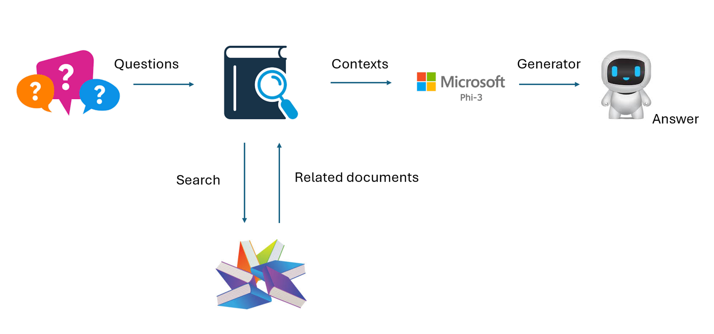

## 微調整 vs RAG

## 検索強化生成

RAGはデータ検索+テキスト生成です。企業の構造化データと非構造化データはベクトルデータベースに保存されます。関連するコンテンツを検索する際に、関連する要約とコンテンツを見つけてコンテキストを形成し、LLM/SLMのテキスト補完機能と組み合わせてコンテンツを生成します。

## RAGプロセス

## 微調整
微調整は特定のモデルの改良に基づいています。モデルアルゴリズムから始める必要はありませんが、データを継続的に蓄積する必要があります。業界アプリケーションでより正確な用語と言語表現を求める場合、微調整がより良い選択です。しかし、データが頻繁に変わる場合、微調整は複雑になる可能性があります。

## 選択方法
回答に外部データの導入が必要な場合、RAGが最適な選択です。

安定して正確な業界知識を出力する必要がある場合、微調整が良い選択です。RAGは関連するコンテンツを優先的に引き出しますが、専門的なニュアンスを常に把握できるわけではありません。

微調整には高品質なデータセットが必要であり、少量のデータでは大きな違いはありません。RAGはより柔軟です。
微調整はブラックボックスであり、内部メカニズムを理解するのが難しいです。しかし、RAGはデータの出所を見つけやすく、幻覚やコンテンツエラーを効果的に調整し、より良い透明性を提供します。
