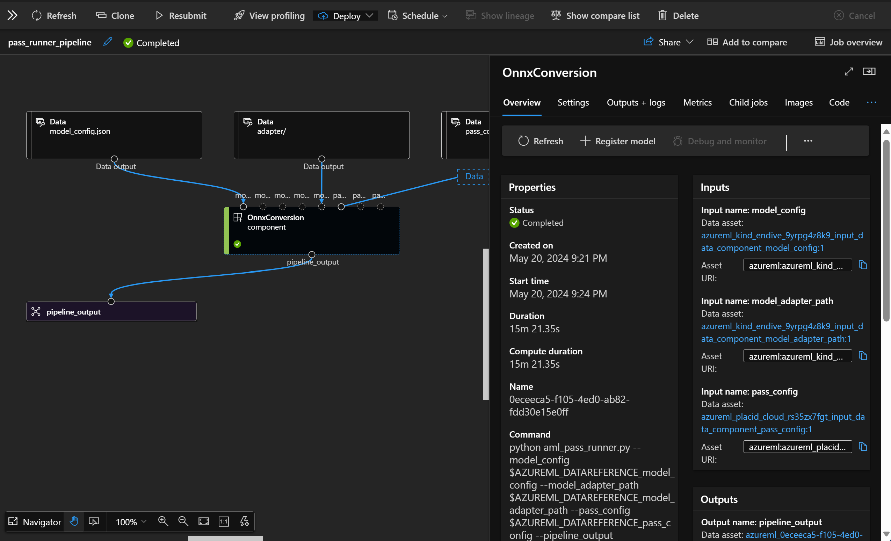

# **Azure Machine Learning サービスの紹介**

[Azure Machine Learning](https://ml.azure.com?WT.mc_id=aiml-138114-kinfeylo) は、機械学習（ML）プロジェクトのライフサイクルを加速および管理するためのクラウドサービスです。

ML の専門家、データ サイエンティスト、およびエンジニアは、日常のワークフローで次のことに使用できます。

- モデルをトレーニングしてデプロイします。
機械学習オペレーション (MLOps) を管理します。
- Azure Machine Learning でモデルを作成するか、PyTorch、TensorFlow、scikit-learn などのオープンソース プラットフォームから作成されたモデルを使用できます。
- MLOps ツールを使用すると、モデルの監視、再トレーニング、および再デプロイが可能になります。

## Azure Machine Learning は誰のためのものですか?

**データ サイエンティストと ML エンジニア**

彼らは、日常のワークフローを加速および自動化するためのツールを使用できます。
Azure ML は、公平性、説明可能性、追跡可能性、および監査可能性の機能を提供します。
アプリケーション開発者:
彼らは、モデルをアプリケーションやサービスにシームレスに統合できます。

**プラットフォーム開発者**

耐久性のある Azure Resource Manager API に支えられた強力なツールセットにアクセスできます。
これらのツールを使用すると、高度な ML ツールを構築できます。

**企業**

Microsoft Azure クラウドで作業する企業は、なじみのあるセキュリティとロールベースのアクセス制御の恩恵を受けることができます。
プロジェクトを設定して、保護されたデータおよび特定の操作へのアクセスを制御します。

## チーム全員の生産性
ML プロジェクトには、構築および維持するためにさまざまなスキルを持つチームが必要な場合がよくあります。

Azure ML は、次のことを可能にするツールを提供します。
- 共有ノートブック、コンピューティング リソース、サーバーレス コンピューティング、データ、および環境を介してチームとコラボレーションします。
- 系統および監査コンプライアンス要件を満たすために、公平性、説明可能性、追跡可能性、および監査可能性を備えたモデルを開発します。
- ML モデルを迅速かつ簡単に大規模にデプロイし、MLOps を使用して効率的に管理およびガバナンスします。
- 組み込みのガバナンス、セキュリティ、およびコンプライアンスを備えた任意の場所で機械学習ワークロードを実行します。

## すべてのチーム メンバーに対応するクロス互換プラットフォーム ツール

ML チームの誰もが、仕事を成し遂げるために好みのツールを使用できます。
迅速な実験、ハイパーパラメーターの調整、パイプラインの構築、推論の管理など、次のような使い慣れたインターフェイスを使用できます。
- Azure Machine Learning Studio
- Python SDK (v2)
- Azure CLI (v2)
- Azure Resource Manager REST API

モデルを洗練し、開発サイクル全体を通じてコラボレーションする際に、Azure Machine Learning スタジオ UI 内でアセット、リソース、およびメトリックを共有および検索できます。

## **Azure ML の LLM/SLM**

Azure ML には、LLMOps と SLMOps を組み合わせて、企業全体の生成 AI テクノロジ プラットフォームを作成するための多くの LLM/SLM 関数が追加されています。

### **モデル カタログ**

企業ユーザーは、Model Catalog を使用して、さまざまなビジネス シナリオに応じてさまざまなモデルをデプロイし、Model as Service としてサービスを提供して、企業の開発者やユーザーがアクセスできるようにします。

Azure Machine Learning スタジオのモデル カタログは、生成 AI アプリケーションの構築を可能にするさまざまなモデルを発見して使用するためのハブです。モデル カタログには、Azure OpenAI サービス、Mistral、Meta、Cohere、Nvidia、Hugging Face などのモデル プロバイダーや、Microsoft によってトレーニングされたモデルなど、数百のモデルが含まれています。Microsoft 以外のプロバイダーのモデルは、Microsoft の製品条項で定義されている Non-Microsoft Products に該当し、モデルに付随する条項の対象となります。

### **ジョブ パイプライン**

機械学習パイプラインのコアは、完全な機械学習タスクを複数のステップに分割することです。各ステップは管理可能なコンポーネントであり、個別に開発、最適化、構成、および自動化できます。ステップは明確に定義されたインターフェイスを介して接続されます。Azure Machine Learning パイプライン サービスは、パイプライン ステップ間のすべての依存関係を自動的に調整します。

SLM/LLM のファインチューニングでは、パイプラインを通じてデータ、トレーニング、および生成プロセスを管理できます。

### **プロンプト フロー**

Azure Machine Learning プロンプト フローを使用する利点
Azure Machine Learning プロンプト フローは、ユーザーがアイデアから実験、最終的には LLM ベースの本番対応アプリケーションに移行するのに役立つさまざまな利点を提供します。

**プロンプト エンジニアリングの俊敏性**

インタラクティブな作成エクスペリエンス: Azure Machine Learning プロンプト フローは、フローの構造の視覚的表現を提供し、ユーザーがプロジェクトを簡単に理解してナビゲートできるようにします。また、フローの開発とデバッグを効率的に行うためのノートブックのようなコーディング エクスペリエンスも提供します。
プロンプト調整のバリアント: ユーザーは複数のプロンプト バリアントを作成して比較できるため、反復的な改良プロセスが促進されます。

評価: 組み込みの評価フローにより、ユーザーはプロンプトとフローの品質と有効性を評価できます。

包括的なリソース: Azure Machine Learning プロンプト フローには、開発の出発点となる組み込みツール、サンプル、およびテンプレートのライブラリが含まれており、創造性を刺激し、プロセスを加速します。

**LLM ベースのアプリケーションの企業対応準備**

コラボレーション: Azure Machine Learning プロンプト フローはチーム コラボレーションをサポートし、複数のユーザーがプロンプト エンジニアリング プロジェクトで協力し、知識を共有し、バージョン管理を維持できるようにします。

オールインワン プラットフォーム: Azure Machine Learning プロンプト フローは、開発、評価からデプロイおよび監視に至るまで、プロンプト エンジニアリング プロセス全体を合理化します。ユーザーは、フローを Azure Machine Learning エンドポイントとして簡単にデプロイし、そのパフォーマンスをリアルタイムで監視して、最適な運用と継続的な改善を確保できます。

Azure Machine Learning エンタープライズ対応ソリューション: プロンプト フローは、Azure Machine Learning の堅牢なエンタープライズ対応ソリューションを活用し、フローの開発、実験、およびデプロイのための安全でスケーラブルで信頼性の高い基盤を提供します。

Azure Machine Learning プロンプト フローを使用すると、ユーザーはプロンプト エンジニアリングの俊敏性を発揮し、効果的にコラボレーションし、LLM ベースのアプリケーションの開発とデプロイの成功に向けてエンタープライズ グレードのソリューションを活用できます。

Azure ML のコンピューティング能力、データ、およびさまざまなコンポーネントを組み合わせることで、企業の開発者は独自の AI アプリケーションを簡単に構築できます。
