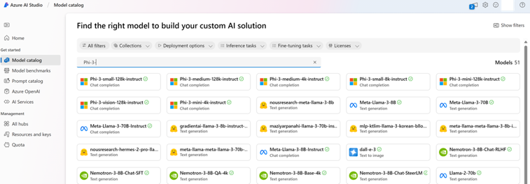
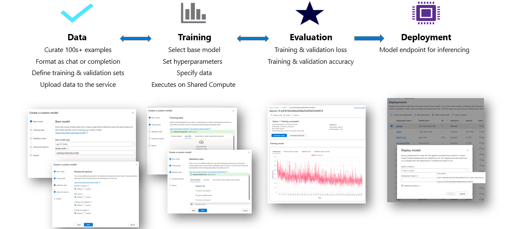
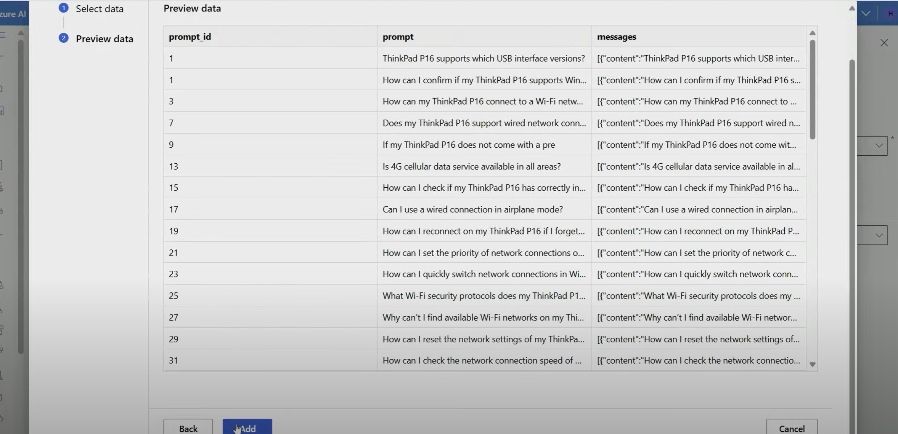

# **微調 Phi-3 與 Azure AI Studio**

讓我們探索如何使用 Azure AI Studio 微調 Microsoft 的 Phi-3 Mini 語言模型。微調允許您將 Phi-3 Mini 調整到特定任務，使其更強大且具上下文感知能力。

## 考慮事項:

- **功能:** 哪些模型可以微調？基礎模型可以微調到什麼程度？
- **成本:** 微調的定價模式是什麼？
- **可定制性:** 我能在多大程度上修改基礎模型 – 以及以何種方式？
- **便利性:** 微調實際上是如何進行的 – 我需要編寫自訂程式碼嗎？我需要自帶運算資源嗎？
- **安全性:** 已知微調模型存在安全風險 – 是否有任何防護措施來防止意外傷害？

以下是開始的步驟:

## 使用 Azure AI Studio 微調 Phi-3

**設定 Your Environment**

Azure AI Studio: 如果你還沒有，請登入 [Azure AI Studio](https://ai.azure.com?WT.mc_id=aiml-138114-kinfeylo)。

**建立一個新專案**

點擊 "New" 並建立一個新專案。根據您的使用案例選擇適當的設定。

### 資料準備

**資料集選擇**

收集或建立與您的任務一致的數據集。這可以是聊天指令、問答對或任何相關的文本數據。

選擇 DataSet

選擇你的資料集

預覽 DataSet

**進階用法**

**資料預處理**

清理並預處理您的資料。移除雜訊、處理缺失值，並將文本標記化。

## 模型選擇

**Phi-3 Mini**

你將微調預訓練的 Phi-3 Mini 模型。確保你能夠訪問模型檢查點（例如，"microsoft/Phi-3-mini-4k-instruct"）。

**微調設定**

超參數: 定義超參數，例如學習率、批次大小和訓練週期數。

**損失函式**

為您的任務選擇適當的損失函式（例如，交叉熵）。

**優化器**

選擇一個優化器（例如，Adam）在訓練期間進行梯度更新。

**微調過程**

- 載入預訓練模型: 載入 Phi-3 Mini 檢查點。
- 添加自定義層: 添加任務特定層（例如，用於聊天指令的分類頭）。

**訓練模型**
使用您準備的數據集微調模型。監控訓練進度並根據需要調整超參數。

**評估和驗證**

驗證集: 將你的資料分成訓練和驗證集。

**評估效能**

使用準確率、F1-score 或困惑度等指標來評估模型表現。

## 儲存微調模型

**檢查點**
保存微調後的模型檢查點以供未來使用。

## 部署

- 部署為 Web 服務: 將你微調過的模型部署為 Azure AI Studio 中的 Web 服務。
- 測試端點: 向已部署的端點發送測試查詢以驗證其功能。

## 迭代和改進

迭代: 如果效能不令人滿意，請透過調整超參數、增加更多數據或微調額外的時期來進行迭代。

## 監控和改進

持續監控模型的行為並根據需要進行改進。

## 自訂和擴展

自訂任務: Phi-3 Mini 可以針對各種任務進行微調，不僅限於聊天指示。探索其他使用案例吧!
實驗: 嘗試不同的架構、層組合和技術來提升性能。

***注意***: 微調是一個反覆的過程。實驗、學習並調整你的模型，以達到特定任務的最佳結果!

