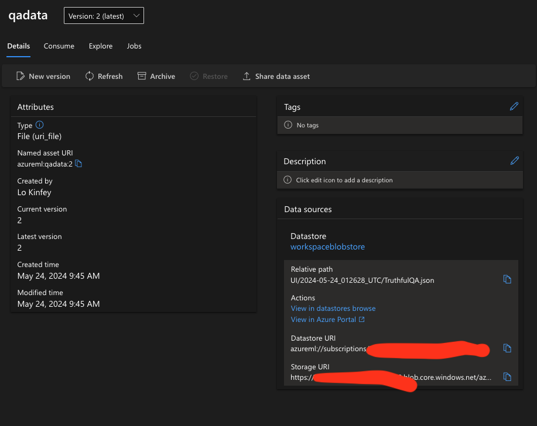

# **Prepare your industry data**

We hope to inject Phi-3-mini into [TruthfulQA's data](https://github.com/sylinrl/TruthfulQA/blob/main/TruthfulQA.csv) . The first step is to import TruthfulQA's data. 


### **1. Load  data into csv and save it to json**


```python

import csv
import json

csvfile = open('./datasets/TruthfulQA.csv', 'r')
jsonfile = open('./output/TruthfulQA.json', 'w')

fieldnames = ("Type","Category","Question","Best Answer","Correct Answers","Incorrect Answers","Source")

reader = csv.DictReader(csvfile, fieldnames)

for row in reader:
    json.dump(row, jsonfile)
    jsonfile.write('\n')

i = 1
data = []
with open('./output/TruthfulQA.json', 'r') as file:
    for line in file:
        print(line)
        data.append(json.loads(line))
        print(str(i))
        i+=1


```

### **2. Upload data to Azure ML datastores**




### **Congratulations!**  

Your data has been successfully loaded.  Next, you need to configure your data and related algorithms through Microsoft Olive [E2E_LoRA&QLoRA_Config_With_Olive.md](./E2E_LoRA&QLoRA_Config_With_Olive.md)

   
