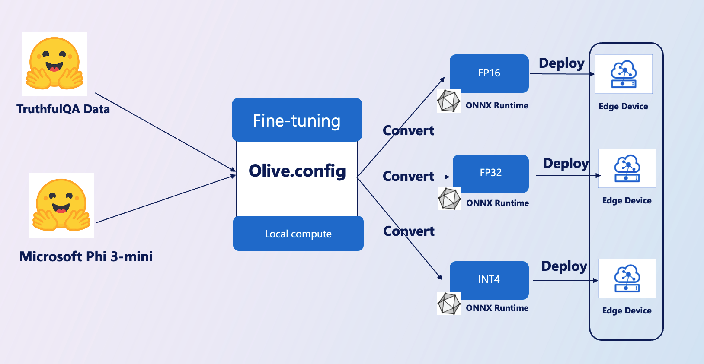

# **Introduce E2E Sample**

This sample is import [TruthfulQA’s data](https://github.com/sylinrl/TruthfulQA/blob/main/TruthfulQA.csv) to fine-tuning Phi-3-mini model. This is Architecture

## **Introduce**

We hope to use [TruthfulQA’s data](https://github.com/sylinrl/TruthfulQA/blob/main/TruthfulQA.csv) set to make Phi-3-mini answer our questions more professionally. This is your first E2E project using Phi-3-mini

### **Requirements**

1. Python 3.10+
2. CUDA 12.1
3. Linux / WSL
4. Azure ML
5. Azure Compute A100

### **Knowledge**

1. [Learn About Phi-3](../01.Introduce/Phi3Family.md)
2. [Learn about How to use Microsoft Olive to fine tuning](../04.Fine-tuning/FineTuning_MicrosotOlive.md)
3. [Learn abount ONNX Runtime for generative AI](https://github.com/microsoft/onnxruntime-genai)
   

