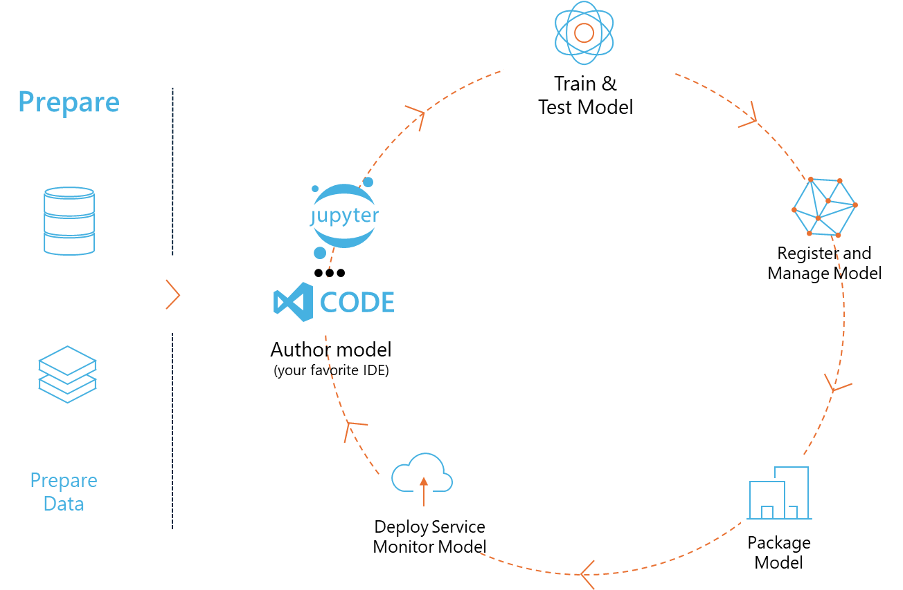
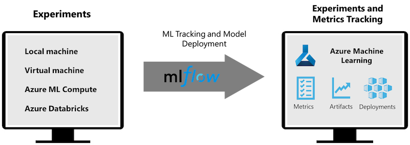

MLFlow is an open-source platform designed to manage the end-to-end machine learning lifecycle. 

It includes capabilities for tracking experiments, packaging code into reproducible runs, and sharing and deploying models. MLFlow is integrated into Databricks and supports a variety of ML libraries, making it library-agnostic. It can be used with any machine learning library and in any programming language, as it provides a REST API and CLI for convenience.

Key features of MLFlow include:

**Experiment Tracking:** Record and compare parameters and results.
**Model Management:** Deploy models to various serving and inference platforms.
**Model Registry:** Collaboratively manage the lifecycle of MLflow Models, including versioning and annotations.
**Projects:** Package ML code for sharing or production use.
MLFlow also supports the MLOps loop, which includes preparing data, registering and managing models, packaging models for execution, deploying services, and monitoring models. It aims to simplify the process of moving from a prototype to a production workflow, especially in cloud and edge environments.

**E2E Scenario - Building a wrapper and using Phi-3 as an MLFlow model**

In this E2E sample we will demonstrate two different approaches to building a wrapper around Phi-3 small language model (SLM) and then running it as an MLFlow model either locally or in the cloud, e.g., in Azure Machine Learning workspace. 

| Project | Description | Location |
| ------------ | ----------- | -------- |
| Notebook 1     | Transformer - This is the easiest option to build a wrapper if you want to use a HuggingFace model with MLFlow’s experimental transformers flavour. | **TransformerPipeline.ipynb Coming Soon** |
| Notebook 2  | Custom Python Wrapper At the time of writing, the transformer pipeline did not support MLFlow wrapper generation for HuggingFace models in ONNX format, even with the experimental optimum Python package. For the cases like this, you can build your custom Python wrapper for MLFlow mode | .**CustomPythonWrapper.ipynb Coming Soon** |
