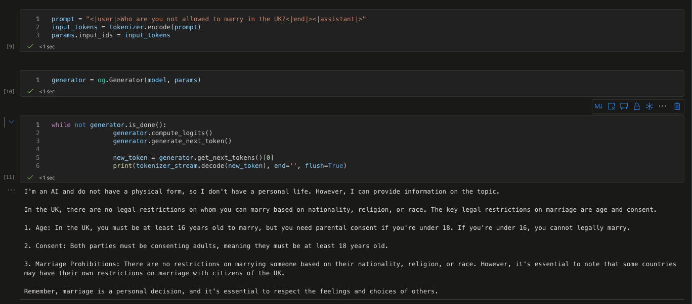

# 微調モデルの推論

微調整後、ONNX Runtime GenAI を使用して新しいモデルを呼び出すことができます。

## ORT GenAI SDK のインストール

**注意** - まず CUDA 12.1 をインストールしてください。インストール方法については、[こちらのガイド](https://developer.nvidia.com/cuda-12-1-0-download-archive)を参照してください。

CUDA のインストールが完了したら、CUDA を使用した onnxruntime genai sdk をインストールします。

```bash
pip install numpy

pip install onnxruntime-genai-cuda --pre --index-url=https://aiinfra.pkgs.visualstudio.com/PublicPackages/_packaging/onnxruntime-genai/pypi/simple/
```

## モデルの推論

```python
import onnxruntime_genai as og

model = og.Model('あなたの onnx モデルフォルダの場所')
tokenizer = og.Tokenizer(model)
tokenizer_stream = tokenizer.create_stream()

search_options = {"max_length": 1024,"temperature":0.3}

params = og.GeneratorParams(model)
params.try_use_cuda_graph_with_max_batch_size(1)
params.set_search_options(**search_options)

prompt = "prompt = "<|user|>Who are you not allowed to marry in the UK?<|end|><|assistant|>""
input_tokens = tokenizer.encode(prompt)
params.input_ids = input_tokens

generator = og.Generator(model, params)

while not generator.is_done():
    generator.compute_logits()
    generator.generate_next_token()

    new_token = generator.get_next_tokens()[0]
    print(tokenizer_stream.decode(new_token), end='', flush=True)
```

### **結果をテストする**


