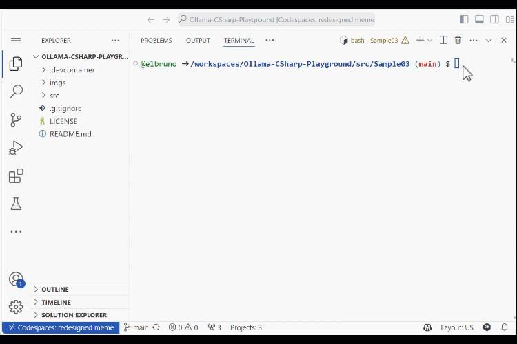

# 使用 Phi-3、SemanticKernel 和 TextMemory 的完整本地 RAG 场景

## 简介

欢迎来到使用 Phi-3、SemanticKernel 和 TextMemory 的完整本地 RAG 场景的代码库。本项目展示了 Phi-3 的强大功能，这是一款突破性的小型语言模型（SLM），正在为开发者和企业重新定义 AI 能力。

## 场景概述

该演示场景旨在通过两种不同的方法回答这个问题：“Bruno 最喜欢的超级英雄是谁？”：

1. 直接询问 Phi-3 模型。
2. 添加一个加载了粉丝信息的 semantic memory 对象，然后再进行询问。

## 完整场景的重要性

Phi-3 在小型语言模型方面代表了一个显著的飞跃，提供了性能和效率的独特结合。它能够独立处理完整的场景，这简化了开发过程并减少了集成复杂性。

## 代码解释

这个命令行应用程序展示了如何使用托管在 Ollama 本地模型和语义记忆进行搜索。该程序使用了多个外部库来实现依赖注入、配置以及 semantic kernel 和记忆功能。

## 测试方法

1. 打开终端并导航到当前项目。

    ```bash
    cd .\src\Sample03\
    ```

1. 使用以下命令运行项目

    ```bash
    dotnet run
    ```

1. 项目 `Sample03` 将回答以下问题：

    ```csharp
    var question = "Bruno 最喜欢的超级英雄是谁？"
    ```

1. 首先将问题直接询问 Phi-3 模型。然后，程序加载以下信息到文本记忆中，并再次询问问题。

    ```csharp

    // 获取嵌入生成服务
    var embeddingGenerator = kernel.Services.GetRequiredService<ITextEmbeddingGenerationService>();
    var memory = new SemanticTextMemory(new VolatileMemoryStore(), embeddingGenerator);    

    // 将事实添加到集合中
    const string MemoryCollectionName = "fanFacts";
    
    await memory.SaveInformationAsync(MemoryCollectionName, id: "info1", 
            text: "Gisela 最喜欢的超级英雄是蝙蝠侠");
    await memory.SaveInformationAsync(MemoryCollectionName, id: "info2", 
            text: "Gisela 最近看过的超级英雄电影是《银河护卫队3》");
    await memory.SaveInformationAsync(MemoryCollectionName, id: "info3", 
            text: "Bruno 最喜欢的超级英雄是无敌少侠");
    await memory.SaveInformationAsync(MemoryCollectionName, id: "info4", 
            text: "Bruno 最近看过的超级英雄电影是《海王2》");
    await memory.SaveInformationAsync(MemoryCollectionName, id: "info5", 
            text: "Bruno 不喜欢的超级英雄电影是《永恒族》");    
    ```

1. 一旦记忆文本准备好，将其作为插件加载到内核中。

    ```csharp
    TextMemoryPlugin memoryPlugin = new(memory);
    
    // 将记忆文本插件导入到内核中
    kernel.ImportPluginFromObject(memoryPlugin);    
    ```

2. 这是在终端中运行的演示程序：

    

## 参考资料

- [Phi-3 Microsoft 博客](https://aka.ms/phi3blog-april)
- [Phi-3 技术报告](https://aka.ms/phi3-tech-report)
- [Phi-3 食谱](https://aka.ms/Phi-3CookBook)
- [面向初学者的生成式 AI](https://github.com/microsoft/generative-ai-for-beginners)
- [Semantic Kernel 主代码库](https://github.com/microsoft/semantic-kernel)
- [Smart Components - 本地嵌入](https://github.com/dotnet-smartcomponents/smartcomponents/blob/main/docs/local-embeddings.md)