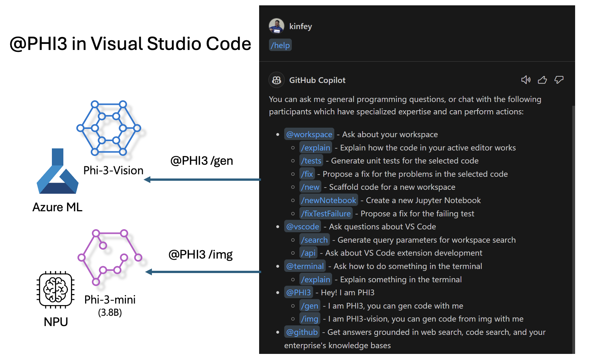

# 用 Microsoft Phi-3 系列构建你自己的 Visual Studio Code Copilot Chat 

您使用过 GitHub Copilot Chat 中的工作区代理吗？你想建立自己团队的代码代理吗？本实践 Lab 希望结合开源模式，打造企业级代码业务代理。

## 基础

### 为什么选择 Microsoft Phi-3

Phi-3 是一个系列家族，包括 phi-3-mini、phi-3-small 和 phi-3-medium，这些基于不同训练参数用于文本生成、对话补全和代码生成。此外，还有基于视觉的 phi-3-vision。它适合企业或不同团队创建离线的生成式 AI 解决方案。

推荐阅读此链接 [https://github.com/microsoft/Phi-3CookBook/blob/main/md/01.Introduce/Phi3Family.md](https://github.com/microsoft/Phi-3CookBook/blob/main/md/01.Introduce/Phi3Family.md)

### Microsoft GitHub Copilot Chat

GitHub Copilot Chat 扩展为你提供了一个聊天界面，让你可以直接在 VS Code 中与 GitHub Copilot 互动，并接收与编码相关的问题答案，而无需导航文档或在线搜索论坛。

Copilot Chat 可能会使用语法高亮、缩进和其他格式功能来增加生成响应的清晰度。根据用户提出的问题，结果可能包含 Copilot 用于生成响应的上下文链接，如源代码文件或文档，或用于访问 VS Code 功能的按钮。

- Copilot Chat 集成在你的开发流程中，在你需要的地方提供帮助：

- 从编辑器或终端直接开始内联聊天，以获得编码时的帮助

- 使用聊天视图，在侧边栏随时获得 AI 助手的帮助

- 启动快速聊天，快速提问并继续你正在做的事情

你可以在各种场景中使用 GitHub Copilot Chat，例如：

- 回答如何最好地解决问题的编码问题

- 解释别人的代码并提出改进建议

- 提出代码修复建议

- 生成单元测试用例

- 生成代码文档

推荐阅读此链接 [https://code.visualstudio.com/docs/copilot/copilot-chat](https://code.visualstudio.com/docs/copilot/copilot-chat)

### Microsoft GitHub Copilot Chat @workspace

在 Copilot Chat 中引用 **@workspace** 允许你对整个代码库提问。基于问题，Copilot 智能地检索相关文件和符号，然后在其答案中引用这些内容作为链接和代码示例。

要回答您的问题，**@workspace** 与开发人员在 VS Code 中浏览代码库时使用的搜索源相同：

- 工作区中的所有文件，.gitignore 文件忽略的文件除外

- 包含嵌套文件夹和文件名的目录结构

- GitHub 的代码搜索索引（如果工作区是 GitHub 代码库并被代码搜索索引的话

- 工作区中的符号和定义

- 当前选中的文本或活动编辑器中的可见文本

注意：如果你打开了文件或在被忽略的文件中选择了文本，它将忽略 .gitignore 的限制。

推荐阅读此链接 [[https://code.visualstudio.com/docs/copilot/copilot-chat](https://code.visualstudio.com/docs/copilot/workspace-context)]

## 了解更多关于这个 Lab 的信息

GitHub Copilot 大大提高了企业的编程效率，每个企业都希望定制 GitHub Copilot 的相关功能。许多企业基于自己的业务场景和开源模型定制了类似 GitHub Copilot 的扩展。对于企业来说，定制的扩展更容易控制，但这也影响了用户体验。毕竟，GitHub Copilot 在处理一般场景和专业性方面具有更强的功能。如果体验可以保持一致，那么定制企业自己的扩展将会更好。GitHub Copilot Chat 提供了相关的 API 供企业在聊天体验中进行扩展。保持一致的体验并拥有定制功能是更好的用户体验。

此实验主要使用 Phi-3 模型结合本地 NPU 和 Azure 混合构建 GitHub Copilot Chat 中的自定义代理 ***@PHI3***，以帮助企业开发人员完成代码生成 ***(@PHI3 /gen)*** 和基于图像生成代码 ***(@PHI3 /img)***。

***注意:***

此 Lab 目前在 Intel CPU 和 Apple Silicon 的 AIPC 上实现。我们将继续更新 Qualcomm 版本的 NPU。

## Lab

| 名称 | 描述 | AIPC | Apple |
| ------------ | ----------- | -------- |-------- |
| Lab0 - 安装(✅) | 配置和安装相关环境和安装工具 | [开始](./HOL/AIPC/01.Installations.md) |[开始](./HOL/Apple/01.Installations.md) |
| Lab1 - 使用 Phi-3-mini 运行 Prompt flow (✅) | 结合 AIPC / Apple Silicon，使用本地 NPU 通过 Phi-3-mini 创建代码生成 | [开始](./HOL/AIPC/02.PromptflowWithNPU.md) |  [开始](./HOL/Apple/02.PromptflowWithMLX.md) |
| Lab2 - 在 Azure 机器学习服务上部署 Phi-3-vision (✅) | 通过部署 Azure 机器学习服务的模型目录 - Phi-3-vision 图像生成代码 | [开始](./HOL/AIPC/03.DeployPhi3VisionOnAzure.md) |[开始](./HOL/Apple/03.DeployPhi3VisionOnAzure.md) |
| Lab3 - 在 GitHub Copilot Chat 中创建 @phi-3 代理 (✅) | 在 GitHub Copilot Chat 中创建自定义 Phi-3 代理以完成代码生成、图形生成代码、RAG 等 | [开始](./HOL/AIPC/04.CreatePhi3AgentInVSCode.md) | [开始](./HOL/Apple/04.CreatePhi3AgentInVSCode.md) |
| 示例代码 (✅) | 下载示例代码 | [开始](../../../code/07.Lab/01/AIPC/) | [开始](../../../code/07.Lab/01/Apple/) |

## 资源

1. Phi-3 食谱 [https://github.com/microsoft/Phi-3CookBook](https://github.com/microsoft/Phi-3CookBook)

2. 了解更多关于 GitHub Copilot [https://learn.microsoft.com/en-us/training/paths/copilot/](https://learn.microsoft.com/en-us/training/paths/copilot/)

3. 了解更多关于 GitHub Copilot Chat [https://learn.microsoft.com/en-us/training/paths/accelerate-app-development-using-github-copilot/](https://learn.microsoft.com/en-us/training/paths/accelerate-app-development-using-github-copilot/)

4. 了解更多关于 GitHub Copilot Chat API [https://code.visualstudio.com/api/extension-guides/chat](https://code.visualstudio.com/api/extension-guides/chat)

5. 了解更多关于 Azure AI Studio [https://learn.microsoft.com/en-us/training/paths/create-custom-copilots-ai-studio/](https://learn.microsoft.com/en-us/training/paths/create-custom-copilots-ai-studio/)

6. 了解更多关于 Azure AI Studio 的模型目录 [https://learn.microsoft.com/en-us/azure/ai-studio/how-to/model-catalog-overview](https://learn.microsoft.com/en-us/azure/ai-studio/how-to/model-catalog-overview)