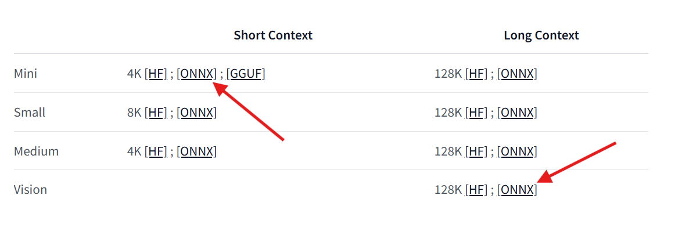

## 歡迎使用 C# 的 Phi-3 實驗室。

有一系列的實驗室展示了如何在 .NET 環境中整合強大的不同版本的 Phi-3 模型。

## 先決條件

在執行範例之前，請確保您已安裝以下內容：

**.NET 8:** 確保你的機器上已安裝[最新版本的 .NET](https://dotnet.microsoft.com/download/dotnet/8.0)。

**(可選) Visual Studio 或 Visual Studio Code:** 您將需要一個能夠執行 .NET 專案的 IDE 或程式碼編輯器。推薦使用 [Visual Studio](https://visualstudio.microsoft.com/) 或 [Visual Studio Code](https://code.visualstudio.com/)。

**使用 git** 複製本地的 Phi-3 版本之一從 [Hugging Face](https://huggingface.co)。

**下載 phi3-mini-4k-instruct-onnx 模型**到你的本機:

### 導航到資料夾以儲存模型

```bash
cd c:\phi3\models
```

### 增加對 lfs 的支援

```bash
git lfs install 
```

### 複製和下載 mini 4K instruct 模型

```bash
git clone https://huggingface.co/microsoft/Phi-3-mini-4k-instruct-onnx
```

### 複製和下載 vision 128K 模型

```
git 複製 https://huggingface.co/microsoft/Phi-3-vision-128k-instruct-onnx-cpu
```

**重要:** 當前的展示設計為使用該模型的 ONNX 版本。之前的步驟會複製以下模型。



## 關於實驗室

主要解決方案有幾個範例實驗室，展示了使用 C# 的 Phi-3 模型的功能。

| Project | Description | Location |
| ------------ | ----------- | -------- |
| LabsPhi301    | 這是一個使用本地 Phi-3 模型來提問的範例專案。該專案使用 `Microsoft.ML.OnnxRuntime` 函式庫載入本地 ONNX Phi-3 模型。 | .\src\LabsPhi301\ |
| LabsPhi302    | 這是一個使用 Semantic Kernel 實現 Console 聊天的範例專案。 | .\src\LabsPhi302\ |
| LabsPhi303 | 這是一個使用本地 Phi-3 視覺模型來分析圖像的範例專案。該專案使用 `Microsoft.ML.OnnxRuntime` 函式庫載入本地 ONNX Phi-3 視覺模型。 | .\src\LabsPhi303\ |
| LabsPhi304 | 這是一個使用本地 Phi-3 視覺模型來分析圖像的範例專案。該專案使用 `Microsoft.ML.OnnxRuntime` 函式庫載入本地 ONNX Phi-3 視覺模型。該專案還提供了一個與使用者互動的選單。 | .\src\LabsPhi304\ |
| LabsPhi305 | 這是一個使用託管在 ollama 模型中的 Phi-3 來回答問題的範例專案。 |**coming soon**|
| LabsPhi306 | 這是一個使用 Semantic Kernel 實現 Console 聊天的範例專案。 |**coming soon**|
| LabsPhi307  | 這是一個使用本地嵌入和 Semantic Kernel 實現 RAG 的範例專案。 |**coming soon**|

## 如何執行這些專案

要執行這些專案，請按照以下步驟操作:

1. 複製儲存庫到您的本機。

1. 打開終端機並導航到所需的專案。例如，讓我們執行 `LabsPhi301`。
    ```bash
    cd .\src\LabsPhi301\
    ```

1. 使用以下命令執行專案
    ```bash
    dotnet run
    ```

1. 範例專案要求用戶輸入並使用本地模式回應。

    執行展示類似於這個：

    

    ***注意:** 第一個問題有一個錯字，Phi-3 足夠酷，會分享正確答案！*

1. 專案 `LabsPhi304` 要求用戶選擇不同的選項，然後處理請求。例如，分析本地圖像。

    執行展示類似於這個：

    

