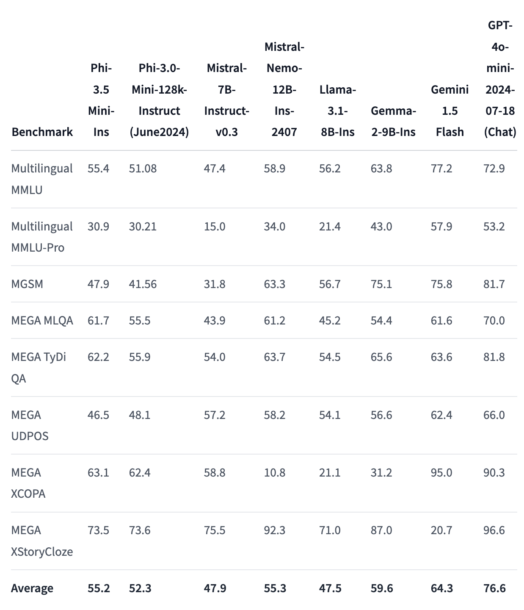
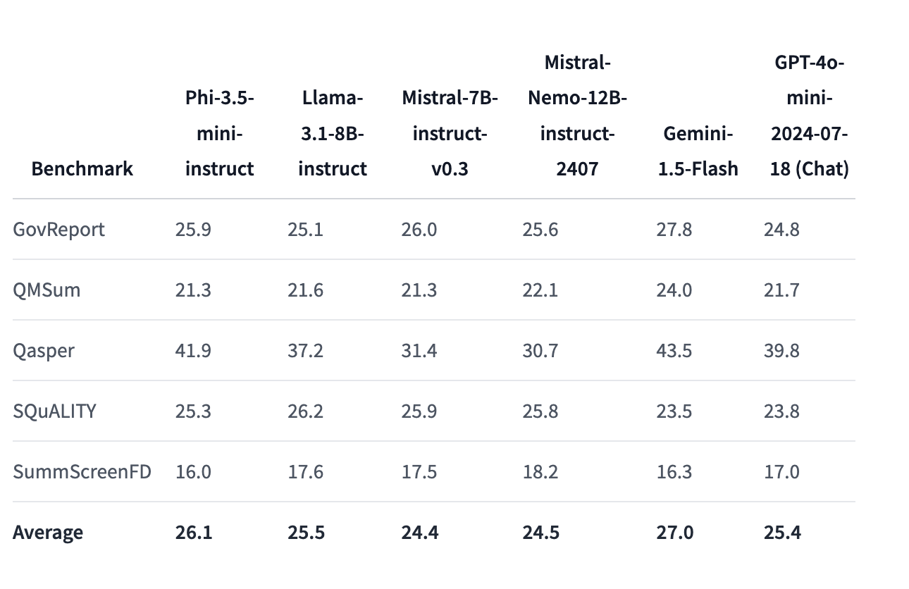
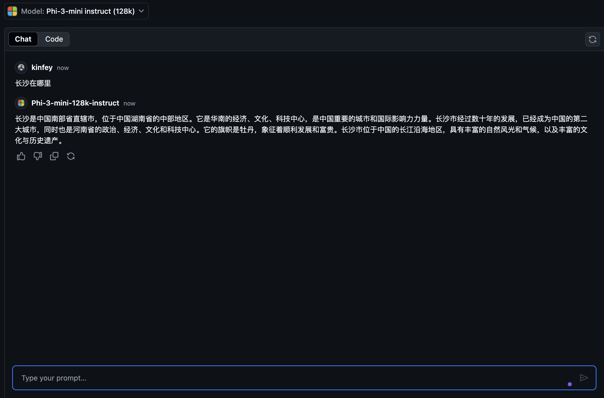
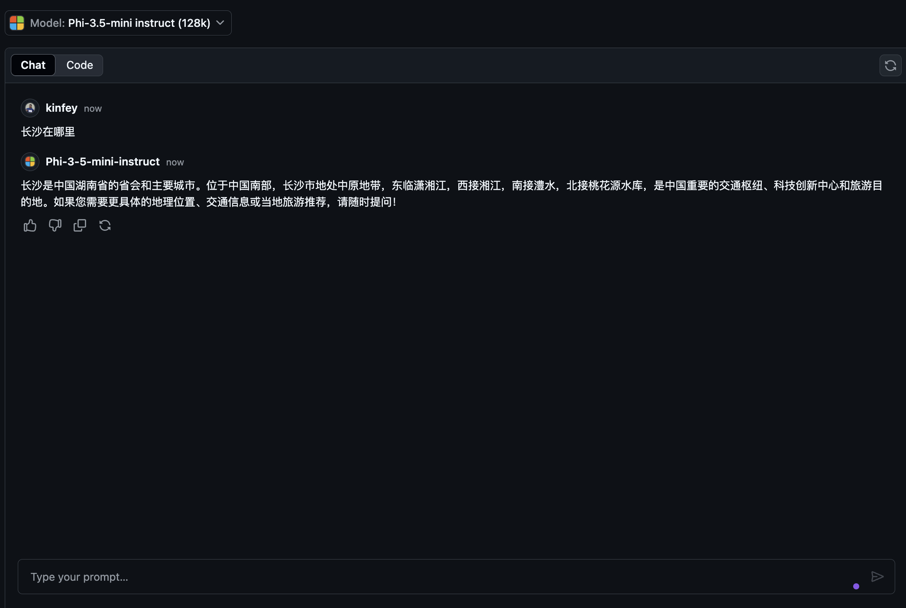
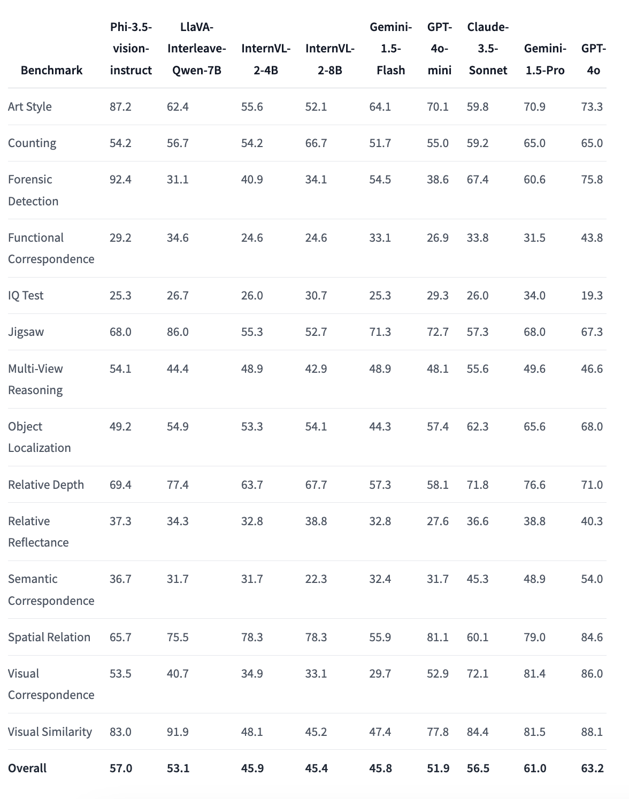
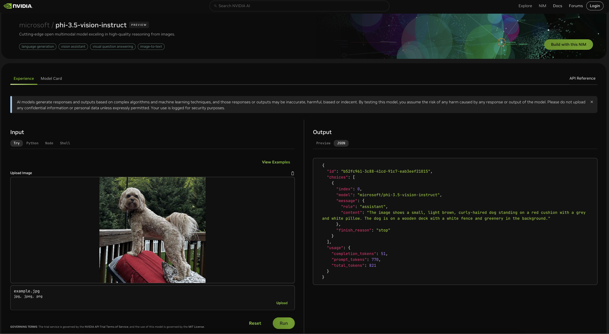
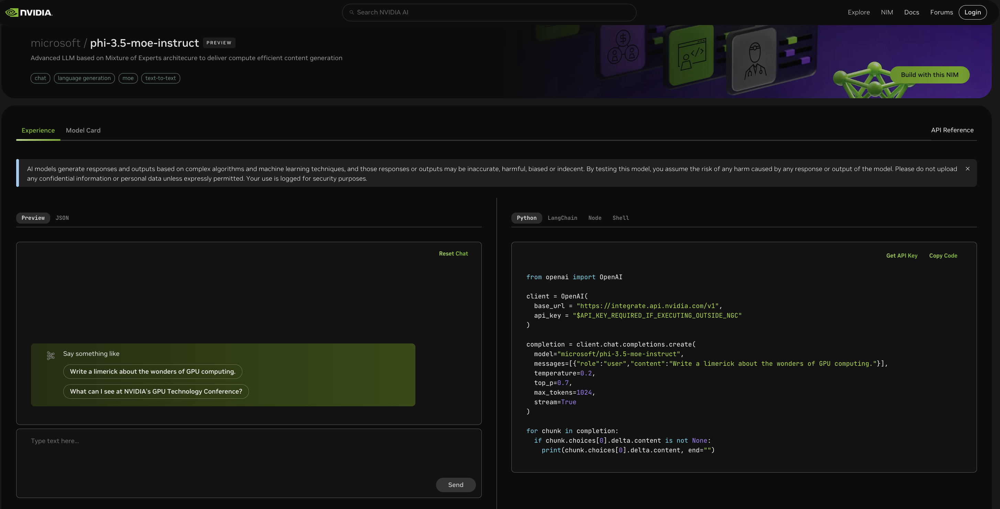

# **What's new Phi-3.5 Family**

Are you already using Phi-3 Family? What are your scenarios? On August 20, 2024, Microsoft released the new Phi-3.5 Family, which has been enhanced in multilingual, vision, and AI Agent. Let's make a more detailed introduction in conjunction with the Model Card on Hugging face.

## **Phi-3.5-mini-instruct**

Phi-3.5-mini is a lightweight, state-of-the-art open model built upon datasets used for Phi-3 - synthetic data and filtered publicly available websites - with a focus on very high-quality, reasoning dense data. The model belongs to the Phi-3 model family and supports 128K token context length. The model underwent a rigorous enhancement process, incorporating both supervised fine-tuning, proximal policy optimization, and direct preference optimization to ensure precise instruction adherence and robust safety measures.

Through the indicators on the Benchmark, you can see that Phi-3.5-mini has improved support for multiple languages ​​and long text content compared to Phi-3-mini, which is used to enhance the language and text capabilities of Phi-3.5 mini in edge applications.

We can compare the ability of Chinese knowledge through GitHub Models. When we ask "Where is Changsha?" (长沙在哪里?), we can compare the results of Phi-3-mini-128k-instruct and Phi-3.5-mini-128k-instruct

It is not difficult to see that the data enhancement on the Chinese corpus allows Phi-3.5-mini to have better results in basic text generation scenarios (***Note:*** Please note that if Phi-3.5-mini needs more accurate answer, it is recommended to fine-tune it according to the application scenario)

## **Phi-3.5-vision-instruct**

Phi-3.5-vision is a lightweight, state-of-the-art open multimodal model built upon datasets which include - synthetic data and filtered publicly available websites - with a focus on very high-quality, reasoning dense data both on text and vision. The model belongs to the Phi-3 model family, and the multimodal version comes with 128K context length (in tokens) it can support. The model underwent a rigorous enhancement process, incorporating both supervised fine-tuning and direct preference optimization to ensure precise instruction adherence and robust safety measures.

Through Vision we opened the eyes of the Phi-3.x Family and were able to complete the following scenarios

1. Memory/compute constrained environments
2. Latency bound scenarios
3. General image understanding
4. Optical character recognition
5. Chart and table understanding
6. Multiple image comparison
7. Multi-image or video clip summarization

Through Vision, we let Phi Family open its eyes and complete the following scenarios

We can also use the provided Hugging face benchmark to understand the comparison in different visual scenarios

If you want to try the free trial of Phi-3.5-vision-instruct, we can use [Nivida NIM](https://build.nvidia.com/microsoft/phi-3_5-vision-instruct) to complete the experience。

Of course, you can also complete the deployment through Azure AI Studio.

## **Phi-3.5-MoE-instruct**

Phi-3.5-MoE is a lightweight, state-of-the-art open model built upon datasets used for Phi-3 - synthetic data and filtered publicly available documents - with a focus on very high-quality, reasoning dense data. The model supports multilingual and comes with 128K context length (in tokens). The model underwent a rigorous enhancement process, incorporating supervised fine-tuning, proximal policy optimization, and direct preference optimization to ensure precise instruction adherence and robust safety measures.

With the development of AI Agent, the demand for MoE models will gradually increase. MoE, the full name of which is Mixed Expert Models, is a new model formed by mixing multiple expert models. MOE is to split the big problem first, then solve the small problems one by one, and then summarize the conclusions. Second, the model scale is one of the key factors to improve model performance. With limited computing resources, training a larger model with fewer training steps is often better than training a smaller model with more steps.

The Phi-3.5-MoE-Instruct model requires more computing power than Phi-3.5-Vision and Phi-3.5-Instruct. It is recommended to use cloud-based methods such as Azure AI Studio and Nvidia NIM for experience and use.

### **🤖 Samples for Phi-3.5 with Apple MLX**

| Labs    | Introduce | Go |
| -------- | ------- |  ------- |
| 🚀 Lab-Introduce Phi-3.5 Instruct  | Learn how to use Phi-3.5 Instruct |  [Go](../../../code/09.UpdateSamples/Aug/phi3-instruct-demo.ipynb)    |
| 🚀 Lab-Introduce Phi-3.5 Vision (image) | Learn how to use Phi-3.5 Vision to analyze image |  [Go](../../../code/09.UpdateSamples/Aug/phi3-vision-demo.ipynb)    |
| 🚀 Lab-Introduce Phi-3.5 MoE   | Learn how to use Phi-3.5 Vision to analyze image |  [Go](../../../code/09.UpdateSamples/Aug/phi3_moe_demo.ipynb)    |

## **Resources**

1. Hugging face's Phi Family [https://huggingface.co/collections/microsoft/phi-3-6626e15e9585a200d2d761e3](https://huggingface.co/collections/microsoft/phi-3-6626e15e9585a200d2d761e3)

2. About GitHub Models [https://gh.io/models](https://gh.io/models)

3. About Azure AI Studio [https://ai.azure.com/](https://ai.azure.com/)

4. About Nividia NIM [https://build.nvidia.com/explore/discover](https://build.nvidia.com/explore/discover)