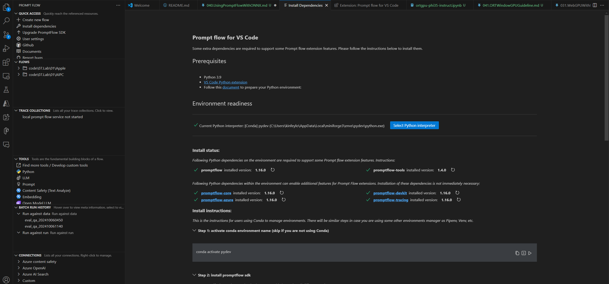
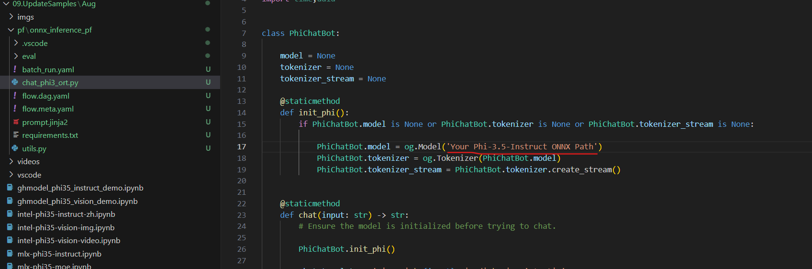
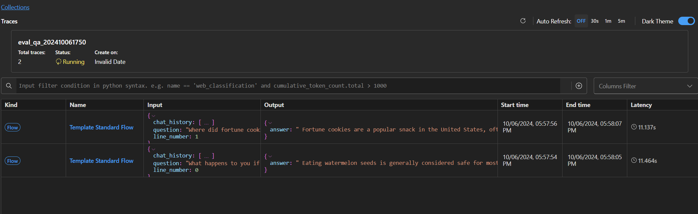

# Using Windows GPU to create Prompt flow solution with Phi-3.5-Instruct ONNX 

**Prompt flow** is a suite of development tools designed to streamline the end-to-end development cycle of LLM-based AI applications, from ideation, prototyping, testing, evaluation to production deployment and monitoring. It makes prompt engineering much easier and enables you to build LLM apps with production quality.

Prompt flow can connect to OpenAI, Azure OpenAI Service, and customizable models (Huggingface, local LLM/SLM). We hope to deploy Phi-3.5's quantized ONNX model to local applications. Prompt flow can help us better plan our business and complete local solutions based on Phi-3.5. In this example, we will combine ONNX Runtime GenAI Library to complete the Prompt flow solution based on Windows GPU.

## **Installation**

### **ONNX Runtime GenAI for Windows GPU**

Read this guideline to set ONNX Runtime GenAI for Windows GPU  [click here](./041.ORTWindowGPUGuideline.md)

### **Set up Prompt flow in VSCode**

1. Install Prompt flow VS Code Extension


2. After install Prompt flow VS Code Extension， click the extension，and choose **Installation dependencies** follow this guideline to install Prompt flow SDK in your env



3. Download [Sample Code](../../../code/09.UpdateSamples/Aug/pf/onnx_inference_pf/) and use VS Code to open this sample


4. Open **flow.dag.yaml** to choose your Python env


   Open **chat_phi3_ort.py** to change your Phi-3.5-instruct ONNX Model location



5. Run your prompt flow to testing

Open **flow.dag.yaml** click visual editor


after click this,and run it to test


6. You can run batch in terminal to check more result


```bash

pf run create --file batch_run.yaml --stream --name 'Your eval qa name'    

```

You can check results in your default browser





