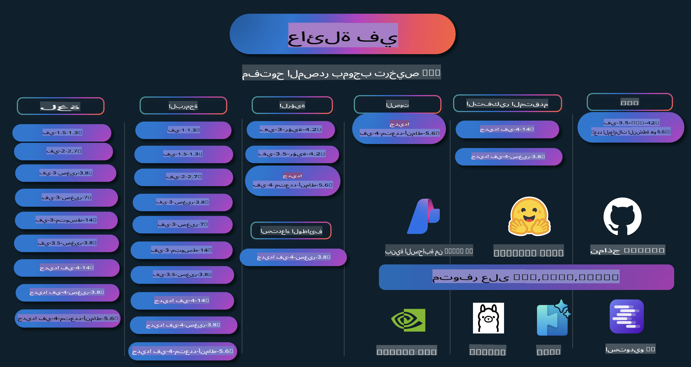

# كتاب وصفات Phi: أمثلة عملية مع نماذج Phi من مايكروسوفت

  

  
  
  

  
  

Phi هي سلسلة من نماذج الذكاء الاصطناعي مفتوحة المصدر التي طورتها مايكروسوفت.

حاليًا، تعد Phi النموذج اللغوي الصغير (SLM) الأقوى والأكثر فعالية من حيث التكلفة، حيث تحقق أداءً ممتازًا في اختبارات متعددة اللغات، التفكير، إنشاء النصوص/الدردشة، البرمجة، الصور، الصوت والعديد من السيناريوهات الأخرى.

يمكنك نشر Phi على السحابة أو الأجهزة الطرفية، ويمكنك بسهولة بناء تطبيقات ذكاء اصطناعي توليدي بقدرات حوسبة محدودة.

اتبع هذه الخطوات للبدء في استخدام هذه الموارد:  
1. **قم بعمل Fork للمستودع**: انقر   
2. **قم باستنساخ المستودع**: `git clone https://github.com/microsoft/PhiCookBook.git`  
3. [**انضم إلى مجتمع مايكروسوفت للذكاء الاصطناعي على Discord وتواصل مع الخبراء والمطورين الآخرين**](https://discord.com/invite/ByRwuEEgH4?WT.mc_id=aiml-137032-kinfeylo)

## جدول المحتويات

- المقدمة  
  - [مرحبًا بك في عائلة Phi](./md/01.Introduction/01/01.PhiFamily.md)  
  - [إعداد بيئتك](./md/01.Introduction/01/01.EnvironmentSetup.md)  
  - [فهم التقنيات الأساسية](./md/01.Introduction/01/01.Understandingtech.md)  
  - [أمان الذكاء الاصطناعي لنماذج Phi](./md/01.Introduction/01/01.AISafety.md)  
  - [دعم الأجهزة لـ Phi](./md/01.Introduction/01/01.Hardwaresupport.md)  
  - [نماذج Phi وتوافرها عبر المنصات](./md/01.Introduction/01/01.Edgeandcloud.md)  
  - [استخدام Guidance-ai وPhi](./md/01.Introduction/01/01.Guidance.md)  
  - [نماذج سوق GitHub](https://github.com/marketplace/models)  
  - [كتالوج نماذج Azure AI](https://ai.azure.com)

- تشغيل Phi في بيئات مختلفة  
    - [Hugging face](./md/01.Introduction/02/01.HF.md)  
    - [نماذج GitHub](./md/01.Introduction/02/02.GitHubModel.md)  
    - [كتالوج نماذج Azure AI Foundry](./md/01.Introduction/02/03.AzureAIFoundry.md)  
    - [Ollama](./md/01.Introduction/02/04.Ollama.md)  
    - [أداة الذكاء الاصطناعي لـ VSCode (AITK)](./md/01.Introduction/02/05.AITK.md)  
    - [NVIDIA NIM](./md/01.Introduction/02/06.NVIDIA.md)

- تشغيل عائلة Phi  
    - [تشغيل Phi على iOS](./md/01.Introduction/03/iOS_Inference.md)  
    - [تشغيل Phi على Android](./md/01.Introduction/03/Android_Inference.md)  
- [استنتاج Phi على Jetson](./md/01.Introduction/03/Jetson_Inference.md)  
    - [استنتاج Phi على AI PC](./md/01.Introduction/03/AIPC_Inference.md)  
    - [استنتاج Phi باستخدام Apple MLX Framework](./md/01.Introduction/03/MLX_Inference.md)  
    - [استنتاج Phi على الخادم المحلي](./md/01.Introduction/03/Local_Server_Inference.md)  
    - [استنتاج Phi على خادم بعيد باستخدام AI Toolkit](./md/01.Introduction/03/Remote_Interence.md)  
    - [استنتاج Phi باستخدام Rust](./md/01.Introduction/03/Rust_Inference.md)  
    - [استنتاج Phi--Vision محليًا](./md/01.Introduction/03/Vision_Inference.md)  
    - [استنتاج Phi باستخدام Kaito AKS وحاويات Azure (الدعم الرسمي)](./md/01.Introduction/03/Kaito_Inference.md)  

- [قياس Phi Family](./md/01.Introduction/04/QuantifyingPhi.md)  
    - [قياس Phi-3.5 / 4 باستخدام llama.cpp](./md/01.Introduction/04/UsingLlamacppQuantifyingPhi.md)  
    - [قياس Phi-3.5 / 4 باستخدام إضافات الذكاء الاصطناعي التوليدي لـ onnxruntime](./md/01.Introduction/04/UsingORTGenAIQuantifyingPhi.md)  
    - [قياس Phi-3.5 / 4 باستخدام Intel OpenVINO](./md/01.Introduction/04/UsingIntelOpenVINOQuantifyingPhi.md)  
    - [قياس Phi-3.5 / 4 باستخدام Apple MLX Framework](./md/01.Introduction/04/UsingAppleMLXQuantifyingPhi.md)  

- تقييم Phi  
    - [الذكاء الاصطناعي المسؤول](./md/01.Introduction/05/ResponsibleAI.md)  
    - [Azure AI Foundry للتقييم](./md/01.Introduction/05/AIFoundry.md)  
    - [استخدام Promptflow للتقييم](./md/01.Introduction/05/Promptflow.md)  

- RAG باستخدام Azure AI Search  
    - [كيفية استخدام Phi-4-mini وPhi-4-multimodal (RAG) مع Azure AI Search](https://github.com/microsoft/PhiCookBook/blob/main/code/06.E2E/E2E_Phi-4-RAG-Azure-AI-Search.ipynb)  

- أمثلة تطوير تطبيقات Phi  
  - تطبيقات النصوص والمحادثة  
    - أمثلة Phi-4 🆕  
      - [📓] [الدردشة مع نموذج Phi-4-mini ONNX](./md/02.Application/01.TextAndChat/Phi4/ChatWithPhi4ONNX/README.md)  
      - [الدردشة مع نموذج Phi-4 المحلي ONNX باستخدام .NET](../../md/04.HOL/dotnet/src/LabsPhi4-Chat-01OnnxRuntime)  
      - [تطبيق كونسول .NET للدردشة مع Phi-4 ONNX باستخدام Sementic Kernel](../../md/04.HOL/dotnet/src/LabsPhi4-Chat-02SK)  
    - أمثلة Phi-3 / 3.5  
      - [روبوت محادثة محلي في المتصفح باستخدام Phi3 وONNX Runtime Web وWebGPU](https://github.com/microsoft/onnxruntime-inference-examples/tree/main/js/chat)  
      - [دردشة OpenVino](./md/02.Application/01.TextAndChat/Phi3/E2E_OpenVino_Chat.md)  
      - [نموذج متعدد - تفاعل بين Phi-3-mini وOpenAI Whisper](./md/02.Application/01.TextAndChat/Phi3/E2E_Phi-3-mini_with_whisper.md)  
      - [MLFlow - بناء واجهة واستخدام Phi-3 مع MLFlow](./md//02.Application/01.TextAndChat/Phi3/E2E_Phi-3-MLflow.md)  
      - [تحسين النموذج - كيفية تحسين نموذج Phi-3-min لـ ONNX Runtime Web باستخدام Olive](https://github.com/microsoft/Olive/tree/main/examples/phi3)  
      - [تطبيق WinUI3 مع Phi-3 mini-4k-instruct-onnx](https://github.com/microsoft/Phi3-Chat-WinUI3-Sample/)  
      - [تطبيق ملاحظات AI متعدد النماذج باستخدام WinUI3](https://github.com/microsoft/ai-powered-notes-winui3-sample)  
      - [تخصيص ودمج نماذج Phi-3 مع Prompt flow](./md/02.Application/01.TextAndChat/Phi3/E2E_Phi-3-FineTuning_PromptFlow_Integration.md)  
      - [تخصيص ودمج نماذج Phi-3 مع Prompt flow في Azure AI Foundry](./md/02.Application/01.TextAndChat/Phi3/E2E_Phi-3-FineTuning_PromptFlow_Integration_AIFoundry.md)  
      - [تقييم نموذج Phi-3 / Phi-3.5 المخصص في Azure AI Foundry مع التركيز على مبادئ الذكاء الاصطناعي المسؤول لشركة Microsoft](./md/02.Application/01.TextAndChat/Phi3/E2E_Phi-3-Evaluation_AIFoundry.md)  
- [📓] [عينة تنبؤ لغة Phi-3.5-mini-instruct (الصينية/الإنجليزية)](../../md/02.Application/01.TextAndChat/Phi3/phi3-instruct-demo.ipynb)  
      - [دردشة RAG باستخدام Phi-3.5-Instruct مع WebGPU](./md/02.Application/01.TextAndChat/Phi3/WebGPUWithPhi35Readme.md)  
      - [استخدام وحدة معالجة الرسومات في ويندوز لإنشاء حل Prompt Flow مع Phi-3.5-Instruct ONNX](./md/02.Application/01.TextAndChat/Phi3/UsingPromptFlowWithONNX.md)  
      - [استخدام Microsoft Phi-3.5 tflite لإنشاء تطبيق أندرويد](./md/02.Application/01.TextAndChat/Phi3/UsingPhi35TFLiteCreateAndroidApp.md)  
      - [مثال أسئلة وأجوبة .NET باستخدام نموذج Phi-3 المحلي مع Microsoft.ML.OnnxRuntime](../../md/04.HOL/dotnet/src/LabsPhi301)  
      - [تطبيق دردشة .NET باستخدام Semantic Kernel وPhi-3](../../md/04.HOL/dotnet/src/LabsPhi302)  

  - عينات برمجية باستخدام Azure AI Inference SDK  
    - عينات Phi-4 🆕  
      - [📓] [توليد كود المشروع باستخدام Phi-4-multimodal](./md/02.Application/02.Code/Phi4/GenProjectCode/README.md)  
    - عينات Phi-3 / 3.5  
      - [إنشاء دردشة GitHub Copilot خاصة بك في Visual Studio Code باستخدام عائلة Phi-3 من Microsoft](./md/02.Application/02.Code/Phi3/VSCodeExt/README.md)  
      - [إنشاء وكيل دردشة Copilot خاص بك في Visual Studio Code باستخدام Phi-3.5 ونماذج GitHub](/md/02.Application/02.Code/Phi3/CreateVSCodeChatAgentWithGitHubModels.md)  

  - عينات الاستدلال المتقدم  
    - عينات Phi-4 🆕  
      - [📓] [عينات استدلال Phi-4-mini](./md/02.Application/03.AdvancedReasoning/Phi4/AdvancedResoningPhi4mini/README.md)  

  - العروض التوضيحية  
      - [عروض Phi-4-mini التوضيحية المستضافة على Hugging Face Spaces](https://huggingface.co/spaces/microsoft/phi-4-mini?WT.mc_id=aiml-137032-kinfeylo)  
      - [عروض Phi-4-multimodal التوضيحية المستضافة على Hugging Face Spaces](https://huggingface.co/spaces/microsoft/phi-4-multimodal?WT.mc_id=aiml-137032-kinfeylo)  

  - عينات الرؤية  
    - عينات Phi-4 🆕  
      - [📓] [استخدام Phi-4-multimodal لقراءة الصور وتوليد الأكواد](./md/02.Application/04.Vision/Phi4/CreateFrontend/README.md)  
    - عينات Phi-3 / 3.5  
      - [📓] [Phi-3-vision-تحويل النص من الصور إلى نصوص](../../md/02.Application/04.Vision/Phi3/E2E_Phi-3-vision-image-text-to-text-online-endpoint.ipynb)  
      - [Phi-3-vision-ONNX](https://onnxruntime.ai/docs/genai/tutorials/phi3-v.html)  
      - [📓] [Phi-3-vision CLIP Embedding](../../md/02.Application/04.Vision/Phi3/E2E_Phi-3-vision-image-text-to-text-online-endpoint.ipynb)  
      - [عرض توضيحي: إعادة التدوير باستخدام Phi-3](https://github.com/jennifermarsman/PhiRecycling/)  
      - [Phi-3-vision - مساعد لغة بصري - باستخدام Phi3-Vision وOpenVINO](https://docs.openvino.ai/nightly/notebooks/phi-3-vision-with-output.html)  
      - [Phi-3 Vision Nvidia NIM](./md/02.Application/04.Vision/Phi3/E2E_Nvidia_NIM_Vision.md)  
      - [Phi-3 Vision OpenVino](./md/02.Application/04.Vision/Phi3/E2E_OpenVino_Phi3Vision.md)  
      - [📓] [عينة Phi-3.5 Vision متعددة الإطارات أو الصور](../../md/02.Application/04.Vision/Phi3/phi3-vision-demo.ipynb)  
      - [Phi-3 Vision نموذج ONNX المحلي باستخدام Microsoft.ML.OnnxRuntime .NET](../../md/04.HOL/dotnet/src/LabsPhi303)  
      - [نموذج ONNX المحلي Phi-3 Vision المستند إلى القائمة باستخدام Microsoft.ML.OnnxRuntime .NET](../../md/04.HOL/dotnet/src/LabsPhi304)  

  - عينات الصوت  
    - عينات Phi-4 🆕  
      - [📓] [استخراج نصوص الصوت باستخدام Phi-4-multimodal](./md/02.Application/05.Audio/Phi4/Transciption/README.md)  
      - [📓] [عينة صوت Phi-4-multimodal](../../md/02.Application/05.Audio/Phi4/Siri/demo.ipynb)  
      - [📓] [عينة ترجمة الكلام باستخدام Phi-4-multimodal](../../md/02.Application/05.Audio/Phi4/Translate/demo.ipynb)  
      - [تطبيق كونسول .NET باستخدام Phi-4-multimodal لتحليل ملف صوتي وإنشاء نصوص](../../md/04.HOL/dotnet/src/LabsPhi4-MultiModal-02Audio)  

  - عينات MOE  
    - عينات Phi-3 / 3.5  
      - [📓] [نماذج Phi-3.5 Mixture of Experts (MoEs) - عينة وسائل التواصل الاجتماعي](../../md/02.Application/06.MoE/Phi3/phi3_moe_demo.ipynb)  
      - [📓] [بناء خط أنابيب استرجاع معزز (RAG) باستخدام NVIDIA NIM Phi-3 MOE وAzure AI Search وLlamaIndex](../../md/02.Application/06.MoE/Phi3/azure-ai-search-nvidia-rag.ipynb)  

  - عينات استدعاء الوظائف  
    - عينات Phi-4 🆕  
      - [📓] [استخدام استدعاء الوظائف مع Phi-4-mini](./md/02.Application/07.FunctionCalling/Phi4/FunctionCallingBasic/README.md)  

  - عينات المزج متعدد الوسائط  
    - عينات Phi-4 🆕  
- [📓] [استخدام Phi-4-multimodal كصحفي تقني](../../md/02.Application/08.Multimodel/Phi4/TechJournalist/phi_4_mm_audio_text_publish_news.ipynb)
  - [.NET console application باستخدام Phi-4-multimodal لتحليل الصور](../../md/04.HOL/dotnet/src/LabsPhi4-MultiModal-01Images)

- تحسين أداء نماذج Phi
  - [سيناريوهات تحسين الأداء](./md/03.FineTuning/FineTuning_Scenarios.md)
  - [تحسين الأداء مقابل RAG](./md/03.FineTuning/FineTuning_vs_RAG.md)
  - [تحسين الأداء لجعل Phi-3 خبيرًا في الصناعة](./md/03.FineTuning/LetPhi3gotoIndustriy.md)
  - [تحسين أداء Phi-3 باستخدام AI Toolkit لـ VS Code](./md/03.FineTuning/Finetuning_VSCodeaitoolkit.md)
  - [تحسين أداء Phi-3 باستخدام خدمة Azure Machine Learning](./md/03.FineTuning/Introduce_AzureML.md)
  - [تحسين أداء Phi-3 باستخدام Lora](./md/03.FineTuning/FineTuning_Lora.md)
  - [تحسين أداء Phi-3 باستخدام QLora](./md/03.FineTuning/FineTuning_Qlora.md)
  - [تحسين أداء Phi-3 باستخدام Azure AI Foundry](./md/03.FineTuning/FineTuning_AIFoundry.md)
  - [تحسين أداء Phi-3 باستخدام Azure ML CLI/SDK](./md/03.FineTuning/FineTuning_MLSDK.md)
  - [تحسين الأداء باستخدام Microsoft Olive](./md/03.FineTuning/FineTuning_MicrosoftOlive.md)
  - [مختبر عملي لتحسين الأداء باستخدام Microsoft Olive](./md/03.FineTuning/olive-lab/readme.md)
  - [تحسين أداء Phi-3-vision باستخدام Weights and Bias](./md/03.FineTuning/FineTuning_Phi-3-visionWandB.md)
  - [تحسين أداء Phi-3 باستخدام إطار عمل Apple MLX](./md/03.FineTuning/FineTuning_MLX.md)
  - [تحسين أداء Phi-3-vision (الدعم الرسمي)](./md/03.FineTuning/FineTuning_Vision.md)
  - [تحسين أداء Phi-3 باستخدام Kaito AKS و Azure Containers (الدعم الرسمي)](./md/03.FineTuning/FineTuning_Kaito.md)
  - [تحسين أداء Phi-3 و Phi-3.5 Vision](https://github.com/2U1/Phi3-Vision-Finetune)

- مختبر عملي
  - [استكشاف النماذج المتقدمة: LLMs، SLMs، التطوير المحلي والمزيد](https://github.com/microsoft/aitour-exploring-cutting-edge-models)
  - [إطلاق إمكانات معالجة اللغة الطبيعية: تحسين الأداء باستخدام Microsoft Olive](https://github.com/azure/Ignite_FineTuning_workshop)

- أوراق بحثية ومنشورات أكاديمية
  - [الكتب المدرسية هي كل ما تحتاجه II: تقرير Phi-1.5 التقني](https://arxiv.org/abs/2309.05463)
  - [تقرير Phi-3 التقني: نموذج لغوي قوي يعمل محليًا على هاتفك](https://arxiv.org/abs/2404.14219)
  - [تقرير Phi-4 التقني](https://arxiv.org/abs/2412.08905)
  - [تحسين النماذج اللغوية الصغيرة لاستدعاء الوظائف داخل المركبات](https://arxiv.org/abs/2501.02342)
  - [(WhyPHI) تحسين أداء PHI-3 للإجابة على الأسئلة متعددة الخيارات: المنهجية، النتائج، والتحديات](https://arxiv.org/abs/2501.01588)

## استخدام نماذج Phi

### Phi على Azure AI Foundry

يمكنك تعلم كيفية استخدام Microsoft Phi وكيفية بناء حلول شاملة على أجهزتك المختلفة. لتجربة Phi بنفسك، ابدأ بتجربة النماذج وتخصيص Phi وفقًا لسيناريوهاتك باستخدام [Azure AI Foundry Azure AI Model Catalog](https://aka.ms/phi3-azure-ai). يمكنك معرفة المزيد من خلال بدء الاستخدام مع [Azure AI Foundry](/md/02.QuickStart/AzureAIFoundry_QuickStart.md).

**البيئة التجريبية**  
كل نموذج لديه بيئة تجريبية مخصصة لاختبار النموذج [Azure AI Playground](https://aka.ms/try-phi3).

### Phi على نماذج GitHub

يمكنك تعلم كيفية استخدام Microsoft Phi وكيفية بناء حلول شاملة على أجهزتك المختلفة. لتجربة Phi بنفسك، ابدأ بتجربة النموذج وتخصيص Phi وفقًا لسيناريوهاتك باستخدام [GitHub Model Catalog](https://github.com/marketplace/models?WT.mc_id=aiml-137032-kinfeylo). يمكنك معرفة المزيد من خلال بدء الاستخدام مع [GitHub Model Catalog](/md/02.QuickStart/GitHubModel_QuickStart.md).

**البيئة التجريبية**
لكل نموذج [مساحة مخصصة لاختبار النموذج](/md/02.QuickStart/GitHubModel_QuickStart.md).

### Phi على منصة Hugging Face

يمكنك أيضًا العثور على النموذج على [Hugging Face](https://huggingface.co/microsoft)

**مساحة التجربة**  
[مساحة تجربة Hugging Chat](https://huggingface.co/chat/models/microsoft/Phi-3-mini-4k-instruct)

## الذكاء الاصطناعي المسؤول

تلتزم مايكروسوفت بمساعدة عملائها على استخدام منتجات الذكاء الاصطناعي بمسؤولية، ومشاركة ما تعلمناه، وبناء شراكات تعتمد على الثقة من خلال أدوات مثل ملاحظات الشفافية وتقييمات التأثير. يمكن العثور على العديد من هذه الموارد في [https://aka.ms/RAI](https://aka.ms/RAI).  
تعتمد مقاربة مايكروسوفت للذكاء الاصطناعي المسؤول على مبادئ الذكاء الاصطناعي الخاصة بنا، والتي تشمل الإنصاف، الموثوقية والسلامة، الخصوصية والأمان، الشمولية، الشفافية، والمساءلة.

النماذج الكبيرة لمعالجة اللغة الطبيعية، الصور، والصوت - مثل تلك المستخدمة في هذا المثال - قد تتصرف بطرق غير عادلة أو غير موثوقة أو مسيئة، مما قد يتسبب في أضرار. يرجى الرجوع إلى [ملاحظة الشفافية لخدمة Azure OpenAI](https://learn.microsoft.com/legal/cognitive-services/openai/transparency-note?tabs=text) للاطلاع على المخاطر والقيود.

النهج الموصى به للتخفيف من هذه المخاطر هو تضمين نظام أمان في هيكليتك يمكنه اكتشاف ومنع السلوك الضار. [Azure AI Content Safety](https://learn.microsoft.com/azure/ai-services/content-safety/overview) يوفر طبقة حماية مستقلة، قادرة على اكتشاف المحتوى الضار الذي يولده المستخدم أو الذكاء الاصطناعي في التطبيقات والخدمات.  
تتضمن خدمة أمان المحتوى في Azure AI واجهات برمجة تطبيقات للنصوص والصور تمكنك من اكتشاف المواد الضارة. داخل Azure AI Foundry، تتيح لك خدمة أمان المحتوى عرض واستكشاف وتجربة أكواد عينة لاكتشاف المحتوى الضار عبر مختلف الوسائط. يوجهك [دليل البدء السريع](https://learn.microsoft.com/azure/ai-services/content-safety/quickstart-text?tabs=visual-studio%2Clinux&pivots=programming-language-rest) حول كيفية تقديم الطلبات للخدمة.

جانب آخر يجب أخذه بعين الاعتبار هو الأداء العام للتطبيق. مع التطبيقات متعددة الوسائط والنماذج، نعتبر الأداء يعني أن النظام يعمل كما تتوقع أنت ومستخدموك، بما في ذلك عدم توليد مخرجات ضارة. من المهم تقييم أداء تطبيقك العام باستخدام [مقيمي الأداء والجودة ومقيمي المخاطر والسلامة](https://learn.microsoft.com/azure/ai-studio/concepts/evaluation-metrics-built-in). لديك أيضًا القدرة على إنشاء وتقييم [مقيمي مخصصين](https://learn.microsoft.com/azure/ai-studio/how-to/develop/evaluate-sdk#custom-evaluators).

يمكنك تقييم تطبيق الذكاء الاصطناعي الخاص بك في بيئة التطوير باستخدام [Azure AI Evaluation SDK](https://microsoft.github.io/promptflow/index.html). بناءً على مجموعة بيانات اختبار أو هدف معين، يتم قياس مخرجات تطبيق الذكاء الاصطناعي التوليدي الخاص بك بشكل كمي باستخدام مقيمين مدمجين أو مقيمين مخصصين من اختيارك. لبدء استخدام Azure AI Evaluation SDK لتقييم نظامك، يمكنك اتباع [دليل البدء السريع](https://learn.microsoft.com/azure/ai-studio/how-to/develop/flow-evaluate-sdk). بمجرد تنفيذ تشغيل التقييم، يمكنك [تصور النتائج في Azure AI Foundry](https://learn.microsoft.com/azure/ai-studio/how-to/evaluate-flow-results).

## العلامات التجارية

قد يحتوي هذا المشروع على علامات تجارية أو شعارات لمشاريع أو منتجات أو خدمات. يخضع الاستخدام المصرح به لعلامات مايكروسوفت التجارية أو شعاراتها لشروط [إرشادات العلامات التجارية الخاصة بمايكروسوفت](https://www.microsoft.com/legal/intellectualproperty/trademarks/usage/general).  
يجب ألا يتسبب استخدام علامات مايكروسوفت التجارية أو شعاراتها في نسخ معدلة من هذا المشروع في حدوث لبس أو الإيحاء برعاية مايكروسوفت. يخضع أي استخدام لعلامات تجارية أو شعارات لأطراف ثالثة لسياسات تلك الأطراف.

**إخلاء المسؤولية**:  
تم ترجمة هذا المستند باستخدام خدمات الترجمة الآلية بالذكاء الاصطناعي. في حين أننا نسعى لتحقيق الدقة، يُرجى العلم أن الترجمات الآلية قد تحتوي على أخطاء أو معلومات غير دقيقة. يجب اعتبار المستند الأصلي بلغته الأصلية هو المصدر الرسمي. للحصول على معلومات حاسمة، يُوصى بالاستعانة بترجمة بشرية احترافية. نحن غير مسؤولين عن أي سوء فهم أو تفسير خاطئ ينشأ عن استخدام هذه الترجمة.