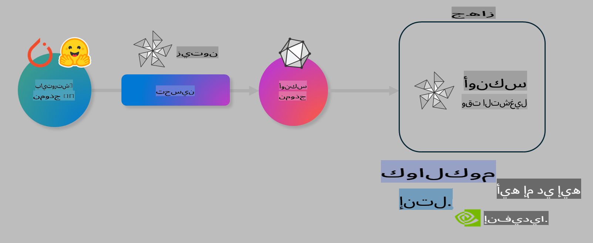

# مختبر: تحسين نماذج الذكاء الاصطناعي للاستدلال على الأجهزة

## المقدمة

> [!IMPORTANT]
> يتطلب هذا المختبر وجود **Nvidia A10 أو A100 GPU** مع تثبيت التعريفات وأداة CUDA toolkit (الإصدار 12 أو أحدث).

> [!NOTE]
> هذا المختبر مدته **35 دقيقة** وسيمنحك مقدمة عملية للمفاهيم الأساسية لتحسين النماذج للاستدلال على الأجهزة باستخدام OLIVE.

## الأهداف التعليمية

بنهاية هذا المختبر، ستكون قادرًا على استخدام OLIVE لـ:

- تقليل حجم نموذج ذكاء اصطناعي باستخدام طريقة AWQ.
- تحسين نموذج ذكاء اصطناعي لمهمة محددة.
- إنشاء LoRA adapters (نموذج محسّن) لاستدلال فعال على الأجهزة باستخدام ONNX Runtime.

### ما هو Olive

Olive (*O*NNX *live*) هي أداة لتحسين النماذج مع واجهة سطر أوامر (CLI) تساعدك على تجهيز النماذج لتعمل مع ONNX runtime +++https://onnxruntime.ai+++ بجودة وأداء عاليين.



يكون الإدخال في Olive عادةً نموذج PyTorch أو Hugging Face، بينما يكون الإخراج نموذج ONNX محسّن يُنفّذ على جهاز (هدف النشر) يعمل بـ ONNX runtime. يقوم Olive بتحسين النموذج بناءً على معالج الذكاء الاصطناعي (NPU، GPU، CPU) المتوفر من قبل شركة الأجهزة مثل Qualcomm، AMD، Nvidia أو Intel.

ينفذ Olive ما يسمى بـ *workflow*، وهو تسلسل مرتب من مهام تحسين النماذج الفردية التي تُعرف بـ *passes*. تشمل الأمثلة على هذه المهام: ضغط النماذج، التقاط الرسوم البيانية، تقليل الحجم، وتحسين الرسوم البيانية. لكل مهمة مجموعة من المعايير التي يمكن تعديلها لتحقيق أفضل النتائج مثل الدقة والسرعة، والتي يتم تقييمها بواسطة أداة التقييم المناسبة. يستخدم Olive استراتيجية بحث تعتمد على خوارزمية للبحث التلقائي لتحسين كل مهمة على حدة أو مجموعة من المهام معًا.

#### فوائد Olive

- **تقليل الإحباط والوقت** الناتج عن التجربة والخطأ مع تقنيات تحسين الرسوم البيانية، الضغط، والتقليل. حدد قيود الجودة والأداء الخاصة بك ودع Olive يجد لك أفضل نموذج.
- **أكثر من 40 مكون لتحسين النماذج** تشمل أحدث التقنيات في تقليل الحجم، الضغط، تحسين الرسوم البيانية، والتعديل.
- **واجهة CLI سهلة الاستخدام** لمهام تحسين النماذج الشائعة. على سبيل المثال: olive quantize، olive auto-opt، olive finetune.
- إمكانية تعبئة النماذج ونشرها مضمنة.
- يدعم إنشاء نماذج لخدمة **Multi LoRA**.
- بناء تدفقات العمل باستخدام YAML/JSON لتنظيم مهام تحسين النماذج والنشر.
- تكامل مع **Hugging Face** و **Azure AI**.
- آلية **تخزين مؤقت مدمجة** لتقليل التكاليف.

## تعليمات المختبر
> [!NOTE]
> تأكد من إعداد Azure AI Hub والمشروع الخاص بك وتجهيز جهاز A100 الخاص بك كما هو موضح في مختبر 1.

### الخطوة 0: الاتصال بحساب Azure AI Compute

ستتصل بحساب Azure AI Compute باستخدام ميزة الاتصال عن بُعد في **VS Code**.

1. افتح تطبيق **VS Code** على سطح المكتب:
2. افتح **لوحة الأوامر** باستخدام **Shift+Ctrl+P**.
3. في لوحة الأوامر، ابحث عن **AzureML - remote: Connect to compute instance in New Window**.
4. اتبع التعليمات التي تظهر على الشاشة للاتصال بحساب Azure Compute. سيتضمن ذلك اختيار اشتراك Azure، مجموعة الموارد، المشروع، واسم الحساب الذي قمت بإعداده في مختبر 1.
5. بمجرد الاتصال بحساب Azure ML Compute، سيتم عرض ذلك في **الزاوية السفلية اليسرى من VS Code** `><Azure ML: Compute Name`

### الخطوة 1: استنساخ هذا المستودع

في VS Code، افتح نافذة طرفية جديدة باستخدام **Ctrl+J** واستنسخ هذا المستودع:

في الطرفية، يجب أن ترى المطالبة:

```
azureuser@computername:~/cloudfiles/code$ 
```
استنسخ الحل

```bash
cd ~/localfiles
git clone https://github.com/microsoft/phi-3cookbook.git
```

### الخطوة 2: فتح المجلد في VS Code

لفتح VS Code في المجلد المناسب، نفذ الأمر التالي في الطرفية، والذي سيفتح نافذة جديدة:

```bash
code phi-3cookbook/code/04.Finetuning/Olive-lab
```

بدلاً من ذلك، يمكنك فتح المجلد عن طريق اختيار **File** > **Open Folder**.

### الخطوة 3: تثبيت التبعيات

افتح نافذة طرفية في VS Code داخل حساب Azure AI Compute (نصيحة: **Ctrl+J**) ونفذ الأوامر التالية لتثبيت التبعيات:

```bash
conda create -n olive-ai python=3.11 -y
conda activate olive-ai
pip install -r requirements.txt
az extension remove -n azure-cli-ml
az extension add -n ml
```

> [!NOTE]
> ستستغرق عملية التثبيت حوالي ~5 دقائق.

في هذا المختبر، ستقوم بتنزيل وتحميل النماذج إلى كتالوج نماذج Azure AI. للوصول إلى كتالوج النماذج، ستحتاج إلى تسجيل الدخول إلى Azure باستخدام:

```bash
az login
```

> [!NOTE]
> أثناء تسجيل الدخول، سيُطلب منك اختيار اشتراكك. تأكد من اختيار الاشتراك المخصص لهذا المختبر.

### الخطوة 4: تنفيذ أوامر Olive

افتح نافذة طرفية في VS Code داخل حساب Azure AI Compute (نصيحة: **Ctrl+J**) وتأكد من تنشيط بيئة `olive-ai` conda:

```bash
conda activate olive-ai
```

بعد ذلك، نفذ الأوامر التالية لـ Olive في سطر الأوامر.

1. **تفحص البيانات:** في هذا المثال، ستقوم بتحسين نموذج Phi-3.5-Mini ليكون متخصصًا في الإجابة عن الأسئلة المتعلقة بالسفر. يعرض الكود أدناه السجلات الأولى من مجموعة البيانات، والتي تكون بتنسيق JSON lines:

    ```bash
    head data/data_sample_travel.jsonl
    ```
2. **تقليل حجم النموذج:** قبل تدريب النموذج، قم أولاً بتقليل حجمه باستخدام الأمر التالي الذي يستخدم تقنية تسمى Active Aware Quantization (AWQ) +++https://arxiv.org/abs/2306.00978+++. تقوم AWQ بتقليل أوزان النموذج بناءً على التنشيطات التي يتم إنتاجها أثناء الاستدلال. يعني ذلك أن عملية التقليل تأخذ في الاعتبار توزيع البيانات الفعلي في التنشيطات، مما يؤدي إلى الحفاظ بشكل أفضل على دقة النموذج مقارنةً بطرق تقليل الأوزان التقليدية.

    ```bash
    olive quantize \
       --model_name_or_path microsoft/Phi-3.5-mini-instruct \
       --trust_remote_code \
       --algorithm awq \
       --output_path models/phi/awq \
       --log_level 1
    ```
    
    تستغرق عملية تقليل الحجم **حوالي 8 دقائق**، مما سيؤدي إلى **تقليل حجم النموذج من ~7.5GB إلى ~2.5GB**.
   
   في هذا المختبر، نعرض لك كيفية إدخال نماذج من Hugging Face (على سبيل المثال: `microsoft/Phi-3.5-mini-instruct`). However, Olive also allows you to input models from the Azure AI catalog by updating the `model_name_or_path` argument to an Azure AI asset ID (for example:  `azureml://registries/azureml/models/Phi-3.5-mini-instruct/versions/4`). 

1. **Train the model:** Next, the `olive finetune` يقوم الأمر بتعديل النموذج المُقلل. تقليل حجم النموذج *قبل* التعديل بدلاً من بعده يعطي دقة أفضل حيث تستعيد عملية التعديل بعض الفقد الناتج عن عملية تقليل الحجم.

    ```bash
    olive finetune \
        --method lora \
        --model_name_or_path models/phi/awq \
        --data_files "data/data_sample_travel.jsonl" \
        --data_name "json" \
        --text_template "<|user|>\n{prompt}<|end|>\n<|assistant|>\n{response}<|end|>" \
        --max_steps 100 \
        --output_path ./models/phi/ft \
        --log_level 1
    ```
    
    تستغرق عملية التعديل **حوالي 6 دقائق** (مع 100 خطوة).

3. **تحسين النموذج:** مع اكتمال تدريب النموذج، يمكنك الآن تحسينه باستخدام أمر `auto-opt` command, which will capture the ONNX graph and automatically perform a number of optimizations to improve the model performance for CPU by compressing the model and doing fusions. It should be noted, that you can also optimize for other devices such as NPU or GPU by just updating the `--device` and `--provider` الخاص بـ Olive - ولكن لغرض هذا المختبر سنستخدم وحدة المعالجة المركزية (CPU).

    ```bash
    olive auto-opt \
       --model_name_or_path models/phi/ft/model \
       --adapter_path models/phi/ft/adapter \
       --device cpu \
       --provider CPUExecutionProvider \
       --use_ort_genai \
       --output_path models/phi/onnx-ao \
       --log_level 1
    ```
    
    تستغرق عملية التحسين **حوالي 5 دقائق**.

### الخطوة 5: اختبار الاستدلال السريع للنموذج

لاختبار استدلال النموذج، قم بإنشاء ملف Python في مجلدك باسم **app.py** وانسخ وألصق الكود التالي:

```python
import onnxruntime_genai as og
import numpy as np

print("loading model and adapters...", end="", flush=True)
model = og.Model("models/phi/onnx-ao/model")
adapters = og.Adapters(model)
adapters.load("models/phi/onnx-ao/model/adapter_weights.onnx_adapter", "travel")
print("DONE!")

tokenizer = og.Tokenizer(model)
tokenizer_stream = tokenizer.create_stream()

params = og.GeneratorParams(model)
params.set_search_options(max_length=100, past_present_share_buffer=False)
user_input = "what is the best thing to see in chicago"
params.input_ids = tokenizer.encode(f"<|user|>\n{user_input}<|end|>\n<|assistant|>\n")

generator = og.Generator(model, params)

generator.set_active_adapter(adapters, "travel")

print(f"{user_input}")

while not generator.is_done():
    generator.compute_logits()
    generator.generate_next_token()

    new_token = generator.get_next_tokens()[0]
    print(tokenizer_stream.decode(new_token), end='', flush=True)

print("\n")
```

نفذ الكود باستخدام:

```bash
python app.py
```

### الخطوة 6: تحميل النموذج إلى Azure AI

تحميل النموذج إلى مستودع نماذج Azure AI يجعل النموذج قابلًا للمشاركة مع أعضاء فريق التطوير الآخرين كما يوفر إدارة الإصدارات للنموذج. لتحميل النموذج، نفذ الأمر التالي:

> [!NOTE]
> قم بتحديث `{}` ` placeholders with the name of your resource group and Azure AI Project Name. 

To find your resource group `"resourceGroup" واسم مشروع Azure AI، ثم نفذ الأمر التالي:

```
az ml workspace show
```

أو عن طريق الذهاب إلى +++ai.azure.com+++ واختيار **management center** **project** **overview**.

قم بتحديث القيم `{}` بأسماء مجموعة الموارد واسم مشروع Azure AI الخاص بك.

```bash
az ml model create \
    --name ft-for-travel \
    --version 1 \
    --path ./models/phi/onnx-ao \
    --resource-group {RESOURCE_GROUP_NAME} \
    --workspace-name {PROJECT_NAME}
```
يمكنك بعد ذلك رؤية النموذج الذي تم تحميله ونشره على https://ml.azure.com/model/list

**إخلاء المسؤولية**:  
تمت ترجمة هذا المستند باستخدام خدمات الترجمة الآلية المعتمدة على الذكاء الاصطناعي. بينما نسعى لتحقيق الدقة، يرجى العلم أن الترجمات الآلية قد تحتوي على أخطاء أو عدم دقة. يجب اعتبار المستند الأصلي بلغته الأصلية المصدر الموثوق به. بالنسبة للمعلومات الحساسة، يُوصى بالاستعانة بترجمة بشرية احترافية. نحن غير مسؤولين عن أي سوء فهم أو تفسيرات خاطئة ناتجة عن استخدام هذه الترجمة.