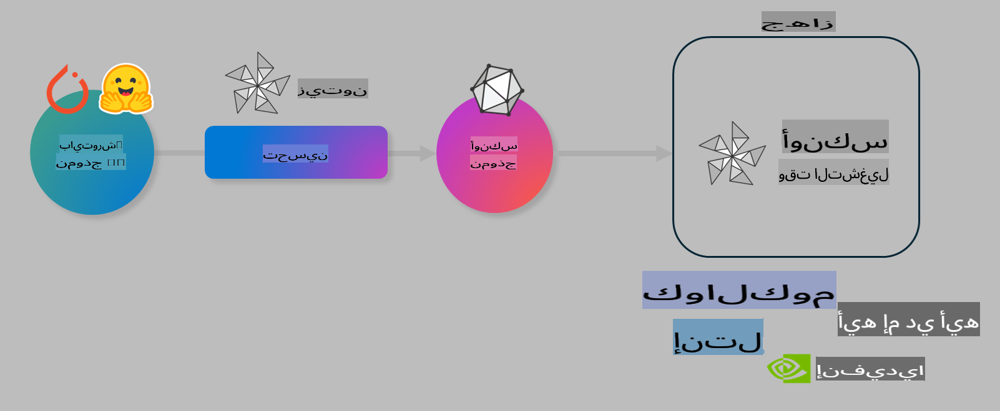

# مختبر: تحسين نماذج الذكاء الاصطناعي للتنفيذ على الأجهزة

## المقدمة

> [!IMPORTANT]
> يتطلب هذا المختبر وجود **وحدة معالجة رسومات Nvidia A10 أو A100** مع تثبيت برامج التشغيل وأدوات CUDA (الإصدار 12+).

> [!NOTE]
> هذا مختبر مدته **35 دقيقة** يقدم لك تجربة عملية حول المفاهيم الأساسية لتحسين النماذج للتنفيذ على الأجهزة باستخدام OLIVE.

## أهداف التعلم

بنهاية هذا المختبر، ستتمكن من استخدام OLIVE لـ:

- تقليل دقة نموذج ذكاء اصطناعي باستخدام طريقة تقليل الدقة AWQ.
- تحسين نموذج ذكاء اصطناعي لمهمة محددة.
- إنشاء إضافات LoRA (النموذج المحسن) لتنفيذ فعال على الأجهزة باستخدام ONNX Runtime.

### ما هو Olive؟

Olive (*O*NNX *live*) هو أداة لتحسين النماذج مع واجهة سطر أوامر (CLI) تساعدك على تقديم نماذج لـ ONNX runtime +++https://onnxruntime.ai+++ بجودة وأداء عاليين.



يكون المدخل لـ Olive عادة نموذج PyTorch أو Hugging Face، والمخرج هو نموذج ONNX محسن يتم تشغيله على جهاز (هدف النشر) يعمل بـ ONNX runtime. يقوم Olive بتحسين النموذج ليعمل بكفاءة مع مسرّع الذكاء الاصطناعي الخاص بالجهاز (NPU، GPU، CPU) الذي توفره الشركات المصنعة مثل Qualcomm، AMD، Nvidia أو Intel.

يقوم Olive بتنفيذ *سير عمل*، وهو سلسلة مرتبة من مهام تحسين النموذج الفردية التي تُعرف بـ *التمريرات* - على سبيل المثال: ضغط النموذج، التقاط الرسم البياني، تقليل الدقة، تحسين الرسم البياني. كل تمرير يحتوي على مجموعة من المعلمات التي يمكن ضبطها لتحقيق أفضل مقاييس، مثل الدقة والوقت، التي يتم تقييمها بواسطة المقيم المناسب. يستخدم Olive استراتيجية بحث تعتمد على خوارزمية للبحث التلقائي لضبط كل تمرير بمفرده أو مجموعة من التمريرات معًا.

#### فوائد Olive

- **تقليل الإحباط والوقت** الناتج عن التجارب اليدوية بالطرق المختلفة لتحسين الرسم البياني، الضغط وتقليل الدقة. قم بتحديد قيود الجودة والأداء واترك Olive يعثر تلقائيًا على أفضل نموذج لك.
- **أكثر من 40 مكونًا مدمجًا لتحسين النماذج** تغطي أحدث التقنيات في تقليل الدقة، الضغط، تحسين الرسم البياني والتحسين.
- **واجهة سطر أوامر سهلة الاستخدام** لمهام تحسين النماذج الشائعة. على سبيل المثال: olive quantize، olive auto-opt، olive finetune.
- تضمين حزم النماذج ونشرها.
- دعم إنشاء نماذج لخدمة **Multi LoRA**.
- إنشاء سير عمل باستخدام YAML/JSON لتنظيم مهام تحسين النماذج والنشر.
- تكامل مع **Hugging Face** و **Azure AI**.
- آلية **تخزين مؤقت مدمجة** لتقليل **التكاليف**.

## تعليمات المختبر

> [!NOTE]
> تأكد من إعداد Azure AI Hub والمشروع الخاص بك وتوفير حساب A100 كما هو موضح في مختبر 1.

### الخطوة 0: الاتصال بحساب Azure AI

ستتصل بحساب Azure AI باستخدام ميزة الاتصال عن بعد في **VS Code**.

1. افتح تطبيق **VS Code** على سطح المكتب:
1. افتح **لوحة الأوامر** باستخدام **Shift+Ctrl+P**.
1. في لوحة الأوامر، ابحث عن **AzureML - remote: Connect to compute instance in New Window**.
1. اتبع التعليمات الظاهرة على الشاشة للاتصال بالحساب. سيتطلب ذلك اختيار اشتراك Azure الخاص بك، مجموعة الموارد، المشروع واسم الحساب الذي قمت بإعداده في مختبر 1.
1. بمجرد الاتصال بحساب Azure ML، ستظهر حالة الاتصال في **الجزء السفلي الأيسر من Visual Code** `><Azure ML: Compute Name`

### الخطوة 1: استنساخ المستودع

في VS Code، يمكنك فتح نافذة طرفية جديدة باستخدام **Ctrl+J** واستنساخ هذا المستودع:

في الطرفية، يجب أن ترى السطر التالي:

```
azureuser@computername:~/cloudfiles/code$ 
```
استنساخ الحل 

```bash
cd ~/localfiles
git clone https://github.com/microsoft/phi-3cookbook.git
```

### الخطوة 2: فتح المجلد في VS Code

لفتح المجلد المناسب في VS Code، نفذ الأمر التالي في الطرفية، والذي سيفتح نافذة جديدة:

```bash
code phi-3cookbook/code/04.Finetuning/Olive-lab
```

بدلاً من ذلك، يمكنك فتح المجلد من خلال تحديد **ملف** > **فتح مجلد**.

### الخطوة 3: تثبيت التبعيات

افتح نافذة طرفية في VS Code على حساب Azure AI الخاص بك (تلميح: **Ctrl+J**) ونفذ الأوامر التالية لتثبيت التبعيات:

```bash
conda create -n olive-ai python=3.11 -y
conda activate olive-ai
pip install -r requirements.txt
az extension remove -n azure-cli-ml
az extension add -n ml
```

> [!NOTE]
> سيستغرق تثبيت جميع التبعيات حوالي ~5 دقائق.

في هذا المختبر، ستقوم بتنزيل ورفع النماذج إلى كتالوج نماذج Azure AI. للوصول إلى الكتالوج، ستحتاج إلى تسجيل الدخول إلى Azure باستخدام:

```bash
az login
```

> [!NOTE]
> عند تسجيل الدخول، سيُطلب منك اختيار اشتراكك. تأكد من تحديد الاشتراك المخصص لهذا المختبر.

### الخطوة 4: تنفيذ أوامر Olive

افتح نافذة طرفية في VS Code على حساب Azure AI الخاص بك (تلميح: **Ctrl+J**) وتأكد من تفعيل بيئة `olive-ai` الخاصة بـ conda:

```bash
conda activate olive-ai
```

بعد ذلك، نفذ أوامر Olive التالية في سطر الأوامر.

1. **فحص البيانات:** في هذا المثال، ستقوم بتحسين نموذج Phi-3.5-Mini ليصبح متخصصًا في الإجابة على الأسئلة المتعلقة بالسفر. يعرض الكود التالي السجلات الأولى من مجموعة البيانات، التي تكون بتنسيق JSON lines:

    ```bash
    head data/data_sample_travel.jsonl
    ```

1. **تقليل دقة النموذج:** قبل تدريب النموذج، قم أولاً بتقليل دقته باستخدام الأمر التالي الذي يستخدم تقنية تُعرف بـ Active Aware Quantization (AWQ) +++https://arxiv.org/abs/2306.00978+++. تقوم AWQ بتقليل أوزان النموذج من خلال أخذ التفاعلات الناتجة أثناء التنفيذ بعين الاعتبار. هذا يعني أن عملية تقليل الدقة تأخذ توزيع البيانات الفعلي في التفاعلات بعين الاعتبار، مما يؤدي إلى الحفاظ بشكل أفضل على دقة النموذج مقارنة بالطرق التقليدية.

    ```bash
    olive quantize \
       --model_name_or_path microsoft/Phi-3.5-mini-instruct \
       --trust_remote_code \
       --algorithm awq \
       --output_path models/phi/awq \
       --log_level 1
    ```
    
    تستغرق عملية تقليل الدقة حوالي **~8 دقائق** وتقلل من حجم النموذج من **~7.5 جيجابايت إلى ~2.5 جيجابايت**.

    في هذا المختبر، نوضح كيفية إدخال النماذج من Hugging Face (على سبيل المثال: `microsoft/Phi-3.5-mini-instruct`). However, Olive also allows you to input models from the Azure AI catalog by updating the `model_name_or_path` argument to an Azure AI asset ID (for example:  `azureml://registries/azureml/models/Phi-3.5-mini-instruct/versions/4`). 

1. **Train the model:** Next, the `olive finetune` الأمر يقوم بتحسين النموذج ذو الدقة المنخفضة. تقليل دقة النموذج *قبل* تحسينه بدلاً من بعده يعطي دقة أفضل لأن عملية التحسين تستعيد بعض الخسائر الناتجة عن تقليل الدقة.

    ```bash
    olive finetune \
        --method lora \
        --model_name_or_path models/phi/awq \
        --data_files "data/data_sample_travel.jsonl" \
        --data_name "json" \
        --text_template "<|user|>\n{prompt}<|end|>\n<|assistant|>\n{response}<|end|>" \
        --max_steps 100 \
        --output_path ./models/phi/ft \
        --log_level 1
    ```
    
    تستغرق عملية التحسين حوالي **~6 دقائق** (مع 100 خطوة).

1. **التحسين:** بعد تدريب النموذج، يمكنك الآن تحسينه باستخدام أمر `auto-opt` command, which will capture the ONNX graph and automatically perform a number of optimizations to improve the model performance for CPU by compressing the model and doing fusions. It should be noted, that you can also optimize for other devices such as NPU or GPU by just updating the `--device` and `--provider` الخاص بـ Olive - ولكن لغرض هذا المختبر، سنستخدم وحدة المعالجة المركزية (CPU).

    ```bash
    olive auto-opt \
       --model_name_or_path models/phi/ft/model \
       --adapter_path models/phi/ft/adapter \
       --device cpu \
       --provider CPUExecutionProvider \
       --use_ort_genai \
       --output_path models/phi/onnx-ao \
       --log_level 1
    ```
    
    تستغرق عملية التحسين حوالي **~5 دقائق**.

### الخطوة 5: اختبار سريع لتنفيذ النموذج

لاختبار تنفيذ النموذج، قم بإنشاء ملف Python في مجلدك يسمى **app.py** ونسخ الكود التالي:

```python
import onnxruntime_genai as og
import numpy as np

print("loading model and adapters...", end="", flush=True)
model = og.Model("models/phi/onnx-ao/model")
adapters = og.Adapters(model)
adapters.load("models/phi/onnx-ao/model/adapter_weights.onnx_adapter", "travel")
print("DONE!")

tokenizer = og.Tokenizer(model)
tokenizer_stream = tokenizer.create_stream()

params = og.GeneratorParams(model)
params.set_search_options(max_length=100, past_present_share_buffer=False)
user_input = "what is the best thing to see in chicago"
params.input_ids = tokenizer.encode(f"<|user|>\n{user_input}<|end|>\n<|assistant|>\n")

generator = og.Generator(model, params)

generator.set_active_adapter(adapters, "travel")

print(f"{user_input}")

while not generator.is_done():
    generator.compute_logits()
    generator.generate_next_token()

    new_token = generator.get_next_tokens()[0]
    print(tokenizer_stream.decode(new_token), end='', flush=True)

print("\n")
```

نفذ الكود باستخدام:

```bash
python app.py
```

### الخطوة 6: رفع النموذج إلى Azure AI

رفع النموذج إلى مستودع نماذج Azure AI يجعل النموذج متاحًا لأعضاء فريق التطوير الآخرين ويتعامل أيضًا مع التحكم في إصدار النموذج. لرفع النموذج، نفذ الأمر التالي:

> [!NOTE]
> قم بتحديث `{}` placeholders with the name of your resource group and Azure AI Project Name. 

To find your resource group `"resourceGroup" واسم مشروع Azure AI، ثم نفذ الأمر التالي:

```
az ml workspace show
```

أو من خلال زيارة +++ai.azure.com+++ واختيار **مركز الإدارة** **المشروع** **نظرة عامة**.

قم بتحديث الحقول `{}` بأسماء مجموعة الموارد واسم مشروع Azure AI.

```bash
az ml model create \
    --name ft-for-travel \
    --version 1 \
    --path ./models/phi/onnx-ao \
    --resource-group {RESOURCE_GROUP_NAME} \
    --workspace-name {PROJECT_NAME}
```
يمكنك بعد ذلك رؤية النموذج الذي قمت برفعه ونشره على https://ml.azure.com/model/list

**إخلاء المسؤولية**:  
تمت ترجمة هذا المستند باستخدام خدمات الترجمة الآلية المدعومة بالذكاء الاصطناعي. بينما نسعى لتحقيق الدقة، يرجى العلم أن الترجمات الآلية قد تحتوي على أخطاء أو معلومات غير دقيقة. يجب اعتبار المستند الأصلي بلغته الأصلية المصدر الموثوق والأساسي. للحصول على معلومات حساسة أو مهمة، يُوصى بالاستعانة بترجمة بشرية احترافية. نحن غير مسؤولين عن أي سوء فهم أو تفسيرات خاطئة تنشأ عن استخدام هذه الترجمة.