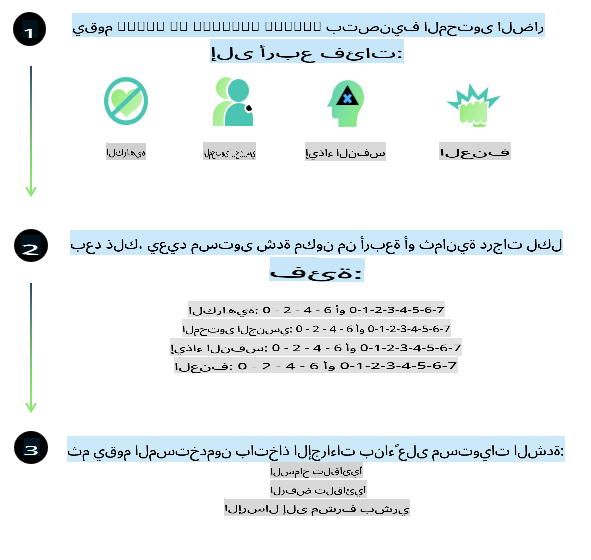
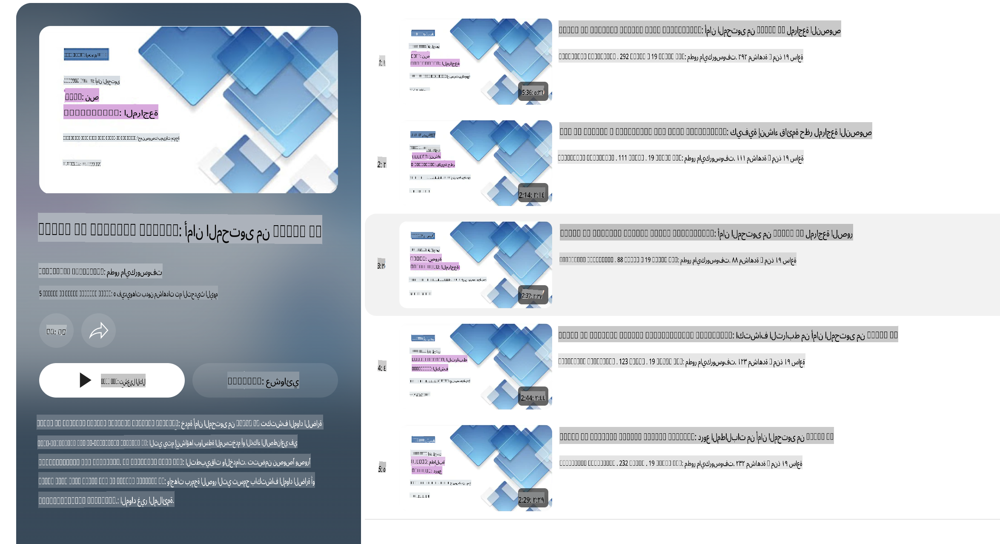

# أمان الذكاء الاصطناعي لنماذج Phi

تم تطوير عائلة نماذج Phi وفقًا لـ [معيار الذكاء الاصطناعي المسؤول من Microsoft](https://query.prod.cms.rt.microsoft.com/cms/api/am/binary/RE5cmFl)، وهو مجموعة من المتطلبات على مستوى الشركة تستند إلى المبادئ الستة التالية: المساءلة، الشفافية، الإنصاف، الموثوقية والأمان، الخصوصية والأمان، والشمولية، التي تشكل [مبادئ الذكاء الاصطناعي المسؤول من Microsoft](https://www.microsoft.com/ai/responsible-ai).

مثل النماذج السابقة من Phi، تم اعتماد نهج تقييم متعدد الأوجه للأمان وتدريب ما بعد الأمان، مع اتخاذ تدابير إضافية تأخذ في الاعتبار القدرات متعددة اللغات لهذا الإصدار. يتم تفصيل نهجنا في تدريب الأمان والتقييمات، بما في ذلك الاختبار عبر لغات متعددة وفئات المخاطر، في [ورقة تدريب ما بعد الأمان لنماذج Phi](https://arxiv.org/abs/2407.13833). وعلى الرغم من استفادة نماذج Phi من هذا النهج، يجب على المطورين تطبيق أفضل ممارسات الذكاء الاصطناعي المسؤول، بما في ذلك تحديد وقياس وتخفيف المخاطر المرتبطة بحالات الاستخدام الخاصة بهم والسياق الثقافي واللغوي.

## أفضل الممارسات

مثل النماذج الأخرى، يمكن أن تتصرف عائلة نماذج Phi بطرق قد تكون غير عادلة أو غير موثوقة أو مسيئة.

بعض السلوكيات المحدودة لنماذج SLM وLLM التي يجب أن تكون على دراية بها تشمل:

- **جودة الخدمة:** تم تدريب نماذج Phi في الأساس على نصوص باللغة الإنجليزية. ستواجه اللغات الأخرى أداءً أقل جودة. كما أن تنوعات اللغة الإنجليزية التي تحظى بتمثيل أقل في بيانات التدريب قد تواجه أداءً أقل جودة مقارنة بالإنجليزية الأمريكية القياسية.
- **تمثيل الأضرار وتعزيز الصور النمطية:** قد تميل هذه النماذج إلى الإفراط أو التقليل في تمثيل مجموعات معينة من الناس، أو محو تمثيل بعض المجموعات، أو تعزيز الصور النمطية المهينة أو السلبية. وعلى الرغم من تدريب ما بعد الأمان، قد تظل هذه القيود موجودة بسبب مستويات التمثيل المختلفة للمجموعات المختلفة أو انتشار أمثلة الصور النمطية السلبية في بيانات التدريب التي تعكس أنماط العالم الحقيقي والتحيزات المجتمعية.
- **المحتوى غير المناسب أو المسيء:** قد تنتج هذه النماذج أنواعًا أخرى من المحتوى غير المناسب أو المسيء، مما قد يجعلها غير مناسبة للاستخدام في سياقات حساسة دون اتخاذ تدابير تخفيف إضافية تتناسب مع حالة الاستخدام.
- **موثوقية المعلومات:** يمكن أن تولد نماذج اللغة محتوى غير منطقي أو تختلق معلومات قد تبدو معقولة لكنها غير دقيقة أو قديمة.
- **نطاق محدود للبرمجة:** تعتمد غالبية بيانات تدريب Phi-3 على Python وتستخدم حزمًا شائعة مثل "typing, math, random, collections, datetime, itertools". إذا أنشأ النموذج نصوص Python تستخدم حزمًا أخرى أو نصوصًا بلغات برمجة أخرى، نوصي بشدة بأن يتحقق المستخدمون يدويًا من جميع استخدامات واجهات برمجة التطبيقات.

يجب على المطورين تطبيق أفضل ممارسات الذكاء الاصطناعي المسؤول وهم مسؤولون عن ضمان توافق حالة الاستخدام المحددة مع القوانين واللوائح ذات الصلة (مثل الخصوصية، التجارة، وما إلى ذلك).

## اعتبارات الذكاء الاصطناعي المسؤول

مثل النماذج اللغوية الأخرى، قد تتصرف نماذج سلسلة Phi بطرق غير عادلة أو غير موثوقة أو مسيئة. بعض السلوكيات المحدودة التي يجب أن تكون على دراية بها تشمل:

**جودة الخدمة:** تم تدريب نماذج Phi في الأساس على نصوص باللغة الإنجليزية. ستواجه اللغات الأخرى أداءً أقل جودة. كما أن تنوعات اللغة الإنجليزية التي تحظى بتمثيل أقل في بيانات التدريب قد تواجه أداءً أقل جودة مقارنة بالإنجليزية الأمريكية القياسية.

**تمثيل الأضرار وتعزيز الصور النمطية:** قد تميل هذه النماذج إلى الإفراط أو التقليل في تمثيل مجموعات معينة من الناس، أو محو تمثيل بعض المجموعات، أو تعزيز الصور النمطية المهينة أو السلبية. وعلى الرغم من تدريب ما بعد الأمان، قد تظل هذه القيود موجودة بسبب مستويات التمثيل المختلفة للمجموعات المختلفة أو انتشار أمثلة الصور النمطية السلبية في بيانات التدريب التي تعكس أنماط العالم الحقيقي والتحيزات المجتمعية.

**المحتوى غير المناسب أو المسيء:** قد تنتج هذه النماذج أنواعًا أخرى من المحتوى غير المناسب أو المسيء، مما قد يجعلها غير مناسبة للاستخدام في سياقات حساسة دون اتخاذ تدابير تخفيف إضافية تتناسب مع حالة الاستخدام.

**موثوقية المعلومات:** يمكن أن تولد نماذج اللغة محتوى غير منطقي أو تختلق معلومات قد تبدو معقولة لكنها غير دقيقة أو قديمة.

**نطاق محدود للبرمجة:** تعتمد غالبية بيانات تدريب Phi-3 على Python وتستخدم حزمًا شائعة مثل "typing, math, random, collections, datetime, itertools". إذا أنشأ النموذج نصوص Python تستخدم حزمًا أخرى أو نصوصًا بلغات برمجة أخرى، نوصي بشدة بأن يتحقق المستخدمون يدويًا من جميع استخدامات واجهات برمجة التطبيقات.

يجب على المطورين تطبيق أفضل ممارسات الذكاء الاصطناعي المسؤول وهم مسؤولون عن ضمان توافق حالة الاستخدام المحددة مع القوانين واللوائح ذات الصلة (مثل الخصوصية، التجارة، وما إلى ذلك). تشمل المجالات المهمة للنظر فيها:

**التخصيص:** قد لا تكون النماذج مناسبة للسيناريوهات التي قد يكون لها تأثير كبير على الوضع القانوني أو تخصيص الموارد أو الفرص الحياتية (مثل الإسكان، التوظيف، الائتمان، وما إلى ذلك) دون إجراء تقييمات إضافية وتقنيات إزالة التحيز.

**السيناريوهات عالية المخاطر:** يجب على المطورين تقييم مدى ملاءمة استخدام النماذج في السيناريوهات عالية المخاطر حيث قد تكون المخرجات غير العادلة أو غير الموثوقة أو المسيئة مكلفة للغاية أو تسبب ضررًا. يشمل ذلك تقديم النصائح في المجالات الحساسة أو التخصصية حيث تكون الدقة والموثوقية أمرًا بالغ الأهمية (مثل النصائح القانونية أو الصحية). يجب تنفيذ ضمانات إضافية على مستوى التطبيق وفقًا لسياق النشر.

**المعلومات المضللة:** قد تنتج النماذج معلومات غير دقيقة. يجب على المطورين اتباع أفضل ممارسات الشفافية وإبلاغ المستخدمين النهائيين بأنهم يتفاعلون مع نظام ذكاء اصطناعي. على مستوى التطبيق، يمكن للمطورين بناء آليات تغذية راجعة وخطوط أنابيب لتثبيت الردود على معلومات سياقية خاصة بحالة الاستخدام، وهي تقنية تُعرف باسم توليد الاسترجاع المعزز (RAG).

**إنتاج محتوى ضار:** يجب على المطورين تقييم المخرجات وفقًا لسياقها واستخدام مصنفات الأمان المتاحة أو الحلول المخصصة المناسبة لحالة الاستخدام الخاصة بهم.

**الاستخدام غير المشروع:** قد يكون من الممكن حدوث أشكال أخرى من الاستخدام غير المشروع مثل الاحتيال، البريد العشوائي، أو إنتاج البرامج الضارة، ويجب على المطورين التأكد من أن تطبيقاتهم لا تنتهك القوانين واللوائح المعمول بها.

### التخصيص وأمان محتوى الذكاء الاصطناعي

بعد تخصيص نموذج، نوصي بشدة باستخدام تدابير [أمان محتوى Azure AI](https://learn.microsoft.com/azure/ai-services/content-safety/overview) لمراقبة المحتوى الذي تولده النماذج، وتحديد المخاطر والتهديدات والمشاكل المحتملة وحجبها.

[أمان محتوى Azure AI](https://learn.microsoft.com/azure/ai-services/content-safety/overview) يدعم كلًا من محتوى النصوص والصور. يمكن نشره على السحابة، في الحاويات غير المتصلة، وعلى الأجهزة المدمجة/الحافة.

## نظرة عامة على أمان محتوى Azure AI

أمان محتوى Azure AI ليس حلاً شاملاً يناسب الجميع؛ يمكن تخصيصه ليتماشى مع سياسات الشركات المحددة. بالإضافة إلى ذلك، فإن نماذجه متعددة اللغات تمكنه من فهم عدة لغات في نفس الوقت.

- **أمان محتوى Azure AI**
- **مطوّر Microsoft**
- **5 مقاطع فيديو**

تكتشف خدمة أمان محتوى Azure AI المحتوى الضار الذي ينتجه المستخدم أو الذكاء الاصطناعي في التطبيقات والخدمات. تتضمن الخدمة واجهات برمجة تطبيقات للنصوص والصور تتيح لك اكتشاف المواد الضارة أو غير المناسبة.

[قائمة تشغيل أمان محتوى الذكاء الاصطناعي](https://www.youtube.com/playlist?list=PLlrxD0HtieHjaQ9bJjyp1T7FeCbmVcPkQ)

**إخلاء المسؤولية**:  
تم ترجمة هذا المستند باستخدام خدمات الترجمة الآلية المدعومة بالذكاء الاصطناعي. بينما نسعى لتحقيق الدقة، يرجى العلم أن الترجمات الآلية قد تحتوي على أخطاء أو معلومات غير دقيقة. يجب اعتبار المستند الأصلي بلغته الأصلية هو المصدر الموثوق. للحصول على معلومات حاسمة، يُوصى بالاستعانة بترجمة بشرية احترافية. نحن غير مسؤولين عن أي سوء فهم أو تفسيرات خاطئة ناتجة عن استخدام هذه الترجمة.