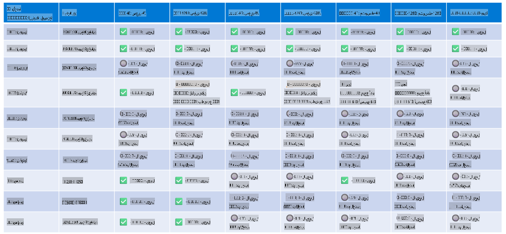

# دعم أجهزة Phi

تم تحسين Microsoft Phi لتعمل بشكل مثالي مع ONNX Runtime وتدعم Windows DirectML. تعمل بكفاءة عبر أنواع مختلفة من الأجهزة، بما في ذلك وحدات معالجة الرسومات (GPUs)، ووحدات المعالجة المركزية (CPUs)، وحتى الأجهزة المحمولة.

## الأجهزة المدعومة
الأجهزة المدعومة تشمل:

- وحدة معالجة الرسومات: RTX 4090 (DirectML)
- وحدة معالجة الرسومات: 1 A100 80GB (CUDA)
- وحدة معالجة مركزية: Standard F64s v2 (64 vCPUs، وذاكرة 128 GiB)

## الأجهزة المحمولة

- أندرويد - Samsung Galaxy S21  
- أبل iPhone 14 أو الأحدث بمعالج A16/A17  

## مواصفات أجهزة Phi

- الحد الأدنى من التكوين المطلوب:
  - ويندوز: وحدة معالجة رسومات تدعم DirectX 12 وذاكرة مشتركة لا تقل عن 4GB  
  - CUDA: وحدة معالجة رسومات NVIDIA مع Compute Capability >= 7.02  



## تشغيل onnxruntime على وحدات معالجة رسومات متعددة

حاليًا، نماذج Phi ONNX المتوفرة تدعم وحدة معالجة رسومات واحدة فقط. يمكن دعم وحدات معالجة رسومات متعددة لنماذج Phi، ولكن تشغيل ORT مع وحدتي معالجة رسومات لا يضمن تحقيق إنتاجية أعلى مقارنة بتشغيل حالتين منفصلتين من ORT. يرجى الاطلاع على [ONNX Runtime](https://onnxruntime.ai/) للحصول على آخر التحديثات.

في [Build 2024 فريق GenAI ONNX](https://youtu.be/WLW4SE8M9i8?si=EtG04UwDvcjunyfC) أعلن أنهم قاموا بتمكين التشغيل متعدد الحالات بدلاً من التشغيل متعدد وحدات معالجة الرسومات لنماذج Phi.

حاليًا، يتيح لك ذلك تشغيل حالة واحدة من onnxruntime أو onnxruntime-genai باستخدام متغير البيئة CUDA_VISIBLE_DEVICES كما هو موضح أدناه.

```Python
CUDA_VISIBLE_DEVICES=0 python infer.py
CUDA_VISIBLE_DEVICES=1 python infer.py
```

لا تتردد في استكشاف Phi بشكل أكبر من خلال [Azure AI Foundry](https://ai.azure.com)

**إخلاء المسؤولية**:  
تمت ترجمة هذا المستند باستخدام خدمات الترجمة الآلية المدعومة بالذكاء الاصطناعي. بينما نسعى جاهدين لتحقيق الدقة، يُرجى العلم أن الترجمات الآلية قد تحتوي على أخطاء أو معلومات غير دقيقة. يجب اعتبار المستند الأصلي بلغته الأصلية المصدر الموثوق والأساسي. للحصول على معلومات حاسمة، يُوصى بالاستعانة بترجمة بشرية احترافية. نحن غير مسؤولين عن أي سوء فهم أو تفسيرات خاطئة تنشأ عن استخدام هذه الترجمة.